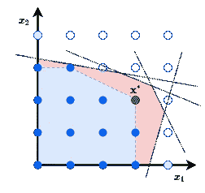
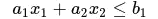
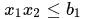
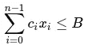
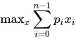

# 混合整数线性规划:简介

> 原文：<https://towardsdatascience.com/mixed-integer-linear-programming-1-bc0ef201ee87>

## 如何解决具有离散变量的复杂约束优化问题


照片由[米切尔罗](https://unsplash.com/@mitchel3uo?utm_source=medium&utm_medium=referral)在 [Unsplash](https://unsplash.com?utm_source=medium&utm_medium=referral)

为复杂问题设计和实现算法是困难的。有趣，但很难。如果我告诉你，你可以解决某些优化问题只使用他们的数学规格？和我一起踏上混合整数线性规划的奇妙世界之旅，它在[护士排班](https://www.researchgate.net/publication/220366435_The_State_of_the_Art_of_Nurse_Rostering)、[换肾程序](https://www.ncbi.nlm.nih.gov/pmc/articles/PMC4311855/)、[生产调度](http://egon.cheme.cmu.edu/Papers/HaderaHarjunkoski_SteelProdElec.pdf)、[机器人细胞能量优化](https://arxiv.org/pdf/1802.05925.pdf)、[自动数独求解](/using-integer-linear-programming-to-solve-sudoku-puzzles-15e9d2a70baa)以及许多许多其他程序中都有应用！这些问题的一个共同特性是它们有离散的解空间。通常，解空间也受到约束的限制，因此只有值的子集表示有效的解。因此，广为人知的人工智能优化算法(如梯度下降)不适合这类问题。



混合整数线性规划的解空间及其线性松弛和最优解。这些线对应于约束，这些约束对解空间进行编码。填充的蓝点代表可行的解决方案，而填充的绿色点是最优的解决方案。

在这一系列的文章中，我们将涵盖 Python 中离散优化问题的实际建模和幕后的理论机器。本系列面向没有深厚计算机科学背景的程序员和机器学习人员，对于他们来说，混合整数线性编程可能是他们熟悉的数据驱动方法的替代工具。为了能够理解内容，火箭科学的博士学位不是必要的，尽管关于数学(矩阵代数)和 Python 编程的基础知识是假定的。

在这第一篇介绍性的文章中，我们将遇到一个经典的优化问题，我们使用 Python 中的混合整数线性编程来解决这个问题。

# 最优化问题

想象你是一家公司的经理。公司积累了大量预算，你想把它投资到各种资产中，以最大化未来利润。有不同种类的资产，如机器或车辆，如果资产被购买，每种资产都有一个*固定成本*和一个*估计未来利润*。你可能会问的问题是:你今天应该购买哪些资产来*最大化预计未来利润*，这样你就不会超出预算(假设你不能购买资产的一部分)？

作为一个聪明的程序员，你想出了一个简单明了的*贪婪的*算法:根据资产的预计未来单位成本利润(即每项资产的利润除以其固定成本)对资产进行递减排序，并按照这个排序列表购买资产，直到预算用完。容易，虽然不能保证这样选择的资产就是未来总利润最大化的资产。你损失了多少？自然，你可能想知道你可以购买的资产的最优选择是什么，这样就不会有其他集团产生更高的利润。

所以你决定实现一个更复杂的启发式算法，例如，基于[遗传算法](https://mpatacchiola.github.io/blog/2017/03/14/dissecting-reinforcement-learning-5.html)。经过几天的代码编写和调试，你想出了一个具有不错性能的算法，它所获得的解将比那些由贪婪算法构造的解有更高的利润。但是如果问题需求发生变化，比如有些资产不能一起买，会怎么样呢？你将不得不回去编码和调试。如此循环往复…


开发努力与解决方案质量(例如，利润):从很差的解决方案到一般的解决方案需要一点努力，但是改进一个高质量的解决方案需要更多的努力。

混合整数线性规划解决了这个问题。你不用编写算法，而是用一种兼容的数学语言来描述你的问题。一旦问题被数学形式化，你就把它传递给现成的混合整数线性规划求解器库来获得解。因为这些解算器是由非常聪明的人编写的，他们有很深的数学背景，所以很有可能你会得到一个比手工算法更好的解。如果问题需求发生变化，您只需修改问题描述，然后重新运行同一个求解器。听起来好得难以置信，对吧？所以让我们调查一下。

# 问题的数学形式化

混合整数线性规划(简称 MILP)被称为*线性*是有原因的。那就是:一个问题的数学描述就是一堆线性不等式和线性表达式。例如，线性不等式



有了变量 *x₁、x₂* 和固定参数 *a₁、a₂、b₁* 就是出现在 MILP 公式中的野兽之一。另一方面，



在 MILP 中不是有效的公式，因为有二次项 *x₁x₂* 。

所以我们知道 MILP 由线性不等式组成，这些不等式以某种方式编码了手头的问题:我们称这些不等式为*约束*。给定固定参数，MILP 求解器将尝试将值插入变量中，以满足约束条件。满足约束的变量值统称为*可行解*。然而，MILP 远远不止找到任何满足约束的解决方案。我们可以寻找一个优化目标*的可行解，目标*是变量的线性函数:优化是根据目标值找到一个最佳可行解。

MILP 中的变量可以是有理数、整数或二进制数(实际上是整数，但被限制为 0 或 1)；这就是为什么名字里有*混*的原因。如果一个公式中的所有变量都是合理的，我们得到线性规划，它有很好的计算特性(但在另一篇文章中会有更多)。

为了更好地理解我们的预算问题，让我们将它形式化。首先，考虑固定参数。假设有 *𝑛* ≥1 种不同的资产可供选择。每项资产 *i∈{0,1,2,…,𝑛-1}* 都有固定成本 *𝑐ᵢ* 和预计未来利润 *pᵢ* 。最后，我们还得到了可用于资产的预算 *𝐵* 。

现在，考虑解决方案。资产 *𝑖* 可以购买也可以不购买，决定资产 *𝑖* 是否购买应该是 MILP 求解者的工作。因此，我们将为每项资产 *𝑖* 设置一个二元变量 *𝑥ᵢ* ，如果资产 *𝑖* 被购买，则该变量为 1，如果没有被购买，则该变量为 0。模型中变量值的解释是由我们决定的，这种解释决定了问题形式化的其余部分应该是什么样子。

我们的问题中的约束是什么？我们只有一个，即解决方案中购买的资产的总成本不能超过预算。我们可以用不等式来写这个



这个约束的解释如下:如果资产 *𝑖* 没有被购买，那么它的成本 *𝑐ᵢ* 将不被包括在总成本中(不等式的左手边)，因为 *𝑐ᵢ𝑥ᵢ=𝑐ᵢ0=0* 。另一方面，如果资产 *𝑖* 被购买，那么它的成本包括在总成本中。

最后，我们指定我们的目标，即从购买的资产中获得的估计总利润的最大化



这就是你的第一个 MILP 公式！

# 用 Python 解决 MILP 问题

一旦有了 MILP 公式，就可以将其传递给现有的 MILP 求解器来获得解。现在，有一些商业甚至开源的 MILP 解算器，我将在以后的文章中介绍它们的不同之处。现在我将使用 Python 包 [Python-MIP](https://www.python-mip.com/) ，它捆绑了 [CBC 开源解算器](https://github.com/coin-or/Cbc)。您可以使用下面的命令从 PyPi 安装它(有针对 Windows、MacOS 和 Linux 的预构建包)

```
pip3 install mip --user
```

*Mac M1 用户注意:你可能需要做一些* [*额外的步骤*](https://github.com/coin-or/python-mip/issues/165#issuecomment-1058946026) *。*

之后，开除你最喜欢的代码编辑器，开始写吧！

```
MILP solution
Solver status: OptimizationStatus.OPTIMAL
Bought assets: [3, 4]
Total cost of the bought assets: 10
Estimated future profit: 180
```

在这里，我们创建了一个有 5 个资产可供选择的问题实例。在解决了 MILP 模型之后，我们得到了一个最优解，估计未来利润为 180 英镑。相比之下，贪婪算法会给我们 160 英镑的小利润。

```
Greedy algorithm solution
Bought assets: [0]
Total cost of the bought assets: 8
Estimated future profit: 160
```

看起来 180–160 = 20 是一个很小的利润差额，但是考虑到利润是以百万美元计的，这就开始变得有趣了，不是吗？还要注意，在 MILP 解决方案中没有选择利润成本比最高的资产 *𝑖* =0(有更好的资产组合可以带来更高的利润)。

顺便问一下，我们如何合并两项资产 *𝑖* 、 *𝑗* 不能一起购买的附加要求？通过包含附加约束

```
m += x[i]+x[j] <= 1
```

在模型中。只有当两个 *𝑖* 、 *𝑗* 一起买的时候，你才能检查出这个约束被违反了，因为这时左手边是 2，明显大于 1。就这样，只有一行代码，你就能适应这个问题的额外需求。唷。

# 总结

在这第一篇介绍性的文章中，我们简要讨论了什么是混合整数线性规划(MILP)以及它为什么有用。它允许我们不用写算法就能解决最优化问题。相反，我们将问题描述写成数学公式，然后由众多可用的 MILP 求解器中的一个来求解。与机器学习方法相比，求解 MILP 不是数据驱动的，因为它利用了组合优化的理论基础。我们探索了一个购买资产的简单优化问题，并用 Python 建模(顺便说一句:这个问题其实叫[背包问题](http://www.or.deis.unibo.it/kp/Chapter2.pdf)！).

在下一篇文章中，我想更正式地定义什么是 MILP，它的解空间看起来是什么样的，计算复杂性是什么(MILP 是一个强大的工具，但它有其局限性)。

*所有图片，除非特别注明，均为作者所有。*