# 将艺术融入模型解释的科学中

> 原文：<https://towardsdatascience.com/mixing-art-into-the-science-of-model-explainability-312b8216fa95>

## 可解释 Boosting 机综述及一种将 ML 解释转换为更人性化解释的方法。


图 1 —我桌子上的乐高玩具，作者拍摄。

# 1.最大似然解释科学

## 1.1 可解释性与准确性的权衡

在传统的表格机器学习方法中，数据科学家经常处理 b/w 可解释性和准确性之间的权衡。

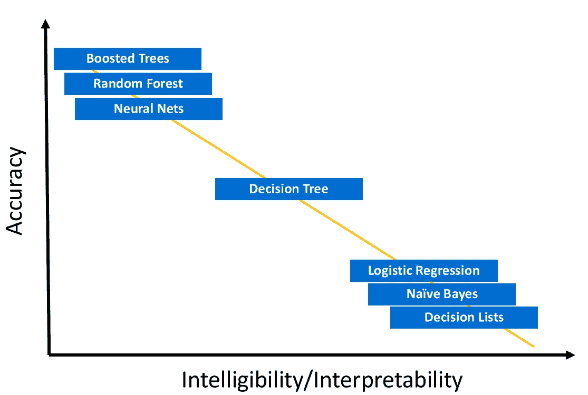

图 2:可解释性/可理解性和准确性的权衡，作者图片

如上图所示，我们可以看到像逻辑回归、朴素贝叶斯和决策树这样的**玻璃箱模型**是简单的解释模型，这些模型的预测并不十分准确。另一方面，**黑箱模型**像提升树、随机森林和神经网络很难解释，但却能带来高度准确的预测。

## EBMs 简介

为了解决上述问题，微软研究院开发了 EBMs(可解释增压机)模型[1]。“可解释的助推机器(EBM)是基于树的、循环梯度助推广义加法模型，具有自动交互检测。EBM 通常与最先进的黑盒模型一样精确，同时保持完全可解释性。虽然 EBM 的训练速度通常比其他现代算法慢，但 EBM 在预测时非常紧凑和快速。”[2]

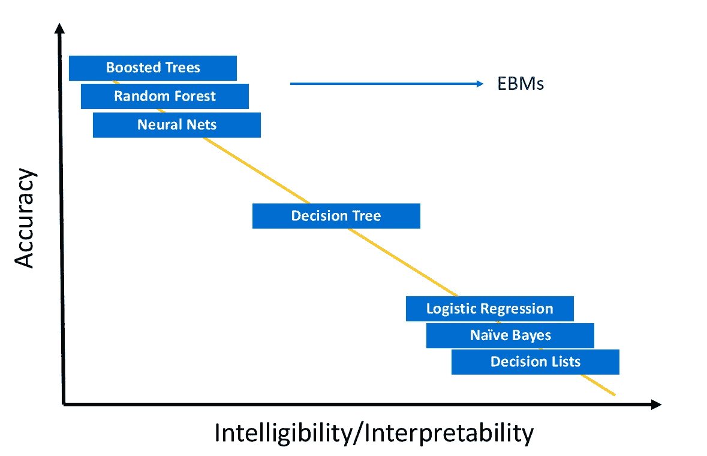

图 3: EBMs 打破了可解释性与准确性的悖论，作者图片

从上面的图表中我们可以看到，EBM 帮助我们打破了这种权衡悖论，并帮助我们建立高度可解释和精确的模型。为了进一步理解 EBMs 背后的数学，我强烈建议观看这段 12 分钟的 YouTube 视频

## 1.3 玻璃盒子 vs 黑盒模型。选什么？

```
**Tip:** *The answer to every complex question in life is “It depends”.*
```

与黑盒模型相比，使用玻璃盒模型有一些利弊。选择一个模型而不是另一个模型没有明显的赢家，但是根据情况，DS 可以对选择什么模型做出有根据的猜测。

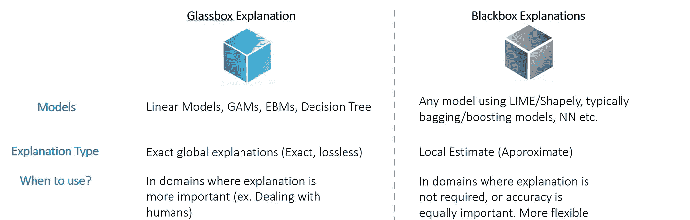

图 4:玻璃盒模型与黑盒模型，图片由作者提供。

选择玻璃盒或黑盒模型时需要考虑的两个因素如下-

**1)可解释性需求** —在不需要解释的领域，或者数据科学家或技术观众出于直觉/检查目的需要解释的领域，在这些情况下，DS 最好使用黑盒模型。在由于业务或法规要求而需要解释的领域中，或者在这些解释是提供给非技术观众(人)的领域中，玻璃盒模型占了上风。这是因为来自玻璃盒子模型的解释是`exact`和`global`。

```
**Note:** *Exact* *and* *global* *just means that a value of a particular feature will always have the same effect on each prediction explanation. For example, in the case of the prediction of income of a particular individual being above $50k with age as one of the predictors, if the* *age* *is 40 and it will impact the target variable with the same proportion let us say 5% in each observation in the data where the age is 40\. This is not the case when we build explanations through LIME and Shapely for black box models. In black-box models,* *age* *with the value 40 for example can have a 10% lift in an individual probability of their income being above 50k for one observation and -10% lift in the other.*
```

**2)计算要求** — DS 需要注意各种计算要求，以便根据其用例测试和训练模型。EBM 在训练阶段特别慢，但是提供了带有内置解释的快速预测。因此，在每小时都需要训练模型的情况下，EBMs 可能无法满足您的需求。但是，如果模型的训练是每月/每周进行的，并且分数生成的频率更高(每小时/每天),那么 EBMs 可能更适合这个用例。此外，在可能需要对每个预测做出解释的情况下，EBMs 可以节省大量计算，并且可能是用于数百万次观察的唯一可行的技术。请看下文，了解 b/w EBMs 和其他基于树的集成方法的操作差异。

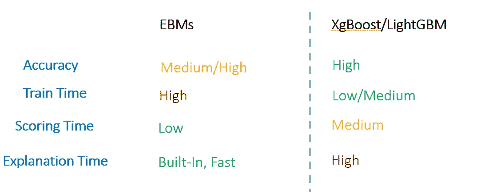

图 5: EBMs vs XgBoost/LightGBM，作者图片。

# 2.动手使用 EBMs

## 2.1 数据概述

对于这个例子，我们将使用来自 **UCI 机器学习库【3】**的[成人收入数据集](https://archive.ics.uci.edu/ml/datasets/Adult)。该数据集中的问题设置为二元分类问题，根据各种人口普查信息(教育程度、年龄、性别、职业等)来预测某个人的收入。)超过 5 万美元/年。为了简单起见，我们只使用美国个人的观察结果和以下预测值-

*   `Age` : `continuous`变量，个人年龄
*   `Occupation` : `categorical`变量，技术支持，工艺维修，其他服务，销售，执行管理，专业，处理-清洁，机器-操作-检查，行政-文书，农业-渔业，运输-搬家，私人-房屋-服务，保护-服务，武装部队。
*   `HoursPerWeek` : `continuous`变量，每周花在工作上的小时数
*   `Education` : `categorical`变量，学士，一些学院，11，HS-grad，Prof-school，Assoc-acdm，Assoc-voc，9，7-8，12，硕士，1-4，10，博士，5-6，学前。

```
**Note —** To render the blog with both code correctly, you can read the same on my [quarto powered blog](https://aayushmnit.com/posts/2022-09-23-Explainability/2022-09-23-Explainability.html#the-art-of-ml-explainability).
```

```
## Importing required libraries
import pandas as pd
import numpy as np
from sklearn.model_selection import train_test_split
from sklearn import metrics
from interpret.glassbox import ExplainableBoostingClassifier
from interpret import show
import warnings
import plotly.io as pio
import plotly.express as px
warnings.filterwarnings('ignore')
pio.renderers.default = "plotly_mimetype+notebook_connected"

## Loading the data
df = pd.read_csv( "https://archive.ics.uci.edu/ml/machine-learning-databases/adult/adult.data", header=None)
df.columns = [
    "Age", "WorkClass", "fnlwgt", "Education", "EducationNum",
    "MaritalStatus", "Occupation", "Relationship", "Race", "Gender",
    "CapitalGain", "CapitalLoss", "HoursPerWeek", "NativeCountry", "Income"
]

## Filtering for Unites states
df = df.loc[df.NativeCountry == ' United-States',:]

## Only - Taking required columns
df = df.loc[:,["Education", "Age","Occupation", "HoursPerWeek", "Income"]]

df.head()
```

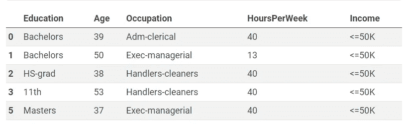

让我们看看目标变量分布。


图 1 —目标变量分布，作者图片。

```
print(df.Income.value_counts(normalize=True))
```

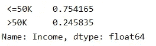

在我们的数据集中，约 24.6%的人收入超过 5 万美元。数据看起来不错，我们有我们需要的列。我们将使用教育、年龄、职业和每周工作时间列来预测收入。在建模之前，让我们执行一个 80–20 的训练测试划分。

```
## Train-Test Split 
X = df[df.columns[0:-1]] 
y = df[df.columns[-1]] seed = 1 
X_train, X_test, y_train, y_test = train_test_split(X, y, test_size=0.20, random_state=seed) 
print(f"Data in training {len(y_train)}, Data in testing {len(y_test)}")
```


## 2.2 拟合循证医学模型

EBM 有一个 scikit 兼容的 API，因此拟合模型和进行预测与任何 scikit 学习模型是一样的。

```
ebm = ExplainableBoostingClassifier(random_state=seed, interactions=0) 
ebm.fit(X_train, y_train)  
auc = np.round(
                metrics.roc_auc_score(
               (y_test != ' <=50K').astype(int).values,
                ebm.predict_proba(X_test)[:,1]),
               3) 
print(f"Accuracy: {np.round(np.mean(ebm.predict(X_test) == y_test)*100,2)}%, AUC: {auc}")
```


我希望上面的代码块显示了 interpret-ml API 与 scikit learn API 是多么相似。基于验证集的 AUC，我们可以说我们的模型比随机预测更好。

```
**Tip:** *In practice, if you are dealing with millions of observations, Try doing feature selection using LightGBM/XGboost and only train your final models using EBMs. This will save you time in feature exploration.*
```

## 2.3 来自 EBMs 的解释

解释包提供了全局和局部解释，并有各种可视化工具来检查模型正在学习的内容。

> 2.3.1 全球解释

全局解释提供了以下可视化效果-

1.  **总结** —特征重要性图，该图提供了每个预测因子在预测目标变量中的重要性。
2.  **特征与预测的相互作用** —该图表与 EBM 在进行实际预测时使用的查找表相同。这可以帮助您检查特征值对预测的贡献。

```
ebm_global = ebm.explain_global() 
show(ebm_global, renderer='notebook')
```

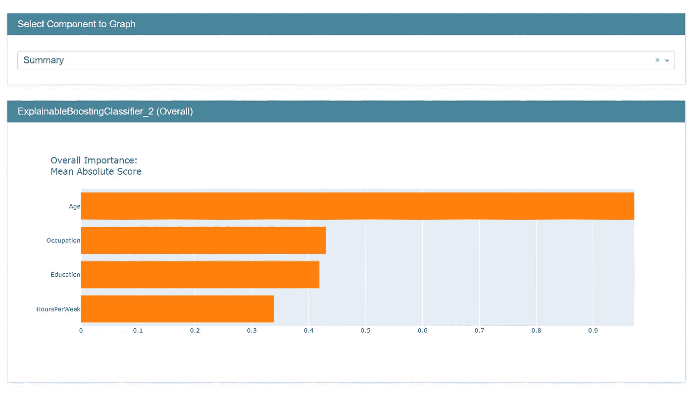

图 6: EBMs 全球解说，作者图片。

> 当地的解释

局部解释是我们每个观察层次的解释。EBM 有一个很好的内置可视化来显示这些信息。

```
ebm_local = ebm.explain_local(X_test.iloc[0:5,:], y_test) show(ebm_local, renderer='notebook')
```

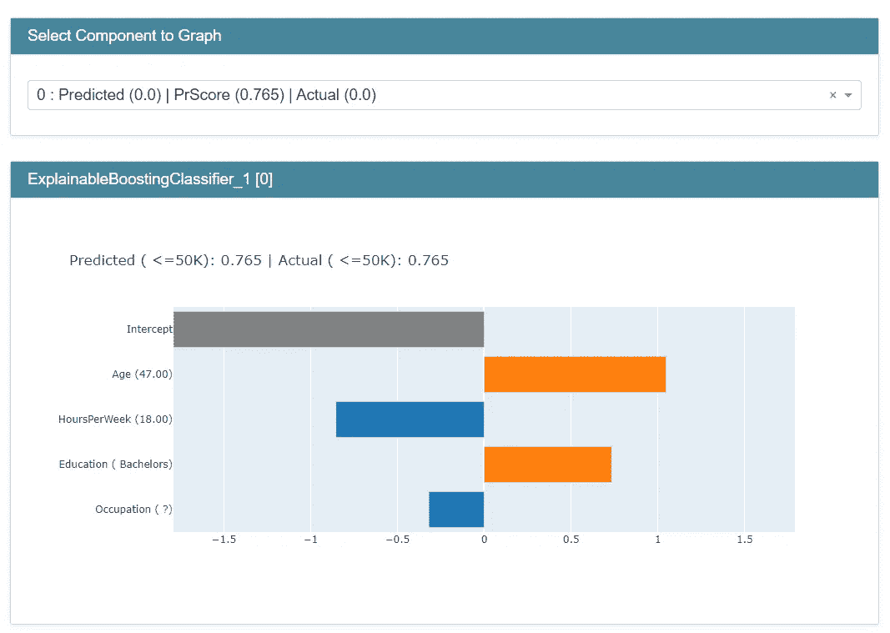

图 7: EBMs 本地解释，作者图片。

让我们举一个例子来解释指数为 0 时的观察结果

```
explainDF = pd.DataFrame.from_dict(
    {
        'names': ebm_local.data(0)['names'], 
        'data':ebm_local.data(0)['values'], 
        'contribution':ebm_local.data(0)['scores']
    })
explainDF
```

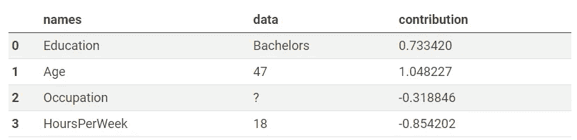

正如我们从数据中看到的，我们可以看到列的名称、实际值以及该值对实际预测得分的贡献。对于这个观察，让我们看看模型在学习什么

1.  本科教育有助于收入超过 5 万英镑
2.  年龄值 47 也有利于> 50K
3.  职业是“？”对超过 5 万英镑的收入有负面影响
4.  每周 18 小时对超过 5 万英镑的收入有负面影响(美国每周平均工作时间约为 40 小时，所以这是有道理的)

您还可以对整个数据集执行此操作，并收集每个要素的重要性。下面是一个执行同样操作的示例代码。

```
scores = [x['scores'] for x in ebm_local._internal_obj['specific']]
summary = pd.DataFrame(scores)
summary.columns = ebm_local.data(0)['names']
summary.head()
```

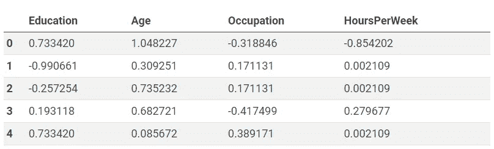

现在我们可以提取测试集中所有数据行的重要性。

## 2.4 缺点和问题

这种解释仍然非常抽象，即使在观察层面上，推理也不是人类(非技术)友好的。当特征数量增加时，这甚至变得对人类不友好。你的模型的典型商业消费者可能不擅长阅读这样的图表，并且回避尝试模型给他们的洞察力/预测。毕竟，如果我不理解某件事，我就不信任它。这就是艺术的用武之地，让我们看看如何在上面的观察的基础上，让它更容易理解。

# 3.ML 解释的“艺术”

```
**Warning -** *The ideas I am going to share now are more marketing than real science.*
```

要让人们按照你的模特的建议行事，你必须**建立信任**。一个想法是建立信任，用数据轶事来支持你的解释。


信用— [Flickr](https://www.flickr.com/photos/59632563@N04/6239670686) ，许可— [知识共享](https://creativecommons.org/licenses/by/2.0/)

数据轶事到处存在，这个想法是我在看一个股市工具时想到的(下图)。注意他们强调的两件事-

1.  **什么事？** —这个工具出色地展示了刚刚发生的事件。例如— *“微软公司因股息宣布*或*“达美航空 14 日 RSI 跌破 70 水平”*。
2.  **为什么很重要？** —然后工具指向历史数据，并告知该事件的意义。在微软的例子中，当事件发生时“历史上，MSFT 的价格平均上涨了 11.9%”。

如果我们能对我们的模型做同样的事情呢？

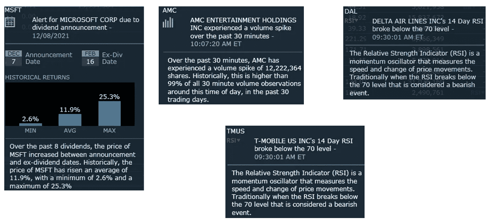

图 8。快照取自我的保真工具，图片由作者提供。

我们可以从训练数据中建立一个历史赔率表。让我们试着建造一个。

```
odds_data = X_train.copy()
odds_data['income'] = (y_train == " >50K").astype(int) 
## Converting continous variables in buckets
odds_data['AgeBucket'] =  (odds_data.Age // 5)
odds_data['HoursPerWeekBucket'] = (odds_data.HoursPerWeek // 5)

# Creating placeholder for odds dictionary
odds_dict = {} 

# Columns for which we need odds
columns = ['Education', 'AgeBucket', 'HoursPerWeekBucket', 'Occupation']
for colname in columns: #iterating through each column
    unique_val = odds_data[colname].unique() # Finding unique values in column
    ddict = {}
    for val in unique_val: # iterating each unique value in the column
        ## Odds that income is above > 50 in presence of the val
        val_p = odds_data.loc[odds_data[colname] == val, 'income'].mean() 
        ## Odds that income is above > 50 in absence of the val
        val_np = odds_data.loc[odds_data[colname] != val, 'income'].mean()

        ## Calculate lift
        if val_p >= val_np:
            odds = val_p / val_np
        else:
            odds = -1*val_np/(val_p+1e-3)

        ## Add to the col dict
        ddict[val] = np.round(odds,1)
    ## Add to the sub dict to odds dict
    odds_dict[colname] = ddict
print(odds_dict)
```

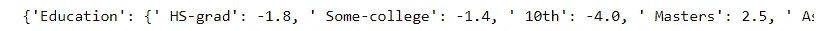

现在使用这个赔率表，我们可以用预先填充的模板生成预测。参考下图。

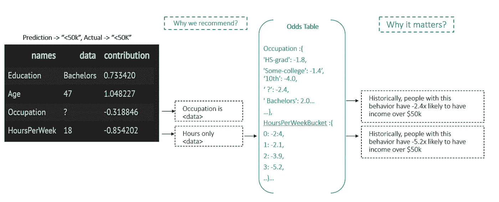

图九。由作者输出到人类可读的文本、图像。

使用之前为行索引 0 生成的`explainDF`数据，我们可以使用上面的框架将其转换为文本。让我们看看输出是什么样子的-

```
def explainPredictions(df, pred, odds_dict):
    reasons = []
    if pred == 0:
        sdf =  df.loc[df.contribution < 0, :].sort_values(['contribution']).reset_index(drop=True).copy()
    else:
        sdf =  df.loc[df.contribution > 0, :].reset_index(drop=True).copy()

    for idx in range(sdf.shape[0]):
        col_name = sdf.names[idx]
        data = sdf.data[idx]
        if col_name in odds_dict:
            odd_value = odds_dict[col_name][data]
        else:
            odd_value = odds_dict[col_name+'Bucket'][data//5]

        s1 = f"This individual have {col_name} value '{data}'." 
        s2 = f"Historically, people with this behavior have {odd_value}x likely to have income over $50k."
        reasons.append(s1+s2)
    return reasons

explainPredictions(explainDF, ebm_local.data(0)['perf']['predicted'], odds_dict)
```

```
["This individual have Education value ' Bachelors'.Historically, people with this behavior have 2.0x likely to have income over $50k.",
 "This individual have Age value '47'.Historically, people with this behavior have 1.8x likely to have income over $50k."]
```

如果这是一个超过 50k 的预测呢？

```
explainPredictions(explainDF, 1, odds_dict)
```

```
["This individual have Education value ' Bachelors'.Historically, people with this behavior have 2.0x likely to have income over $50k.",  "This individual have Age value '47'.Historically, people with this behavior have 1.8x likely to have income over $50k."]
```

看起来棒极了！我们可以为超过 50K 和 LinkedIn(领英)生成可读的推荐信，或者发邮件给我，地址是 aayushmnit@gmail.com。您也可以在 [Medium](https://medium.com/@aayushmnit) 和 [Github](https://github.com/aayushmnit) 上关注我，了解我将来可能会分享的博客帖子和探索项目代码。

# 参考

“InterpretML:机器学习可解释性的统一框架”(H. Nori，S. Jenkins，P. Koch 和 R. Caruana 2019)

[“解释 ML — EBM 文档”](https://interpret.ml/docs/ebm.html)

# Dua d .和 Graff c .(2019 年)。UCI 机器学习知识库[http://archive . ics . UCI . edu/ml]。加州欧文:加州大学信息与计算机科学学院。该数据集根据知识共享署名 4.0 国际版(CC BY 4.0)许可协议进行许可。

1.  “InterpretML: A Unified Framework for Machine Learning Interpretability” (H. Nori, S. Jenkins, P. Koch, and R. Caruana 2019)
2.  [“Interpret ML — EBM documentation”](https://interpret.ml/docs/ebm.html)
3.  Dua, D. and Graff, C. (2019). UCI Machine Learning Repository [http://archive.ics.uci.edu/ml]. Irvine, CA: University of California, School of Information and Computer Science. This dataset is licensed under a Creative Commons Attribution 4.0 International (CC BY 4.0) license.