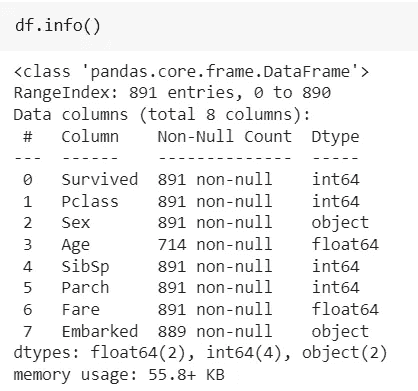

# 本机支持缺失值的 ML 算法

> 原文：<https://towardsdatascience.com/ml-algorithm-that-natively-supports-missing-values-40b42559c1ec>

## 不需要显式处理缺少的值

图片来自[皮克斯拜](https://pixabay.com/?utm_source=link-attribution&amp;utm_medium=referral&amp;utm_campaign=image&amp;utm_content=693873)的[威利·海德尔巴赫](https://pixabay.com/users/wilhei-883152/?utm_source=link-attribution&amp;utm_medium=referral&amp;utm_campaign=image&amp;utm_content=693873)

现实世界的数据集通常包含大量缺失值，这可能是由于数据损坏或未能记录数据而导致的。数据中缺失值的存在可能会影响训练模型的稳健性。数据科学家需要在预处理管道中显式地处理丢失的值。

有多种技术可以显式处理数据中的缺失值。在我以前的一篇文章中，我们讨论了在预处理管道中处理缺失值的 7 种技术:

  

大多数机器学习算法无法处理数据集中的缺失值，因此必须在建模管道之前处理缺失值。在本文中，我们将讨论不需要显式处理缺失值的机器学习算法:

*   基于直方图的梯度增强分类器/回归器

上述估计器可以支持数据集中的缺失值，并且不需要在建模之前显式处理 nan。

# 基于直方图的梯度增强:

梯度提升是一种集成机器学习技术，它将 AdaBoost 等提升算法推广到一个统计框架，该框架将训练过程视为一个重复使用先前网络的任意损耗的加性模型，以提高估计器的能力。

梯度提升将树模型顺序添加到集成中，其中每个基于树的模型试图校正前一个模型的误差。

Scikit-learn 库提供了支持直方图技术的梯度增强的实验实现。它提供了[***histgradientsboostingclassifier***](https://scikit-learn.org/stable/modules/generated/sklearn.ensemble.HistGradientBoostingClassifier.html)和[***histgradientsboostingregressor***](https://scikit-learn.org/stable/modules/generated/sklearn.ensemble.HistGradientBoostingRegressor.html)类，分别实现分类和回归任务。

> 根据 [scikit-learn 文档](https://scikit-learn.org/stable/modules/generated/sklearn.ensemble.HistGradientBoostingClassifier.html):

该估计器对缺失值(nan)有本机支持。在训练模型时，树基于潜在的增益，在每次分裂时学习缺失样本应该跟随左孩子还是右孩子。在推断过程中，缺失的样本记录被相应地分配给左边或右边的孩子。如果对于训练样本的特征没有遇到缺失记录，则这些样本被映射到具有最多样本的子代。

梯度推进算法在计算上是昂贵的，因为每个树是顺序训练和连接的，因此不能并行训练。对于较大的数据集，基于直方图的梯度增强的实现相对来说比`[**GradientBoostingClassifier**](https://scikit-learn.org/stable/modules/generated/sklearn.ensemble.GradientBoostingClassifier.html#sklearn.ensemble.GradientBoostingClassifier)`快得多。

## 实施:

> **数据集来源:**我将使用从[openml.org](https://www.openml.org/d/40945)下载的开源 [titanic 数据集](https://www.openml.org/d/40945)来演示实现。根据知识共享协议的法律条款，数据集[是公开和免费的。](https://creativecommons.org/publicdomain/mark/1.0/)

Scikit-learn 包提供了`[***HistGradientBoostingClassifier***](https://scikit-learn.org/stable/modules/generated/sklearn.ensemble.HistGradientBoostingClassifier.html)` 类，实现了基于直方图的梯度增强分类器。titanic 数据集包含大量不需要显式估算或处理的缺失值。

(图片由作者提供)，Titanic 数据集的缺失值计数

泰坦尼克号数据集有 891 个实例，特征:“年龄”、“上船”有缺失值。

在对分类特征进行编码并将数据样本分成训练样本和测试样本之后。

(作者代码)，Titanic 数据集预处理

请注意，我们没有在预处理阶段处理丢失的值，训练和测试数据已经有了丢失的值。

现在让我们实现`[***HistGradientBoostingClassifier***](https://scikit-learn.org/stable/modules/generated/sklearn.ensemble.HistGradientBoostingClassifier.html)` 算法

(作者代码)，基于直方图的梯度推进分类实现

Scikit-learn 还使用类`[***HistGradientBoostingRegressor***](https://scikit-learn.org/stable/modules/generated/sklearn.ensemble.HistGradientBoostingRegressor.html)***.***`提供了基于直方图的梯度增强的回归实现

## 本身支持缺失值的其他算法:

k-NN 和随机森林算法也可以支持缺失值。k-NN 算法通过取 K 个最近值中的大多数来考虑缺失值。不幸的是，k-NN 和 RandomForest 的 scikit-learn 库实现不支持缺失值的存在。

# 结论:

在本文中，我们讨论了基于直方图的梯度增强算法，该算法受 [LightGBM](https://github.com/Microsoft/LightGBM) 的启发，对于较大的数据集来说比`[**GradientBoostingClassifier**](https://scikit-learn.org/stable/modules/generated/sklearn.ensemble.GradientBoostingClassifier.html#sklearn.ensemble.GradientBoostingClassifier)`快得多。

在我的上一篇文章中，我们讨论了显式处理缺失值的 7 种技术:

  

如果样本数据有很多缺失值，我们可以使用剩余的数据来预测缺失的记录。我在以前的一篇文章中简要讨论过这个问题:

  

# 参考资料:

[1] Scikit-learn 文档:[https://sci kit-learn . org/stable/modules/generated/sk learn . ensemble . histgradientsboostingclassifier . html](https://scikit-learn.org/stable/modules/generated/sklearn.ensemble.HistGradientBoostingClassifier.html)

[2]泰坦尼克号数据集([公开发布](https://creativecommons.org/publicdomain/mark/1.0/)):[https://www.openml.org/d/40945](https://www.openml.org/d/40945)

> 感谢您的阅读