# ML 基础(第 2 部分):支持向量机

> 原文：<https://towardsdatascience.com/ml-basics-part-2-support-vector-machines-ac4defba2615>

## **什么是支持向量机，以及如何为监督学习制定、构建和应用支持向量机**

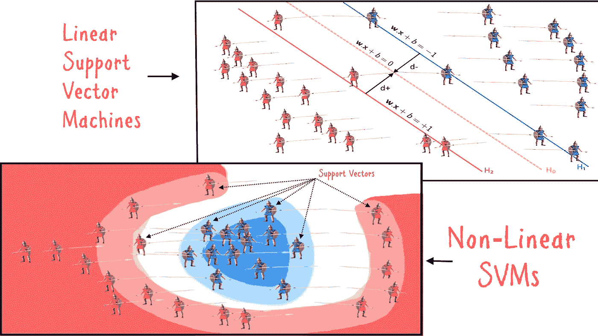

图 1:战争中士兵的例子中支持向量机模型的描述(来源:作者)

在[之前的帖子](/ml-basics-part-1-regression-a-gateway-method-to-machine-learning-36d54d233907)中，我们学习了回归方法。在本文中，我们将介绍一种类似但稍微先进的机器学习方法，称为“*(SVM)*”。除非你已经很熟悉了，否则建议你在阅读这篇文章之前先看看之前的文章。

</ml-basics-part-1-regression-a-gateway-method-to-machine-learning-36d54d233907>  

**简介**

如果您已经学习了前面的课程，您现在应该知道机器学习模型的目标是找到最适合数据的模型参数。在线性模型(例如，一条线)的情况下，这意味着找到穿过所有数据点的线的最佳系数。然而，不可能用一条线来拟合以群集形式分布的所有数据点，因此，需要找到一条与大多数点的距离最短的线。这就是线性回归的工作原理。然而，这些基于多数的方法的最大缺陷是它们倾向于过度适应训练样本。这意味着它们倾向于在训练集上工作良好，但是不能预测训练集中不存在的新例子。这种普遍性的缺乏导致了一类新的方法，它们在概念上以相反的方式工作。这些方法不是为大多数人找到最佳的*拟合*，而是试图对两个类别之间的分隔空间进行建模。这样的分离空间称为“*超平面*”。SVM 就是这样一种技术，它试图学习一个*超平面*，该超平面能够最好地分离两组数据点。

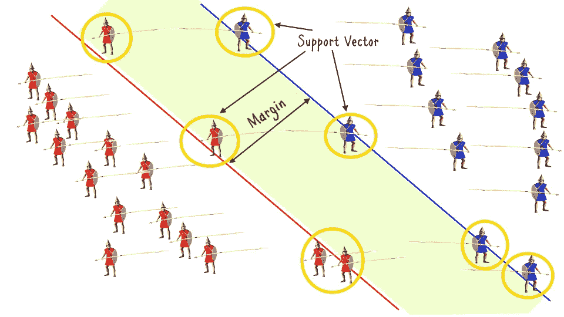

图 2:支持向量、边缘和超平面的描述(来源:作者)

SVM 通过在存在于这种超平面边界的两个数据集群中找到那些“*离群值*来完成这项任务。让我们看看图 2 中的示例图像；如果我们使用基于多数的分类器，它会试图找到一条单独的线来区分蓝色和红色的簇。但是，这种分类是不正确的，因为它会忽略远离聚类平均值的点，从而导致绘制错误的边界。然而，当更多的数据变得可用时，均值偏移和那些更远的点看起来不再是*异常值*。因此，这种基于多数的方法会失败，并且不能产生适用于新样本的通用解决方案。

SVM 方法通过找到数据中最重要的点(或从原点画出的向量)来解决这个问题。这些点位于超平面的边界上。这些点被称为*支持向量*。它们之所以这样命名，是因为它们的存在占据了分类边界。如果将它们移除，两个集群之间的分隔线会发生显著变化。支持向量机试图从两个相反的类别中找出它们之间距离最短的支持向量。这个距离被称为*边缘*，该边缘最末端的线形成决策面的边界。

**线性 SVM**

支持向量机的主要优势在于其发现非线性决策边界的能力。然而，它们也非常适合线性可分的数据。在本文前面，我们已经看到了线性可分数据的一个简单例子(例如，战争中的士兵)。如果你阅读了回归文章，你会注意到这样的例子也可以用逻辑回归建模。然而，当样本数量较少且存在导致稀疏的缺失数据时，使用 SVM 进行线性分类任务表现更好。在这种情况下，支持向量机表现得更好，因为它们不模拟大多数，而是支持边界点。

**SVM 目标函数**

前面提到过，SVM 模型的目标是找到使裕度最大化的超平面，裕度是两个相反类别的决策边界之间的距离。因此，我们需要定义一个目标函数，该函数找到最佳的*支持向量*，从而找到决策边界，同时也最大化两个决策边界之间的余量。更具体地说，我们想找到一个权重向量' **w'** ，它的每个元素都是一组数据点的系数。从支持向量到决策边界的最短距离(即点到线的距离)是 1/|| **w** ||并且两个决策边界之间的总距离(即余量)是 2/|| **w** ||。所以，如果我们想最大化利润率，我们需要最小化|| **w** ||。图 3 中的函数 *f(x)* 显示了这个目标函数。

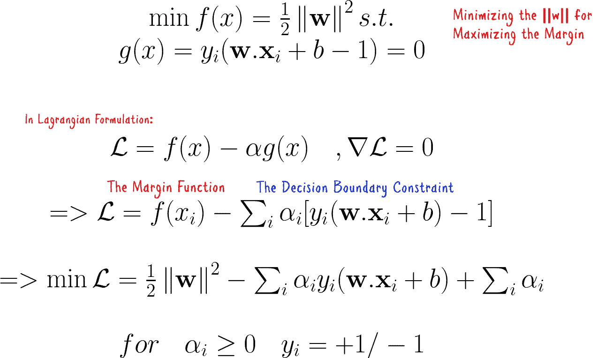

图 3:支持向量机优化函数的推导(来源:作者)

除了目标函数，我们还需要确保决策边界得到遵守。为此，我们必须对目标函数施加约束，使得当点属于一类时，输出> =+1，而当它们属于另一类时，输出为上述方程组中的<=-1\. This constraint is represented by the function *g(x)* 。现在为了解决这个问题，我们必须把它写成*拉格朗日*形式——约束优化问题的数学优化公式。我们通过遵循上述等式中的目标函数公式化的*拉格朗日*格式来编写新的目标函数。目标函数*‘L’*由两部分组成，原最小化函数 *f(x)* 和约束函数 *g(x)* —决策边界约束。阿尔法矢量是我们想要优化的一组参数，但是我们也没有 **w** 或 **b** 。我们可以通过对偶拉格朗日公式进一步简化这个拉格朗日公式。

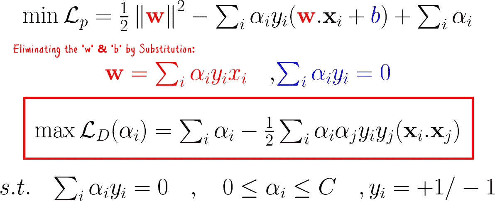

图 4:对偶拉格朗日公式(来源:作者)

我们通过替换早期目标函数公式*中的“***w”***和“*b”*来实现对偶拉格朗日公式。*我们可以通过分别取 **L** 相对于 **w** 和 b 的梯度并将它们设置为零(回想一下，在最佳点梯度为零)来获得' **w'** 。这给了我们一个简化的目标函数，它只取决于数据集中每个点的*α*参数向量。

如果你一直在观察，你也应该注意到，除了 Xᵢ.，我们还引入了另一个向量 Xⱼ这是因为我们想要区分两个向量:一个代表数据点，另一个代表权重。但是，请注意，两者都来自同一组数据点。这样，这个乘积就是一个向量和另一个向量的点积。两个向量的点积给出了相似性的度量。换句话说，我们想要从*不同的*类中找到两个*相似的*向量，这两个向量使裕度最大化。

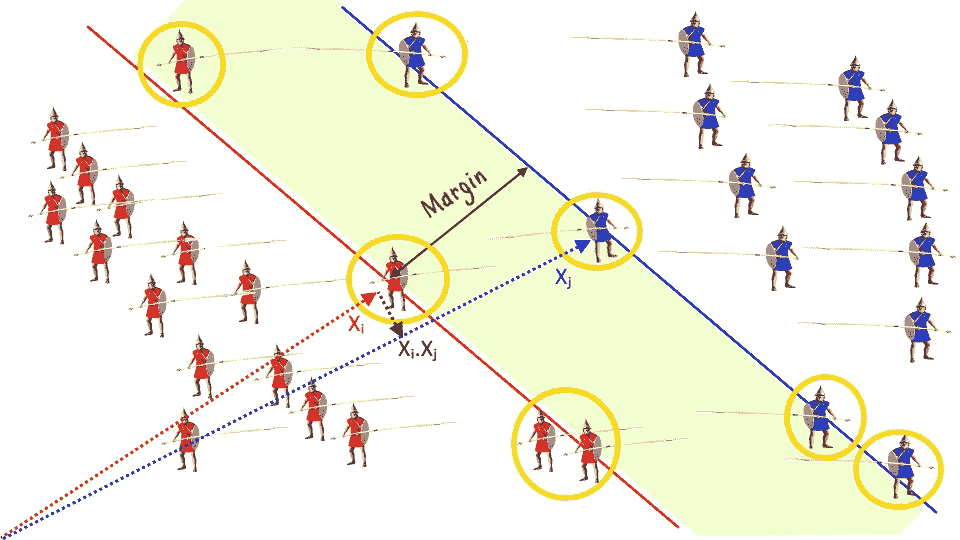

图 5:使用点积描述支持向量的相似性计算(来源:作者)

我们将在数据集中的两个数据点之间进行这种成对的相似性计算，然后找到 *alpha* 向量的最佳值，这将是一个稀疏向量——一个大多数条目为零且只有少数条目非零的向量。这样，我们将能够在优化过程结束时，通过使用来自 *alpha* 向量的非零系数来挑选支持向量。

**使用 Python 进行线性 SVM 分类**

在前面的章节中，我们已经了解了支持向量机的概念。我们可以使用 python 的 *scikit* 库来构建线性 SVM 模型，并将其应用于示例数据集。我们首先创建一个随机数据集，并将其分为训练集和测试集，如下图所示。

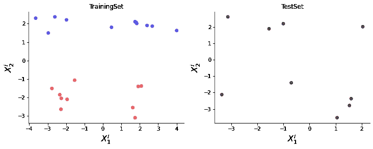

图 6:一组随机的数据点被分成训练集和测试集(来源:作者)

然后，我们可以用线性 SVM 模型来拟合训练样本，并用它来对测试样本进行分类。生成的超平面如下图所示。

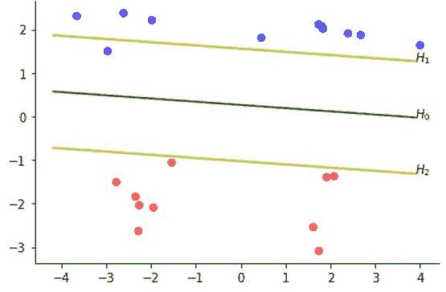

图 7:线性 SVM 模型拟合训练集的决策边界(来源:作者)

图 7 中的极端线条显示了决策边界，靠近这些线条的点是图 8 中描述的支持向量。请注意，这些几乎是异常点，但是它们是最关键的点，因为它们的存在/不存在会改变决策边界。

图 8:线性 SVM 模型的支持向量的描述。(来源:作者)

测试集的分类结果如下图所示。阴影颜色区域显示了特定类别的决策边界。这些点离决策边界越远，它们被分类到相应类别的可能性就越大。位于相应颜色的较亮色带上的点是支持向量。

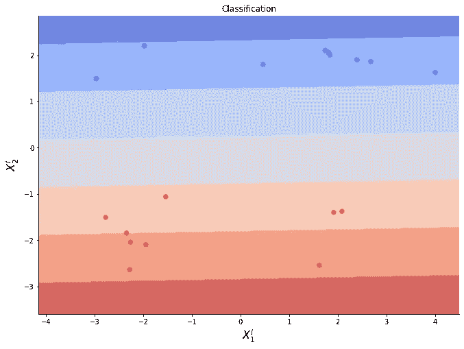

图 9:测试集上线性 SVM 模型的结果(来源:作者)

**非线性 SVM**

在上一节中，我们成功构建了一个线性 SVM 模型，并使用它对数据集进行分类。线性支持向量机一直工作到我们遇到不可线性分离的数据。然而，大多数真实世界的数据不是线性可分的。这就是我们需要非线性 SVM 模型进行分类的地方。

**非线性目标函数公式**

在下图中，你可以看到一个非线性数据的例子。

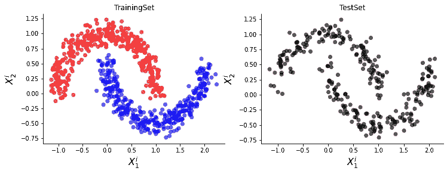

图 10:非线性数据的例子(来源:作者)

如果我们在这个数据集上使用线性 SVM 模型，我们将得到如下图所示的结果。

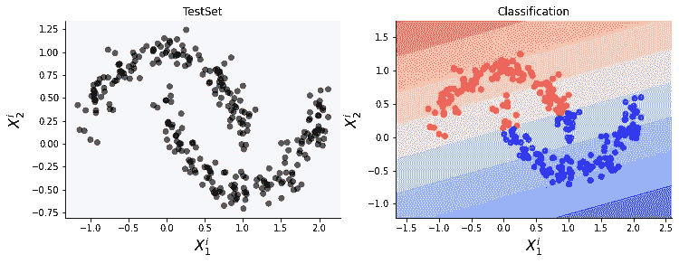

图 11:线性支持向量机在非线性数据上的应用(来源:作者)

正如你所见，线性 SVM 模型未能准确分类数据点。是因为线性模型不适合这样的数据。这并不好，因为我们已经提到，支持向量机的最大优势是能够准确分类非线性样本。我们需要为非线性支持向量机重构我们的目标函数。这是我们在考虑了数据样本中的非线性后得到的结果。

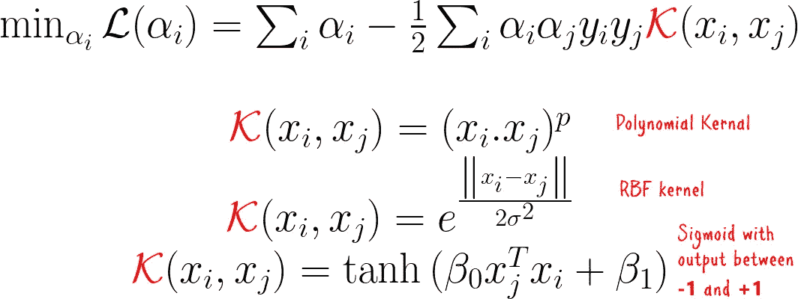

图 12:非线性支持向量机的目标函数(来源:作者)

请注意，我们的主要变化是我们引入了一个内核函数*。如果你已经学习了回归课程，你将会熟悉内核函数。它们是将数据投射到多维空间的函数。这些核函数可以是不同类型的，一些例子是多项式核、径向基核和 sigmoid 基核函数。*

***采用核函数的非线性分类***

*现在，如果我们在非线性数据集上使用这个新公式，我们将得到如下图所示的输出。我们对这个数据集使用弧度基核，因为数据样本清楚地显示了圆形模式。正如你所看到的，它已经成功地对所有的例子进行了分类。*

*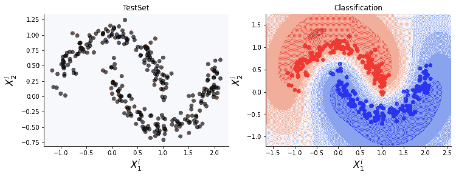*

*图 13:使用 RBF 核的非线性 SVM 分类(来源:作者)*

*如前所述，不同类型的数据需要不同类型的内核函数。我们看到了一个 RBF 核函数的例子。有些情况下，不同的内核函数更适合。例如，让我们以下面的数据为例。该数据中的样本没有形成放射状模式。*

*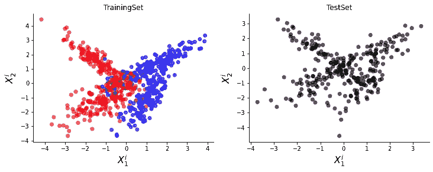*

*图 14:随机生成的数据样本(来源:作者)*

*这两个集群几乎是线性可分的，直到它们在中心重合并混合。我们可以画一条分割曲线，将这两个集群分开。这是我们可以利用多项式核的地方，它使用多项式函数作为决策边界。我们在下图中看到，使用这种核的分类成功地对大多数样本进行了准确的分类。*

*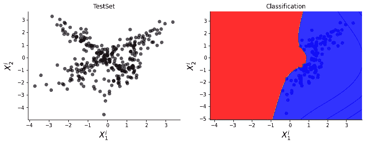*

*图 15:使用多项式核的 SVM 分类(来源:作者)*

***结束语***

*在本文中，您已经了解了支持向量机。您已经学习了如何为支持向量机制定目标函数，以及如何为线性可分数据构建 SVM 模型。您还学习了如何通过使用核函数来处理数据中的非线性。支持向量机是许多现实世界应用的伟大工具，在某些情况下甚至可以胜过复杂的神经网络模型(取决于数据)。在接下来的课程中，我们将探索更多的机器学习概念。*

***如需代码，请点击链接:***

*【https://www.github.com/azad-academy/MLBasics-SVM 号*

***在 Patreon 上支持我:***

*<https://www.patreon.com/azadacademy>  

**在子栈上找到我:**

<https://azadwolf.substack.com>  

**关注 Twitter 更新:**

[https://www.twitter.com/@azaditech](https://www.twitter.com/@azaditech)*