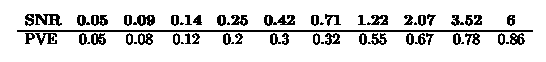
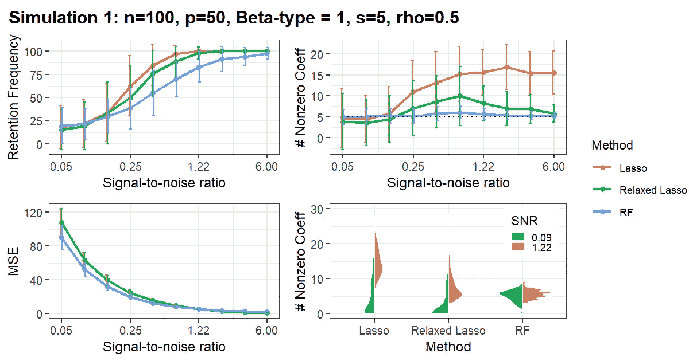
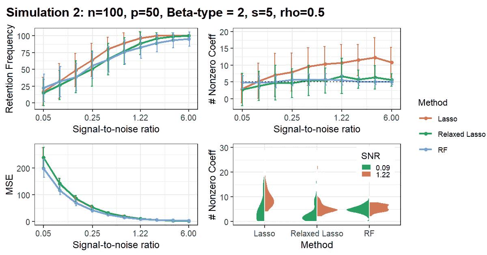
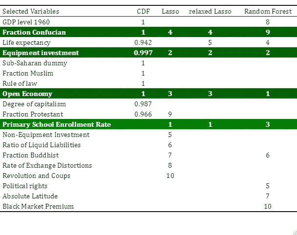

# 宏观经济学 ML # 1

> 原文：<https://towardsdatascience.com/ml-for-macroeconomics-1-cb7fccf93ccf>

## 低质量数据中随机森林的变量选择

卡洛斯·阿兰达在 [Unsplash](https://unsplash.com?utm_source=medium&utm_medium=referral) 上的照片

虽然*机器学习* (ML)席卷了许多应用科学，但经济学对因果关系的强调使其很难找到相关的应用。在过去的几年里，苏珊·艾希成功地开创了微观经济学的各种应用，然而，宏观经济学的学生们还没有找到类似的榜样来效仿。这就是为什么在这篇文章中，我想用*变量选择*的问题来说明一个更小的领域，ML 可以很容易地补充经典技术。

鉴于宏观分析的聚合性质，如跨国研究，高维(也称为“大”)数据是研究人员面临的最常见的情况。尽管*最小绝对收缩和选择算子* ( **套索**)在经济学家中一直很受欢迎，但像*随机森林* ( **RF** )这样的非参数替代物却没有得到类似的关注。因此，我们将一起 ***i)*** 进行模拟研究，比较 Lasso 和 RF 在低质量数据下的行为，并将 ***ii)*** 应用于 Sala-I-Martin 著名的“百万”经济增长数据集。

***免责声明*** *:本文基于*[*GitHub*](https://github.com/pcschreiber1/LASSO_RF_for_Macro)*上的一个课程项目。所有的材料，进一步的解释和额外的参考资料都可以在那里找到。*

# 变量选择复习

变量选择——在 ML 文献中称为“特征选择”——是处理高维数据(即预测值数量相对于观察值数量较高的数据)的最常见方法之一。其思想是，如果研究人员知道只有所有协变量的子集影响因变量，正确识别这些可以减轻一些“维数灾难”，如预测准确性(范和吕，2009)。在实践中，这被称为*稀疏假设*。

套索和随机森林的应用是多年来发展起来的各种可变选择技术的两个例子。重要的是，就像在统计学中一样，不存在单一的最优过程。正如 Hastie 等人(2017 年)解释的那样:

> 不同的过程具有不同的操作特性，即，当我们改变它们各自的调谐参数时，产生不同的偏差-方差权衡。事实上，根据问题设置，最佳子集选择提供的偏差-方差权衡可能比 lasso 提供的权衡更有用或更不有用。(第 582 页)

现在，Hastie 等人所指的是“最佳子集选择”自然具有非常低的偏差，但是，在有噪声的数据中，Lasso 等方法通常可以提供更好的结果，因为它们以一些偏差换取方差的大幅减少。事实上，这种类型的权衡是本文的中心动机，因为我们将 Lasso 与另一种需要有效减少方差的技术相比较:RFs。在进行模拟研究之前，让我简单介绍一下 Lasso 和 RF。

**套索**属于收缩法的一类，具有特殊的性质，即对于罚项的适当选择，系数被精确地收缩到零。由于惩罚项缩小了所有系数的大小，因此开发了一种**松弛套索**，其中非零系数的控制与整体收缩分开。

**RFs** 的定义特性是去相关决策树的聚合，这对于减少方差特别有效。与 Lasso 不同，RF 并不自然地执行变量选择，Genuer 等人(2010)为此开发了一种逐步上升的变量引入策略，并在 R-CRAN 库上提供的非常好的 [**VSURF**](https://cran.r-project.org/web/packages/VSURF/VSURF.pdf) 包中实现了该策略。

# 模拟研究

考虑到偏差-方差权衡对问题结构的依赖性，我们的模拟研究模仿我们的真实世界应用(即经济增长的跨国研究)是关键。除了*(非常)小的样本量*(世界上大约有 100 个国家)，这还与我们任何一年的**数据质量**密切相关:人口普查很少进行，没有全球标准化，严重依赖数据估算——这些问题在不太富裕的国家更为严重。

我们将数据质量作为比较的重点，并通过*信噪比* ( **SNR** )对其进行评估。直觉上，如果噪声(误差)比信号(我们的解释变量)多得多，就很难识别信号的影响。我们遵循 Hasties 等人(2017 年)的方法，考虑了对数标度上从 0.05 到 6 的十个 SNR 值，为了进行比较，还报告了“解释的方差比例”的相应值。重要的是，正如作者强调的那样，研究往往对信号清晰度过于乐观，并认为在现实世界中，观测数据往往具有 **log(SNR) < 1** ！

图片作者。

作为这种 SNR 标度的结果，模拟研究计算了 10 个 x #sim 合成数据集，并将套索、松弛套索和 RF 应用于每个数据集。数据集是稀疏的，因此 50 个协变量中只有 5 个影响结果。Toeplitz 矩阵用于方差-协方差矩阵，因此变量的相对位置决定了相关结构。请注意，我们选择了线性 DGP，在比较参数方法和非参数方法的结果时，需要考虑这一点。最后，模拟次数设置为 100。

现在我们已经熟悉了模拟研究的概念设置，我们可以看看结果了。如果您对代码或更详细的解释感兴趣，包括对 SNR 的控制，我诚挚地邀请您在 [GitHub](https://github.com/pcschreiber1/LASSO_RF_for_Macro) 上查看原始项目。

## 模拟 1 —基线

作者图片

*   **RF 始终更接近真实稀疏度，在所有 SNR 水平上的方差都非常低**
*   **Lasso 方法的良好保留频率是过度密集估计的副产品，并隐藏了无效模型的数量**

在基线模拟中，一般的相关程度是中等的(0.5 到直接邻居)，在五个真正的预测值之间没有特殊的相关性。左上方的图描绘了保留频率，即鉴定了多少真预测因子。毫不奇怪，当信号变得更清晰时，所有三个模型在识别重要变量方面都变得更好。然而，RF 在 SNR 0.25 和 1.22 之间的相对表现不佳具有误导性:查看右上方的图表说明了模型预测的非零系数的数量，换句话说，它的估计密度。这里我们可以看到，套索方法的高保留频率是其高度高估密度的结果。

事实上，虽然松弛的套索由于其分离收缩和稀疏控制的能力，最终更接近真正的稀疏，但对于信噪比的实际水平，它仍然选择平均两倍的协变量。查看右下方的图表，该图放大了“真实世界窗口”，我们看到 RF 密度牢牢地集中在真实数字周围，而在 SNR 的下端，即使是松弛的套索也选择了许多零模型(即模型没有识别出显著的协变量)。

最后，按照惯例，还报告了 MSE(左下角)。我们可以看到，对于低水平的 SNR，MSE 是天文数字，并且随着数据质量的提高而迅速降低。重要的是，我们可能想知道为什么非参数方法明显优于线性方法，尽管事实上这些方法是正确指定的。然而，对于 RF，我们只报告了 VSURF 的出袋均方误差，这是向下偏置的，因为排名和选择是基于相同的观察结果(Genuer 等人，2015)。从该图中可以看出，RF 和 Lasso 的 MSE 下降斜率相似。

## 模拟 2-高协方差

作者图片

*   **RF 对高共线性非常稳健，不像 Lasso**

由于高度共线性是宏观经济分析中的一个常见问题，因此更好地理解这些方法的相对性能对于解释应用结果非常重要。这就是为什么在第二次模拟研究中，我们让所有真正的预测者成为邻居，从而给他们一个相对高相关性的结构。重要的是，鉴于我们的托普利兹矩阵的性质，这也意味着现在还存在一组无关紧要的变量，这些变量与*所有*真实预测值密切相关。这种设置的目标是众所周知的弱点套索选择正确的变量，如果相关性高(见，例如，詹姆斯等人，2013 年)。相比之下，对于 RF，Genuer 等人(2010 年)发现，可变重要性排序对共线性的存在非常稳健。

事实上，RF 的性能与第一项研究相比几乎没有变化，小提琴图实际上表明，在实际 SNR 窗口的低水平上，方差有所降低。另一方面，我们看到标准套索生成了更多的无效模型，并且保留频率的增加较低。类似地，松弛的套索也生成许多空模型，但也演示了它用多达 20 个变量膨胀模型的情况。因此，尽管其保留频率和平均密度与 RF 非常匹配，但其性能仅在高信噪比下才会收敛。

*[*原始项目*](https://github.com/pcschreiber1/LASSO_RF_for_Macro) *包含几项附加研究，进一步说明了这些技术的偏差-方差权衡。**

# *应用*

*有了这些见解，我们现在用 Sala-I-Martin (1997) [ [此处可用](http://www.columbia.edu/~xs23/data/millions.htm) ]著名的“百万”数据集将这三种技术用于这项任务。它由 20 世纪 70 年代 134 个国家的 63 个宏观变量组成，与我们模拟研究的观测变量比相匹配。标准化并用样本平均值替换缺失值后，我们剩下 119 个国家和 62 个预测变量。*

*Sala-I-Martin (1997 年)以标志性的标题“*我刚刚运行了两百万次回归*”着手开发一种比当时非常流行的“极限界限测试”更快速、更灵活的方法来识别相关的宏观经济增长变量。他自己提出了基于累积分布函数来估计和选择变量，我们也将累积分布函数包含在下面的结果表中。*

**

*百万数据结果表(图片作者提供)。*

*在这四种方法中，选择了 20 个不同的变量作为 20 世纪 70 年代 GDP 增长率的预测值。虽然乍一看，我们可能会发现这种实质性的分歧令人惊讶，但仔细检查估计结果会发现存在高度共线性(在[原始项目](https://github.com/pcschreiber1/LASSO_RF_for_Macro)中详细讨论)。记住第二次模拟研究的结果，尽管所有四种方法的回收率都相对较低，*我们应该对 RF* 估计的密度相对有信心。因此，尽管 CDF 和 relaxed Lasso 的节俭看起来很有吸引力，但这表明他们的估计过于保守。*

*为了便于比较，Lasso 方法的结果按估计系数的绝对值排列。我们可以看到，四个变量不仅在 all 或 Lasso&RF(以绿色标记)之间共享，而且通常被赋予高度的重要性:虽然随机森林方法只赋予宗教一个次要角色，但它也将“设备投资”(即机械化投资)计算在经济增长的一组非常重要的驱动因素中。对经济开放度的衡量也是如此，这四种方法都非常重视经济开放度。相比之下，Sala-I-Martin 的 CDF 方法没有选择小学入学人数，而 Lasso 方法将小学入学人数排在首位，在 RF 方法中排在第三位。然而，结果的明显不稳定性提醒人们不要过于相信这些排名:对于套索，变量很难选择，以至于交叉验证过程中的随机性导致“预期寿命”包含在放松的套索中，而不是标准的套索中。*

*退一步说，我们看到存在一小部分(相对)强的预测因子，但有许多弱的。从宏观经济的角度来看，在比较四个子集选择时，突出的是缺乏有利于社会和经济的政治变量:虽然 CDF、standard Lasso 和 random forest 都选择了一个政治变量，但没有一致性。有趣的是，即使是与暴力冲突相关的“革命和政变”，也只被标准套索选择，并且仍然只被分配最低的等级——这与非常成功的制度经济学文献相反。*

# *结论*

*谢谢你坚持到最后。我希望这篇文章为您提供了一个将 ML 简单应用于宏观经济学的实例。当然，虽然我们的“数百万”数据集的简单例子不能保证任何因果解释——显而易见的下一步将是时间序列数据——但我们能够看到随机森林的变量选择对于经验宏观经济学的一些问题来说可能更加稳健。如果你能想到更多的宏观经济应用，或者曾经做过一些，我很想听听，所以请在下面分享。*

*保持安全&保持联系！*

## *参考*

*   ***樊军、吕军军(2009)** 。高维特征空间变量选择的选择性综述(特邀综述文章)。*中国统计，20 (1)，*第 101–148 页。*
*   *(2010 年)。使用随机森林的变量选择。*模式识别字母，31 (14)* ，第 2225–2236 页。【在线】。可在:[https://doi:10.1016/j . patrec . 2010 . 03 . 014](https://doi:10.1016/j.patrec.2010.03.014)获取。*
*   *Genuer，r .，波吉，J.-M .和 Tuleau-Malot，C. (2015 年)。VSURF:一个使用随机森林进行变量选择的 R 包。*《R 日报》，第 7 卷第 2 期*，页 19–33。【在线】。可在:[https://doi:10.32614/RJ-2015-018](https://doi:10.32614/RJ-2015-018)获取。*
*   ***Hastie，t .，Tibshirani，r .和 Tibshirani，R. (2017)** 。最佳子集，向前逐步还是套索？基于广泛比较的分析和建议。*统计科学，35 卷 4 期*，第 579–592 页。【在线】。可在:[https://doi:10.1214/19-STS 733](https://doi:10.1214/19-STS733)获取。*
*   ***詹姆斯，g .等人(2013)** 。*统计学习入门*。斯普林格。*
*   ***萨拉伊马丁，X. X. (1997)** 。我刚刚做了两百万次回归分析。*《美国经济评论》，87 卷 2 期*，第 178–183 页。*