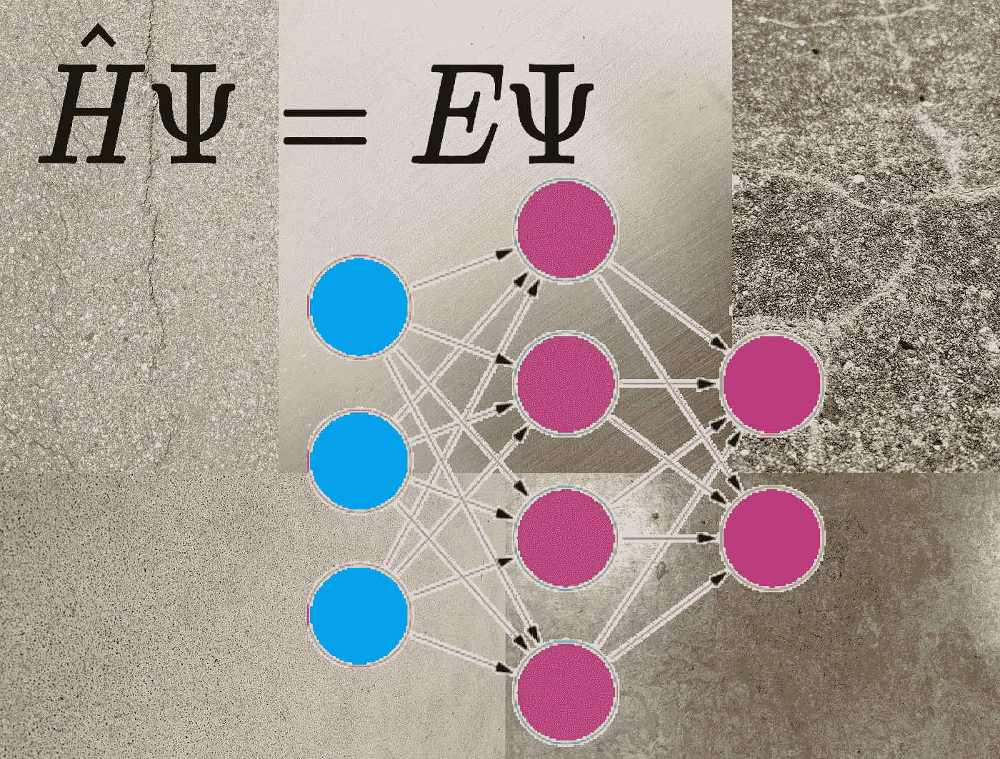

# ML 追求化学和材料科学——使用和开发模型的每个人都感兴趣的综述的要点

> 原文：<https://towardsdatascience.com/ml-goes-after-chemistry-and-material-sciences-highlights-of-a-review-of-interest-to-everybody-9b3caf2d131e>

## 人工智能在生物学之外的科学领域的应用

## 科学家们刚刚为人工智能应用于化学和材料科学的未来制定了一个路线图，在一篇文章中，沿着人工智能的几个前沿追踪了艺术的状态

就像 ML 用于生物学一样，分子和材料的性质也可以用从数据库和量子计算中训练出来的 ML 模型来计算。作者的图片，由自己的照片和图画组成。

在过去的十年里，我们见证了机器学习(ML)和人工智能(AI)领域的一场革命，并且在过去的 5 年里，它对其他科学产生了前所未有的影响。虽然最著名的例子可能是 AlphaFold 及其对生物学的影响，但其他领域也感受到了这些新计算技术的潜力。特别是，计算化学和计算材料科学已经开始转变可能很快就会发生的类似于 AlphaFold 的范式转变，由此执行计算的传统方法正在被更快、更容易、通常更精确的方法所取代，这些方法源于 ML 模型的直接应用。

就在刚才，一组致力于将 ML 应用于材料科学和化学的科学家发表了一篇关于新兴子领域及其可能立即发展的评论/意见(或“路线图”)文章。文章讨论了在计算化学和材料科学中 ML 的几个正在进行和即将进行的应用中现存的和即将出现的困难的观点。

即使你使用的是 ML 模型，而不是化学和材料，你肯定会发现这篇文章和我的博客摘要很有趣，因为这篇文章探索了更广泛领域的许多方面。

# 五个主要标题，每个标题都讨论了几个要点

文章讨论了 5 个主要问题，包括更具体的要点，如创建更好更快的基于 ML 的力场，这些力场基于数据或复杂精确但计算缓慢的量子计算，计算密度泛函理论的交换相关泛函的新方法，多体问题的基于 ML 的解决方案，以及处理 ML 模型正确训练所需的大量数据的方法。

简而言之，这篇文章涵盖了这些要点，其中我强调了一两个要点:

## **1。预测材料特性**

*   **利用机器学习加速计算材料设计**

在 AlphaFold 的成功推动下，我们现在正经历着将 ML 应用于蛋白质设计的热潮——现在这是一个热门话题，非常有前景([示例见](/new-deep-learned-tool-designs-novel-proteins-with-high-accuracy-41ae2a7d23d8))。

事实证明，ML 也可以用于设计新材料，正如文章开头所述。正如文章的第一部分所讨论的，这不仅仅是设计原子在空间中的位置，还包括由此产生的电子属性。

*   **用于材料性能预测的机器学习**

就像在 ML 产生影响的任何其他科学领域一样，它可以帮助预测比常规模型更好的属性，或者具有相同的准确性，但速度要快得多。

事实上，用于预测物理或化学性质的 ML 已经存在了几十年，尤其是使用相当简单的神经网络。举例来说，看看早期计算分子核磁共振化学位移的程序，或者其中记载的几个应用程序(顺便说一句，太棒了，我家里就有！)1999 年的书:

 [## 化学和药物设计中的神经网络，第 2 版

### 这个备受推崇的文本的第二版已大大扩展。第六部分“应用”更新自…

www.amazon.com](https://www.amazon.com/Neural-Networks-Chemistry-Drug-Design/dp/3527297790) 

当然，我们现在有更好的网络架构、激活功能和训练方法；同样重要的是，现在的数据库比 23 年前这本书出版时大了几个数量级，也更容易访问。所有这些方面都将在本文的其他部分讨论。

*   **预测热力学稳定的物质**

当然，材料科学的重要实际成果之一是发现和开发具有有用特性的新材料。一个非常理想的特性是耐久性，或者说是稳定性。科学家们对预测可以在实验室合成的稳定材料的成分和晶体结构感兴趣，ML 模型可以很好地帮助这一点。

*   **材料性能和功能的学习规则**

例如通过可解释的神经网络或通过进行符号回归的网络，如这里的[应用于量子计算](https://medium.com/towards-data-science/google-proposes-new-method-to-derive-analytical-expressions-for-terms-in-quantum-mechanics-d70fff6e1ef2)或更广泛地应用于科学中的[。](/real-world-applications-of-symbolic-regression-2025d17b88ef)

关于可解释的 ML 模型的具体问题也将在文章的后面和这篇博客中提到。

*   **光谱学深度学习**

光谱学研究辐射与物质的相互作用，特别是如何从描述物质对辐射的影响的光谱中检索出有关物质的信息。获取这些信息，或者模拟交互，并不简单，ML 当然可以在这方面有所帮助。

*   **无序系统的机器学习**

无序材料是那些以极端的结构和化学无序为特征的材料。玻璃、塑料和无定形晶体是无序材料的例子，这当然是许多研究和开发的重要焦点。

## **2。精确力场的构建及超越**

*   **用于分子量子模拟的机器学习**

在分子模拟中，力被传播为加速度和运动，以创建一个系统的原子可能如何一起移动的“电影”，从而赋予一片物质的属性，例如蛋白质的功能或材料的柔性。(要了解更多关于模拟的一般知识，请查看[这篇文章](https://medium.com/towards-data-science/a-family-of-specialized-supercomputers-that-simulates-molecular-mechanics-like-no-other-38a6e59f96ef)的介绍。)

使用经典方程计算力场需要大量的参数和密集的计算，而神经网络可以极大地简化(和加速)。例如，参见这篇关于计算小分子[的势能及其导数(即力)的“通用”网络的论文。](https://pubs.rsc.org/en/content/articlelanding/2017/sc/c6sc05720a)

许多类似的网络已经存在，更多的网络正在出现。

*   **微观交互的贝叶斯机器学习**

贝叶斯 ML 允许自适应模型在模拟中更好地描述系统。由于可靠和有效的量子计算软件包的存在，微观数据可以大量产生，然后用于拟合灵活的原子间潜在模型，而不是宏观的可观测数据。这种想法并不新鲜，因为它已经被应用于非 ML 方法，但与 ML 方法一起，这种想法被推向了最大化，其中 ML 模型表现为非参数回归器，对交互的数学形式施加很少或没有约束，并直接依赖于实际数据。然后，贝叶斯技术以函数分布的形式强加先验，并使用数据和 ML 模型来提供预测。

*   **来自机器学习的光谱精确势能面**

如上所述，光谱学研究辐射与物质的相互作用，并且通常使用光谱学方法来检索关于一种物质的信息。从光谱中提取这种信息的主要方法之一是模拟它。在最基本的层面上，这需要求解薛定谔方程，但这很难从第一原理中实现。对于一些计算来说，这甚至更难，因为人们需要知道所谓的势能面，这是一个超维面，它量化了组成系统的原子和电子的不同配置(位置和状态)的势能。今天，一些 ML 方法可以辅助小分子的这些计算，目标是改进这些方法，使它们适用于更大的系统。

*   **化学和材料科学中的高维神经网络势能面**

根据上一点，计算势能的神经网络有许多更广泛的应用，例如快速(甚至可能交互地)测试分子和分子组的能量和构象。

*   **可转移神经网络力场**

如上所述，分子模拟是关于将力传播为加速度和运动，以创建系统原子可能如何一起移动的“电影”，从而为我们感兴趣的属性让位。量子计算已经成为计算有机化学的主力，是最精确的*从头计算*模拟，即不依赖于特定原子、键等的参数化。这些计算的问题在于它们极其昂贵，肯定比经典分子力学昂贵得多——代价是后者需要参数化。

原来产生势能的 ML 模型也能提供力，因为作用在原子上的力是能量面沿空间维度的梯度。有一个新兴的领域利用这一点来产生新的力场，其运行速度接近经典计算的速度，但几乎和量子计算一样精确。这里有一个最著名的例子:

 [## ANI-1:力场计算成本下具有 DFT 精度的可扩展神经网络潜力

### 深度学习正在变革许多科学和技术领域，特别是图像、文本和语音识别…

pubs.rsc.org](https://pubs.rsc.org/en/content/articlelanding/2017/sc/c6sc05720a) 

*   **集成机器学习模型:超越局部势的电子结构精度**

随着方法的进步，考虑电子的原子尺度系统的建模越来越具有预测性。然而，可获得的模拟时间和长度比例受到昂贵的计算机要求和模拟中包括的电子数量的急剧缩放的限制。一个相对灵活的函数形式和少量的参考计算可以用来拟合结构-性质的相互作用使用 ML 方法。许多研究领域试图缩小电子结构计算能力和数据驱动能力之间的差距。他们遵循的主要策略是调整用作输入的原子特征，或者调整模型本身的数学结构，以反映问题的潜在物理特性和目标属性的特定结构。

## 3.用机器学习解决多体问题

*   **统一机器学习和电子结构方法**

上面评论的路线图的一部分是关于用 ML 预测势能面，然后直接用 ML 强制模拟其力学和/或化学性质。这些模型没有明确地模拟系统的电子，也就是说，它们没有考虑量子力学——但是显然 ML 有潜力在这方面帮助科学。

正如文章的这一部分所描述的，最近出现了一股将 ML 方法应用于量子化学的热潮:预测电子密度、分布、自旋、哈密顿量和波函数。如果 ML 对量子计算的影响与它对蛋白质结构预测或分子力学力场的影响相同，我们可以期待它在实际应用中的巨大进步。

*   **利用机器学习寻找新的密度泛函**

密度泛函是量子计算的一个重要部分，ML 现在正在影响他们的计算。我最近讨论了甚至谷歌和 Deepmind 都在处理的工作:

 [## 谷歌提出新方法推导量子力学术语的解析表达式…

### 新方法以符号形式导出精确的泛函(量子力学计算的元素),因此…

towardsdatascience.com](/google-proposes-new-method-to-derive-analytical-expressions-for-terms-in-quantum-mechanics-d70fff6e1ef2)  [## DeepMind 反击了，现在正在处理量子力学计算

### 这家与谷歌有关联的公司开发了一个新的框架，用高度精确的电子密度来训练神经网络…

towardsdatascience.com](/deepmind-strikes-back-now-tackling-quantum-mechanical-calculations-e1cae792e5d0) 

*   **机器学习 Kohn–伪交换–相关电位**

这正是上述文章所要解决的问题，因为使用 ML 可以大大加速这些计算。特别是，上面 Google 的文章利用了一种基于符号回归的有趣方法，这使得整个计算更容易解释，也更容易嵌入到其他软件包中。

*   **针对分子的深度学习量子蒙特卡罗**

如上所述，分子和材料的性质原则上可以用薛定谔方程来描述，但是这非常昂贵，并且需要近似。随着系统中电子数量的增加，主要的挑战是找到在精确度和计算成本之间取得良好平衡的近似值。我们之前已经看到，许多 ML 方法试图直接预测量子计算的结果，另一方面，还有旨在直接简化量子计算本身的*从头计算* ML 方法。这一部分是关于后者的，包括像这样的例子，它通过在优化参数和从波函数取样之间交替产生数据来接近薛定谔方程的解:

 [## DeepQMC

### 欢迎阅读 DeepQMC 文档。从安装开始，然后通过，它将引导您完成…

deepqmc.github.io](https://deepqmc.github.io/) 

*   **无序量子系统**

上面已经介绍过的无序系统也可能从量子计算的研究中受益，同样，通过 ML 方法加速无序系统也是有益的。

这些系统中缺乏规律性带来了额外的挑战，因为训练集很可能会错过可行的安排——只是它们太多了，无法解释所有的安排。尽管如此，还是有进步的；例如，该文章描述了在包括许多随机实现的数据集上训练的一些 ML 模型，然后可以为以前看不见的实例生成准确的预测。

## 4.机器学习的大数据

*   **异构数据集合的互操作性和重用的挑战和前景**

对于结构生物学，大数据分析和 ML 方法听说得更多，它们正越来越多地应用于化学和材料科学中的各种问题。即使是高通量筛选，通常与发现生物功能分子相关，也越来越多地用于在大规模数据集上发现化学物质和材料。

文章的这一部分讨论了 NOMAD(新材料发现)实验室，这是欧洲的一项努力，旨在为化学家和材料科学家的整个社区提供一个共享数据的开放平台。NOMAD 允许用户上传大多数量子计算程序产生的结果，托管研究人员贡献的和从其他数据库收集的超过 1 亿次计算:

 [## 使命-游牧实验室

### 实现材料科学数据的公平共享和使用，不受限制地发布您的数据，获取 DOI，并共享…

游牧实验室](https://nomad-lab.eu/) 

这种资源显然用于为化学和材料科学训练新的 ML 模型，并且还用于比较不同方法的性能，发现数据中的趋势等。

文章进一步讨论了当处理如此大量的数据时，特别是当来自不同来源时，有限的互操作性，这些问题与再现性有内在联系，再现性不仅是实验科学的问题，也是计算科学的问题。

*   **计算材料数据和设计的流程框架**

本节讨论另一个名为 AFLOW 的大型数据存储库，它位于美国，与上面的不同之处在于它执行自己的计算。给定从实验观察到的材料生成的输入结构，或者从晶体原型生成的输入结构，然后用不同的元素装饰这些原型以生成相关假设材料的大型库，AFLOW 然后计算量子计算并存储结果以供以后检索。不同的流程子模块进一步计算各种属性，这些属性也会被存档。

 [## 材料发现的自动流程

### 用于材料发现的自动流程

aflow.org](http://aflow.org/) 

就像 NOMAD 中的数据一样，AFLOW 可以训练 ML 模型，发现趋势等。目前它有超过 350 万个条目，每个条目有超过 200 个计算属性；所有数据都可以通过 API 以编程方式访问。

## 5.材料科学中机器学习的前沿进展

*   **电子结构计算的自适应学习策略**

自适应学习旨在实现通常与 ML 模型的训练相关联的巨大参数空间的快速和有效导航。难怪它也在化学和材料信息学中出现。

自适应学习的基础是使用一种算法来执行学习过程，该算法能够以一种最佳方式从广阔的未探索或未知区域中自主地选择数据点，这种最佳方式减少了收敛步骤的数量和/或所使用的训练点的数量，而不牺牲模型的预测和概括能力。当处理作为训练数据的量子计算时，自适应学习可以提供巨大的帮助，因为产生这样的数据是昂贵的。文章的这一部分讨论了在使用量子计算时实现精确适应学习的方法，特别强调了实现这一点的一些方法，以及最重要的是，如何准备输入数据。

*   **强化学习**

就像动物的行为可以通过反复应用奖励和惩罚来塑造一样，强化学习包括在奖励正确预测的环境中反复训练模型。环境因此“选择”最大化回报的 ML 模型。这种学习更适用于必须在后续步骤中实现目标的程序的调整，例如，你可能已经在训练必须学会走路的虚拟机器人的方法中看到过。

到目前为止，强化学习在物理学、化学和生物学中还没有太多的应用，但是本节的作者提出了一些潜在的应用。特别是，由于强化学习擅长控制动态，它可以应用于预测行为的 ML 模型，如温度变化、施加电场等的影响。

*   **物理科学中机器学习模型的可解释性**

文章的最后一部分处理了一个实际上是所有 ML 方法的核心问题:可解释性。经过训练的模型可以完美地重现训练数据并正确预测测试数据，它甚至可以正确地做出新的预测。但是，它真正了解了我们人类可以利用的潜在物理和化学知识吗？

这篇文章非常有趣的部分，我指的不仅仅是对科学家，而是对所有使用 ML 模型的人，解释了关于可解释性的文献非常多，但是还没有完全的共识。特别是，对于需要问哪些确切的基本问题，还没有明确的共识，更不用说可以测量的明确数量来推断模型学到了什么。文章接着解释了与可解释性相关的两点:透明性和可解释性。

透明性直接关系到这样一个事实，即在科学中，当一个预测性的数学定律被公式化时，一个现象被认为是完全可以理解的，至少在一个给定的应用领域中原则上可以毫无例外地工作，这就是 ML 通过符号回归可以提供最大帮助的地方。此外，这样的定律通常被认为是相对简单的，因此我们可以将它与基础物理或化学联系起来。我在本文中讨论了一些这样的例子:

 [## 符号回归的现实应用

### 不像常规神经网络那样是一个黑箱，它提供的模型不仅能预测数据，还能使数据合理化…

towardsdatascience.com](/real-world-applications-of-symbolic-regression-2025d17b88ef) 

另一个方面，可解释性，指的是至少检查一个模型的可能性，该模型通常太复杂而不能被人脑理解(作为一个“黑盒”)来研究，并理想地揭示输入和输出在其中是如何连接的，例如通过测试哪些输入在更大程度上影响输出。

理想情况下，科学家需要达到深度透明和/或可解释，以便像信任简单的分析模型一样真正信任 ML 模型。文章最后讨论了当前和未来的工作和挑战。因此，对每个从事 ML 模型工作的人来说，这又是非常有趣的。

# 参考资料和相关阅读

整篇文章中有 47 位作者暴露了他们的想法:

 [## 电子结构中的机器学习路线图

### 中国工程院院士，中国工程院院士，中国工程院院士，中国工程院院士，中国工程院院士

iopscience.iop.org](https://iopscience.iop.org/article/10.1088/2516-1075/ac572f) 

这里是我之前的两篇关于 ML 在量子力学计算中的应用的文章:

 [## 谷歌提出新方法推导量子力学术语的解析表达式…

### 新方法以符号形式导出精确的泛函(量子力学计算的元素),因此…

towardsdatascience.com](/google-proposes-new-method-to-derive-analytical-expressions-for-terms-in-quantum-mechanics-d70fff6e1ef2)  [## DeepMind 反击了，现在正在处理量子力学计算

### 这家与谷歌有关联的公司开发了一个新的框架，用高度精确的电子密度来训练神经网络…

towardsdatascience.com](/deepmind-strikes-back-now-tackling-quantum-mechanical-calculations-e1cae792e5d0) 

这里是我关于 AlphaFold 和 ML 应用于蛋白质结构预测和蛋白质设计的关键文章:

 [## 蛋白质结构预测的 ML 上的 AlphaFold 之后是什么？

### 人工智能驱动的生物学革命会持续下去吗？我们能期待新的突破吗？现在正在发生什么事情…

towardsdatascience.com](/whats-up-after-alphafold-on-ml-for-structural-biology-7bb9758925b8)  [## 我在 AlphaFold 上的博客文章指南

### 我写的关于数据科学的文章的摘要，讨论了自 AlphaFold 2 的代码以来最重要的发展…

lucianosphere.medium.com](https://lucianosphere.medium.com/guide-to-my-blog-articles-on-alphafold-39c10a7dad7f)  [## 新的深度学习工具以高精度设计新的蛋白质

### 贝克实验室的这款新软件设计了在潮湿实验室中实际工作的蛋白质。你可以用它来…

towardsdatascience.com](/new-deep-learned-tool-designs-novel-proteins-with-high-accuracy-41ae2a7d23d8) 

www.lucianoabriata.com*我写作并拍摄我广泛兴趣范围内的一切事物:自然、科学、技术、编程等等。* [***成为媒介会员***](https://lucianosphere.medium.com/membership) *访问其所有故事(我免费获得小额收入的平台的附属链接)和* [***订阅获取我的新故事***](https://lucianosphere.medium.com/subscribe) ***通过电子邮件*** *。到* ***咨询关于小职位*** *查看我的* [***服务页面这里***](https://lucianoabriata.altervista.org/services/index.html) *。你可以* [***这里联系我***](https://lucianoabriata.altervista.org/office/contact.html) ***。***