# 不再有 ML 延迟

> 原文：<https://towardsdatascience.com/ml-latency-no-more-9176c434067b>

## 将最大似然预测延迟降低到亚 X 毫秒的常用方法

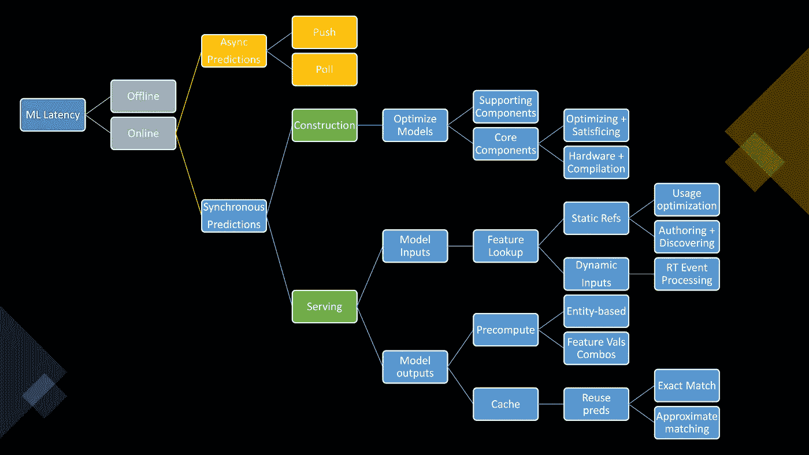

减少最大似然预测延迟的常用方法。作者图片

机器学习(ML)系统在部署之前是不存在的。

不幸的是，预测*延迟*是造成严重伤害的边缘之一。

而且，它在产品周期中伤害得太晚了。

停止优化那个模型！首先关注 ML 服务延迟。

> 首先关注 ML 服务延迟。
> 
> 这是客户首先看到的。

那么有哪些减少 ML 延迟的常用方法呢？

这里有一种方法来组织低延迟 ML 服务的已知模式，我希望它有所帮助:

([高分辨率示意图此处](https://raw.githubusercontent.com/gist/moutai/4d047e0790a71b30f074b51ced743696/raw/bc0ed804d4fe9ba91316021c7b647222201e0625/ml_latency_patterns_2022.svg))

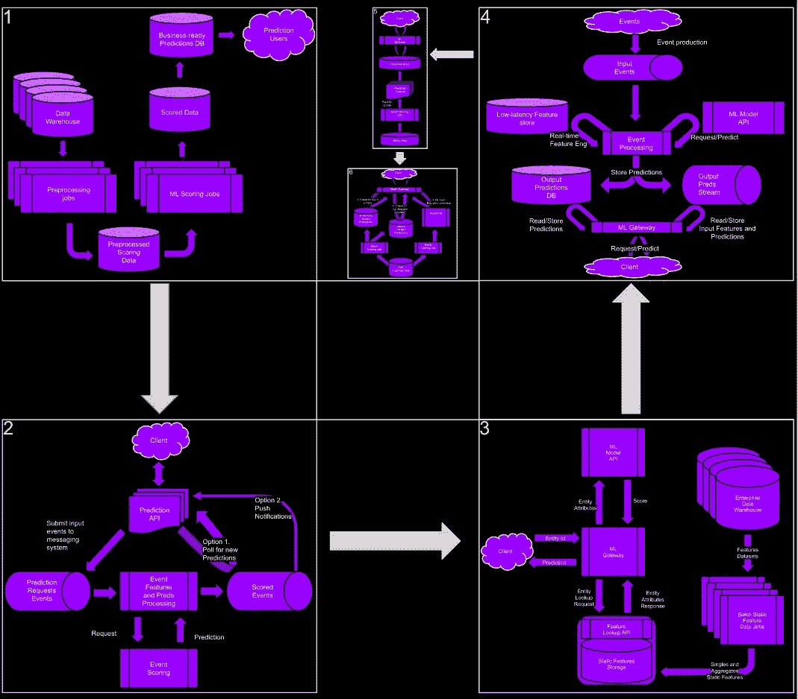

对抗 ML 预测延迟的架构模式。图片作者。([高分辨率示意图此处](https://raw.githubusercontent.com/gist/moutai/4d047e0790a71b30f074b51ced743696/raw/bc0ed804d4fe9ba91316021c7b647222201e0625/ml_latency_patterns_2022.svg))

# 目录

*   **一、并非罕见的 ML 潜伏期过长案例**
*   **二。在线与离线以及实时与批量**
*   **—二. a .离线预测管道长什么样？**
*   **— II.b .在线预测是延迟真正伤害的地方**
*   **三。异步在线预测**
*   **—三. a 选项 1:推送**
*   **—三. b 选项 2:投票**
*   **IV 同步在线预测**
*   **—四. a .标准 ML API**
*   **—四、b 服务与构建预测**
*   **五、优化模型本身只能做到这么多**
*   **— V.a .支持模型组件**
*   **— V.b .核心模型组件**
*   **六。特性是整个操作中真正的阻力**
*   **— VI.a .具有静态参考特征的“简易”外壳**
*   **—六、b .具有动态实时特征的“不太容易”案例**
*   **七。不要忘记预测！**
*   **—七. a .预计算预测**
*   **— — VII.a.i 如果你能使用实体，那就用吧！…**
*   **—VII.b .缓存预测**
*   **— — VII.b.i 实时相似性匹配的非常特殊的情况**
*   **— — VII.b.ii 记住，预测特征值的组合很快就会变得昂贵**

# I .并不罕见的 ML 潜伏期过长的情况

延迟是 ML 系统中一个非常普遍的问题。不要让这扼杀你的产品。如何最小化 ML 系统的预测服务延迟？

在开始你的下一个 ML 项目之前，这里有一些关键的问题要问你自己:

*   是否需要<100ms or offline?
*   Do you know your approximate “optimizing” and “satisficing” metrics thresholds?
*   Did you verify that your input features can be looked up in a low-read-latency DB?
*   Could you find anything that can be precomputed and cached?

The image below presents several ways to answer these questions. The following sections then discuss specific applications of them.

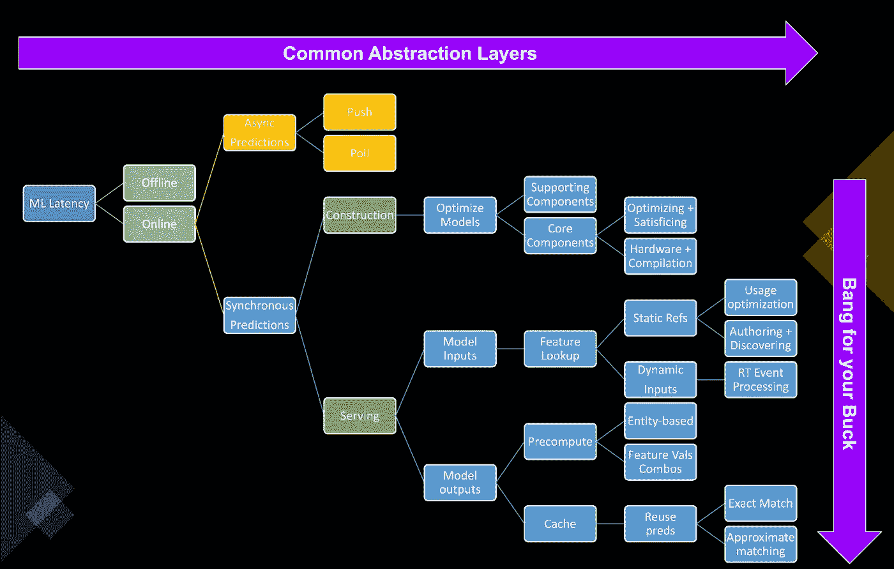

Common ways to reduce ML prediction latency, “ranked”. Image by author

# II. Online vs Offline and Real-time vs Batch

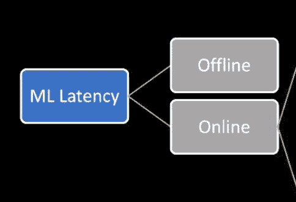

ML models come in two flavors:

1.  ***离线预测:*** 当你需要对一整批数据条目进行评分，并且你在必须为预测服务之前有相当多的时间时，就使用这个。在这种情况下，您只根据**历史数据**生成预测。比如为我们认为很快会从我们的服务中流失的客户“线下”开展促销活动。这并不容易，但是在你需要返回预测之前，你还有一些时间。
2.  ***在线预测:*** 这是用来动态生成预测的。随着新请求的到来，服务使用**当前上下文+历史信息**来生成预测。也就是说，上下文是一个宽泛的术语。可以将它看作是当前日期+时间、会话中查看的最后 N 个项目、新购物篮的内容、用户设备类型/位置以及历史数据仓库中没有整齐组织的任何其他有用信息的组合。

## II.a .离线预测管道长什么样？

在离线用例中，你不会一次得到一个数据点。相反，您可以在合适的存储位置收集许多数据点，并立即为所有目标数据点生成预测。这通常采用预定批处理作业的形式，其频率与业务需求相匹配。

受益于这种操作模式的一些使用案例:

*   你需要优化商店库存。您的预测作业在早上 6:45 运行。陀螺餐厅会卖多少鸡肉，这样你就可以去当地的山姆会员店挑选一些了。
*   你需要通过建立每周一次的客户细分来了解受众，围绕有益的特征对用户进行分组，从而找出谁是你最好的客户。是的，团体。
*   你需要确定你的顾客是否满意。因为人们谈论你的三明治，它们变得越来越油腻。所以你进入社交媒体寻找答案。

生成离线批量预测的一种方法是使用“标准”ETL 管道，该管道包含生成预测的智能。

看下一张图:

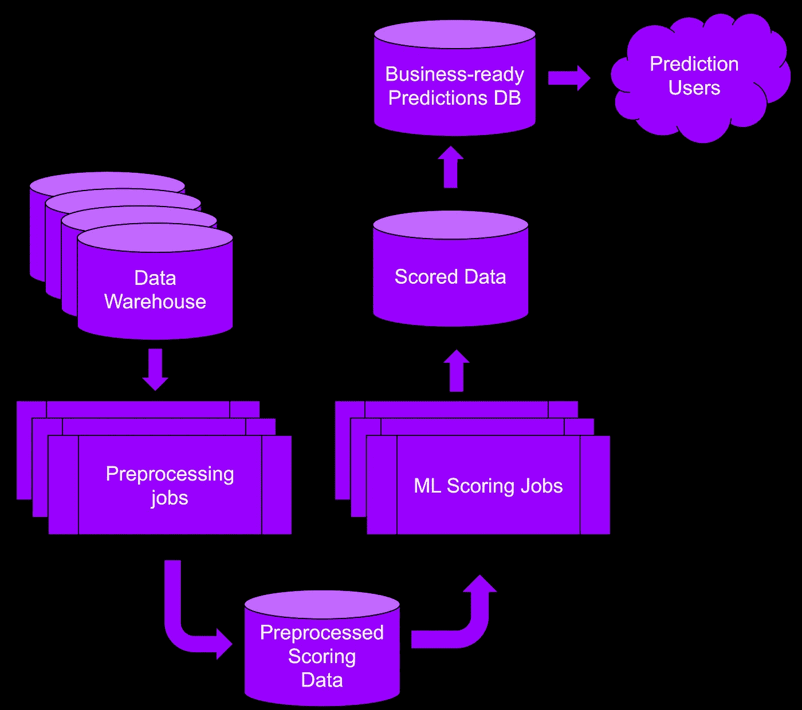

“标准”离线评分 ETL 管道。作者图片

上图是这样的:

1.  将要评分的数据上传到您的存储器。
2.  将数据预处理成模型可以使用的东西。
3.  对预处理后的数据进行评分。
4.  将分数存储在最终用户可以访问的地方。

对于上面概述的这种处理，没有人关心它需要 1 小时还是 10 小时。然而，由于在线预测是受延迟影响最大的预测，让我们更深入地研究一下。

## II.b. ***在线预测*** *潜伏才是真正伤人的地方*

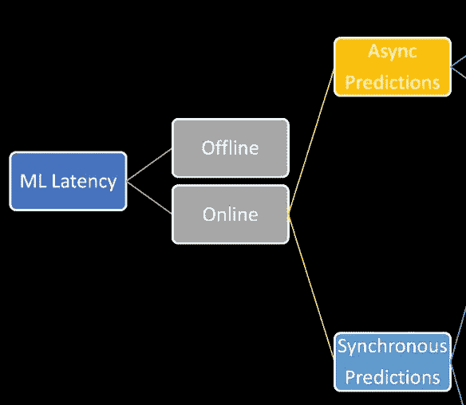

作者图片

对于在线预测，呼叫者向我们发送一个数据点进行评分。打电话的人预计预测会在 10 毫秒内返回。以下是一些有延迟要求的使用案例:

*   当浏览器加载页面时，为广告请求生成广告推荐。
*   在竞争性实时竞价广告市场中优化竞价。
*   预测关键设备是否会在接下来的几秒钟内发生故障(基于传感器数据)。
*   基于订单的大小、当前交通状况和订单的其他上下文信息来预测杂货交付时间。

# 三。异步在线预测

异步预测表示调用者将请求预测，但生成的预测将在以后交付的场景。调用者不必阻塞来等待预测返回。

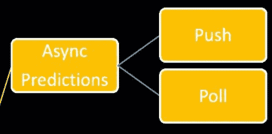

作者图片

执行异步在线预测的两种主要方法:

**三. a .方案一:推。**调用者发送生成预测所需的数据，但不等待响应。例如，当使用您的信用卡时，您不希望每次交易都等待欺诈检查响应。通常情况下，如果银行发现欺诈交易，他们会向你发送一条信息。

例如，在一个客户流失预测系统中，ML 系统将试图留住那些容易退出我们付费送餐订阅服务的用户:

*   来电者:“嘿，我有这个登录用户。她目前很活跃，但正在修改她的订阅设置。我们是否应该在她退出我们令人惊叹的服务之前，向她发送一封新的挽留促销电子邮件？”
*   模特:“让我想想。如果需要，我会向您发送推送通知。”
*   …时间…流逝…
*   模型:“嗨，打电话的人，把这封关于 3 顿免费餐的促销邮件发给顾客，这样她就可以继续订阅我们的服务了。”

**三. b .备选方案 2:投票。**调用者发送所需数据，然后定期检查预测是否可用。这些模型用于生成预测，并将预测存储在读取优化的低延迟数据库中。

*   来电者:“嘿，我有这个登录用户。她目前很活跃，但正在修改她的订阅设置。我们是否应该在她退出我们令人惊叹的服务之前，向她发送一封新的挽留促销电子邮件？”
*   模特:“让我想想。我将更新预测数据库中的预测。”
*   打电话者:“有什么消息吗？”
*   打电话者:“有什么消息吗？”
*   打电话者:“有什么消息吗？”
*   致电者:“啊，好的，我认为我们应该向此人发送一封挽留促销电子邮件。谢谢。”

对于异步在线预测，典型的数据流如下所示:

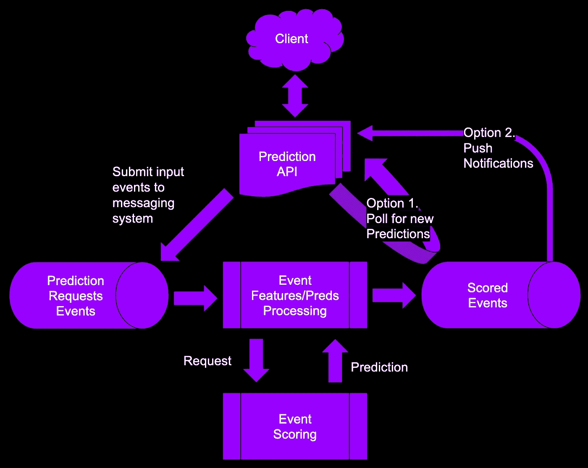

使用事件消息传递和流处理生成异步预测的管道模式。作者图片

在异步情况下，消息传递系统帮助编排流程，如下所示:

1.  客户端与外观预测 API 对话。
2.  预测 API 服务将可用数据发送到输入消息传递系统。
3.  然后，事件处理服务会清理并动态丰富该事件。则预测请求被转发给评分服务。
4.  事件处理系统接收预测。在对预测进行格式化、过滤和后处理之后，它会将预测写入一个输出评分事件消息系统。
5.  然后，要么预测 API 继续轮询以获取分数，要么有一种方法将通知推送到预测 API。

# 四。同步在线预测

## 标准 ML API

同步在线预测比异步模式对延迟更敏感。同步在线预测的基本模式是:

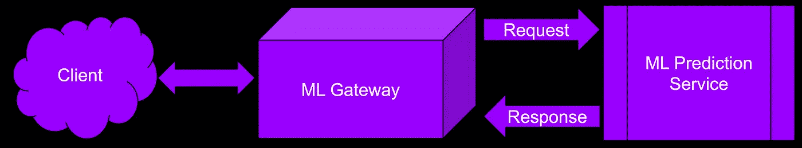

使用 ML 网关生成同步预测的服务模式。作者图片

1.  该模型被部署为一个 HTTP REST API。
2.  在线应用程序向模型发送一个 HTTP 请求，然后阻塞，等待预测“立即”返回(例如，<10ms).
3.  The model starts generating the prediction and sends it back to the caller as soon as the prediction is available.
4.  If the model does not respond within the latency budget (it takes too long), the caller times out, and the online application says something like “prediction took too long, try again later”.

But that’s not all of course. The ML service has to do more tasks.

Namely, generate the prediction, preprocess and enrich the input request, and post-process the output prediction before giving it back to the caller. Even all that would still be manageable with a standard ML gateway that would orchestrate the whole thing.

However, because the ML gateway can be hit by spikes in traffic, you must also do the following tasks. The following becomes part of your job:

1.  Securing the endpoint
2.  Load balancing the prediction traffic
3.  Auto-scaling the number of ML gateways

Have fun.

## IV.b. Serving vs Constructing Predictions

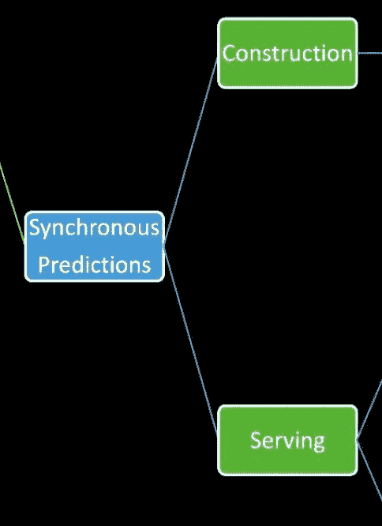

Image by author

We expect synchronous online predictions to return immediately. However, it is essential to realize that reducing latency relies on optimizing two distinct levels:

1.  **预测构建** -这是减少模型从一个完全形成的、行为良好的、丰富的和经过处理的预测请求构建预测所需时间的地方。
2.  **预测服务** -这是其余延迟的所在。这包括输入预测事件的任何预计算、预处理、丰富、消息传递以及输出预测的任何后处理、缓存和优化传递。

在**预测构建**级别，优化侧重于以最少的额外成本构建更小的模型，并选择适当的硬件以在正确的价格/延迟点生成预测。

在**预测服务**级别，重点是在足够快的数据存储中构建支持的历史数据集，并计算实时上下文动态特征。这通常是在痛苦地意识到减少预测构造的等待时间不会移动指针之后发生的，因为在提供全功能预测服务之前和之后涉及十个其他步骤。

最后，正如我们将要讨论的，如果您正在预先计算组合特征的预测并缓存它们以供在线服务，那么将模型预测延迟减少 50%将不如将特征和预测提取延迟减少 50%有价值。

# 动词 （verb 的缩写）优化模型本身只能做这么多

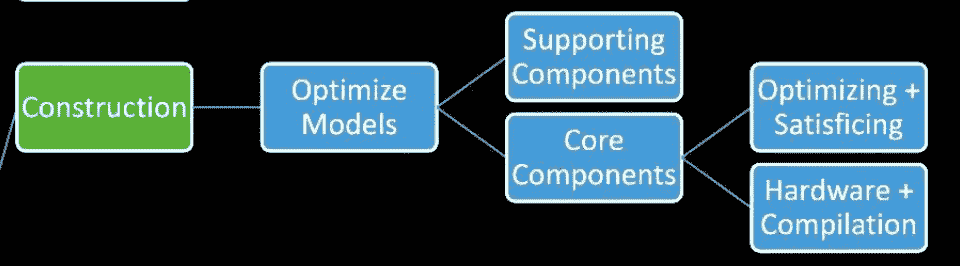

作者图片

## 支持模型组件

减少模型级延迟的第一步是**移除任何额外的模型 cruft。**在模型开发、实验和调优期间，通常会添加许多支持组件，如日志记录、挂钩、多头、监控、集成和管道转换器代码路径，以帮助调试模型。该工具在模型训练、评估和调试过程中很有帮助，但是会意外地增加核心模型的复杂性。不言而喻，删除这些不会损害模型的性能，但会改善预测的延迟。

## 核心模型组件

下一步是查看模型的核心组件，并决定需要删除哪些组件。但是在这个过程中有什么可以指导你呢？关键是要理解模型的**优化指标**与**满意度指标**之间的权衡。

我们通常关心开发阶段的优化指标:模型的预测能力。那是你通常的地图，MRR，准确度，精度，MSE，对数损失等..在每个指标对应的方向上，每个新高或新低都是线下世界的胜利。

然而，优化指标必须与满意指标相平衡。**满意度指标**关心模型运行的环境。例如:

*   就存储大小而言，该型号是否适合我的设备？
*   该型号可以在设备上运行该类型的 CPU 吗？需要 GPU 吗？
*   特征预处理能在特定的时间范围内完成吗？
*   模型预测是否满足我们的用例所要求的延迟限制？

这里的想法是为满足性度量选择一个上限，比如 50 毫秒的延迟，并使用它来过滤掉需要更多时间的模型。

接下来是你开始摆弄模型的部分。主要指针是:

*   模型越小，响应时间越快。
*   输入特征的数量越少，响应时间越快。

要减小模型的大小，有几个选项可用:

*   修剪树模型中的层数
*   修剪随机森林中的树木数量和梯度增强树模型
*   修剪神经网络中的层数
*   削减逻辑回归模型中的变量数量

您在这里的任务是平衡预测有效性和延迟需求。以下是如何做到这一点的一些指导:

1.设置满意度度量阈值。

2.增加模型的复杂性，直到达到满意的度量界限。

3.如果模型延迟满足要求，但预测有效性低于优化指标要求，那么问问自己您的应用程序是否可以接受这一点。

4.如果预测性能不可接受，那么要么尝试更轻的模型类型，要么重新评估应用程序的优化指标要求。

更令人困惑的是，还需要评估两个计算维度:

1.  尽量使用定制硬件，比如 GPU 或者特定的推理芯片。
2.  尝试使用自定义编译方法来优化模型组件。

但是，优化模型只能到此为止，因为迟早您会意识到，模型构建延迟方面 10%的改进将被用于预处理输入要素、后处理预测和交付预测的分布式 I/O 操作所摧毁。例如，如果您的总延迟来自预测构造的 10 ms，来自预测服务的 90ms，那么在 10ms 上节省 10%是没有帮助的，因为在预测服务中您仍然有一个巨大的 90ms 要处理。

减少预测服务延迟是我们接下来要讨论的内容。

# 不及物动词特征是整个操作中真正的阻力

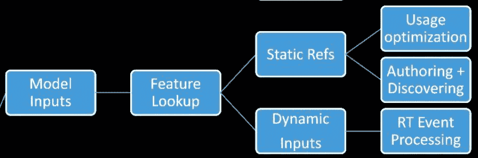

作者图片

功能是模型的生命线。但不幸的是，调用者可能不会向您发送一个完整的请求。取而代之的是，他们会发送当时任何可用的信息。这和你线下用来训练模型的相差甚远。与模型的预期相差甚远。

例如，对于杂货交付估计，模型将只接收 order_id。但是模型可能需要的不仅仅是 order_id。它需要获取关于订单、客户和送货人的信息。此外，它可能需要送货地址周围的当前交通状况，以及与该邮政编码中以前的送货时间、当前商店中以前的购物持续时间等相关的一系列历史值。因为所有这些都包含在模型中，所以获取和处理要素成为一项高风险的操作，大部分预测服务延迟将来自于此。

作为考虑特性的心理模型，我们可以将输入特性分成三个阵营:

*   **用户提供的特性:**这些特性直接来自请求。
*   **静态参考特征:**这些是不经常更新的值。
*   **动态实时特征:**这些值将来自其他数据流。当新的上下文数据到达时，它们被处理并持续可用。

## VI.a .具有静态 Ref 特性的“简单”案例

作者图片

静态特性有两种类型:单个和集合。单个是单个实体的属性。房子中房间的数量，或者与活动相关联的广告商的 ID。总量是指邮政编码中的房价中值或针对特定受众群的广告活动的平均预算。

这些静态特性有助于预测用例，例如:

*   根据邮政编码、里程、车型年、车型类型和该车型/年份组合的中间价格预测二手车的最终销售价格。
*   推荐与用户以前看过的电影相似的电影。
*   基于先前的购买和人口统计信息对向用户显示哪些广告创意进行排名。

问题是原始静态特性最初存在于企业数据仓库中。在预测时，ML 网关将需要检索特征并创建符合 ML 模型需求的请求。不幸的是，典型的数据仓库并没有针对低延迟查询进行优化。相反，数据仓库针对大量星型模式上的大型聚合、连接和过滤进行了优化。这不适合低延迟应用。

静态特性的 ML gateway 获取模式是:“对于客户 x 的每个特性，我需要一行一列。”

低延迟静态特性的标准方法是定期提取特性和集合，并将它们放在针对单例查找操作优化的数据存储中。

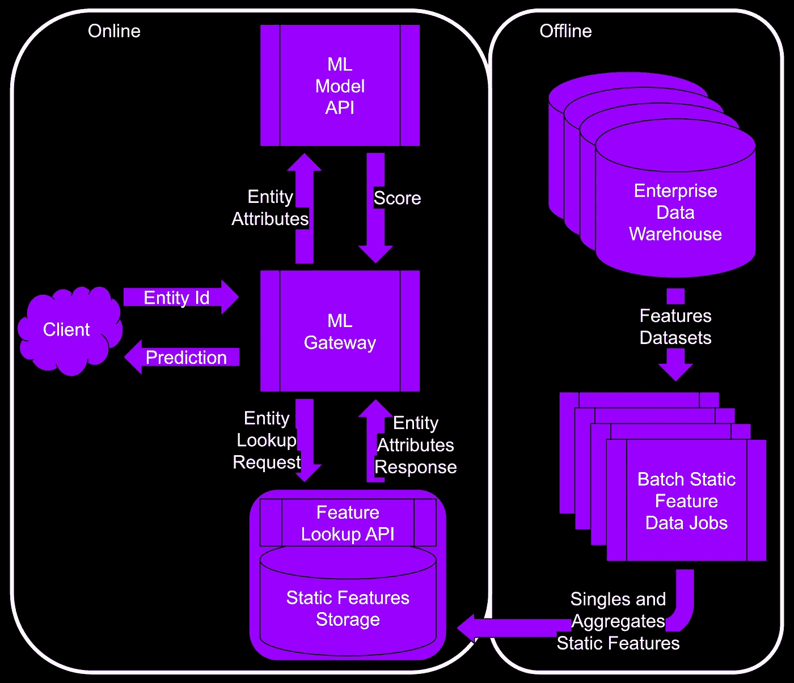

使用 ML 网关、要素查找数据库和离线批处理作业处理静态要素的标准服务模式。图片作者。

这两股平行的水流是这样的:

**离线:**

批处理作业执行以下操作:

1.  从数据仓库中读取。
2.  生成单个和聚合静态要素。
3.  加载特征查找 API/DB 中的特征。

**上线:**

1.  客户端发送需要预测的实体 ID。比如给 user_id="x "推荐一个电影列表。
2.  该实体通过特征查找 API 中存在的属性来丰富/水合。
3.  ML 网关然后将输入特征合并到转发给 ML 模型 API 的预测请求中。
4.  当 ML 模型 API 返回预测时，ML 网关对它们进行后处理，并将它们返回给客户端。

静态特性的好处是它们…..嗯…..静态；而不是实时变化的。

标准模式是建立一个批处理作业来更新静态要素。不幸的是，如果每隔 15 分钟运行一次，那么这个批处理作业就要花费相当多的钱。因此，您成倍地降低了更新的频率，直到模型的优化指标开始抱怨。然后你把频率提高到之前的值。实现自动化。完成了。

我们需要一张照片！我们有一张照片…

使用 ML 网关、要素查找数据库和离线批处理作业处理静态要素的标准服务模式。图片作者。

下面是上面数据流中发生的情况:

1.  从你的数据中获取数据。使用能够处理仓库级查询的东西。
2.  处理数据以完成所有常见的争论(连接、过滤、聚合一些数字，等等)。
3.  运行特征工程(这是你的工作):提取你的模型需要的最便宜的特征。继续“去除”昂贵的特性，直到优化指标低于您的阈值。然后自动化。
4.  存储您要预测的每个实体。希望是查找时间最短的地方。选择一个能够提供最佳查找延迟的数据库，但是一旦模型预测延迟性能表现良好，就停止优化数据库。

现在您已经优化了上述内容，您可以在您的组织中扩展要素生成。例如，假设您创建的特性可以在一个单独的用例中被随机重用。与其让每个 ML 管道重新生成相同的特征并浪费时间和金钱，不如构建一个具有以下特征的特征库:

*   企业范围的
*   集中的
*   发现的

这是你要做的。这个计划完美无缺。将特征生成工作流分为两部分:

*   产生 ML 特征(给予者)
*   发现 ML 特性(接受者)

生成要素在概念上类似于上图。

为了发现，ML 团队中的每个人都需要关于客户、产品和渠道的信息。从那里开始。首先是单打，然后是总数。看烟火。

我认为*发现*比*产生*特征更复杂。功能越复杂，就越难重用。客户的最小、最大和平均年龄比产品图像嵌入或目录分类法更容易共享。

> 首先关注 ML 服务延迟。
> 
> 这是客户首先看到的。

## 六. b .具有动态实时特征的"不太容易"的情况

这个选项的“动态”本质来自于使用事件。

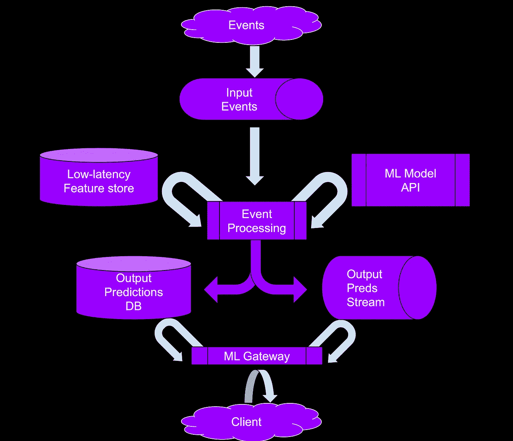

实时功能和输出预测管理。

这什么时候会发生？当您希望将最近的事件用作模型中的要素时。例如，想象以下任何一种情况:

*   您正在使用浏览器会话中的用户交互作为功能，客户与“N”个项目进行了交互，您想要推荐下一个要观看的项目。
*   你预测你工厂的哪个“饼干制造机”会因为黄油的温度不正确而失败。
*   你预测食品杂货的送货时间，这样你就可以告诉顾客什么时候在附近，这样他们的东西就不会被偷。

这些实时功能通过事件流处理管道传递。与批处理的情况相比，您需要找到一种方法，一旦传入的数据可用，就立即更新现有的聚合值。例如，包含 1+$1+$1 的购物篮不同于包含 1+$1+$1000+$1 商品的购物篮。

为此，您需要一个流管道来做两件事:

*   动态生成要素。管道任务在一端接收事件，并尽快生成所需的统计数据。
*   动态生成预测。管道任务获取新特征并调用部署的模型来生成预测。

建议将生成的要素放在读写性能良好的低延迟数据库中。输出预测应落在两个位置:

*   输出预测数据库
*   输出预测流

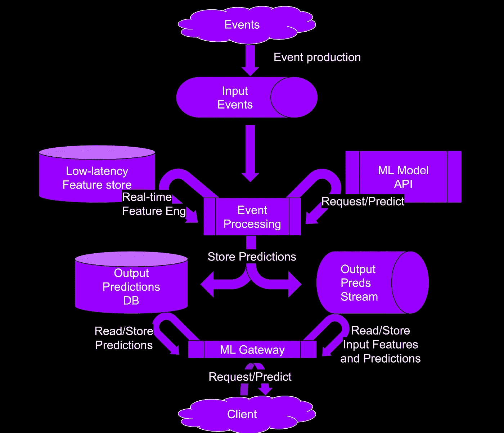

实时功能和输出预测管理与步骤。图片作者。

所以总结一下:

1.  新鲜事件登陆你最喜欢的信息系统。然后，它们被流式管道拾取。生成的要素(可能在时间窗口内聚合)位于低延迟要素存储中。使用新值更新现有要素。
2.  流式管道使用特征和模型 API 生成预测。
3.  m1 网关接收客户端预测请求。然后，网关检查数据库或消息系统中是否有任何预测。然后网关将它们返回给客户端。最后，如果下游的其他系统感兴趣，它可以选择将它们推送到消息传递系统。看看你的治理团队。

# 七。不要忘记预测！

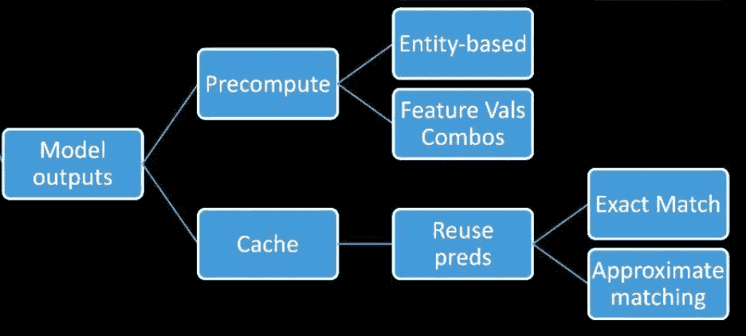

作者图片

如果到目前为止，这篇文章中的所有技术仍然不能使你的预测延迟足够低，那么你需要的下一个优化是预计算和缓存预测。

您设置了一个批处理评分作业，将预测存储在一个低读取延迟的数据库中。最完美的记忆。则客户端不必调用任何实时预测服务。客户端直接从数据库中提取预先生成的预测。

这里有一个图表来直观显示预计算过程:

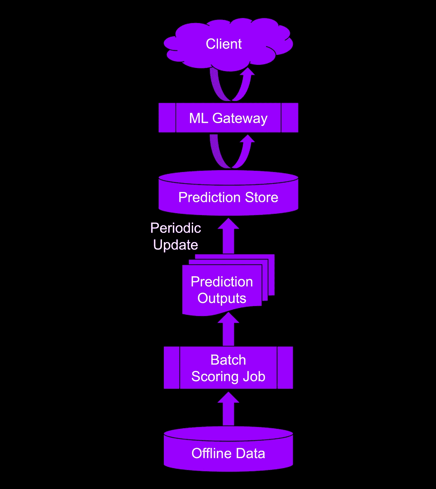

用步骤预先计算和缓存输出预测。图片作者。

上图中概述的要完成的任务如下:

1.  获取要评分的数据。
2.  在批处理作业中离线评分。
3.  将预测存储在专门存储键值记录的数据库中。
4.  ML 网关获得预测请求，然后获取并返回预测。
5.  客户得到预测并继续前进。

作者图片

您可能会问:*“这很好，但是查找键怎么办？那里应该用什么？”*

让我们把问题分成两种类型:

*   对一个 ***实体*** 的预测
*   特征值组合**的预测**

对于**实体**的情况，预测服务接收一个已知的实体 ID。这个 ID 将在您的用例中代表一个域实体。这可能是产品标识、电影标识、订单标识、设备标识等。例如，预测下一个显示给刚刚加载了我们的产品页面的 user_id 的广告。这将是实体层面的预测。

对于特征值的组合**情况****，**预测服务接收特征值的组合。例如，假设你正试图预测用户是否会购买某样东西，而我们想展示一个促销来推动他们。然而，我们可能只能得到位置、当前购物车大小、细分信息和产品类别的组合。对于这种情况，您可能希望选择前 N 个最常见的要素组合，并离线生成这些组合的预测。然后，当有一个客户端请求时，您可以首先检查是否可以为该组合特性获取一个预测。

## 七. a .预计算预测

## VI.a.i 如果可以用实体，就用吧！…

小心预计算预测！实体基数是这里的杀手。

如果您正在为低基数实体生成预测，那么您的情况会很好。例如，预测一个工业车队中数百辆汽车的维护需求可能不会倾家荡产。

但是，如果您正在为高基数实体生成预测，那么祝您好运。例如，如果产品目录是一个 1 亿件商品的怪物，你就需要降低期望值，使用一些技巧。最受欢迎的一种方法是为前 N 名最受关注的产品生成预测。然后，对于剩余产品的剩余长尾，您让客户端等待您直接调用模型，而不是从预测存储中提取预测。

以下是该工作流程的可视化表示:

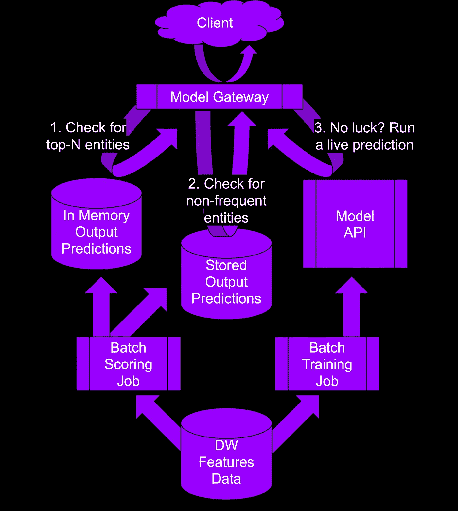

使用实体预计算和缓存预测。图片作者。

## VI.b .缓存预测

作者图片

## 实时相似性匹配的非常特殊的情况

假设你有太多的实体。您尝试了直接预测、完全预计算预测或部分预计算预测，但仍然没有效果。在这种情况下，相似性匹配值得一试。

类似下面的内容将改善预测延迟:

1.  使用产品-用户交互或产品-产品协同定位来训练产品相似性的模型。
2.  提取产品的嵌入。
3.  使用近似最近邻方法建立嵌入的索引。
4.  在 ML 预测服务中加载索引。
5.  在预测时使用索引来检索相似的产品 id。
6.  定期更新索引以保持内容的新鲜和相关性。

"但是如果索引太大，或者预测延迟太高，我该怎么办呢？"减少嵌入大小以获得更小的索引，直到优化指标开始抱怨。如果你不能得到一个可接受的优化+满意的权衡，那就去别处看看。

## VII.b.ii 记住，预测特征值的组合会很快变得昂贵

如果实体对于您的用例不可用，因为人们通常喜欢他们的隐私，尝试使用特征值组合。您将需要一个静态散列方法来为每个值的组合生成一个密钥。

比如说你有三个特征:国家，性别，歌曲 _ 类别。然后生成一个 hash (county，gender，song_category)作为关键字。顺序在这里很重要:一个散列(国家，性别，歌曲类别)将不同于一个散列(歌曲类别，国家，性别)。所以选择一个特定的顺序，并坚持下去。

小心基数。类别越多，生成的预测数量就越多。如果你服务 10 个国家，2 种性别，40 个歌曲类别，那就意味着你要做 10x2x40=800 个预测。记住这一点。

在决定了键之后，您需要预先计算每个键的预测。将每个键值存储在一个低读取延迟的数据库中，然后就可以开始了。同样，请记住，即使有了可靠的键值存储，您仍然需要通过减少可能的键的数量来减少存储的预测的数量。在这里也使用优化与满意度度量方法。在模型的预测性能提高的同时，不断添加类别、功能和键。但是当预测延迟开始抱怨时就停止了。

要记住四件事:

1.  数据库将有许多行，但只有几列。选择一个能够很好地处理单键查找的数据库。
2.  留意类别的基数和生成的键的数量。如果您有一个批处理作业在做这件事，那么监视基数，如果您在要计数的新类别中得到一个峰值，就发出警报。这将防止增加数据库查找延迟。
3.  连续值需要分桶存储。这将是一个你需要调整的超参数。
4.  任何可以用来降低类别基数的技术都是你的朋友。在优化指标允许的情况下，尽可能降低基数。

# **总结**

就是这样，伙计们！多棒的旅行啊！

理解在低延迟实时在线 ML 推理产品上工作时可用的选项具有优势:

*   首先，当你和你的产品经理聊天时，你要听起来很聪明。
*   然后，您可以通过探索 ML 延迟优化的正确类型来节省自己的时间。
*   当你的工程团队说你的模型生产时间太长时，你也不要失去希望。
*   最后，你的产品可能会成功。谁知道呢，对吧？

以下是模式图，供将来参考:

([高分辨率示意图此处](https://raw.githubusercontent.com/gist/moutai/4d047e0790a71b30f074b51ced743696/raw/bc0ed804d4fe9ba91316021c7b647222201e0625/ml_latency_patterns_2022.svg))

对抗 ML 预测延迟的架构模式。图片作者。([高分辨率示意图此处](https://raw.githubusercontent.com/gist/moutai/4d047e0790a71b30f074b51ced743696/raw/bc0ed804d4fe9ba91316021c7b647222201e0625/ml_latency_patterns_2022.svg))

这是一张探索地图，供将来参考:

减少 ML 预测延迟的常用方法，“排名”。作者图片

我希望你对 ML 潜伏期有所了解。我确实做了:)

# 最后一件事！

所有这些复杂性可能会使您的 ML 代码更难维护和发展。因此，请查看我的最新课程，该课程围绕这篇博文的主题，包含代码示例、深入讨论以及更多有助于解决所有这些问题的内容！

[图书链接](https://leanpub.com/cleanmachinelearningcode)

[视频课程链接](https://www.udemy.com/course/clean-machine-learning-code/)

作者图片

# 参考

1.  [https://cloud . Google . com/architecture/minimizing-predictive-serving-latency-in-machine-learning # handling _ static _ reference _ features](https://cloud.google.com/architecture/minimizing-predictive-serving-latency-in-machine-learning#handling_static_reference_features)
2.  [https://developers . Google . com/machine-learning/guides/rules-of-ml/](https://developers.google.com/machine-learning/guides/rules-of-ml/)
3.  [https://cloud . Google . com/architecture/building-real-time-embedding-similarity-matching-system](https://cloud.google.com/architecture/building-real-time-embeddings-similarity-matching-system)
4.  *《ML 特色店:一次休闲之旅》；* [*第一部*](https://medium.com/@farmi/ml-feature-stores-a-casual-tour-fc45a25b446a)*；* [*第二部分*](https://medium.com/@farmi/ml-feature-stores-a-casual-tour-30a93e16d213)*；* [*第三部分；*](https://farmi.medium.com/ml-feature-stores-a-casual-tour-3-3-877557792c43)