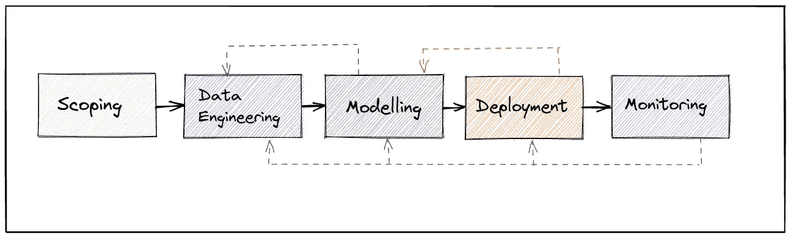
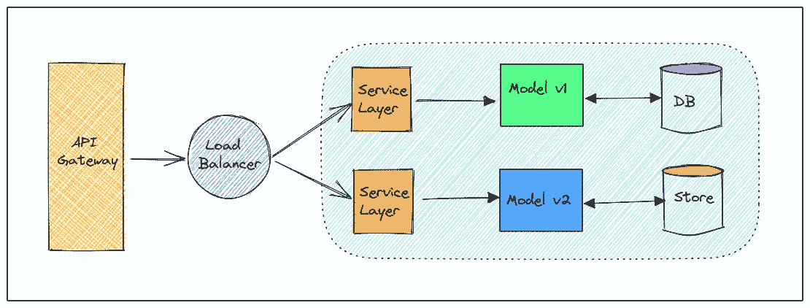
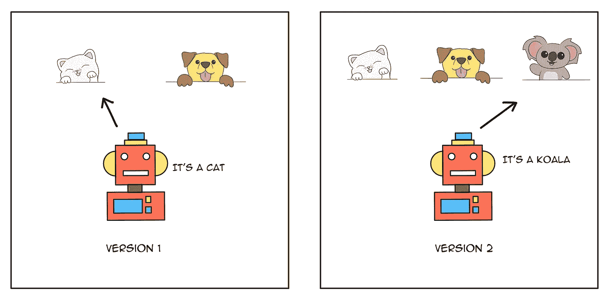
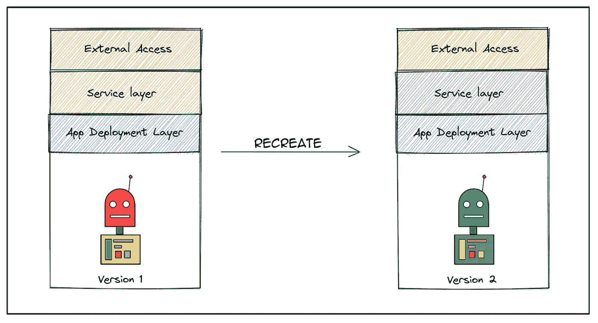
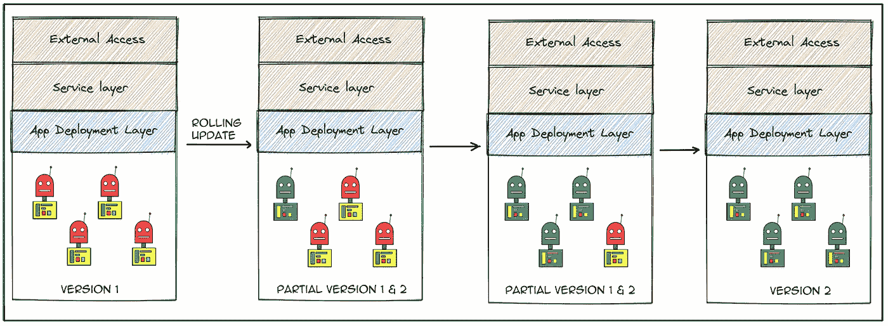
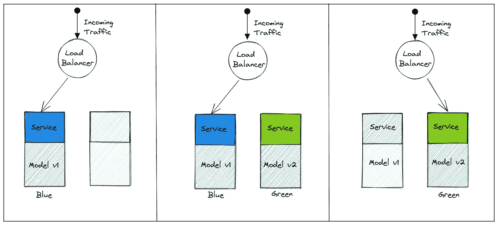
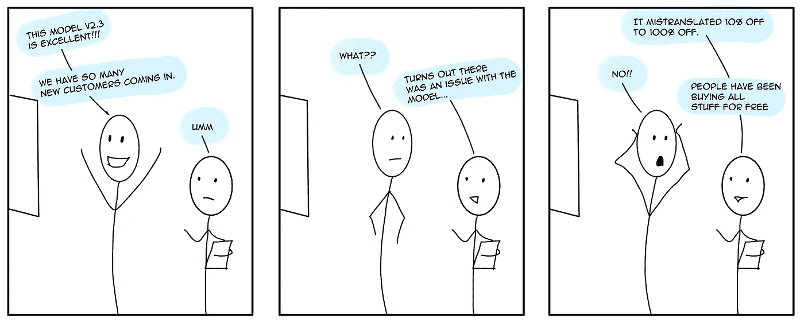
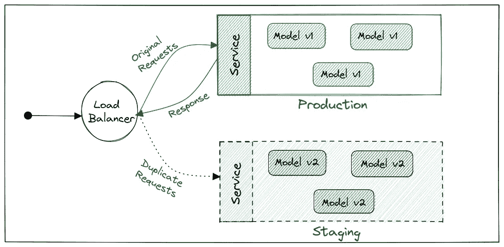

# ML 模型部署策略

> 原文：<https://towardsdatascience.com/ml-model-deployment-strategies-72044b3c1410>


让我们制定战略(图片由作者提供)

## ML 工程师部署策略图解指南

你好。

这篇文章是为那些想了解 ML 模型在生产中是如何部署的，以及在部署这些模型时可以使用什么策略的人准备的。

我将举例说明部署 ML 模型的一般方法，部署时可以采用的不同策略，以及这些策略通常在哪里实现。每个数据科学团队都有不同的需求，所以要有所保留。

我们开始吧。

## 了解 ML 模型部署

与软件或应用程序部署不同，模型部署是一种不同的野兽。一个简单的 ML 模型生命周期有几个阶段，如范围界定、数据收集、数据工程、模型训练、模型验证、部署和监控。



ML 生命周期(图片由作者提供)

当我们部署 ML 模型时，我们需要考虑一些因素，如:

**1。模型尺寸和包装—** 模型尺寸在我们计划如何包装中扮演着重要角色。较小的模型通常可以包装在 FastAPI 服务器中，并装入 Docker 容器中。然而，较大的模型可能需要在部署期间加载——它们可能从远程存储中取出，并通过模型服务器(如 TFServing 或 TorchServer)运行。

**2。模型再培训和版本化—** 您再培训模型的频率会影响您的部署策略。你经常需要比较你的模特表演吗？您在生产中多久更新一次模型？您会在生产中维护不同版本的模型吗？

**3。流量和请求路由—** 根据流量和模型类型，您必须决定是实时推理还是批量模型部署。您希望每个版本的模型分流多少流量？有多少用户可以访问特定的模型版本？

**4。数据和概念漂移—** 在一段时间内，真实世界的数据不断变化，可能不会反映在模型中。比如说，购买力与工资的关系，工资可能每年或每月都在变化。或者消费者购买模式在新冠肺炎疫情期间如何变化，但模型大多依赖于历史数据。这影响了我们必须如何设计部署架构:我们应该重新培训和重新部署吗？我们现在应该只重新培训和展示模型吗？这个因素在数据科学团队的长期部署战略中发挥作用。

记住这些因素，我们有大约六种模型部署的通用策略。这些方法大多借鉴自 DevOps 和 UX 的方法，在 ML 场景中非常适用。

通常，在技术层面上在生产中部署模型涉及 API 端点网关、负载平衡器、虚拟机集群、服务层、某种形式的持久数据存储和模型本身。



通用模型部署(按作者列出的图像)

部署策略通常在负载平衡器和服务级别进行配置，主要是配置路由和接收规则。

让我们以动物识别和分类系统为例。 ***我们从一个简单的猫-狗分类器开始。这将是我们的第一版模型。*** 假设我们已经训练了一个模型的副本来识别考拉，那么 ***我们的版本 2 是一个猫-狗-考拉分类器*** 。我们将如何部署我们模型的新版本？



型号版本(按作者列出的图像)

# 模型部署策略

## **大爆炸——重现**

**什么—** 这种部署形式是一种“从头开始”的部署方式。您必须为要部署的新部署拆除现有部署。

**WHERE —** 在开发环境中通常是可以接受的—您可以使用不同的配置根据需要多次重新创建部署。通常，部署管道会分解现有资源，并在其位置创建新的更新。



重新创建部署(按作者创建映像)

这种部署会导致一定程度的停机。在我们目前的组织 ML 开发速度下，这是不可接受的。

在我们的例子中，我们将用版本 2 替换版本 1；这包括替换所有相关的基础设施和库设置。

## 滚动更新

> 他们看到我滚…他们讨厌…🎵

**什么—** 滚动更新包括逐个更新模型/应用程序的所有实例。假设你有 4 个吊舱的应用程序目前正在运行，你用一个新版本的模型激活了一个滚动更新。旧的豆荚一个接一个地被新的豆荚取代。这种方法没有停机时间。

**WHERE —** 当您希望用新版本快速更新整个产品线时，此选项非常有用。还允许您在需要时回滚到旧版本。主要用于团队需要测试新版本模型的测试或准备环境。



滚动更新(按作者列出图像)

它通常不会是生产系统中的唯一实现，除非您只需要全面部署模型的特定版本。在我们的示例中，我们将只替换模型应用程序窗格，保持基础架构的其余部分不变。

## 🔵Blue/Green🟢

**什么—** 这种部署形式本质上是一种服务器交换。有两个相同的系统可用。用户请求被路由到其中一个系统，较新的更改和更新在另一个系统上完成。一旦更新经过测试和验证，用户的请求就会被发送到新的系统，从本质上来说，就是用新的系统替换旧的系统。

**其中—** 多用于应用或 web app 场景。也可以应用于模型部署，包括批处理和实时推理部署。基本上没有停机时间，因为我们只是将负载平衡器指向一组不同的机器。



蓝绿色部署(图片由作者提供)

正如您在这里看到的，我们使用模型的更新版本创建了一个新的相同系统，然后将流量切换到新系统。

但是，我们必须考虑维护两个相同基础设施系统的成本。根据基础设施的规模和承受能力选择这种方法。

## **金丝雀**🐦

**什么—** 在 Canary 部署中，我们将更新部署到现有系统，并向用户部分展示新版本。这意味着我们的一小部分用户将能够访问更新的模型，其余的将仍然使用旧版本。

这种类型的部署主要用于测试新版本的工作情况，或者是否工作正常。通常，一小部分用户(大约 5%-30%)会接触到更新，因为这有助于 ML 工程师和开发人员理解哪些特性可能需要推出，哪些需要重构。

**其中—** Canary 部署通常在试运行和生产阶段进行，此时团队需要了解新更新型号的性能。这可以通过两种方式实现:

1.  金丝雀滚动部署
2.  金丝雀并行部署


金丝雀部署(图片由作者提供)

***滚动部署*** 补丁更新到同一集群内的少量实例，一组用户请求被发送到这些 pod。

***并行部署*** 在现有设置的基础上创建一个较小的新实例集，并将一定比例的用户请求发送到这些 pod。

根据流量负载和基础设施可用性，您可以选择希望设置哪个 Canary 实现。

*用户请求通常通过标头进行标记，然后负载平衡器设置被配置为将它们发送到适当的目的地。*含义 ***选择一组用户*** 查看更新， ***同一组用户每次都会看到更新。用户请求不会被随机发送到新的 pod。Canary 部署具有会话关联性。***

在我们的示例中，假设 10%的精选用户可以将他们的图像提交给模型，模型会使用考拉选项对他们进行分类，其余的用户只能使用二元分类器。

## A/B 测试

**WHAT —** 这种方法最常用于用户体验研究，用来评估用户的偏好。在 ML 场景中，我们可以使用这种部署风格来了解用户喜欢什么，以及哪种模型可能更适合他们。

**其中—** 主要用于全球推荐系统的部署。根据人口统计数据，假设一个在线市场网站使用两种不同类型的推荐引擎，一种可能服务于一组普通用户，另一种服务于特定的地理位置——提供更多的本地语言支持。工程师可以在一段时间后确定哪个引擎为用户提供更流畅的体验。



为什么我们需要 A/B 测试(图片由作者提供)

在我们的例子中，假设我们在全球部署了猫狗分类器，但是我们在澳大利亚—太平洋岛屿地区部署了版本 1 和版本 2，在那里用户请求被随机发送到版本 2。想象一下重新训练版本 2 来识别更多的本地动物品种并部署它，你认为澳大利亚的人民会更喜欢哪个版本？

```
**NOTE:**
You might wonder what's the **difference between Canary and A/B Testing**. The main differences are:- Canary is session affinity-based, mostly the same set of users will see the updated model whereas, in A/B Testing, the users are randomly sent to different versions.- Canary is specifically to test if the app or model is working as expected, A/B is more to understanding user experience.- The Canary user ratio never goes beyond 50, a very small percentage of the user request (less than 35% ideally) is sent to the newer testing version.
```

## 阴影👻

**什么—** 影子部署在生产系统中使用，用生产数据测试新版本的模型。用户请求的副本被制作并发送到您的更新模型，但是现有系统给出了响应。

**其中—** 假设您有一个高流量的生产系统，为了验证更新后的模型如何处理生产数据和流量负载，我们以影子模式部署更新后的模型。每次向模型发送请求时，都会向更新的版本发送一个副本。响应仅由现有模型发回，而不是更新后的模型。



影子部署(图片由作者提供)

这种类型的部署用于了解生产负载、流量和模型性能。主要用于大量预测服务。这种部署增加了体系结构和设计的复杂性。我们必须包括服务网格、请求路由和基于用例的复杂数据库设计。

在我们的示例中，我们可能将版本 2 部署为影子部署，以了解版本 2 如何处理生产负载，也了解我们从哪里获得更多的考拉分类请求😉或者任何特定类型的模型请求模式。

现在，我们对如何在各种用例中部署模型有了很好的基本理解。根据需求，数据科学团队可能会结合使用这些方法。各有所好。

目前就这些。保重。再见！😇