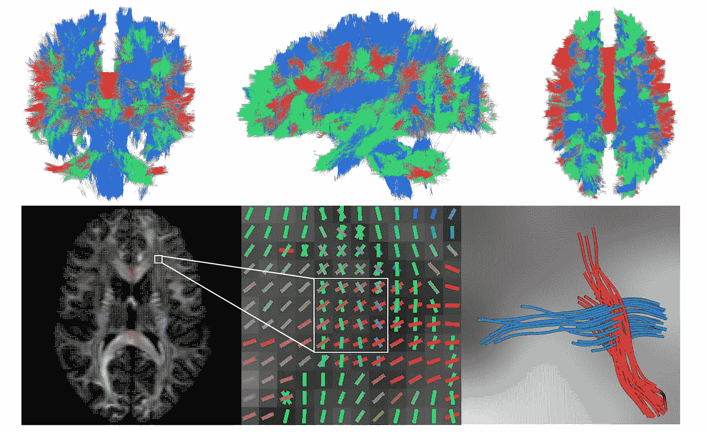
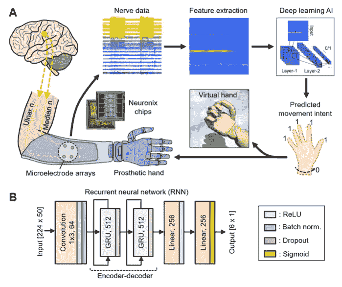
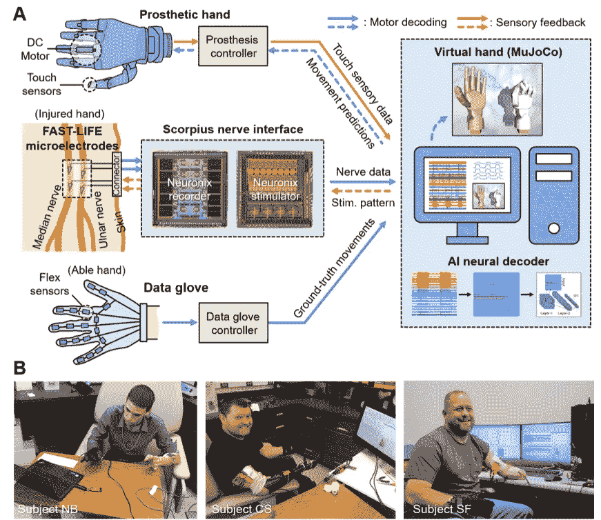
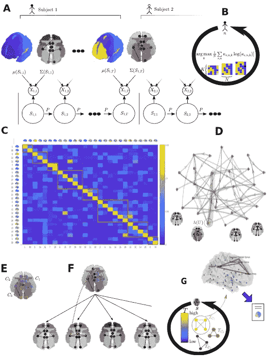

# ML &神经科学:2022 年 3 月必读

> 原文：<https://towardsdatascience.com/ml-neuroscience-march-2022-must-reads-4d5d32dc80ed>

本月:PDE 和深度学习构建大脑的🧠连接体🔗脑机💻假手的接口，最后是对大脑动力学理解的隐马尔可夫模型的新看法。

图片由[莫](https://unsplash.com/@meid88)在[的 Unsplash](https://unsplash.com/photos/gJzpzEajT6c)

*通过我的推荐链接加入 Medium 来支持我的写作和项目:*

 [## 通过我的推荐链接加入 Medium-Stefano Bosisio

### 作为一个媒体会员，你的会员费的一部分会给你阅读的作家，你可以完全接触到每一个故事…

stefanobosisio1.medium.com](https://stefanobosisio1.medium.com/membership) 

**为什么要关心神经科学？**

神经科学是当今人工智能🧠的根源🤖。阅读并意识到神经科学中的进化和新见解不仅会让你成为一个更好的“人工智能”的家伙😎而且还是一个更好的神经网络体系结构的创造者👩‍💻！

在这篇文章中，我正式用一种新的方法重新发布我的[“保持神经科学的更新”](https://stefanobosisio1.medium.com/)文章。在这一系列中，我将涵盖 3 篇主要论文，在 arxiv.org[的评论中，它们涉及机器学习和神经科学。特别是，我将涉及以下几个方面:](http://arxiv.org/)

*   ML 研究能否帮助神经科学更深入地了解大脑的动力学和活动？
*   神经科学如何用新的生物启发模型帮助增强 ML？
*   ML 和模型如何通过新的成像和信号技术给我们带来新的临床神经科学？

这个月我们将看到 ML 如何帮助我们更深入地理解大脑系统，并成为临床神经科学应用的关键。第一篇论文展示了深度学习在生成大脑连接体和解决偏微分方程问题方面的奇妙用途。第二篇论文将我们直接带入未来，对计算机-大脑接口进行了大量研究，给截肢者带来了巨大的希望。最后，我们将看到马尔可夫状态模型与图形模型的伟大结合，以图形形式创建大脑动力学新的可能的神经科学应用。享受:)

## 深度学习大脑连接体的形状

戴浩成，马丁·鲍尔，p·托马斯·弗莱彻，萨朗·c·乔希，[论文](https://arxiv.org/pdf/2203.06122.pdf)

人工智能如何帮助神经科学更深入地了解大脑的动力学？

脑连接体是大脑的神经连接图，是一种接线图，有助于解释神经系统的构建和沟通。很难获得一个好的图，通常的设置是扩散加权磁共振成像(DW-MRI)和追踪成像的结合，这里是关于 DWMRI 重建方法的 ML 文章。追踪成像计算 DW-MRI 矢量场的积分曲线，为每个体素找到最可能的纤维束。然而，这种技术对噪声非常敏感，这在 DWMRI 测量中是不可能避免的。为此，作者成功地将深度学习模型与黎曼流形结合起来。黎曼流形是一个实的、可微的数学流形，即一种我们可以执行一些微分/应用 ML 技术的域。黎曼流形的形状可以推断白质路径，再加上深度学习，就有可能有一个模型来找到适合塑造连接体的完美曲线。

如果连接体存在于黎曼流形中，这意味着我们可以有黎曼度量。黎曼度量可以告诉我们如何找到满足和创建连接体的正确路径。找到完美路径的方法是解一个偏微分方程(PDE)。这个偏微分方程的解是测地线，一族满足黎曼度量的曲线。由于这个问题很难解决，作者颠倒了问题的观点。我们需要的是在流形上找到一个黎曼度量，它最小化一个给定的能量泛函形式。当达到最小化时，我们找到了正确的测地线，即正确的路径/连接体，这符合我们的数学领域。

如今，这个问题可以通过深度学习模型来解决，如 PINN(物理学信息神经网络)，它可以估计 PDE 问题的解决方案。特别是，作者采用了 PINN 的扩展，即卷积编码器-解码器神经网络(CEDNN)，它从高维输入中构建多尺度特征。

图 1: CEDNN 基于 103818 名受试者生成的连接体。左上:冠状面视图，中上:矢状面视图，右上:横断面视图。右下角和中间:交叉光纤区域的建议放大视图。右下:提议的跟踪成像为缩放区域生成测地线。图片来自报纸。

该方法首先在合成数据集上进行了验证。最后，用于估计 103818 名受试者 DWMRI 输出中的 3D 交叉纤维区域。图 1 示出了使用 CEDNN 的全脑度量的完整估计，对于每个密集块具有 55、30、55 个密集层，学习速率为 0.0003，迭代次数为 90，000 次。结果可以清楚地显示深度学习如何通过黎曼度量来建模人类连接体的形状。未来的工作将集中在普遍性上。

## 人工智能能够通过神经接口对假肢进行实时和直观的控制

陆迪奎、阮安俊、姜鸣、马库斯·w·德莱兰、徐健、吴桐、谭永健、赵文锋、林志宏、辛西娅·k·奥弗斯特里特、赵奇、乔纳森·郑、爱德华·w·基弗、杨志

ML 如何帮助临床神经科学？

作者提出了一种神经假体系统，该系统利用人工智能代理通过外周神经接口来翻译人类运动。

神经假体系统的核心挑战是神经接口。首先，直接大脑植入提供了最全面的人机互联。然而，这种解决方案是高度侵入性的，并且会产生长期问题，例如神经组织损伤、感染等。另一方面，外周神经接口是一种侵入性较小的解决方案，然而，它必须处理要实时处理的高维输入数据，以有效地转化为假体运动。作者通过采用基于卷积神经网络(CNN)和递归神经网络(RNN)的人工智能神经解码器，研究了第二种方法。已经证明，在神经通信/翻译中，CNN 和 RNN 优于其他最大似然技术。

该实验是通过束靶控制灵巧手(DEFT)的临床试验的一部分，其中人体实验由机构审查委员会(IRB)审查。在截肢后的三个不同时间(9 个月、4 年和 10 年)对三名受试者进行了测试。每个受试者接受 2-4 个束特异性靶向纵向束内电极(快速寿命)微电极植入物，靶向正中神经和尺神经的单个束，持续 3-16 个月。

图 2: A):人工智能设置概述。尺神经和正中神经与微电极阵列相连。从电路中，执行 AI 计算来预测运动意图。b):实现了 RNN 架构。图片来自报纸

图 2 显示了整个人工智能系统。神经数据通过带有高性能 Neuronix 神经接口芯片的神经调节系统获得。在信号采样和处理之后，记录具有高信噪比的位置，并从中提取特征。从那里，人工智能代理预测当前的运动意图。RNN 架构用 PyTorch 编码，有 160 万个可训练参数，部署在 NVIDIA Jetson Nano 上。

图 3: A):实验概述。神经数据(蓝色箭头/路径)分别从受伤的手和健全的手获得。该信号被实时处理。B)在治疗过程中拍摄受试者的照片。图片来自报纸。

图 3 显示了对象的实际实现。该系统记录受伤和健全手的神经数据。数据是通过镜像双边范例获得的。受试者被要求用双手做 10 次手势。从那里，数据通过人工智能代理进行处理，并通过蓝牙将预测映射到虚拟手和假手上。该测试要求每个受试者从静止位置摆出想要的姿势。

AI 代理可以准确地实现直观的实时控制和鲁棒的长期性能。此外，记录的反应时间短，超过 16 个月的使用没有恶化的迹象。无需重新训练，模型预测准确率在 90%以上。

## 大脑动力学的多重时空模型中的社区排序

James B. Wilsenach，Catherine E. Warnaby，Charlotte M. Deane，Gesine D. Reinert，[论文](https://arxiv.org/pdf/2203.09281.pdf)

在本文中，作者展示了如何融合两个主要领域:一方面是网络神经科学，另一方面是马尔可夫模型和图 ML 模型的结合。这个想法是使用一个新的模型，命名为隐马尔可夫图模型(HMGMs)来给出大脑动力学的新解释。
焦点的出发点是这样的假设:

> 健康受试者在休息时的大脑活动通常被用作…病理条件下的基线…一种条件下的活动被建模为单一的静态活动模式，忽略了大规模的动态变化

最近，神经研究人员已经开始使用神经成像时间序列来提供一种新的方法来理解人类大脑中的空间模式和电活动(功能活动)。大脑区域之间的活动交换被称为功能连接。功能活动和连接性之间的关系可以用来以图表的形式理解大脑系统。大脑作为一个图形将大脑与马尔可夫毯联系起来，在马尔可夫毯中，我们可以识别解剖节点或区域，并通过与其他节点交换的一系列信息水平来表征它们。在这项研究中，大脑被研究为一个具有模块化结构的复合图。特别地，处理了隐马尔可夫模型(HMMs)的静态视图。在 hmm 中，大脑动力学可以被参数化为忽略跨节点和大脑区域的动力学切换的有限状态。通过将 HMM 转换成动态图模型，作者可以阐明层间网络(马尔可夫信息矩阵)。

图 4:工作的整体模式。答:首先，获得受试者的 fMRI 扫描。变分贝叶斯推理用于训练 hmm。b)隐藏状态的数量通过主题交叉验证的最大熵来确定 C)层间时间转换的邻接矩阵 D)将每个状态表示为图形，从相关活动中导出。e)每个子状态的分析 F)内部群体的排名 G)结果。

使用 NeuroSynth 数据集，作者运行了新提出的模型的基准。从数据集中，HMM 被训练以获得多重时空脑状态图。然后，可以从每个马尔可夫状态的分数占据分布中直接获得时空分量。虽然我们在这里处于研究的非常阶段，但通过这种无监督的方法，作者能够获得丰富的互补社区阵列，它们共同作用，给出静息觉醒期间的神经行为模式。大脑状态与模块化概念相关联。在深度麻醉或意识改变的背景下，理解大脑模块性的含义，阐明有意识大脑活动中复杂的网络动力学，将是非常重要的。

如果你有问题或好奇，请发邮件至:stefanobosisio1@gmail.com 或在 Instagram 上关注我，支持我的新人工智能项目:[https://www.instagram.com/bosiartai/](https://www.instagram.com/bosiartai/)