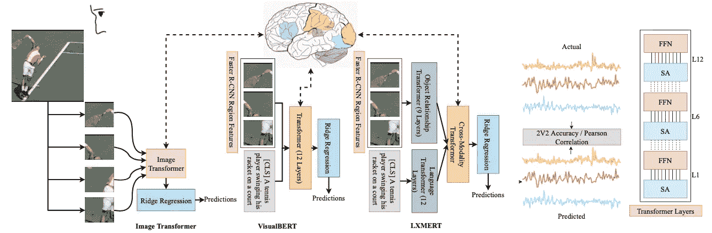
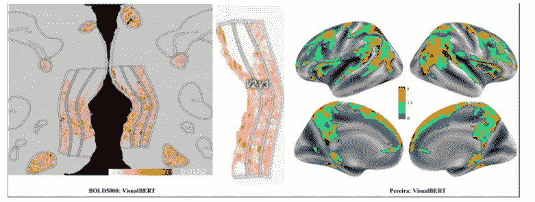
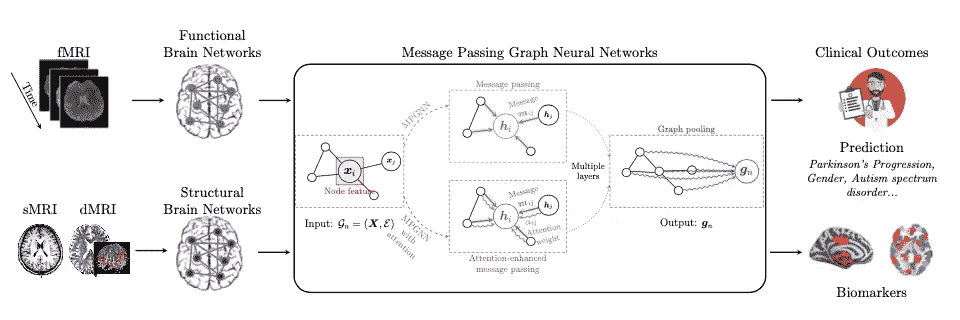
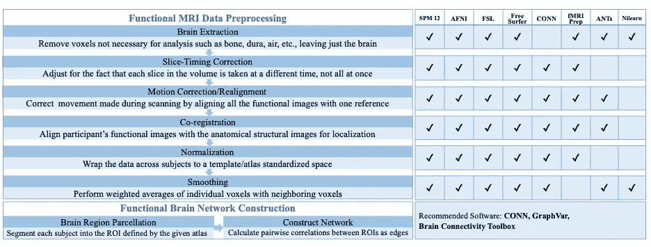
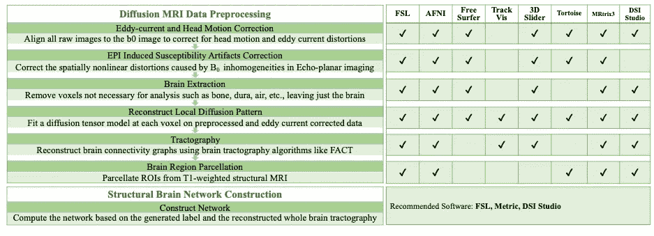

# ML &神经科学:2022 年 4 月必读

> 原文：<https://towardsdatascience.com/ml-nuroscience-april-2022-must-reads-fea9594f4c9d>

本月:微软、INRI 和 IIIT 攻克脑机💻解决大脑编码问题的接口和视觉语言转换器🧮和探索大脑结构和功能网络的第一个公共图形神经网络框架🕸️。

图片由[莫](https://unsplash.com/@meid88)在[的 Unsplash](https://unsplash.com/photos/mM5HPB6uTVs)

*通过我的推荐链接加入 Medium 来支持我的写作和项目:*

  

**为什么要关心神经科学？**

神经科学是当今人工智能🧠的根源🤖。阅读并意识到神经科学中的进化和新见解不仅会让你成为一个更好的“人工智能”的家伙😎而且还是一个更好的神经网络体系结构的创造者👩‍💻！

在这篇文章中，我正式用一种新的方法重新发布我的[“保持神经科学的更新”](https://stefanobosisio1.medium.com/)文章。在这一系列中，我将涵盖 3 篇主要论文，在 arxiv.org[的评论中，它们涉及机器学习和神经科学。特别是，我将涉及以下几个方面:](http://arxiv.org/)

*   ML 研究能否帮助神经科学更深入地了解大脑的动力学和活动？
*   神经科学如何用新的生物启发模型帮助增强 ML？
*   ML 和模型如何通过新的成像和信号技术给我们带来新的临床神经科学？

这个月我将与你分享两篇在 ML/神经科学领域引起我注意的论文。前者来自微软印度公司与印度自然资源研究所和 IIIT 的合作，研究强大的深度学习技术来解决大脑编码问题是一项了不起的工作。脑编码是脑-机接口系统需要解决的核心问题。作者在该领域首次研究了视觉语言转换器在解耦 fMRI 信号和大脑区域激活中的应用。
第二篇论文是埃默里大学和匹兹堡大学的合作成果。作者测试并向公众发布了 BrainGB，这是一个大型大脑图形神经网络系统，允许研究人员寻找临床结果的预测以及大脑生物标记。这是一项关键的工作，它铺平了道路，并覆盖了神经科学和深度学习之间的差距，以从图形神经网络角度获得越来越多的对大脑结构的见解。简直太神奇了。

# 视觉语言大脑编码

Subba Reddy Oota，Jashn Arora，Vijay Rowtula，Manish Gupta，Bapi Raju Surampudi，[论文](https://arxiv.org/abs/2204.08261)

ML 研究能否帮助神经科学更深入地了解大脑的动力学和活动？

这篇论文来自 INRIA、IIIT 和微软印度公司的合作，解决了当前最热门的研究课题之一:脑-机接口和大脑编码。为了实现完全有效的脑机接口系统，我们确实需要了解人脑是如何对刺激进行编码的。给定一个视觉或语言刺激，大脑执行一种“神秘”的编码，将信号转化为大脑活动。在这项工作中，作者研究了基于图像和多模型的变压器是否可以在*整个*大脑上编码 fMRI 信号，以及编码的准确性如何。

图 1:提出的大脑编码方法。视觉和文本刺激是多模型变压器的输入。从这里开始，模型预测不同大脑区域的功能磁共振成像活动。然后用 2V2 准确度和皮尔逊相关系数(R)评估大脑编码结果。

到目前为止，大脑编码研究仅限于卷积神经网络(CNN)和两个单一的大脑区域，即视觉皮层 V4 和前额叶 IT。CNN 显示可以有效地对视觉刺激的语义进行编码，然而，对于大脑作为一个整体是如何编码的还没有了解。此外，在得到有意义的结果之前，被调查的 CNN 经过了大量的人工处理。

为了研究这些问题，作者采用了两个神经科学数据集:BOLD5000 和 Pereira。前者是从观看 5254 幅自然图像的受试者收集的 fMRI 扫描数据集，它指出了 5 个视觉区:早期视觉区(EarlyVis)，对象相关区，如外侧枕叶复合体(LOC)，枕叶位置区(OPA)，海马旁位置区(PPA)和脾后复合体(RSC)。后一个数据集报告了受试者的 fMRI 扫描，这些受试者将概念词与图片一起可视化。该数据集的主要焦点是默认模式网络(DMN)、语言网络、任务积极网络、视觉网络

型号(*所属 CNN*—vgnet 19，ResNet50，INceptionV2ResNet，EfficientNetB5，*预训练文本转换器* — RoBERTa，*图像转换器* — ViT，DEiT，BEiT，*后期融合型号* — VGGNEt19+RoBERTa，ReNet50 + RoBERTa，InceptionV2ResNet+RoBERTa，efficient net b5+RoBERTa，*多型号)在 fMRI 扫描上被训练，具有岭回归损失。每个模型的主要目标是编码和预测给定刺激的每个大脑区域的 fMRI 体素值。*

结果清楚地表明，VisualBERT 优于所有其他模型。对于 BOLD5000，VisualBERT 在 2V2 准确性和皮尔逊相关性方面都优于所有模型(图 2)。特别是 VisualBERT 显示出 OPA 和 LOC 区域的高 Pearson R，与视觉处理层次一致——有一个联合编码(视觉和语言信息)。在 Pereira 上，数据集 VisualBERT 显示了与语言区域、DMN 和 TP 的高度相关性。

图 2:真实和预测的 fMRI 体素之间的 MAE:a)bold 5000 受试者 1 的 VisualBERT 的 V2 和 V3 区域。b)佩雷拉数据集 subject 2 上的 VisualBERT。

我们可以得出结论，多模型视觉语言转换器优于当前用于解决大脑编码问题的 ML 方法。这些新的见解为 fMRI 分析和脑机接口铺平了道路

# BrainGB:基于图形神经网络的大脑网络分析基准

崔和杰，，朱彦桥，宣侃，，安东尼奥敖东，，乔舒亚卢米雷，梁湛，，何，杨颖，卡尔，[论文](https://arxiv.org/abs/2204.07054?context=cs.LG)

图 BrainGB 框架。图形神经网络接收 fMRI 扫描、sMRI、dMRI 作为输入，并创建网络结构。从这里，用户将能够获得临床结果的预测以及生物标记。

ML 和模型如何通过新的成像和信号技术给我们带来新的临床神经科学？

这是一篇关键的论文，因为它填补了大脑连接体和图形神经网络(GNN)之间的空白。特别是，作者提出了 BrainGB，这是一个统一的、模块化的、可扩展的和可重复的框架，用于使用 GNNs 进行大脑网络分析。

理解结构、功能和大脑动力学是神经科学中引人入胜的研究。从这里，我们可以获得各种目标的洞察力，如精神障碍治疗或实现通用人工智能。此外，不同脑区之间的相互作用是神经发育或障碍的驱动因素。如果我们能把大脑转化成一个有节点和边的图形系统，我们就能开始对一些神经机制有更深刻的理解。多年来，不同的实验技术被用来将大脑映射到一个图形上。来自磁共振成像(MRI)或脑电图(EEG)或正电子发射断层扫描(PET)或扩散张量成像(DTI)的数据已被用于和研究，以绘制一个大脑网络，该网络可以通过灰质区域的连通性来描述跨大脑区域信号的相关性。已经进行了不同的尝试来使用机器学习创建完整的网络。一些研究试图通过学习大脑网络图结构来预测大脑疾病。然而，许多提议的实验协议局限于本地数据集，或者由于伦理原因，不公开可用。通常，成像处理的细节不被公开，使得评估结果和再现结果更加困难。出于这些原因，作者创建了 BrainGB，一个公共基准平台，来评估用于大脑网络分析的深度图模型。

图 1 报告了最终的 BrainGB 结构，它由以下 3 点组成:

*   该框架是统一的、模块化的、可扩展的和可复制的。该设计确保了公正的评估、公开可用的数据集、超参数、设置和基线
*   功能性和结构性大脑网络都被用来弥补神经成像和深度学习之间的差距
*   GNN 方法被细分为 4 个步骤:1)节点特征，2)消息传递，3)注意机制，4)汇集策略

项目主要代码可在:[https://github.com/HennyJie/BrainGB](https://github.com/HennyJie/BrainGB)获得，教程可在 [https://brainnet.us](https://brainnet.us) 找到。

图 4a:用于构建大脑网络的 fMRI 数据预处理，以及用于提取信息的一系列软件

图 4b:提取大脑结构信息的 dMRI 数据处理以及用于提取信息的软件。

为了建立大脑网络，从 fMRI 和 dMRI 扫描中提取了功能和结构信息。图 4a 和 4b 报告了预处理协议以及用于提取所有相关信息的输入软件。

一旦原始信息不同的 GNN 模块化设计已被应用。第一种方法是纯图形神经网络，具有节点特征构造。该首过特征记录了每个感兴趣的大脑网络区域(ROI)的高维身份。第二种方法采用消息传递，通过本地连接聚合相邻要素来迭代更新节点表示。第三步是基于注意力机制，模型更新大脑区域

以数据驱动的方式表示。最后一步是使用池策略。为了测试 BrainGB 的预测，作者对 fMRI 和 dMRI 扫描建立的四个数据集(艾滋病毒、PNC、PPMI 和 ABCD 数据集)进行了一系列验证。对于每个数据集，记录并评估 4 种图表策略的准确性、F1 和 AUC 评分。有一点令人惊讶，但与其他策略相比，基于良好节点连接的注意机制返回了最佳结果(表 1，仅针对 HIV 的结果)

表 1:艾滋病毒数据集的 BrainGB GNN 策略的结果，在准确性、F1 和 AUC 评分方面。为了清楚起见，我没有报告 PNC、PPMI 和 ABCD 的结果。

这里的作者提供了第一个。使用脑网络分析与图形神经网络融合的统一、模块化、可扩展和可复制的框架。从这里，研究人员可以访问可重复的数据集、基线和教程，并要求模型对临床结果进行预测，这些结果可以每天得到改善。

如果您有任何疑问或好奇，请发送电子邮件至:stefanobosisio1@gmail.com 或通过 Medium 关注我:)