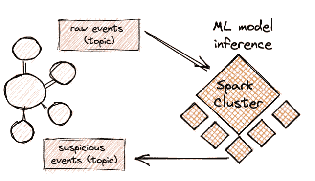
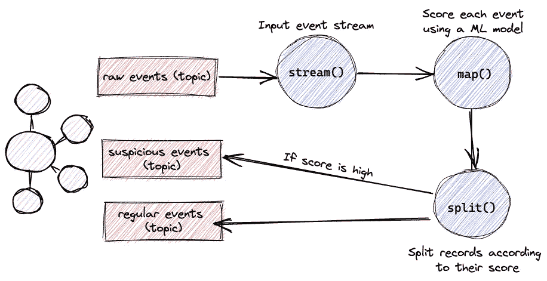

# 使用 Kafka 流对流数据进行 ML 预测

> 原文：<https://towardsdatascience.com/ml-prediction-on-streaming-data-using-kafka-streams-1e4ebd21008>

## 通过在 Scala 应用程序中的 Kafka 流平台上提供经过 Python 训练的 ML 模型，提高它们的性能


埃姆雷·卡拉塔什在 [Unsplash](https://unsplash.com?utm_source=medium&utm_medium=referral) 上拍摄的照片

# 1.介绍

假设您有一个基于 Kafka 的健壮的流媒体平台，它在将客户的事件数据写入某个仓库之前对其进行清理和丰富。一天，在一次偶然的计划会议上，您的产品经理提出了对传入数据使用机器学习模型(由数据科学团队开发)的要求，并为模型标记的消息生成警报。“没问题”，你回答。“我们可以从数据仓库中选择我们想要的任何数据集，然后运行我们想要的任何模型”。“不完全是”，首相回答。“我们希望尽可能实时地运行。*我们希望在收到事件*后不到一分钟，ML 模型的结果就可以在 Kafka 主题中使用。

这是一个普遍的要求，而且只会越来越流行。对于许多必须对模型结果做出时间敏感决策的客户来说，对流式数据进行实时 ML 推断的要求变得很重要。

看起来大数据工程和数据科学配合得很好，应该有一些简单的解决方案，但通常情况下并非如此，使用 ML 对繁重的数据工作负载进行接近实时的推理涉及到相当多的挑战。例如，在这些挑战中，Python(ML 的主流语言)和 JVM 环境(Java/Scala )(大数据工程和数据流的主流环境)之间存在差异。另一个挑战与我们用于工作负载的数据平台有关。如果你已经在使用 Spark，那么你可以使用 Spark ML 库，但是有时候它不够好，有时候(就像我们的例子)Spark 不属于我们的栈或者基础架构。

诚然，生态系统意识到了这些挑战，并正在慢慢地用新功能来解决它们，尽管我们特定的通用场景目前留给您几个通用选项。例如，一种方法是将 Spark 添加到您的堆栈中，并编写一个 pySpark 作业，将 ML 推理阶段添加到您的管道中。这将为您的数据科学团队提供更好的 Python 支持，但也意味着您的数据处理流程可能需要更长时间，并且您还需要向堆栈中添加和维护 Spark 集群。另一种选择是使用某个第三方模型服务平台，该平台将基于您的模型公开推理服务端点。这可能有助于保持您的性能，但也可能需要额外的基础架构成本，同时对于某些任务来说是多余的。



常见的解决方案是在堆栈中添加一个 Spark 集群来运行 ML 推理

在这篇文章中，我想展示使用 Kafka Streams 完成这项任务的另一种方法。使用 Kafka Streams 完成这项任务的优势在于，与 Flink 或 Spark 不同，它不需要专用的计算集群。相反，它可以运行在您已经在使用的任何应用服务器或容器环境上，如果您已经在使用 Kafka 进行流处理，那么它可以非常无缝地嵌入到您的流中。

虽然 Spark 和 Flink 都有他们的机器学习库和教程，但使用 Kafka Streams 来完成这项任务似乎是一个不太常见的用例，我的目标是展示它是如何容易实现的。具体来说，我展示了我们如何使用 XGBoost 模型——在 Python 环境中训练的生产级机器学习模型，对 Kafka 主题的事件流进行实时推理。

这是一篇非常实用的文章。在第 2 节中，我们在欺诈检测数据集上训练一个 XGBoost 分类器。我们在 Python 环境中的 Jupyter 笔记本中这样做。第 3 节举例说明了如何将模型的二进制文件导入并包装到 Scala 类中，第 4 节展示了如何将其嵌入到 Kafka 流应用程序中，并对流数据进行实时预测。在文章的最后，你可以找到一个回购协议的链接，里面有完整的代码。

(注意，在很多情况下，我以一种非常不习惯的方式使用 Scala。我这样做是为了清晰，因为惯用的 Scala 有时会令人困惑。)

# 2.Python 中的 XGBoost 分类器训练

对于这个例子，我们首先基于 Kaggle [信用欺诈数据集](https://www.kaggle.com/datasets/mlg-ulb/creditcardfraud)训练一个简单的分类模型。你可以在这里找到完整的模型训练代码。重要的一点是，当我们(或我们的数据科学家)对我们模型的结果感到满意后，我们简单地将其保存为简单的二进制形式。这个二进制文件就是我们在 Kafka Streams 应用程序中加载模型所需的全部内容。

# 3.Scala 中的 XGBoost 分类器预测

在这一节中，我们开始实现我们的 Kafka Streams 应用程序，首先将我们的机器学习模型包装在一个 Scala 对象(singleton)中，我们将使用它对传入的记录进行推理。这个对象将实现*一个 predict()* 方法，我们的流处理应用程序将在每个流事件上使用这个方法。该方法将接收一个记录 id 和一个字段或要素数组，并将返回一个由记录 ID 和模型给它的分数组成的元组。

Scala 中的 XGBoost 模型加载和预测非常简单(尽管应该注意的是，较新的 Scala 版本中的支持可能是有限的)。在初始导入之后，我们开始将经过*训练的*模型加载到一个 Booster 变量中。

实现 *predict()* 方法也相当简单。我们的每个事件都包含一个由 10 个特征或字段组成的数组，我们需要将它们作为输入提供给我们的模型。

XGboost 用来包装输入向量以进行预测的对象类型是一个 *DMatrix，*，它可以通过多种方式构建。我将使用*密集矩阵*格式，它基于提供一个表示模型特征或字段的扁平的浮动数组；每个向量的长度(nCols)；以及数据集中向量的数量(nRows)。例如，如果我们的模型用于在具有 10 个特征或字段的向量上运行推理，并且我们希望一次预测一个向量，那么我们的 DMatrix 将使用长度= 10、nCols = 10 和 nRows = 1 的浮点数组进行实例化(因为集合中只有一个向量)。

这将为我们的分类器对象完成工作，该对象包装了一个经过训练的 XGboost ML 模型。将有一个带有 *predict()* 方法的分类器对象，每个记录都将被调用。

# 4.基于实时数据的 Kafka 流推理

在我们进入流应用程序的代码和细节并展示如何在流数据上使用我们的分类器之前，强调在这样的系统中使用 Kafka 流的优势和动机是很重要的。

以 Spark 为例，计算的分配由集群管理器完成，集群管理器从驱动程序应用程序接收指令，并将计算任务分配给专用集群中的执行器节点。每个 Spark 执行器负责处理一组数据分区。Kafka Streams (KS)的强大之处在于，尽管它同样通过并行性实现了规模，即通过运行流处理应用程序的多个副本，但它并不依赖于专用集群，而是只依赖于 Kafka。换句话说，计算节点的生命周期可以由任何容器编排系统(如 K8S)或任何其他应用服务器管理，而将协调和管理留给 Kafka(和 KS 库)。这似乎是一个小优势，但这正是 Spark 最大的痛苦。

事实上，与 Spark 不同，KS 是一个可以导入任何基于 JVM 的应用程序的库，最重要的是，它可以在任何应用程序基础设施上运行。KS 应用程序通常从 Kafka 主题读取流消息，执行转换，并将结果写入输出主题。Kafka 保存和管理状态和有状态转换，如聚合或窗口计算，只需运行应用程序的更多实例即可实现扩展(受限于主题的分区数量和消费者策略)。

KS 应用程序的基础是拓扑结构，它定义了应用程序的流处理逻辑或者输入数据如何转换为输出数据。在我们的例子中，拓扑将如下运行



这里的拓扑相当简单。它首先从 Kafka 上的输入主题中读取流记录，然后使用 map 操作对每个记录运行模型的 predict 方法，最后它分割流，并将从模型中获得高分的记录 id 发送到“可疑事件”输出主题，其余的发送到另一个主题。让我们看看这在代码中是怎样的。

我们的起点是从 Kafka 上的`inputTopic`主题开始读取消息的`builder.stream`方法。我将很快对此进行更多的解释，但请注意，我们将每个 kafka 记录键序列化为字符串，将其有效载荷序列化为类型为`PredictRequest`的对象。PredictRequest 是一个 Scala case 类，对应于下面的 protobuf 模式。这确保了与消息生成者的集成是直接的，同时也使得生成我们在处理定制对象时需要提供的反序列化/序列化方法变得更加容易。

```
message PredictRequest{
  string recordID = 1;
  repeated float featuresVector = 4;
}
```

接下来，我们使用`map()`在每个消息携带的数组上调用我们的分类器的`predict()`方法。回想一下，这个方法返回一个 recordID 和 score 的元组，它是从 map 操作流回的。最后，我们使用`split()`方法创建流的两个分支——一个用于高于 0.5 的结果，另一个用于其他结果。然后，我们将流的每个分支发送到它们自己指定的主题。订阅输出主题的任何消费者现在都将收到一个可疑记录 id 的警报(希望如此),接近实时

## 关于序列化的最后一点意见:

在用 Scala 编写的 KS 应用程序中使用定制类或对象，无论是 Kafka 记录的键还是值，都需要为类型提供一个隐式的`Serde[T]`(包括它的序列化器和反序列化器)。因为我使用了一个原型对象作为消息有效载荷，所以大部分繁重的工作都由`scalapbc`来完成，它将一个原型模式“编译”成一个 Scala 类，这个类已经包含了解序列化/序列化这个类的重要方法。让这个隐式 val 对流方法可用(在范围内或通过导入)可以实现这一点。

```
implicit val RequestSerde: Serde[PredictRequest] = Serdes.fromFn( //serializer
  (request:PredictRequest) => request.toByteArray, //deserializer
  (requestBytes:Array[Byte]) => 
Option(PredictRequest.parseFrom(requestBytes)))
```

# 5.结论

实时最大似然预测的需求变得越来越普遍，并且经常给数据流管道带来相当多的挑战。最常见和最可靠的方法通常是使用 Spark 或 Flink，主要是因为它们支持 ML 和一些 Python 用例。然而，这些方法的一个缺点是，它们通常需要维护一个专用的计算集群，这有时会过于昂贵或大材小用。

在这篇文章中，我试图基于 Kafka Streams 勾勒出一种不同的方法，这种方法除了您已经在使用的应用服务器和流平台之外，不需要额外的计算集群。作为一个生产级 ML 模型的例子，我使用了 XGBoost 分类器，并展示了如何将在 Python 环境中训练的模型轻松地包装在 Scala 对象中，并用于对流数据进行推理。当 Kafka 被用作流平台时，那么使用 KS 应用程序在所需的开发、维护和性能工作方面几乎总是有竞争力的。

希望这将有所帮助！

***所有图片，除非特别注明，均为作者所有***

## 笔记

[1] *信用卡欺诈检测数据集*，由[机器学习小组](https://mlg.ulb.ac.be/wordpress/)(ULB 布鲁塞尔自由大学)收集。在开放数据共享下许可公共使用。作者在这里提到了 Kaggle 的出版物:Yann-al Le Borgne，Gianluca Bontempi [用于信用卡欺诈检测的可复制机器学习——实用手册](https://fraud-detection-handbook.github.io/fraud-detection-handbook/Chapter_2_Background/MachineLearningForFraudDetection.html)。该小组的更多工作和关于数据集的信息可在[这里](https://www.kaggle.com/datasets/mlg-ulb/creditcardfraud)获得。

(*)完整回购可在[这里](https://github.com/a-agmon/kafka-streams-ml-classifier)找到

(*)模型训练代码可以在[这里](https://github.com/a-agmon/kafka-streams-ml-model-train)找到

(*)xdboost JVM 包文档可以在[这里](https://xgboost.readthedocs.io/en/stable/jvm/java_intro.html)找到