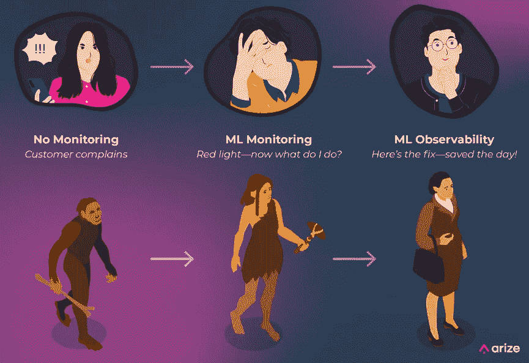
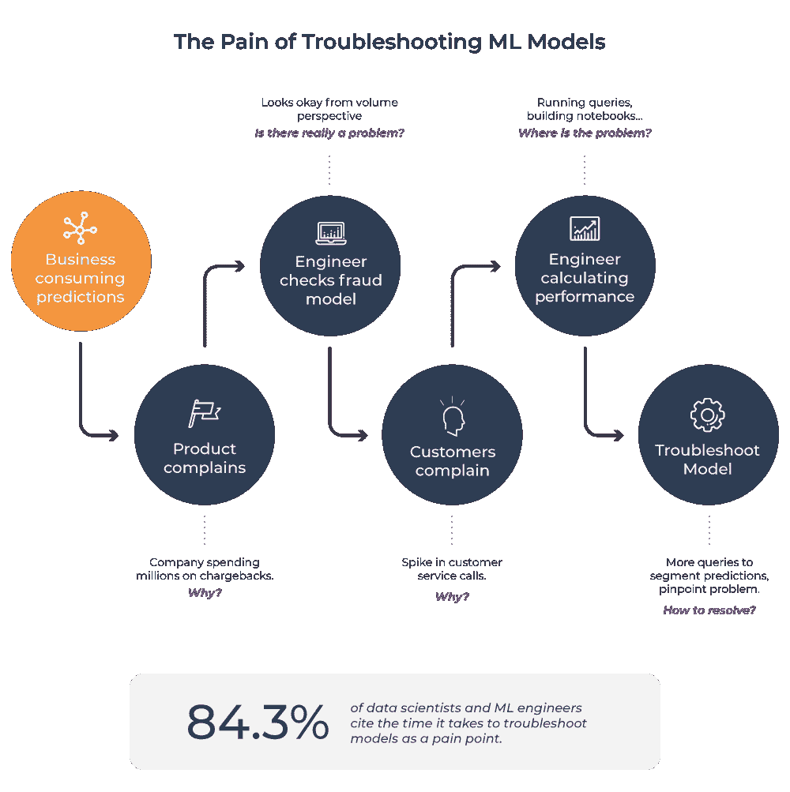
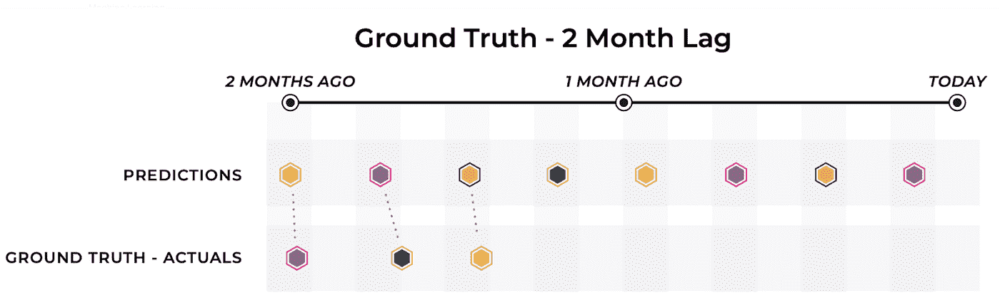
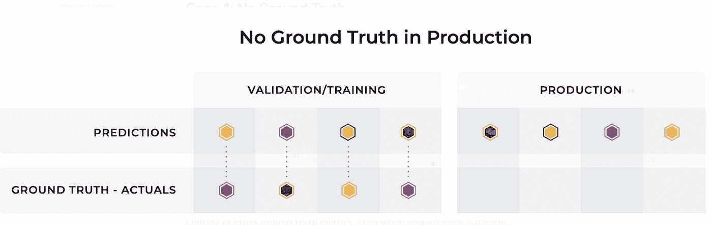

# 今天的 ML 故障排除太难了(但也不一定是这样)

> 原文：<https://towardsdatascience.com/ml-troubleshooting-is-too-hard-today-but-it-doesnt-have-to-be-that-way-fbf9a10cac05>

ML 可观测性的演变(图片由作者提供)

## 随着 ML 从业者将更多的模型部署到生产中，模型性能的风险比以往任何时候都高——错误的代价也更大。

## 第一部分:从无监控到有监控

套用一句常见的智慧，如果机器学习模型在生产中运行，没有人抱怨，这是否意味着该模型是完美的？不幸的事实是，生产模型通常被搁置，除非它们导致负面的业务影响。

让我们看一个今天可能发生的例子:

作为一家金融科技公司的机器学习工程师(MLE ),你维护着一个欺诈检测模型。它已经投入生产一周了，当您正在享用早晨的咖啡时，一位产品经理(PM)急切地抱怨说，客户支持团队发现投诉欺诈交易的电话显著增加了。

这使公司在按存储容量使用计费交易中损失了一大笔钱。公司每小时要花好几万美元，你现在就要解决它。

大口喝。是你的模型吗？软件工程师告诉你问题不在他们这边。

传统的 ML 故障排除工作流程(图片由 [Arize AI](https://arize.com/) 提供)

您编写一个自定义查询，从您的模型在过去三天中所做的最后一百万次预测的日志中提取数据。运行查询需要一些时间，导出数据，做一些简单的预处理，导入到 Jupyter 笔记本中，最后开始计算您提取的样本数据的相关指标。

整体数据似乎没有问题。您的项目经理和客户仍在抱怨，但您所看到的可能只是欺诈活动略有增加。

更多的指标，更多的分析，更多的与他人的交流。有些事情正在发生，只是不太明显。因此，您开始挖掘数据，寻找模型所遗漏的欺诈交易的共同模式。您正在编写临时脚本来分割数据。

这需要*几天或几周*的全力以赴。在这个问题解决之前，你所做的其他事情都暂停了，因为:1)你最了解这个模型；2)每一个坏的预测都在消耗公司的收入。

最终你会发现一些奇怪的事情。如果你按地理位置划分，加州的表现似乎比几天前要差一些。您过滤到加利福尼亚，并意识到一些商家 id 属于您的模型没有发现的诈骗商家。你在这些新的商家身上重新训练你的模型，然后转危为安。

这个例子有助于我们了解今天如何对机器学习模型进行故障诊断。它比传统软件的故障排除复杂许多倍。我们装运人工智能盲板。

对于传统的软件工程来说，有许多监控工具和技术——比如 Datadog 和 New Relic——可以自动发现性能问题。但是机器学习模型的监控是什么样子的呢？

# ML 性能监控

首先，让我们确定一下什么是监控:*监控*，在最基本的层面上，是关于您的系统如何运行的数据；它要求数据能够以某种合理的方式存储、访问和显示。

## 做性能监控需要哪些数据？

为了[监控机器学习模型](https://arize.com/model-monitoring/)的性能，你必须从一个**预测**和**实际**开始。

一个模型必须做出一些预测。这可以是在拼车应用程序中预测顺风车何时到达的估计到达时间(ETA)。也可以是给某个人多少贷款额度。一个模型可以预测周四是否会下雨。在基本层面上，这就是机器学习系统所做的事情:它们使用数据来进行预测。

既然你想要的是预测真实世界，并且你希望那个预测是准确的，那么看看**实际值(**也称为地面真实值)也是有用的。真实的才是正确的答案——它是真实世界中实际发生的事情。你的车五分钟后就到了，不然周四就下雨了。如果不与实际情况进行比较，在客户抱怨之前，很难量化模型的表现。

但是获取实际数据并不是一件小事。这里有四种情况:

1.**快速实际值:**在最简单的情况下，每个预测的实际值都会呈现给你，并且在预测和实际值之间有一个直接的链接，允许你直接分析你的模型在生产中的性能。例如，这可能发生在预测你的行程的预计到达时间的情况下。在某个时刻，车会到达，你会知道花了多长时间，以及实际时间是否与你的预测相符。

快速现实:图片由阿里泽艾

2.**延迟的实际值:**在下图中，虽然我们看到模型的实际值最终被确定，但对于所需的分析来说，它们来得太晚了。

当这个实际延迟足够小时，这个场景与快速实际没有太大区别。对于模型所有者来说，仍然有一个合理的节奏来度量性能指标并相应地更新模型，就像人们在实时实际场景中所做的那样。

延迟的现实:图片由阿里泽艾

然而，在接收实际数据有明显延迟的系统中，团队可能需要求助于**代理指标**。代理指标是与您试图估算的实际值相关的替代信号。

例如，假设您正在使用一个模型来确定哪些消费者最有可能拖欠信用卡债务。在这种情况下，一个潜在的代理指标可能是您贷款的客户中延迟付款的客户的百分比。

3.**对实际值的因果影响(有偏差的实际值):**并非所有的实际值都是相同的。在某些情况下，团队会收到实时的实际数据，但模型的预测会极大地影响结果。举一个贷款的例子，当您决定向某些申请人提供贷款时，您将收到这些申请人的实际金额，但不会收到您拒绝的申请人的实际金额。因此，你永远不会知道，你的模型是否准确地预测到被拒绝的申请人会违约。

有偏见的现实例子:图片由阿里泽艾

4.**没有实际值**:对于建模团队来说，没有实际值来连接回模型性能是最糟糕的情况。获取基本事实数据的一种方法是雇佣人类注释者或标注者。[监控输出预测中的漂移](https://arize.com/model-drift/)也可用于发出异常模型行为的信号，即使实际值不存在。

没有现实:图片由阿里泽艾

要深入了解这些场景，请参见“[行动手册，以监控您的模型在生产中的性能](https://arize.com/blog/monitor-your-model-in-production/)”

收集你的预测和实际情况是第一步。但是为了进行任何有意义的监控，你需要一个公式来比较你的预测和你的实际情况——你需要正确的衡量标准。

# 我的模型的正确指标是什么？

监控任何模型的正确指标取决于您的模型的用例。让我们看一些例子。

## 欺骗

一个[欺诈模型](https://arize.com/blog/best-practices-in-ml-observability-for-monitoring-mitigating-and-preventing-fraud/)特别难以用简单的准确性衡量标准来评估，因为数据集是极度不平衡的(绝大多数交易都不是欺诈)。相反，我们可以测量:

*   **回想一下**，或者您的模型识别出的欺诈示例中有多少部分是真的。
*   **假阴性率**衡量模型未能准确预测的欺诈。这是一个关键的性能指标，因为就直接财务损失而言，它是组织最昂贵的，会导致退款和其他被盗资金。
*   **假阳性率**——或模型预测实际上并非欺诈的交易欺诈的比率——也很重要，因为给客户带来不便有其间接成本，无论是在医疗保健领域(患者的索赔被拒绝)还是在消费信贷领域(客户延迟购买食品杂货)。

## 请求预报

[需求预测](https://arize.com/blog/best-practices-for-ml-monitoring-and-observability-of-demand-forecasting-models/)预测给定时间段内的客户需求。例如，销售电脑机箱的在线零售商可能需要预测需求，以确保他们能够满足客户需求，而不会购买过多库存。像其他时间序列预测模型一样，它最好用 me、MAE、MAPE 和 MSE 等指标来描述。

*   **均值误差** (ME)是平均历史误差(偏差)。正值表示预测过高，负值表示预测过低。虽然平均误差通常不是模型在训练中优化的损失函数，但它测量偏差的事实对于监控业务影响通常是有价值的。
*   **平均绝对误差** (MAE)是模型预测值和实际值之间的绝对值差，在整个数据集中取平均值。这是对模型性能的一个很好的初步观察，因为它没有被一些预测的极端误差所扭曲。
*   **平均绝对百分比误差** (MAPE)衡量模型产生的平均误差幅度。这是模型预测准确性的一个更常见的指标。
*   **均方误差** (MSE)是模型的预测值和实际值之间的差值，对数据集进行平方和平均。MSE 用于检查预测值与实际值的接近程度。与均方根误差(RMSE)一样，这种方法对较大的误差给予较高的权重，因此在企业可能希望严重惩罚较大的误差或异常值的情况下可能很有用。

## 其他使用案例

从[点击率](https://arize.com/blog/best-practices-in-ml-observability-for-click-through-rate-models/)到[终身价值](https://arize.com/blog/best-practices-in-ml-observability-for-customer-lifetime-value-ltv-models/)模型，有很多机器学习用例以及关联的[模型度量](https://arize.com/glossary/)。关于使用案例的[模型指标的其他资源可用。](https://arize.com/use-case/)

# 什么是正确的阈值？

现在你有了自己的衡量标准，你面临一个新问题:多好才算足够好？什么是好的准确率？是我的假阴性率太高了吗？什么才算是好的 [AUC](https://arize.com/blog/what-is-auc/) ？

绝对量度很难定义。相反，机器学习实践者必须依赖相对度量。特别是，您必须确定一个**基线性能**。当您训练模型时，您的基线可以是您已经产品化的旧模型、来自文献的最先进的模型或人类行为。但是一旦模型投入生产，它就会成为自己的基准。如果你第一天有百分之三的假阴性率，然后今天有百分之十的假阴性率，你应该叫醒你的工程师！

通常，初始性能不是实际使用的性能；相反，你可以使用连续 30 天的表现。

当模型发生显著变化(标准差或更大)时，必须触发警报。这应该是一个基于基线数据集的自动设置，以便您可以主动收到警报。

# 结论&下一步是什么

在过去十年中，机器学习模型被迅速采用，解决了具有巨大商业影响的非常复杂的问题。机器学习系统通常建立在数据管道和其他复杂的工程系统之上，这些系统为模型提供进行预测所需的数据。但是预测仅仅是开始。为了在生产中可靠地运行这些系统，您需要[性能监控](https://arize.com/model-monitoring/)来持续评估您的模型的准确性和质量。

当然，光靠监控是不够的。如果您处于这一阶段，您可能会在客户抱怨欺诈性交易增加之前收到警报，但您仍然不知道如何轻松地修复它。在本博客系列的第二部分中，我们将介绍一种现代的、不那么痛苦的评估和排除模型性能故障的方法:带有 ML 性能跟踪的全栈 [ML 可观测性](https://arize.com/ml-observability/)。

# 联系我们

如果这个博客引起了你的注意，并且你渴望了解更多关于[机器学习可观察性](https://arize.com/ml-observability/)和[模型监控](https://arize.com/model-monitoring/)，请查看我们的其他[博客](https://arize.com/blog/)和关于 [ML 监控](https://arize.com/ml-monitoring/)的资源！如果您有兴趣加入一个有趣的 rockstar 工程团队，帮助模型成功生产，请随时[联系](https://arize.com/contact/)我们，并在此处[找到我们的空缺职位](https://arize.com/careers/)！