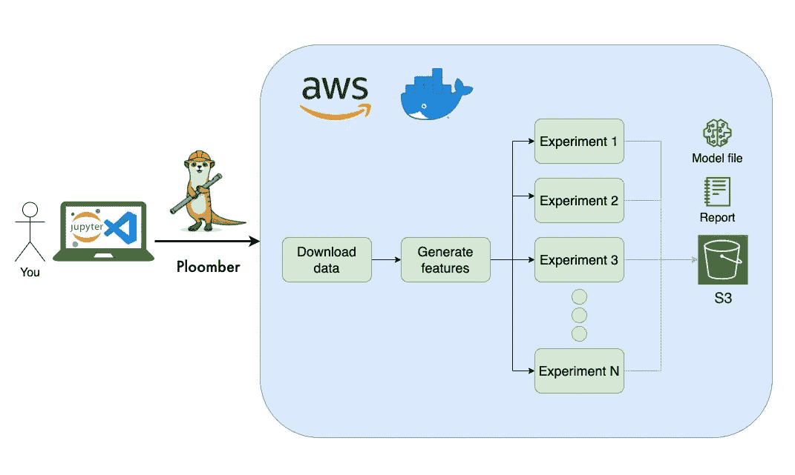
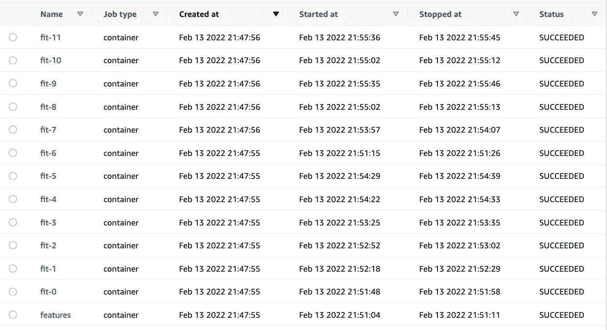
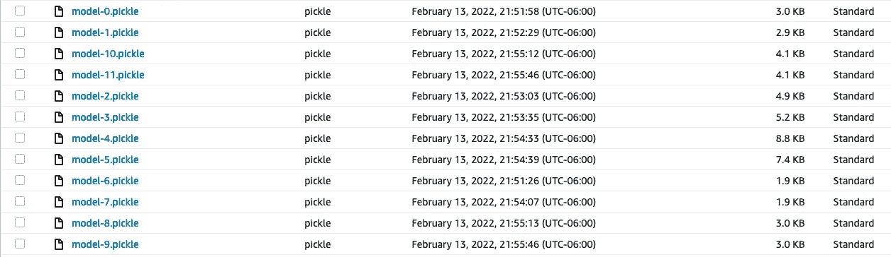
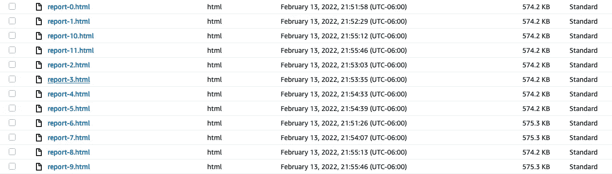
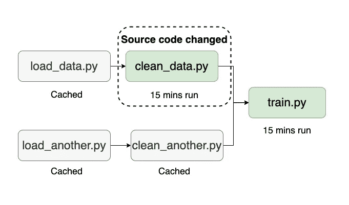

# 没有 Ops 的 ML:在 AWS 上用 Ploomber 进行大规模实验

> 原文：<https://towardsdatascience.com/ml-without-the-ops-running-experiments-at-scale-with-ploomber-on-aws-29c4b78ff0fa>

## 行动中的 MLOps

## 用 Ploomber 从 Jupyter 到云

在过去的几个月里，[我们](https://ploomber.io/)与许多数据科学和机器学习团队聊天，以了解他们的痛点。当然还有*很多这些*。然而，最让我惊讶的是，让一些简单的端到端工作流工作起来是多么困难，部分原因是供应商经常将团队锁定在需要大量设置和维护的复杂解决方案中。

这篇博客文章将描述一个简单的架构，您可以使用它在云中开始构建数据管道，而不会牺牲您最喜欢的工具或经常性的高维护成本。解决方案包括使用我们的开源框架和 AWS 批处理。我们开始吧！

Ploomber 允许您在 AWS 上轻松运行作业。图片作者。

# **什么是 AWS 批次？**

AWS Batch 是一个托管服务，允许用户提交批处理作业。AWS 提供资源(例如启动 EC2 实例)而没有额外成本(您只需为使用的 AWS 资源付费)。

AWS Batch 是一个很好的服务，但是它仍然需要一些设置来封装您的代码并提交作业。**我们的开源框架允许您自动化这一过程，因此您可以快速地从您喜欢的交互环境(Jupyter、VScode、PyCharm 等)迁移到云。**

# **Ploomber & AWS Batch = ML 不带 Ops**

如果你没有听说过我们，Ploomber 是一个开源框架，允许数据科学家和机器学习工程师从他们最喜欢的编辑器中构建模块化管道。**我们为用户提供了一种简单的方法来模块化他们的工作，而不会干扰现有的工作流程。**

当您准备运行更大规模的实验或部署时，您可以通过一个命令快速转移到 AWS Batch(我们也支持 Kubernetes、Airflow 和 SLURM 作为后端)。我们的框架自动构建 Docker 映像，将其推送到容器注册中心，在任务之间传递数据，向 AWS 批处理提交作业，缓存结果，并将工件上传到 S3。成功执行后，您可以下载结果并在本地进行分析。

# **看起来怎么样？**

在 Ploomber 中，用户通常在一个`pipeline.yaml`文件中声明他们的任务(尽管 Python API 也是可用的)。这些任务可以是函数，笔记本，或者脚本(注意:我们与 Jupyter 集成，允许用户将`.py`作为笔记本打开)。这里有一个例子:

一旦声明了`pipeline.yaml`,您就可以使用以下命令在本地编排执行:

只需几个额外的步骤，您就可以将本地管道转移到 AWS 批处理；以下是 11 个模型训练任务(并行执行)在 AWS 上完成执行后的截图:

AWS 批处理控制台上的计划任务。图片作者。

这是输出。模型文件:

在 S3 上输出模型文件。图片作者。

以及每个模型的 HTML 报告:

输出关于 S3 的模型评估报告。图片作者。

# **增量构建的快速迭代(此外，节省您的云账单💰！)**

Ploomber 只执行自上次运行以来发生变化的任务。图片作者。

数据科学和机器学习是高度迭代的。例如，您可能希望调整预处理参数，调整一些特征工程转换，或者添加一些诊断图表。在每个小的迭代中重新运行端到端的管道是浪费你的时间(和金钱)。为了帮助你，Ploomber 跟踪源代码的变化。因此，下次执行工作流时，它将只提交自上次执行以来源代码已经更改的作业(以及所有下游任务)，从而显著加快迭代速度并减少云计算时间。

# **现在就试试吧！**

运行 Ploomber 示例:

**祝贺你，你运行了你的第一个 Ploomber 管道！🎉**

在 AWS 批处理中运行管道只需要几个额外的步骤:

在提交到 AWS 批处理之前，您需要从 AWS 控制台配置服务，然后配置您的项目。查看我们的完整教程，了解更多信息。

完成后，您可以使用以下命令提交到云:

**Ploomber + AWS Batch 是在没有基础设施管理的情况下开始运行数据科学和机器学习管道的最精简的方式。**由于它允许您使用自己喜欢的文本编辑器构建数据管道，因此无需重构代码即可在云中运行工作流，从而缩短开发周期，让您能够更快地进行实验。

你有什么问题吗？在[松驰上 Ping 我们！](https://ploomber.io/community)

*最初发布于*[*ploomber . io*](https://ploomber.io/blog/aws-batch/)