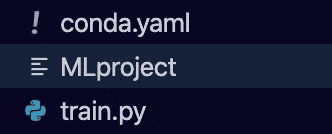
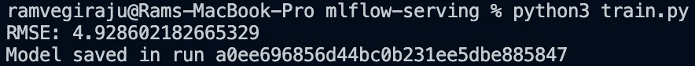
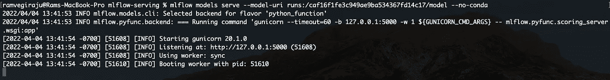
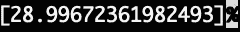

# MLflow 模型服务

> 原文：<https://towardsdatascience.com/mlflow-model-serving-bcd936d59052>

## 使用 MLflow 在本地托管模型

图片来自[马特·博茨福德](https://unsplash.com/@mattbotsford)拍摄的 [Unsplash](https://unsplash.com/photos/OKLqGsCT8qs)

在之前的文章中，我们讨论了如何用 [MLflow](https://mlflow.org/) 来[跟踪和注册模型](/using-mlflow-to-track-machine-learning-experiments-adbf27e9d36c)。MLflow 还涵盖了 ML 生命周期的另一个重要步骤，即**模型托管**和部署。虽然跟踪训练模型的不同迭代很重要，但最终你需要从你选择的模型中进行[推理](https://hazelcast.com/glossary/machine-learning-inference/)。

使用 [MLflow 模型](https://www.mlflow.org/docs/latest/models.html)我们可以打包 ML 模型用于**本地实时推理**或 Apache Spark 上的批量推理。在本文中，我们将探索如何训练一个 Sklearn 模型，然后使用 MLflow 在本地部署它进行推理。我们将使用 MLflow 存储库中的以下[示例](https://github.com/mlflow/mlflow/tree/master/examples/sklearn_logistic_regression)作为参考。具体这个例子的代码可以在[这里](https://github.com/RamVegiraju/mlflow-serving)找到。

# 目录

1.  设置
2.  模特培训
3.  部署和推理
4.  其他资源和结论

## 1.设置

这里的设置非常简单，因为 MLflow 是一个开源包，您可以使用它。

安装 MLflow

如果你想完全访问 MLflow [文档](https://www.mlflow.org/docs/latest/quickstart.html)，从他们的[资源库](https://github.com/mlflow/mlflow)开始吧，那里也有一大套[示例](https://github.com/mlflow/mlflow/tree/master/examples)，涵盖了我们讨论过的所有主要组件。

现在，对于我们的 MLflow 模型的设置，我们需要**以模型服务将理解的某种结构定义几个文件**。我们将捕获我们将在脚本中部署的模型，为此，我们可以创建一个 **train.py** 来进行模型训练，并创建 **log** 我们的**模型工件**。

模型服务脚本

我们可以在根目录下的一个 [MLproject](https://mlflow.org/docs/0.4.2/projects.html) 文件中指向这个脚本。在这个文件中，我们可以提供**模型服务**所需的**元数据**。在这里，我们可以在 train.py 中捕获我们的[入口点](https://mlflow.org/0.2.0/python_api/mlflow.projects.html)脚本，这将基本上让 MLflow 知道这是我们可以在项目中捕获我们的模型工件的地方。

ml 项目已定义

您可以在这个文件中以 yaml 格式定义更多的参数。MLflow 项目的本质是以可重用的方式打包您的数据科学代码以供部署。例如，在上面的 yaml 文件中，如果您正在部署 conda 环境，您也可以定义一个 conda 环境。

在这个例子中，我们不会使用 conda 环境，但是您可以在这个文件中指定您的依赖项。我还附上了一个示例 conda.yaml 文件，仅供本例的代码库中参考。在我们开始编写培训脚本之前，您的文件结构应该如下所示。

文件结构(作者截图)

## 2.模特培训

在开始部署我们的模型之前，我们将使用 [Sklearn 框架](https://scikit-learn.org/stable/modules/generated/sklearn.linear_model.LinearRegression.html)用[波士顿住房数据集](https://www.cs.toronto.edu/~delve/data/boston/bostonDetail.html)训练一个简单的线性回归模型。

模特培训

我们可以使用 MLflow 提供的 [log_metric API 调用](https://mlflow.org/docs/1.2.0/python_api/mlflow.html)来捕获我们的 RMSE 度量，以跟踪不同的训练迭代。

MLflow 运行的日志度量

更重要的是，我们需要捕获我们的模型工件/数据，我们可以通过 log_model API 调用来完成。对于 sklearn 来说更好的是，MLflow 提供了一个为框架定制的特定的 [sklearn.log_model 调用](https://www.mlflow.org/docs/latest/python_api/mlflow.sklearn.html)。

捕获模型工件

现在，如果我们运行训练脚本，我们应该看到最后一行中省略了一个运行 ID。我们在前面要点的最后一行获取运行 ID，这样我们就可以指定我们想要部署哪个模型。

模特训练+跑步 ID(作者截图)

请务必保存此运行 ID，我们将需要它为我们的模型服务。

## 3.部署和推理

使用这个运行 ID，我们可以将 MLflow 模型作为一个公共 REST API。使用下面的命令，我们的模型将作为 REST API 用于推理。

请注意，我们为 **no conda 环境**提供了一个**环境变量**，因为我们没有针对这种情况的环境变量，但是如果您在 conda 环境中，请确保忽略它。

模特上菜(作者截图)

现在，我们可以通过对**/调用**路径的 POST 输入来调用本地 REST API 端点。我们可以获取一个样本数据点，并指定我们的输入数据点以及内容类型(JSON、CSV)。

引起

您可以通过[模型签名](https://www.mlflow.org/docs/latest/models.html#model-signature-and-input-example)进一步添加更多定制来定义您的输入和输出。您可以将模型签名添加到 log_model 调用中，以便根据定型数据自动推断输入数据，或者指定您的列/输入数据功能。

在这个例子中，我们将直接调用 REST API 和一个示例数据点，如上面的 shell 命令所示。在另一个 shell 中运行该命令，您应该会看到推论。

推论(作者截图)

## 4.其他资源和结论

<https://github.com/RamVegiraju/mlflow-serving>  

MLflow 是一个非常强大的工具，涵盖了 ML 生命周期的每一步。您可以使用它来构建端到端的 ML 工作流，但更重要的是，它还为您提供了选择 ML 项目中您想要关注的步骤的灵活性。

我希望这篇文章是对使用 MLflow 托管模型的一个很好的介绍，我们将在接下来的文章中探索该平台的不同方面。

## 额外资源

[使用 MLflow 跟踪 ML 实验](/using-mlflow-to-track-machine-learning-experiments-adbf27e9d36c)

[MLflow 模型注册&服务](https://docs.databricks.com/applications/mlflow/model-serving.html)

[部署 ML 模型](/3-ways-to-deploy-machine-learning-models-in-production-cdba15b00e)

*如果你喜欢这篇文章，请在*[*LinkedIn*](https://www.linkedin.com/in/ram-vegiraju-81272b162/)*上与我联系，并订阅我的媒体* [*简讯*](https://ram-vegiraju.medium.com/subscribe) *。如果你是新手，使用我的* [*会员推荐*](https://ram-vegiraju.medium.com/membership) *报名。*