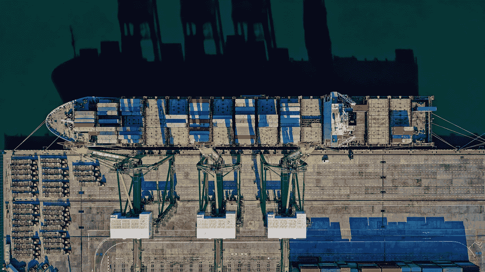
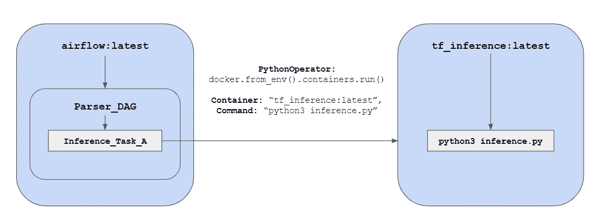
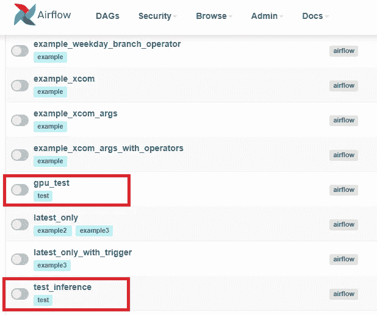
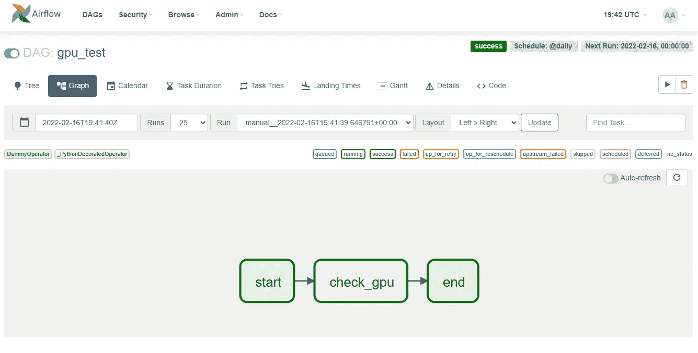
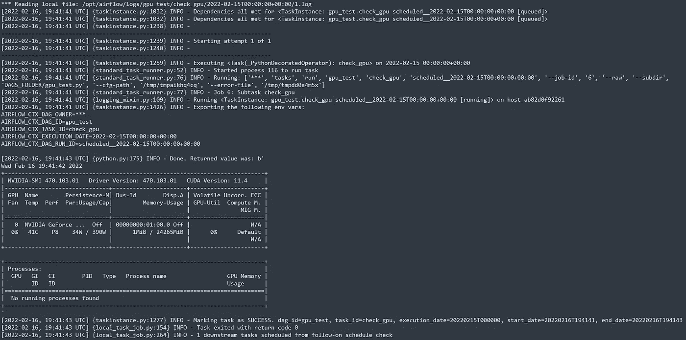
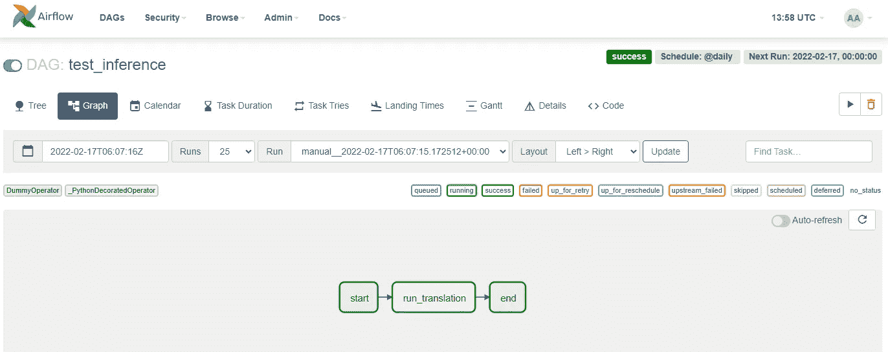
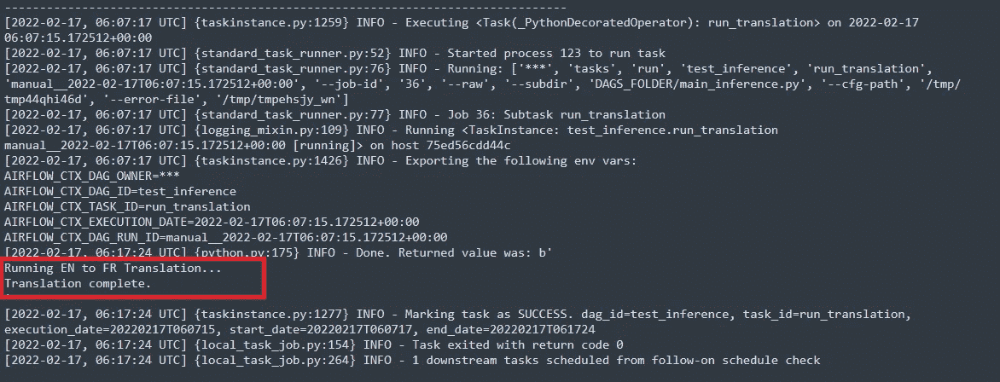
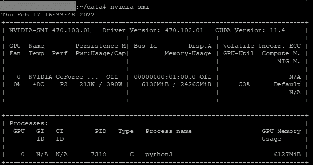

# 用于批处理的 MLOps:在 GPU 上运行气流

> 原文：<https://towardsdatascience.com/mlops-for-batch-processing-running-airflow-on-gpus-dc94367869c6>

## 阿帕奇气流限制的简单变通方法



来自 [Pexels](https://www.pexels.com/photo/aerial-view-of-cargo-ship-1554646/?utm_content=attributionCopyText&utm_medium=referral&utm_source=pexels) 的[汤姆·菲斯克](https://www.pexels.com/@tomfisk?utm_content=attributionCopyText&utm_medium=referral&utm_source=pexels)的照片。

*有很多 MLOps 平台本身就处理 GPU 访问，但我们喜欢我们的一些任务的简单性。本文着眼于一种允许同时使用 PyTorch 和 Tensorflow 堆栈的方法。*

*已经有一些关于这种类型的实现的文章，但是* [*为 Batch*](https://medium.com/fandom-engineering/gpu-based-workloads-as-a-part-of-airflow-dags-1d856418b529) *创建自己的 AWS AMI 或者使用其他依赖于特定于云的平台的方法并不是解决这个看似简单的问题的最佳方式。*

# 背景和动机

如果你已经花了很多时间将你的模型打包到一个漂亮的小容器中，并将它们绑定到你的 CI/CD 管道，那么偶尔你的模型会需要原始的 GPU 能力。对于大批量作业来说尤其如此，这是我们在 [AuditMap](http://auditmap.ai) 内部审计和企业风险客户中经常看到的情况。此外，[我们](https://lemay.ai)在大多数 NLP 项目中使用大量基于 BERT 的模型进行数据预处理和清理，因此在 GPU 上进行批处理推理工作很有意义。

但是，有一些现成的限制，我们将在本文中讨论和解决。

## 气流

[Apache Airflow](https://airflow.apache.org/) 是一个开源的任务调度器和工作流管理器。与端到端 MLOps 解决方案相反，它只做一件事，即运行良好的作业。Airflow 自带多种任务类型，包括 [PythonOperator](https://airflow.apache.org/docs/apache-airflow/stable/howto/operator/python.html) 和 [DockerOperator](https://airflow.apache.org/docs/apache-airflow-providers-docker/stable/_api/airflow/providers/docker/operators/docker/index.html) 。这些特定的操作符意味着您可以分别运行 Python 函数或旋转容器。

在这些条件下，相信 DockerOperator 能够提供所有本机 Docker 功能(包括目标设备分配)是明智的。然而，截至 2021 年 10 月，[仍没有关于该特定能力的重大开发活动](https://github.com/apache/airflow/pull/13541)。现在，关于 [Airflow Github 页面](https://github.com/apache/airflow)上的 [*device_request* 参数](https://github.com/apache/airflow/pull/13541#issuecomment-935688549)已经有了很多讨论，但是无论是他们的[文档](https://airflow.apache.org/docs/apache-airflow-providers-docker/stable/_api/airflow/providers/docker/operators/docker/index.html)还是他们的[源代码](https://github.com/apache/airflow/blob/d87762b3cc8170b78b0dac5c1ff932df913346fe/airflow/providers/docker/operators/docker.py#L47)都没有启用这个特定的参数。

我仍然希望我的团队在 GPU 上运行气流 Dag，所以我们在这里。

## 变通办法

虽然 Airflow 已经在内部使用了[docker-py](https://github.com/apache/airflow/issues/9492#issuecomment-648765141)，但是我们将把它作为一个外部依赖项来安装，并通过 Python 以编程方式调用 Docker 守护进程。从那里，外部容器将在目标 GPU 上以单次运行脚本的形式执行它们的代码。

这需要一个包含 python 脚本的外部容器，该容器可以访问目标数据(下面将详细介绍)。然而，考虑到一些结构上的最佳实践，我们现在有了一个可以作为气流任务运行的容器。



呼叫逻辑的图表视图。

所以我们正在做的是**在一个外部容器中运行一个 Python 脚本，这个脚本本身被一个 Airflow Python 任务**调用。这避开了 Airflow 的 DockerOperator 限制，并从本机 Docker 引擎进行调用。

来自 [Giphy](https://giphy.com/gifs/spotify-play-streaming-SbtWGvMSmJIaV8faS8) 的 [Spotify](https://giphy.com/spotify/) 拍摄的《侏罗纪公园心灵爆炸》GIF。

# 示例:基本 DAG

为了让我们熟悉一下，下面是一个简单的 *nvidia-smi* 测试，它将在一个外部容器中运行(在本例中，[*tensor flow:2 . 7 . 0-GPU*](https://hub.docker.com/layers/tensorflow/tensorflow/2.7.0-gpu/images/sha256-fc5eb0604722c7bef7b499bb007b3050c4beec5859c2e0d4409d2cca5c14d442?context=explore)):

## 让它工作

假设您的起点是 Airflow 的[*docker-compose . YAML*](https://github.com/apache/airflow/blob/main/docs/apache-airflow/start/docker-compose.yaml)文件，下面是要做的更改:

*   添加 docker-py 作为 PIP 要求:

```
x-airflow-common:
...
  environment:
  ...
    _PIP_ADDITIONAL_REQUIREMENTS: 
    ${_PIP_ADDITIONAL_REQUIREMENTS:-**docker==5.0.3**}
```

*   安装包含 Docker 插座的卷:

```
x-airflow-common:
...
  volumes:
  ...
 **- /var/run/docker.sock:/var/run/docker.sock**
```

*(注意:如果您最终使用 DockerOperator，那么它可以作为一个参数包含进来。)*

*   确保设置您的 [AIRFLOW_UID](https://airflow.apache.org/docs/apache-airflow/stable/start/docker.html#setting-the-right-airflow-user) 。

从那里开始，假设有适当的隧道并且没有端口冲突，您可以运行`docker-compose up`来让*气流*运行。主 web 服务器现在运行在端口 8080 上。如果您从我们的 [Github repo](https://github.com/lemay-ai/airflow_gpu) 中获取了代码，那么将会出现两个新的 Dag:



作为我们回购的一部分。

运行`gpu_test` DAG 给了我们很多信心。

## 结果

正如所料，我们有一个不错的 DAG 运行成功和一个完成日志与一个 *nvidia-smi* 打印输出:



成功的 DAG 运行图。太美了。



nvidia-smi 从 check_gpu()调用中记录。

# 高级脚本

下一步是创建一个容器，它可以:

1.  持有生产模型；
2.  运行推理代码；和
3.  加载目标数据并保存结果。

如果您从容器化设计开始，那么将所有推理任务分配给一个脚本会变得更容易。让我们创建一个简单的多任务推理脚本，它可以接受参数。我们将从 [Helsinki-NLP](https://huggingface.co/Helsinki-NLP) 创建一个简单的翻译管道。我们还将使用来自 [Kaggle](https://www.kaggle.com/ldorigo/full-sentences-only) 的一些样本数据来启动测试过程。

这个脚本现在可以执行一个带有参数的推理任务。让我们更新我们的 DAG 来进行呼叫:

## 结果

成功！



又一次成功的气流运行。



确认成功运行的日志。

在这个操作过程中，GPU 确实受到了影响:



nvidia-smi 打印输出。

# 后续步骤

在成功运行之前，您需要清理一些基础设施项目:

1.  映射数据文件夹和数据源。
2.  加载正确的模型。
3.  确保 nvidia-docker 和 GPU 访问在你的目标机器上可用。

您还应该使用 MLFlow、PMML 或[任何其他高质量工具](https://arxiv.org/abs/2201.00162)以编程方式添加模型，作为您的 CI/CD 管道的一部分。

# 讨论

虽然有点复杂，但这种设计模式允许各种推理活动之间的大量可互换性。它还允许将模型作为 CI/CD/MLOps 管道的一部分进行分离，因为容器在启动时将始终采用最新的模型(如果模型是从外部卷加载的)。

防止 GPU 资源争用需要一点警惕，但我们在 BERT 模型上的经验告诉我们，您可以在每个模型 6–8gb 的内存预算下轻松运行多个模型。(但是，确保为 Tensorflow 设置[增量内存增长。)](https://www.tensorflow.org/guide/gpu)

# 笔记

*   我们确实在一个 [Tensorflow](https://hub.docker.com/layers/tensorflow/tensorflow/2.7.0-gpu/images/sha256-fc5eb0604722c7bef7b499bb007b3050c4beec5859c2e0d4409d2cca5c14d442?context=explore) 容器中运行了一个 Torch 示例。这是因为 Tensorflow 容器倾向于非常整洁地预安装 CUDA 库。
*   确保根据[气流安装说明](https://airflow.apache.org/docs/apache-airflow/stable/start/docker.html)设置您的[气流 _ 流体参数](https://airflow.apache.org/docs/apache-airflow/stable/start/docker.html#setting-the-right-airflow-user)。
*   Github 资源库可从这里获得:[https://github.com/lemay-ai/airflow_gpu](https://github.com/lemay-ai/airflow_gpu)

*这篇文章的灵感来源于*[*Aquater*](https://stackoverflow.com/users/7091333/aquater)*上的*[*stack overflow*](https://stackoverflow.com/questions/69572705/how-to-create-an-airflow-task-where-i-start-a-docker-container-with-gpu-support)*。干得好阿奎特。*

流水线作业快乐！

马特。

*如果您对本文或我们的 AI 咨询框架有其他问题，请通过*[***LinkedIn***](https://www.linkedin.com/in/mnlemay/)**或通过* [***电子邮件***](mailto:matt@lemay.ai) *联系。**

# *你可能喜欢的其他文章*

*   *数据集偏差:制度化的歧视还是足够的透明度？*
*   *[人工智能如何创造价值？](https://medium.com/@lsci/how-does-artificial-intelligence-create-value-bec14c785b40)*
*   *[实施企业人工智能战略](/implementing-a-corporate-ai-strategy-a64e641384c8)*
*   *[离群点感知聚类:超越 K 均值](/outlier-aware-clustering-beyond-k-means-76f7bf8b4899)*
*   *[深度学习图像分类器的罗夏测试](/rorschach-tests-for-deep-learning-image-classifiers-68c019fcc9a9)*