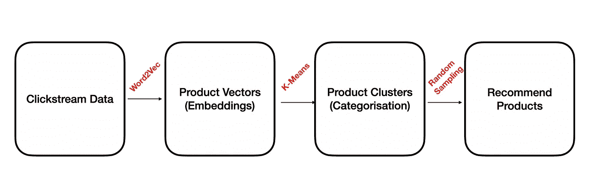
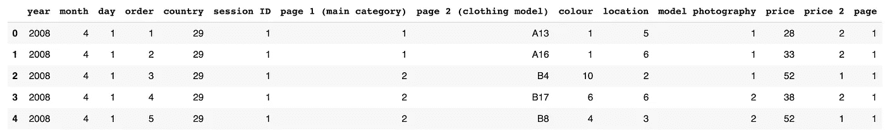
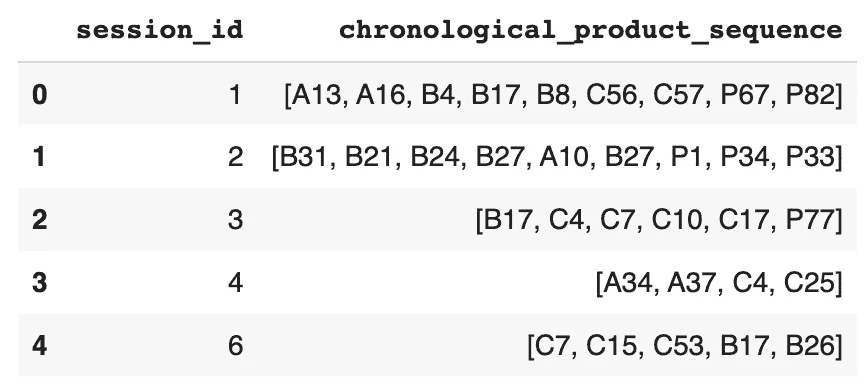
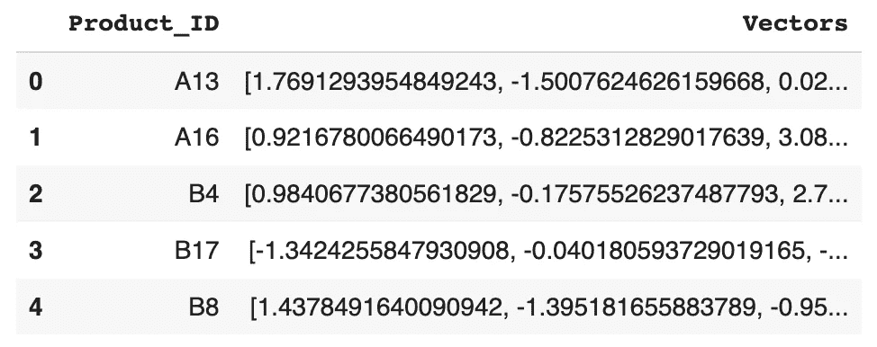
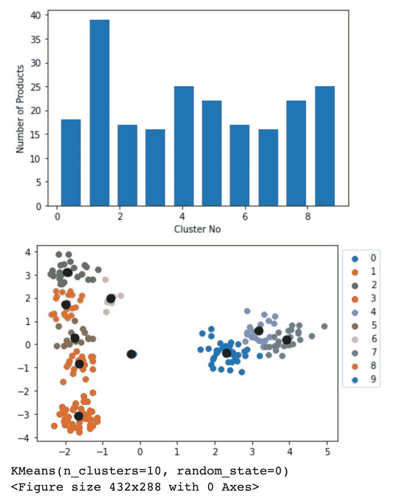
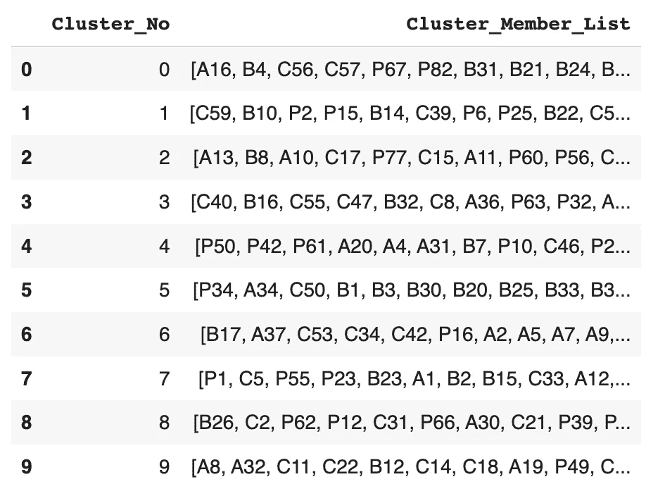
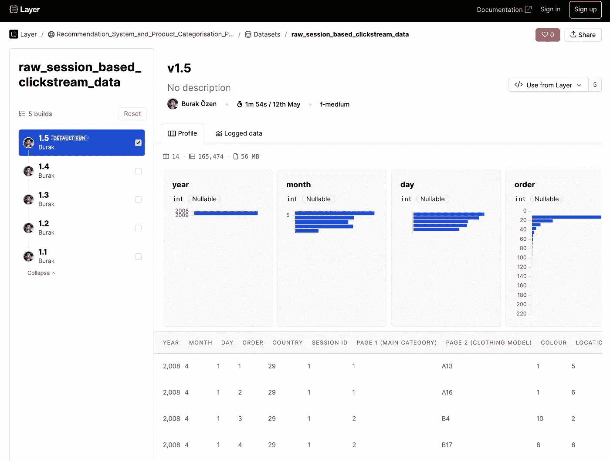

# MLOps:如何运营电子商务产品推荐系统

> 原文：<https://towardsdatascience.com/mlops-how-to-operationalise-e-commerce-product-recommendation-system-c755477bde5f>


照片由 [JJ 英](https://unsplash.com/@jjying?utm_source=medium&utm_medium=referral)在 [Unsplash](https://unsplash.com?utm_source=medium&utm_medium=referral)

## 介绍

电子商务业务中最常见的挑战之一是建立一个性能良好的产品推荐和分类模型。产品推荐器用于向用户推荐相似的产品，从而增加每个用户在平台上花费的时间和金钱。还需要有一个模型来对产品进行正确分类，因为在这些平台上可能会有一些错误分类的产品，特别是在大多数内容是由用户生成的情况下，如分类网站。产品分类模型用于捕捉这些产品，并将它们放回正确的类别，以改善平台上的整体用户体验。

本文有两个主要部分。在第一部分中，我们将讨论如何建立一个电子商务产品推荐系统，并将通过一些动手编码练习进行产品分类。在第二部分，我们将讨论如何在一个名为[层](http://layer.ai)的 MLOps 平台的帮助下，通过几个步骤来操作这个项目。

## 简要方法



**方法简单明了**(图片由作者提供)

我相信大多数电子商务平台收集用户的点击流数据，这基本上是一个简单的表格，由 3 列组成:会话 id、产品 id 和时间戳。实际上，这个表是为您的企业创建本文中描述的产品推荐模型所需的唯一数据。在整个教程中，我们将使用[一个公共 Kaggle 数据集](https://www.kaggle.com/datasets/tunguz/clickstream-data-for-online-shopping) ( [CC0:公共域](https://creativecommons.org/publicdomain/zero/1.0/))，这是一个电子商务商店的点击流数据，您可以在下面找到链接。[1]

[](https://www.kaggle.com/datasets/tunguz/clickstream-data-for-online-shopping) [## 在线购物的点击流数据

### 在线购物数据集的点击流数据

www.kaggle.com](https://www.kaggle.com/datasets/tunguz/clickstream-data-for-online-shopping) 

Word2Vec 算法是这种方法的核心，用于生成产品嵌入。单词 2Vec 主要在 NLP 和文本上下文中使用。在这个上下文中使用单词 2Vec 有一个类比。产品将被视为一个单词，一系列产品视图(会话)将被视为一个句子。Word2Vec 算法的输出将是乘积的数字表示向量。

[在下一步中，这些产品向量被输入 K-Means 算法，以创建任意数量的产品聚类。](https://app.layer.ai/layer/Ecommerce_Recommendation_System/models/clustering_model)这些聚类代表相似产品的分组(分类)。

在最后一步，我们将从给定产品所属的集群中随机选择一些产品推荐。

本文更像是一个包含一些编码示例的教程。要了解更多关于这个方法的信息和了解这个项目的故事，我们强烈建议你也阅读这篇文章。

[](/ad2vec-similar-listings-recommender-for-marketplaces-d98f7b6e8f03) [## Ad2Vec:市场的相似列表推荐器

### 如何在推荐系统领域使用 Word2Vec？

towardsdatascience.com](/ad2vec-similar-listings-recommender-for-marketplaces-d98f7b6e8f03) 

# 目录

## 第一部分:实践示例

> 第一步:将 csv 文件加载到熊猫数据框中
> 
> 第二步:将点击流数据转换成产品视图序列
> 
> 第三步:使用 Word2Vec 算法生成产品向量(嵌入)
> 
> 步骤四:在产品向量上拟合 K-均值模型(嵌入)
> 
> 步骤五:将聚类保存为数据框
> 
> 第六步:获取给定产品的类似产品推荐

## 第二部分:MLOPS

> 层安装和登录
> 
> 图层数据集装饰器
> 
> 层模型装饰器
> 
> 层运行环境模式
> 
> 集成了层的全笔记本

# 第一部分:实践示例

## **第一步:将 csv 文件加载到熊猫数据框架中**

定义一个名为*的简单函数 raw _ session _ based _ click stream _ data*，该函数从 csv 文件所在的位置读取该文件并返回一个 Pandas DataFrame *。*

功能#1:基于原始会话的点击流数据()

```
raw_clickstream = raw_session_based_clickstream_data()raw_clickstream.head(5)
```



**样本数据记录**(图片由作者提供)

## **第二步:将点击流数据转换成产品视图序列**

定义一个名为*generate _ sequential _ products*的函数，该函数从前一个函数的输出中提取数据帧 *raw_clickstream* ，并应用一些数据清理，例如重命名一些列并删除只有一个产品视图的会话。之后，它按照 *session_id* 列对数据进行分组，并为每个会话创建产品列表。在按会话对产品视图进行分组时，使用数据中的 *order* 列很重要，因为产品视图的序列必须按时间顺序排列。如果您的数据中只有产品视图的时间戳，您应该首先使用时间戳列创建这样一个单独的*订单*列。

还有一个名为 *remove_consec_duplicates* 的帮助函数，它从产品视图序列中删除任何连续的重复产品。这尤其重要，因为我们将在下一部分使用 Word2Vec 算法来生成产品嵌入。您的数据中很可能会有许多连续的重复产品视图，这可能会扭曲算法。

函数# 2:generate _ sequential _ products()

```
session_based_product_sequences = generate_sequential_products()session_based_product_sequences.head(5)
```



**样本数据记录**(图片由作者提供)

## 第三步:使用 Word2Vec 算法生成产品向量(嵌入)

定义一个名为*create _ product _ embeddings*的函数，该函数从先前函数的输出中获取数据帧*session _ based _ product _ sequences*，并通过将参数窗口大小设置为 5 并将嵌入大小设置为 10 来训练 Gensim 的 Word2vec 模型。此函数返回一个两列数据集，其中第一列是产品 id，另一列是从 Word2Vec 模型返回的 10 维数值向量。

函数#3:创建产品嵌入()

```
product_ids_and_vectors = create_product_embeddings()product_ids_and_vectors.head(5)
```



**样本数据记录**(图片由作者提供)

## 步骤四:在产品向量上拟合 K-均值模型(嵌入)

定义一个名为 *fit_kmeans* 的函数，该函数使用上一步生成的产品向量数据帧 *product_id_and_vectors* 来训练 k 均值模型。在下面的代码片段中，我们将聚类数设置为任意数字 10。但是，您可以根据平台上应该存在的类别总数来决定集群的数量。

我们还创建了两个不同的图，作为另外两个辅助函数的结果:*plot _ cluster _ distribution*和 *plot_cluster_scatter。*第一个创建了一个可视化图，以条形图的形式显示了集群成员数量的分布，第二个创建了一个散点图，显示了集群在 2D 空间中是如何形成的，并用黑点标记了它们的质心。

函数#4: fit_kmeans()

```
model = fit_kmeans()
```



**看看这些图在图层上的样子:**[**https://app . Layer . ai/Layer/Ecommerce _ Recommendation _ System/models/clustering _ model # Product-Distribution-over-Clusters**](https://app.layer.ai/layer/Ecommerce_Recommendation_System/models/clustering_model#Product-Distribution-over-Clusters)(图片由作者提供)

## 步骤五:将聚类保存为数据框

定义一个名为*save _ final _ product _ clusters*的函数，该函数创建一个数据帧来存储每个集群的成员列表。该函数使用前一函数的*模型*和 create_product_embeddings 函数输出的 *product_ids_and_vectors* 数据帧。因为我们之前将聚类数设置为 10，所以在我们的例子中，数据集中总共有 10 行。我们已经知道，在这种情况下，一个集群成员就是一个产品 id。

函数#5:保存最终产品群集()

```
cluster_members_df = save_final_product_clusters()cluster_members_df.head(10)
```



**样本数据记录**(图片由作者提供)

## 第六步:获取给定产品的类似产品推荐

现在，让我们编写一个代码块，为特定的产品 id“A13”获取一些类似的产品推荐。

为此，首先我们需要从 *product_ids_and_vectors* 数据帧中获取该产品的代表性数值向量，并将其提供给*模型*以获得其分配的集群编号。然后，我们将获取产品“A13”所属的集群的成员列表。最后一步，我们将从该集群中随机选择 5 个相似的产品，瞧，我们完成了！

演示的代码片段

输出将类似于:

```
5 Similar Product Recommendations for A13:  ['C17', 'P60', 'C44', 'P56', 'A6']
```

# 第二部分:MLOPS

[层](http://layer.ai/)是一个协作的机器学习平台，自带一些预定义的功能装饰器。作为用户，你所要做的就是根据你的函数的返回数据类型，用一个层装饰器([数据集](https://docs.app.layer.ai/docs/sdk-library/dataset-decorator) & [模型](https://docs.app.layer.ai/docs/sdk-library/model-decorator)装饰器)包装你的 Python 函数。例如，如果您的函数返回一个数据集，并且您希望 Layer 跟踪它，那么用 Layer [dataset decorator](https://docs.app.layer.ai/docs/sdk-library/dataset-decorator) 包装它，Layer 将自动开始对您的数据集进行版本控制。模型的步骤也是一样的。如果你的函数返回一个 ML 模型，那么用层模型装饰器包装它，层将在你每次运行同一个笔记本时自动开始对你的模型进行版本控制。

## 层安装和登录

让我们从用几行代码安装并登录到层开始。然后，使用***‘Layer . init(your _ project _ name)’***在图层上初始化你的项目。

```
!pip install layer
import layer
from layer.decorators import dataset, modellayer.login()
layer.init("Ecommerce_Recommendation_System")
```

## [图层数据集装饰器](https://docs.app.layer.ai/docs/sdk-library/dataset-decorator)

让我们将本教程中的第一个函数*raw _ session _ based _ click stream _ data*用图层数据集装饰器***' @ dataset(dataset _ name)]'***包装起来，并为您的图层数据集命名为:“raw _ session _ based _ click stream _ data”。您还可以使用' ***layer.log()'*** 记录其他类型的数据和数据集，如下面的代码片段所示。

从现在开始，Layer 将跟踪从函数返回的数据集，记录其他数据类型以及数据集，并自动对其进行版本控制。这意味着每次运行这个函数，它都会创建一个新版本的数据集。这样，Layer 将使您能够在 Layer Web UI 上看到相同数据集的整个旅程，如下图所示。



**图层数据集页面**截图(图片由作者提供)

您可以在页面的左侧看到数据集版本的列表，在右侧看到一些数据配置文件信息。在名为“Logged data”的选项卡下，您将看到与数据集一起记录的所有其他数据。

## [图层模型装饰器](https://docs.app.layer.ai/docs/sdk-library/model-decorator)

现在，让我们为模型做同样的过程。这一次，你要用图层模型装饰器***' @ model(model _ name)]'***包装你的模型函数: *fit_kmeans()* ，并给你的图层模型起个名字: *"clustering_model"* 。您还可以使用'***layer . log()'*【T25]记录其他类型的数据，如下面的代码片段所示。**

上一节第四步中的代码块和下面的代码块之间唯一的区别就是多了 3 行特定于层的代码。

从现在开始，层将跟踪和版本化你的模型以及记录所有其他数据。它将使您能够比较模型的不同版本，在失败的情况下转换回任何以前的模型版本，并持续监控您的模型性能。这里有一张截图，取自 Layer WebUI 上的一个模型页面。


**图层模型页面截图**(图片由作者提供)

## 层运行环境模式

该层有两种运行环境模式:本地和远程。

**本地模式:**在本地模式下，您将像往常一样按照您希望的顺序调用您的函数，代码将使用您自己的计算能力在您的本地计算机上运行。此模式仍会将所有数据记录到图层的远程主机，例如运行过程中创建的数据集或模型。

```
# LAYER LOCAL MODEraw_session_based_clickstream_data()
generate_sequential_products()
create_product_embeddings()
fit_kmeans()
save_final_product_clusters()
```

**远程模式:**在远程模式下，你将把你所有的 Python 函数名放入***‘Layer . run()’***中，这将利用层的资源远程运行你的代码。通过这种方式，您可以轻松地利用层机器和 GPU 的巨大计算能力来运行您的深度学习项目。

```
# LAYER REMOTE MODElayer.run([raw_session_based_clickstream_data,
           generate_sequential_products,
           create_product_embeddings,
           fit_kmeans,
           save_final_product_clusters],debug=True)
```

如果在远程模式下使用 Layer，建议在装饰签名中显示数据集或模型之间的依赖关系。例如，在下面的示例代码中，模型“clustering_model”依赖于数据集“product_ids_and_vectors”，而数据集“final_product_clusters”依赖于数据集“product_ids_and_vectors”和模型“clustering_model”。

```
#MODEL DECORATOR WITH DEPENDENCIES@model("clustering_model",dependencies=[Dataset("product_ids_and_vectors")]) #DATASET DECORATOR WITH DEPENDENCIES@dataset("final_product_clusters", dependencies=[Model("clustering_model"), Dataset("product_ids_and_vectors")])
```

这只是对层的一个快速介绍。有关 Layer SDK 和其他功能的更多信息，请访问:

 [## 什么是层？|层文档

### Layer 是一个协作的机器学习平台，在这里你可以建立、训练、跟踪和分享你的 ML 模型。它有助于…

docs.app.layer.ai](https://docs.app.layer.ai/docs/) 

## 集成了层的全笔记本

让我们将所有代码块放在一个 python 笔记本中。下面是完整版的电商产品推荐系统笔记本，带层集成:

[](https://colab.research.google.com/github/layerai/examples/blob/main/recommendation-system/Ecommerce_Recommendation_System.ipynb) [## 谷歌联合实验室

### 用于电子商务推荐系统的笔记本

colab.research.google.com](https://colab.research.google.com/github/layerai/examples/blob/main/recommendation-system/Ecommerce_Recommendation_System.ipynb) 

您也可以通过单击下面的链接查看此项目在图层上的外观:

 [## 层

### 电子商务推荐系统

app.layer.ai](https://app.layer.ai/layer/Ecommerce_Recommendation_System/) 

感谢阅读！您的反馈很有价值。请在下面的评论区和我们分享你的想法。

*参考文献:*

1.  *apczy ski m .，Bia ow s……s .(2013)发现用户在电子商店中的行为模式——波兰和其他欧洲国家消费者购买行为的比较,《经济研究》,第 151 期,《信息社会:欧洲和全球视角:公民和消费者的互联网使用和风险》,第*