# 10 分钟后起飞

> 原文：<https://towardsdatascience.com/mlops-in-10-minutes-165c746a9b8e>

## MLOps 如何在 ML 项目的所有阶段提供帮助

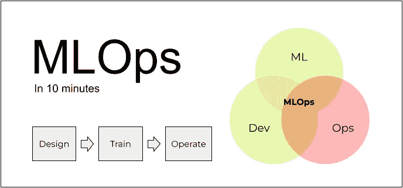

MLOps 是 ML 的 DevOps(图片由作者提供)。

一个常见的误解是，MLOps 仅仅是我们用来部署模型和准备基础设施的工具。部分是，但这不是全部——还有更多。在这篇文章中，我将把机器学习项目分成几个阶段，并解释 MLOps 如何在每个阶段提供帮助。

MLOps 是一个新的话题，对于它是什么或不是什么还没有一致的意见。在这篇文章中，我将分享我个人对此的看法。你不必同意它，但我希望它仍然有用。

所以我们开始吧！

# MLOps

MLOps 是一套将机器学习投入生产的实践。让我们看看它们是什么。

为了做到这一点，我们将从 ML 项目的典型过程的直升机视图开始。最简单的形式是，它包括 3 个阶段:

*   设计
*   火车
*   操作

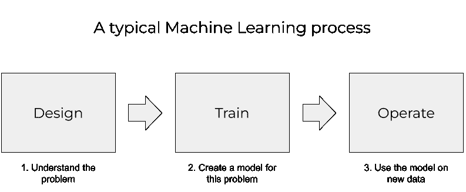

我们可以把一个 ML 项目分解为三个阶段:设计、培训、运营(图片由作者提供)。

它从设计阶段开始:我们理解问题是什么，并决定 ML 是否是正确的解决方案。

如果我们认为我们需要 ML，我们训练模型。这是火车状态。

准备就绪后，我们需要定期将模型应用于新数据。这是操作阶段。

# 火车

在训练阶段，我们用不同的模型进行实验，并试图找到模型的最佳参数和特征集。

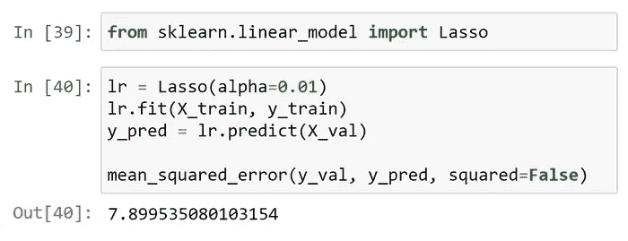

训练模型并寻找最佳参数(图片由作者提供)。

大多数数据科学家都是在 Jupyter 笔记本上做的。

做实验的典型流程是“改变一个参数→重新执行单元格→看看结果有没有提高”。在一些迭代器之后，它使笔记本变得一团糟:你不能容易地跟踪变化、参数和结果。此外，以后重现这些结果也变得非常重要。

两件事有助于我们处理这些问题:

*   实验跟踪
*   培训渠道

## 实验跟踪

在实验跟踪中，我们建立了保存每个实验结果的过程。每次我们试验一组新的参数，或者一个新的特性，我们都用一个试验跟踪工具记录参数和结果。稍后，我们可以使用它来查看哪些设置导致了最佳模型，以及不同的参数如何相互比较。

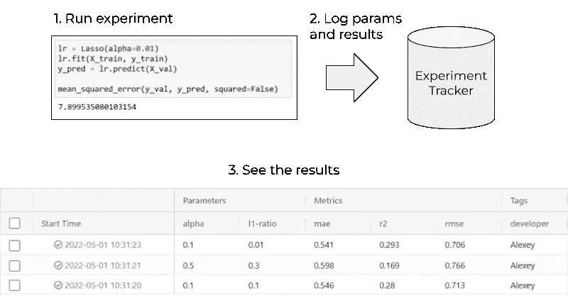

跟踪有助于在试验不同的特性、模型和参数时保持理智(图片由作者提供)。

跟踪实验的工具有很多。最受欢迎的是 [MLFlow](https://mlflow.org/) 。

## 培训渠道

实验跟踪并不能解决我们所有的训练问题。我们仍然有杂乱的 Jupyter 笔记本，其中的单元格需要按照特定的顺序执行才能得到最终的解决方案。

为了解决这个问题，我们将笔记本分解成一组一个接一个执行的构建块。我们将这种块的序列称为“机器学习流水线”。

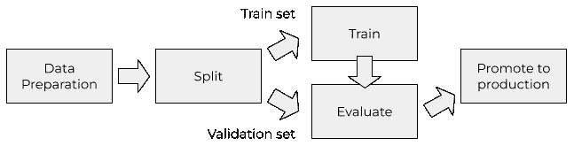

机器学习管道是需要按照特定顺序执行的一系列步骤(图片由作者提供)。

一旦我们将训练过程表示为一个管道，我们只需点击一下鼠标，就可以执行它并根据新数据重新训练模型。或者根本没有任何点击。

在实践中，您可以通过将笔记本转换成 Python 脚本，然后将其分解成几个函数来实现。对于更高级的管道，您可以使用通用的工作流编排工具，如 [Airflow](https://airflow.apache.org/) 。也有专门的面向 ML 的工具，如 [Kubeflow Pipelines](https://www.kubeflow.org/docs/components/pipelines/introduction/) 。

总之，在训练阶段，MLOps 有助于再现性和自动化模型训练和评估。

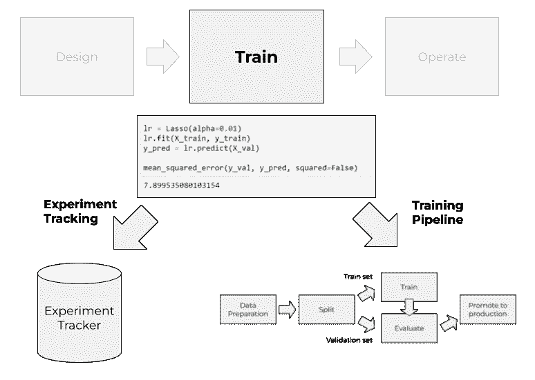

实验跟踪有助于自动化评估，培训管道有助于自动化培训(图片由作者提供)。

# 操作

ML 管道的输出是一个模型——通常是一个 pickle 文件。现在，我们需要采用该模型，并开始将其应用于新数据。

这个过程被称为模型部署。

## 部署

根据一个用例，我们可以用两种方式部署我们的模型:批处理和在线。

在批处理模式中，我们不需要立即对所有新数据做出反应。相反，我们定期分批处理数据。例如，我们可以每小时、每天或每周执行一次。

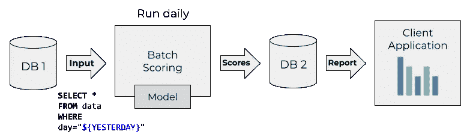

以批处理模式应用模型的一种典型方式是为昨天生成的数据运行它(图片由作者提供)。

我们也以批处理模式运行训练管道，这就是为什么批处理部署通常成为 ML 管道的扩展。我们通常只使用简单的 Python 脚本，这些脚本可以作为 Kubernetes 作业或 AWS 批处理作业来执行。或者有时我们可能会使用 Spark。

批处理模式是使用 ML 模型最常见的方式。对于很多情况来说，这很简单，也足够了。

与批处理相反，在在线模式下，我们需要在新数据出现时立即做出反应。它通常比批处理更复杂，因为模型服务需要始终启动和运行，随时准备处理新数据。

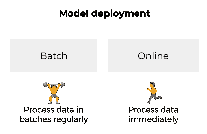

部署 ML 模型的两种方式:批处理和在线(图片由作者提供)。

我们可以进一步将在线案例分解为两种部署 ML 模型的方式:web 服务和流。

在第一个示例中，我们将模型部署为 web 服务。我们模型的用户发送带有特性的 HTTP 请求(通常以 JSON 格式)并获得预测。

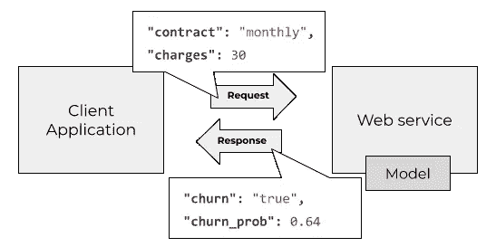

作为 web 服务部署的模型总是准备好用预测来响应(图片由作者提供)。

为了将模型部署为 web 服务，我们使用像 Flask 或 FastAPI 这样的库，并在 Kubernetes 或类似的系统上运行它们。也有更专业的面向 ML 的解决方案，如 [KServe](https://github.com/kserve/kserve) 。

在流的情况下，我们的模型成为事件流的消费者。

每当有新事件发生时，服务就会对其做出反应并应用该模型。预测被保存到另一个流中。我们的用户现在可以订阅输出流，并根据这些预测做出决策。

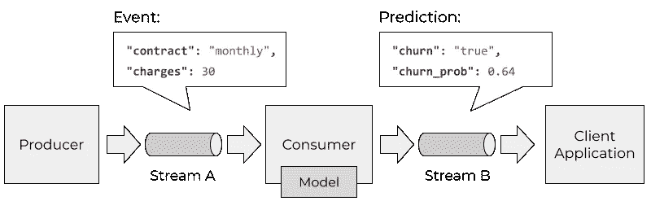

在流的情况下，服务之间的通信通过流进行。模型服务对一个流中的事件做出反应，并将预测放到另一个流中(图片由作者提供)。

通常，我们使用 Kafka 这样的消息代理进行流式传输，并作为 Kafka 消费者实现模型服务。除了卡夫卡，我们可以使用其他流媒体平台，如 Kinesis。

## 模型监控

模型部署后，我们的工作并没有结束。当它上线时，我们需要密切关注它，确保它保持正常运行。

首先，我们监控传统的 DevOps 指标:

*   CPU 单元化
*   记忆
*   网络使用
*   每秒的请求数
*   和其他人。

如果某个指标超过某个阈值，我们会向支持团队发送警报，支持团队会迅速对这些问题做出反应并修复它们。

但这还不够。我们还需要确保我们的模型的预测仍然是好的，并且模型不会变得陈旧。这就是为什么我们需要模型监控。

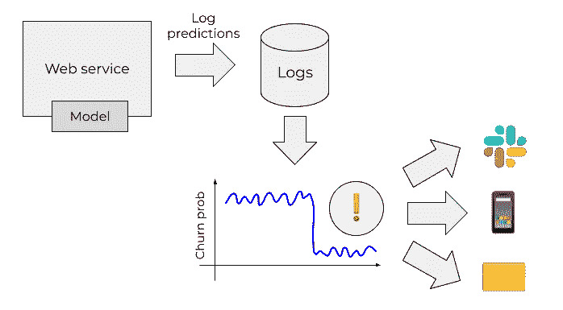

监控有助于我们发现模型行为的变化。[松弛图标来源](https://commons.wikimedia.org/wiki/File:Slack_icon_2019.svg)。

如果我们检测到性能下降，我们可以触发训练管道，并根据新数据对其进行重新训练。

总之，在操作阶段，MLOps 帮助我们部署模型并监控其性能。

在操作阶段，我们选择部署模型并关注它(图片由作者提供)。

# 人员、流程和最佳实践

到目前为止，我们讨论了培训和操作的实践和工具。这已经很好了，但还不够。

首先，我们需要确保我们了解我们想要解决的问题，并确保 ML 是正确的解决方案。我们需要有条不紊:从目标开始，提出一个基线，然后逐步改进。我们并不总是需要在 Kubeflow 中部署完整的培训管道，在 KServe 中部署模型和最先进的监控系统。相反，我们通常需要从简单开始，首先显示项目中的价值——然后迭代。

流程可以帮助我们做到这一点。有像 [CRISP-DM](https://mlbookcamp.com/article/crisp-dm) 、 [ML Canvas](https://www.ownml.co/machine-learning-canvas) 和 [MLOps Canvas](https://ml-ops.org/content/mlops-stack-canvas) 这样的工具和框架帮助我们一起工作并解决问题。

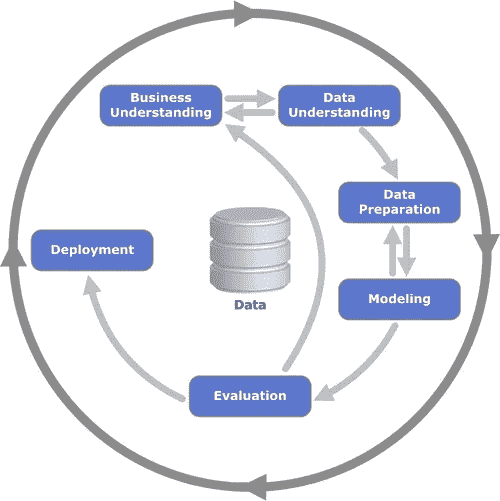

CRISP-DM 是运行 ML 项目的框架之一。它突出了 ML 的迭代性质:我们从简单开始，逐步改进([图片来源](https://commons.wikimedia.org/wiki/File:CRISP-DM_Process_Diagram.png))。

MLOps 是“数据科学的 DevOps”。这意味着所有 DevOps 实践仍然适用:

*   用单元测试和集成测试来测试我们的服务
*   自动化一切
*   CI/CD
*   使用模板快速入门(例如 cookie-cutter)和 makefiles
*   撰写全面的文档

过程和最佳实践都在项目的所有三个状态中帮助我们。

# 还有更多

在本文中，我们仅仅触及了表面。这里还有更多我没有涉及的概念:

*   功能商店
*   示范登记册
*   实验平台

可能更多。可以多看看他们，看看他们解决了哪些问题，属于哪个阶段(提示:有的可以属于多个)。

# 摘要

我们讨论了什么是 MLOps，并从直升机上观察了该过程。我们将流程分为三个阶段:设计、培训和运营。

对于这些阶段中的每一个，我们都看到了 MLOps 是如何帮助我们的:

*   流程帮助我们一起工作，并确保我们带来价值
*   实验跟踪帮助我们在尝试不同的模型参数时保持理智
*   训练管道使得只需几个命令就可以更容易地重现结果和重新训练模型
*   模型部署负责以最佳方式使用模型——无论是以批处理模式、作为 web 服务还是作为流的一部分
*   当模型过时，我们需要重新训练它时，模型监控会提醒我们
*   最佳工程实践保持我们的代码干净可靠

# 动物园营地

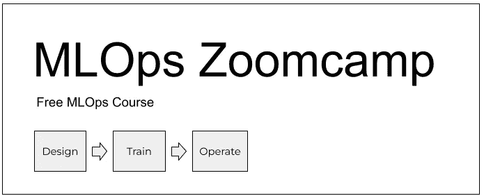

想要获得 MLOps 工具的实践经验吗？(图片由作者提供)

你对学习 MLOps 感兴趣吗？在数据会谈上。俱乐部我们推出了免费的在线课程。我们将涵盖这里讨论的所有主题，并教你如何在实践中应用所有这些概念。

更多信息请点击这里:【https://github.com/DataTalksClub/mlops-zoomcamp】T2。

球场上见！