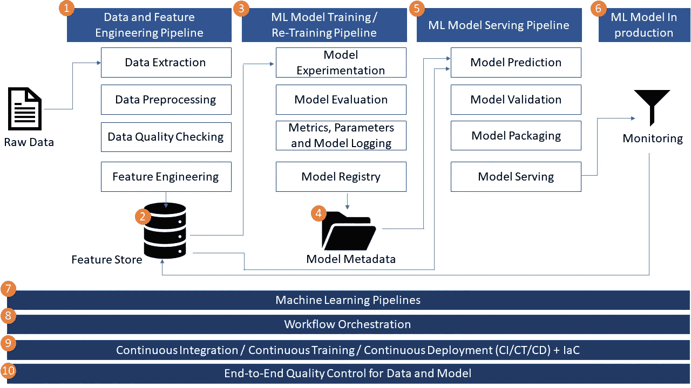

# 实践中的 MLOps 将 ML 解决方案架构分解为 10 个组件

> 原文：<https://towardsdatascience.com/mlops-in-practice-de-constructing-an-ml-solution-architecture-into-10-components-c55c88d8fc7a>

## 全面介绍端到端 ML 解决方案的 10 个关键组件

在我以前的博客中，我谈到了三个关键管道(1)数据和特征工程管道，(2) ML 模型训练和重新训练管道，(3) ML 模型推理和服务管道，以及构建可靠和可扩展的 MLOps 解决方案所需的底层基础设施。你可以在这里找到博客的详细信息:

*   [学习数据工程的核心——构建数据管道](https://medium.com/@weiyunna91/learn-the-core-of-data-engineering-building-data-pipelines-21a4be265cc0?source=friends_link&sk=a15ca2e70b29b46a33adc695a341349e)
*   [了解 MLOps 的核心——构建机器学习(ML)管道](/learn-the-core-of-mlops-building-machine-learning-ml-pipelines-7242b77520b7?source=friends_link&sk=0a3006eed886f1071082ac1b5a485785)
*   [m lops 最基础的一层—所需的基础设施](/the-most-fundamental-layer-of-mlops-required-infrastructure-bafd111db4c3?source=friends_link&sk=5cafc4801563fea80380a4ff89fcfc7d)

从这篇博客开始，我将重点解释端到端 MLOps 解决方案的详细实现，为您提供一个实用的剧本，供您在为您的组织设计和实现 ML 驱动的系统时参考。本实施手册包括一个普遍适用的 ML 解决方案架构，对每个关键架构组件的深入研究，以及生产 ML 驱动系统的最佳实践。

让我们从解释一般适用的 ML 解决方案架构看起来像什么开始。

迈克·科诺诺夫在 [Unsplash](https://unsplash.com?utm_source=medium&utm_medium=referral) 上的照片

## 普遍适用的 ML 解决方案架构

ML 解决方案架构描述了一个解决方案在高层应该是什么样子的蓝图，以及为了构建一个可伸缩的和可靠的 ML 驱动的系统所需要的关键组件。当我说一个普遍适用的 ML 解决方案架构时，我的意思是这个架构可以应用于大多数 ML 驱动的系统或用例。从 ML 生命周期的角度来看，这种通用架构涵盖了关键的 ML 阶段，从开发 ML 模型，到部署培训系统和服务系统，再到生产。您可能需要定制其中的一些，但是总体工作流程应该大致相同。

下图描述了端到端 MLOps 解决方案的关键架构组件。总共有 10 个关键组件，下面是每个组件的概要。

普遍适用的解决方案体系结构的 10 个组件|作者图片

1.  数据和特征工程管道——在解决方案要求的时间内交付高质量的数据，并以可扩展和灵活的方式产生有用的 ML 特征。一般来说，数据管线可以与特征工程管线分开。数据管道是指提取、转换和加载(ETL)管道，其中数据工程师负责将数据传送到存储位置，例如建立在 S3 桶顶部的数据湖，特征工程管道可以从该处开始。特征工程管道专注于将原始数据转换为 ML 特征，这些特征可以帮助 ML 算法更快更准确地学习。特征工程通常包括两个阶段。在第一阶段，特征工程逻辑通常由数据科学家在开发阶段通过各种实验创建，以便找到最佳的特征套件，而数据工程师或 ML 工程师负责特征工程管道的生产，以便为模型训练和生产环境中的服务提供高质量的特征。
2.  特征存储-存储和版本管理的 ML 特征，用于发现、共享和重用，并为模型训练和服务提供一致的数据和 ML 特征，这提高了 ML 驱动的系统的可靠性。特征存储是用于保存由特征工程管道创建的 ML 特征的存储解决方案。特征存储支持模型训练和服务。因此，它是一个非常重要的部分，是端到端 ML 解决方案的重要架构组件。
3.  ML 模型训练和再训练管道-以简单和可配置的方式使用不同的参数和超参数进行 ML 训练实验，并使用丰富的参数和模型性能指标记录这些训练运行。自动评估、验证、选择性能最佳的模型并将其记录到 ML 模型库中。
4.  培训和模型 Metastore —存储和记录 ML 运行的工件，包括参数、指标、代码、笔记本、配置和培训模型的结果，并提供模型生命周期管理、模型注释、模型发现和模型重用等功能。对于一个全面的 ML 解决方案，可能会从数据中生成大量的元数据，并以工程、模型训练到模型服务为特征。所有这些元数据对于获得系统如何工作的更多可见性非常有用，提供了从数据->特性->模型->服务端点的可追溯性，以及当模型停止工作时用于调试的有用信息。
5.  ML 模型服务管道—根据服务吞吐量和延迟，为在生产环境中使用 ML 模型提供适当的基础设施。一般来说，有 3 种类型的模型服务——批量服务、流服务和在线服务。每种服务类型需要完全不同的基础设施。此外，基础设施应该是容错的和可自动扩展的，以响应请求和吞吐量波动，特别是对于业务关键的 ML 驱动的系统。
6.  监控生产中的 ML 模型——当检测到数据和模型漂移和异常时，提供数据收集、监控、分析、可视化和通知功能，并使用必要的信息协助系统调试。
7.  机器学习管道-与特定的 ML 工作流相比，ML 管道提供了一个可重用的框架，允许数据科学家更快地开发和迭代，同时保持高质量的代码并减少生产时间。一些 ML 管道框架也提供编排和基础设施抽象功能
8.  工作流程编排—集成端到端 ML 驱动系统的所有关键组件。编排和管理所有这些关键组件的依赖关系。工作流编排工具还提供日志记录、缓存、调试和重试等功能。
9.  持续集成/持续培训/持续部署(CI/CT/CD) —持续测试和集成代码更改，持续使用新数据培训新模型，并在需要时升级模型性能，以及以安全、敏捷和自动化的方式持续为生产环境提供服务并部署模型。
10.  数据和模型的端到端质量控制—在端到端 ML 工作流程的各个阶段嵌入强大的数据质量检查、模型质量检查、数据和概念漂移检测，以确保 ML 解决方案本身可靠可信。这些质量控制检查描述性统计数据、整体数据形状、缺失数据、重复数据、恒定(或几乎恒定)要素、统计测试、距离度量和模型预测质量。

## 摘要

这些是普遍适用的解决方案体系结构的 10 个组件。到目前为止，您应该对 ML 驱动的解决方案应该是什么样子有了一个高层次的理解。在以后的文章中，我将深入研究每个组件，并具体讨论:

*   每个组件的作用以及为什么这个组件是必需的
*   每个组件的关键设计考虑事项
*   可用于实施每个组件的工具、框架和服务

如果你想在这些文章发表时得到通知，请随时关注我。我一般每周都会发表 1-2 篇关于数据和 AI 的文章。

如果想看到更多围绕现代高效数据+AI 栈的指南、深度潜水、见解，请订阅我的免费简讯— [***高效数据+AI 栈***](https://yunnawei.substack.com/) ，谢谢！

注:以防万一你还没有成为一个媒体成员，你想获得无限制的媒体，你可以使用我的[推荐链接](https://medium.com/@weiyunna91/membership)注册！

非常感谢你的支持！