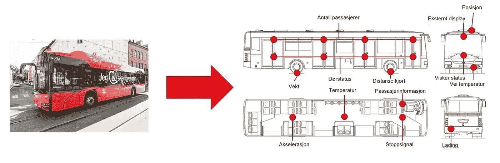
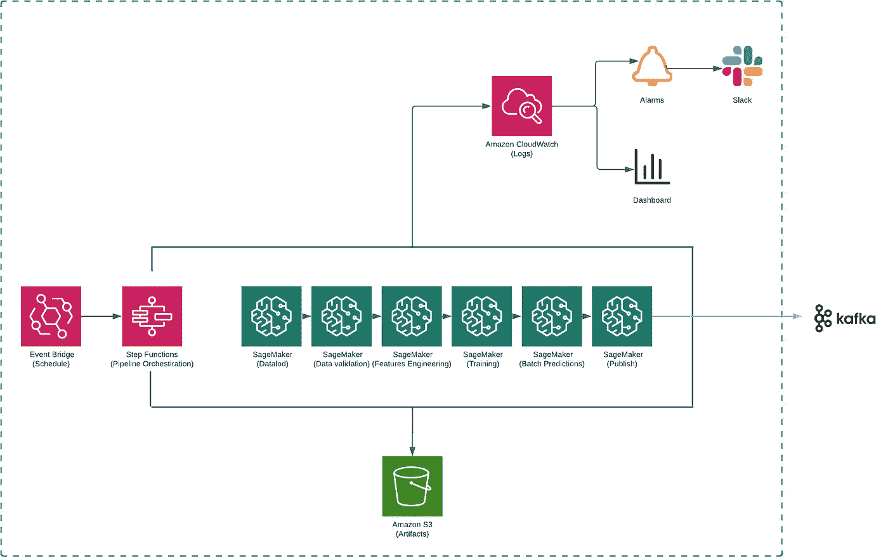
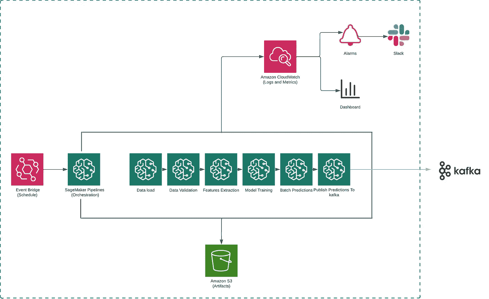
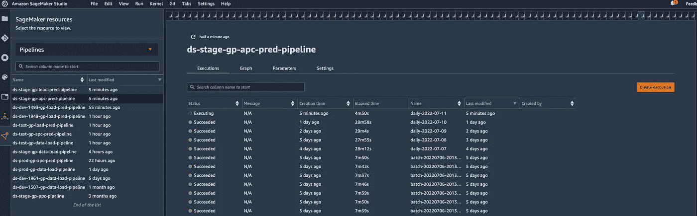
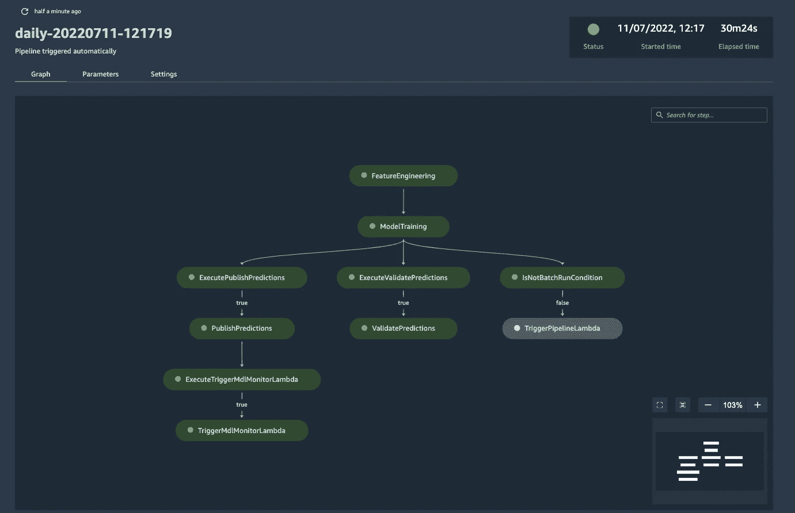
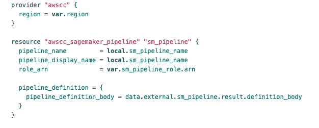
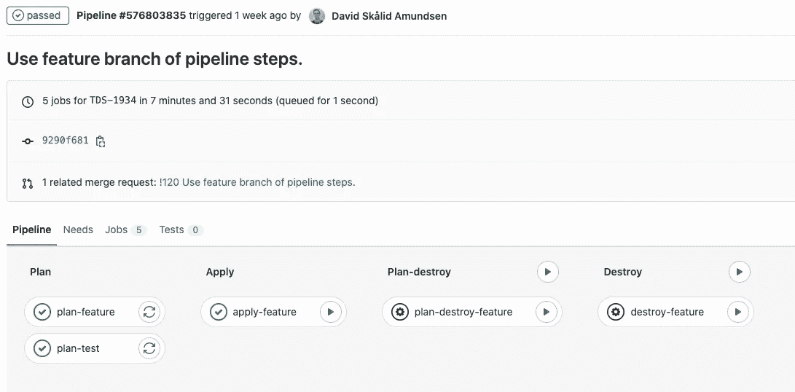
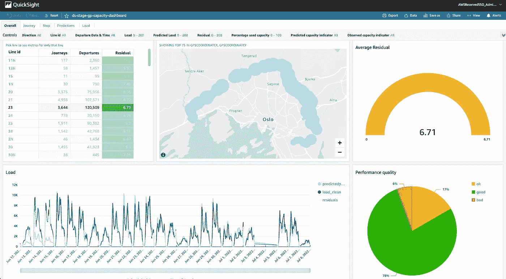

# 利用 AWS SageMaker、Terraform 和 GitLab 的 MLOps

> 原文：<https://towardsdatascience.com/mlops-leveraging-aws-sagemaker-terraform-and-gitlab-e7d97eaa6dce>

## 创建可扩展的、可重复的、健壮的和受到良好监控的机器学习管道

[阿特勒莫](https://unsplash.com/@atlemo?utm_source=unsplash&utm_medium=referral&utm_content=creditCopyText)在 [Unsplash](https://unsplash.com/s/photos/oslo-transportation?utm_source=unsplash&utm_medium=referral&utm_content=creditCopyText) 上拍照

*这个项目的目标是使用数据驱动的方法和机器学习来为 Ruter 的客户提供个性化和情境化的服务以及顺畅的旅行体验。我们希望我们的客户知道他们计划的旅程中车辆的载客量，以便他们能够根据我们提供的信息做出更明智的决定。*

Ruter 通过公共汽车、电车、地铁和船只在挪威奥斯陆和 Viken 地区提供公共交通服务。它每天服务约 50 万次出发，覆盖约 30 万公里，每天运送约 100 万名乘客。我们从公共汽车、电车和地铁上的物联网传感器收集原始数据。这些传感器持续报告不同类型的数据，包括上下车乘客的数量、车内/车外温度以及车辆的实时速度和位置。所有这些来自整个 Ruter 车队的实时流数据由内部开发的后端系统实时接收、处理和存储。

Ruter 的一辆电动公交车上的物联网传感器布局(图片由 Ruter 提供)

收集到的大量数据只讲述了故事的一半，即过去发生了什么。为了实现我们提供个性化和情境化服务以及顺畅旅行体验的目标，我们还必须能够告知顾客未来可能发生的事情。我们利用大数据、机器学习和人工智能来预测和预测这些未来事件。

Ruter 在多个领域使用人工智能，例如，预测容量，乘客数量和旅行模式。人工智能还用于处理客户查询，并为我们的按需服务优化交通路线。为了最大限度地利用人工智能，我们应该能够超越 PowerPoint 演示和可行性报告，必须能够迅速将想法转化为创造价值的应用。

# AWS —我们的应用和机器学习平台

我们使用 AWS 作为我们的公共云提供商以及应用和机器学习平台。我们利用卡夫卡和 EKS(Amazon**Elastic Kubernetes Service**)作为我们的实时系统，利用 S3、Glue、Athena 和 SageMaker 作为我们的历史、分析和人工智能用例。我们将深入研究后者。

据 [VentureBeat](https://venturebeat.com/ai/why-do-87-of-data-science-projects-never-make-it-into-production/) 报道，大约 87%的机器学习模型从未投入生产。许多成功的公司没有在生产中呆很长时间，因为他们不能足够快地适应变化的环境。这种限制的原因之一是缺乏一个健壮的机器学习(ml)平台。在 Ruter，我们投资了一个基于现代云(AWS)的机器学习平台，使我们能够以高质量的速度交付我们的 ml 模型。它围绕 MLOps 原则构建，使我们能够生产稳健、可扩展、可重复和受监控的 ml 管道。

在本文中，我们将讨论我们典型的机器学习管道是什么样子的。

# 使用 AWS 阶跃函数的机器学习流水线

Ruter 的机器学习团队负责其机器学习模型的端到端生命周期，从数据摄取到模型部署和推理，并通过 Kafka 将这些见解和预测提供给其他团队。我们遵循“我们建设它，我们运营它”的思维模式。因为我们是开发这些机器学习模型的人，所以我们知道应该如何监控和修复它们，以及应该如何衡量它们的性能。因此，我们最好自己操作和管理机器学习管道，而不是将它们交给外部 it 团队进行部署。这样我们可以避免添加多余的依赖项。

如前所述，我们使用 AWS 作为我们的机器学习平台。我们使用额外的工具来实现我们的 ml 管道:GitLab、Terraform、Python 和 GreatExpectations 等等。我们使用 GitLab 进行版本控制、开发和 CI/CD，使用 Terraform 实现基础设施即代码，使用 Python 定义管道定义，并对数据质量监控寄予厚望。

我们在 2021 年第一季度开始了我们的第一个机器学习管道。管道将剥离 AWS EC2(AWS 虚拟机)实例，用于模型训练、批量预测和在 Kafka 上发布这些预测。你可能已经注意到了，这条管道是最小的。它不可复制、不可扩展、不稳定或不受监控。我们需要比这更好的东西来提高速度，增加健壮性并增强开发人员的体验。在回到绘图板并经历了几次迭代之后，我们得出了如下所示的管道。

使用 AWS Step 函数的机器学习管道(图片由作者提供)

管道由以下部分组成。

**事件桥:** Amazon EventBridge 是一个无服务器的事件总线，它使得使用应用程序生成的事件来大规模构建事件驱动的应用程序变得更加容易。我们用它在特定的时间触发我们的 ml 管道。根据设定的时间，它启动一个λ。

**AWS Lambda:** AWS Lambda 是一种无服务器、事件驱动的计算服务，它通过自定义输入参数触发 AWS step 函数。

**AWS Step Functions:**AWS Step Functions 是一个低代码的工作流服务，我们用它来编排机器学习管道中的步骤。

**SageMaker 处理和培训作业:**我们使用 SageMaker 处理作业进行各种数据处理作业。例如，从 S3 和我们的数据仓库加载数据，数据清洗和特征提取，数据质量控制，批量推理和在 Kafka 上发布结果。我们使用 SageMaker 培训工作进行模型培训。

S3: 我们用 S3 来储存人工制品。在那里，我们存储了原始输入数据、提取的特征、数据质量结果以及报告和模型的快照。

# 迁移到 AWS SageMaker 管道

虽然 AWS Step Functions 是编排一般工作流和状态机的好工具，但我们发现它对于机器学习管道来说并不理想，因为

1.  AWS 步骤函数使用 Amazon Stage 语言实现。它是一种基于 JSON 的结构化语言，用于定义状态机。这意味着我们必须在我们的工具集中增加一种语言来实现和维护使用 AWS Step 函数的管道。由于 Amazon State Language 降低了用户的复杂性，它也降低了灵活性和控制力。
2.  AWS 阶跃函数对管道故障的处理是次优的。如果管道中的一个步骤失败了，您不能只是重新运行失败的步骤，并从您停止的地方开始。你必须重启整个管道。
3.  AWS step 函数不提供机器学习特定的功能，如实验跟踪、模型注册和开箱即用的端点。

我们将管道迁移至 SageMaker 管道，该管道提供了缺失的功能并解决了阶跃函数的限制:

1.  您可以用 Python 定义整个管道，这让数据科学家和 ML 工程师感到如鱼得水。
2.  如果管道中的某个步骤失败，您可以重试管道，它将从失败时停止的地方开始。
3.  SageMaker pipeline 提供了实验跟踪、模型注册和终端开箱即用等功能。

我们当前使用批处理推断的典型管道如下所示。

机器学习管道利用 SageMaker 管道，与 Slack、Kafka 和 S3 集成。(图片由作者提供)

这些管道中的每一步都使用 AWS CloudWatch 发出日志和指标，这是 AWS 的默认监控和可观察性服务。根据这些日志和指标，生成警报并转发给特定于项目的松弛通道。这确保了我们是第一个知道任何停机或故障的人。我们要么在下游用户注意到问题之前修复它，要么如果修复需要时间，我们可以提前通知他们。这些指标也显示在仪表板中(我们使用 Cloudwatch 和 DataDog)，这有助于我们有效地监控管道和调试问题。此外，每一步都配置了指数补偿和重试。如果一个步骤失败，它将重试可配置的次数，然后放弃并使整个管道失败。

使用 SageMaker 管道的另一个好处是 SageMaker 工作室。它提供了一个基于 web 的可视化界面，您可以在其中执行所有 ML 开发步骤，从而提高数据科学团队的工作效率。使用工作室，我们可以对我们所有的管道有一个概览。我们获得当前和所有以前执行的状态，以及它们的开始和运行时间。我们还可以找到管道参数、容器版本等。，用于每次执行。我们还可以重试失败的管道执行，开始新的执行或调查以前的运行。每个管道执行被锁定到用于训练和推断的数据的快照。利用 SageMaker 和数据快照，我们可以使用完全相同的数据、模型和参数重新运行之前执行的管道。

来自 SageMaker 工作室的片段(图片由作者提供)

管道的详细概述(图片由作者提供)

值得一提的是，尽管 SageMaker 提供了许多功能，但我们仍然清醒地使用 SageMaker 管道，只使用我们认为能够为我们的服务和用例增加价值的功能。从它提供的一整套功能来看，还有很多需要探索和尝试的地方。

# 与 Terraform 和 GitLab 集成

我们使用开源基础设施 Terraform 作为代码(IAC)工具，用于我们所有的云基础设施和管道实施。我们遵循标准的 DevOps 实践，Terraform 使我们能够在开发、测试、试运行和生产环境中拥有基础架构的精确副本。

不幸的是，AWS Terraform 提供商(截至 2022 年 8 月)没有 SageMaker 管道资源。为了避免这个问题，我们使用 AWSCC Terraform 提供者来部署我们的管道，它有一个 SageMaker 管道资源。

如上所述，我们使用 Python 定义管道，即 SageMaker 管道 Python SDK。我们创建一个带有管道定义的 Python 脚本，它在运行时以 JSON 的形式返回一个管道定义。这个脚本由 Terraform 通过外部数据源执行，返回的管道定义被发送到 AWSCC SageMaker 管道资源。这样，我们可以让我们的 SageMaker 管道由 Terraform 控制，同时允许我们使用 Python 编写管道定义。

(图片由作者提供)

我们使用 GitLab CI/CD 和 Terraform 来构建、更改和管理我们的基础设施和管道。我们以这样的方式设计设置，当开发人员创建一个新的开发分支时，GitLab CI/CD 会自动为该项目创建一个完全隔离的沙盒开发基础设施。然后，开发人员可以使用这个开发基础设施进行开发和实验，而不用担心资源或影响任何其他服务。一旦开发完成，dev 分支被合并到 test 分支(我们使用 test、stage 和 main 分支作为基础设施)，dev 基础设施及其所有的资源和数据都会被 GitLab CI/CD 销毁。这为我们的开发人员提供了以模块化方式工作所需的灵活性和速度，并降低了实验和尝试新想法的门槛。

使用 GitLab 的 CI/CD 和 Terraform 创建和删除开发基础设施。(图片由作者提供)

# 模型性能监控

到目前为止，一切顺利。我们完全控制我们的管道和工作流程。如果出现问题，无论是外部 API 故障、数据质量问题还是失败的作业，我们都有系统通过 Slack 频道和电子邮件立即通知我们。但是，一旦模型得到部署，并在野外，我们如何知道它是否产生高质量的预测和有价值的信息？

为了回答这个问题，我们使用了另一个 AWS 服务。我们使用 Amazon QuickSight 来支持我们的模型性能监控仪表板。这些仪表板显示由我们的 ml 模型产生的预测和基本事实(当它到达时)以及定制生成的指标，这有助于我们评估 ml 模型在实际运行中的性能。例如，使用这个仪表板，我们可以深入到单个出发，并检查模型是否预测了这些出发的正确机上乘客人数。我们还监控模型漂移，如果模型漂移超过定义的阈值，QuickSight 就会触发警报。由于这些仪表板的所有后端处理都是在 Terraform 中实现的，我们可以通过为我们的开发分支自动生成开发仪表板来执行 A/B 测试。这给我们的开发人员带来了很大的力量，他们可以进行多个实验，每个实验都有相关的仪表板来监控他们的 ml 模型在生产中的性能。

模型性能监控仪表板。(图片由作者提供)

# 未来计划和改进

我们对平台和渠道的现状相当满意，但仍有改进的空间。我们目前没有充分发挥 SageMaker 的潜力，我们认为仍有一些功能可以为我们现有的管道和工作流程增加价值。例如，我们希望更积极地使用 SageMaker 进行实验跟踪。我们想尝试的另一个功能是使用 [Amazon SageMaker 功能库](https://docs.aws.amazon.com/sagemaker/latest/dg/feature-store-getting-started.html)，这是一个完全托管的、专门构建的存储库，用于存储、共享和管理机器学习(ML)模型的功能。增强开发人员的体验(提高速度和降低复杂性)是我们未来开发和增强的主要焦点。

*我于 2020 年 6 月加入 Ruter，从那时起，我就在数据科学部门管理机器学习和数据工程团队。* *在大奥斯陆地区，我们尝试利用先进的统计学和 ML 结合现代数据堆栈来改善公共交通和客户体验。*

*感谢 David sklid Amundsen、Daniel Haugstvedt、Erlend Fauchald 和 Simen W Tofteberg 让这一切成为可能。*