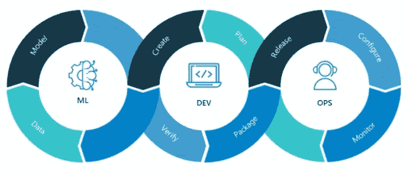
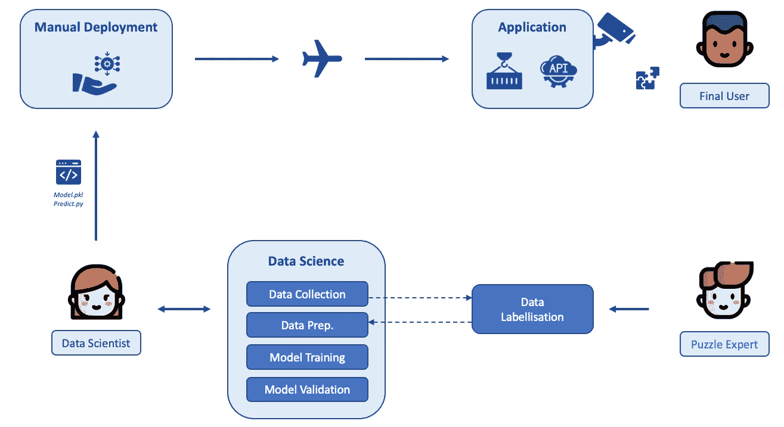
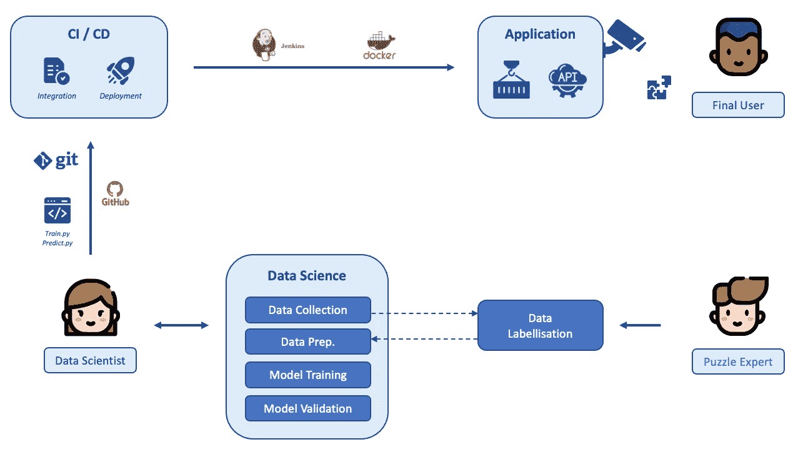
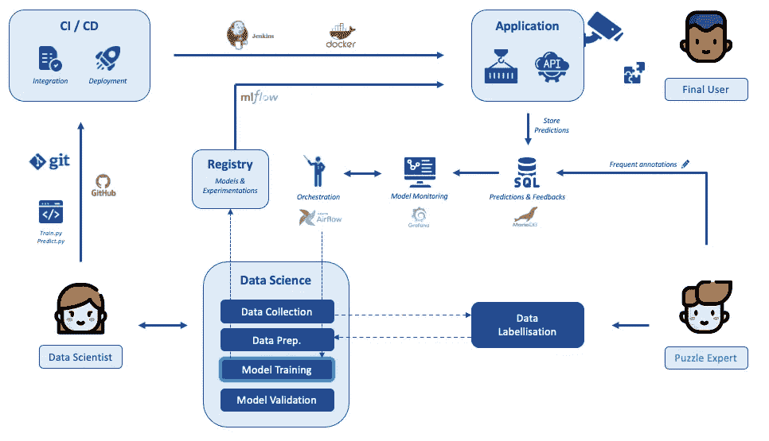

# MLOps 或如何大规模部署数据科学

> 原文：<https://towardsdatascience.com/mlops-or-how-to-deploy-data-science-at-scale-b33921b4f17f>

图 1 —由[戈汗·波拉特](https://unsplash.com/@go_pol)在 [Unsplash](https://unsplash.com/photos/qyC7DTbWJJk) 上拍摄的照片

## 在行业中扩展人工智能和人工智能

几年来，我们一直听到很多关于人工智能(AI)和机器学习(ML)的说法。这通常与数学和模型化有关。因此，由于数据的炒作，公司雇佣了如此多的数据科学家，导致了行业中无数的概念证明(POC)或最低可行产品(MVP)。

这些公司现在面临着一个新的挑战:如何将这些人工智能 POC 和 MVP 部署到生产中？最重要的是，如何以低成本高效地制造出**？**

由于 ML 实验涉及代码和数据，经典的 DevOps 达到了它的极限，MLOps 作为一种新的范例被引入。 **MLOps** 或许可以理解为“机器学习”、“开发”和“运营”之间的缩写。

在本帖中，我们将试着从三个方面来理解隐藏在这个词背后的需求和概念:

*   MLOps 动机—部署 PuzzleNet 的示例
*   MLOps 理论——主要概念
*   MLOps 成熟度级别—公司和项目的立场

# 1.MLOps 动机

你见过艾米丽吗？Emily 是一位出色的数据科学家！她处理数据，创建机器学习和深度学习模型！

图二——你见过艾米丽吗？

现在，艾米丽在亚特兰大 Puzzle&Co 的总部工作！她正在训练一个用于质量目的的分类模型:给定一条拼图生产线的图片，她必须找出生产质量低的图片！

由于工厂团队的合作，她设法收集了许多拼图中正确和错误部分的图片。因此，她可以训练一个有效的深度神经网络，她现在有一个很棒的模型在她的笔记本上运行: **PuzzleNet**

> 是时候投入生产了！

## 首次部署

Emily 将她的数据准备和评分笔记本保存为 python 文件，并将她的模型导出为 pickle。她把这些都存在她的 u 盘里。她去机场，乘飞机，飞往工厂所在地波特兰。

不出所料，当她到达时，摄像机已经在生产线上的正确位置，并且 Python 已经安装在与之相连的计算机上。精彩！她解压她的文件，保存在本地计算机上，做一些测试，然后…它工作了！太好了！

安装成功后，她飞回亚特兰大！

在接下来的一周，她收到了经理和工厂团队的祝贺，他们对预测的质量非常满意，并且有更多的时间专注于生产流程的另一部分。

图 3[克拉肯 images](https://unsplash.com/@krakenimages) 在 [Unsplash](https://unsplash.com/photos/376KN_ISplE) 拍摄的照片

## 两周后

既然模型的准确性已经被证明是真实的，Paul，工厂经理决定将质量预测应用到第二条生产线上，生产更大尺寸的婴儿拼图。你猜怎么着？这真是一场灾难！

他立即打电话给艾米丽:“嘿！我们在我们的第二条生产线上试用了你们的型号，但是根本不能用！我给你发了一组图片，请你**重新培训你的模型并重新部署**？”

经过几天的努力工作，Emily 在她的新数据上获得了正确的结果！她重新压缩它，把它放在她的 u 盘上，带上飞机，安装她的模型，它就可以正常工作了！

她回到家，在飞机上她想着**这个小小的改变有多痛苦**！

图 4—Elisa Ventur 在 [Unsplash](https://unsplash.com/photos/bmJAXAz6ads) 上拍摄的照片

> “这是多么讲究和复杂啊！”—艾米莉

# 2.MLOps 理论

艾米丽的情况有点夸张，但也不算夸张。在现实中，将机器学习模型投入生产需要许多技能。幸运的是，在过去的几年中，这些已经被理论化，许多公司正在创造工具来缓解这一痛苦的步骤。

## 什么是 MLOps？

我们可以找到不同的定义，但我绝对喜欢维基百科的措辞:

> “MLOps 是一套工具和实践，旨在可靠有效地在生产中部署和维护机器学习模型”。

AWS 将其定义为随着时间的推移不断进化人工智能模型的迭代和重复过程。我也认为非常准确。

当谈到数据科学的可操作性时，有 3 个组件需要考虑和关注:

*   **代码**:不考虑数据科学部分，任何代码都需要测试，版本&打包。因为我们是用 Python 工作的，所以我们必须处理这个问题。
*   **数据**:数据的质量可能会随时间而变化。然后，有必要确保数据源不被延迟，以不同的容量或格式。数据质量评估非常重要。
*   **模型**:处理数据的方式必须非常谨慎地定义，不能有有偏差的模型。一旦经过训练，预测的质量可能会随着时间的推移而变化。

当你想要实现一个 ML 项目时，你将不得不并行地管理这 3 个组件。正如在介绍中提到的，MLOps 可以被认为是 DevOps 到 ML 的扩展。

图 5 —来自 [Nvidia 博客](https://blogs.nvidia.com/blog/2020/09/03/what-is-mlops/)的 MLOps/DevOps 方案

目的是在合理的上市时间内将**可靠的代码、数据和模型**部署到产品中。

在生产过程中，关于数据处理的不同阶段，必须考虑许多因素。除其他事项外，我们还将关注:

*   **数据**:它是 ML 流程的核心。为了进行准确的预测，数据必须是高质量的、可用的和持续的。如何确保这一点？
*   **培训**:如何连接数据流？如何训练、验证和存储模型以便进一步重用？如何记住哪个模型是用哪个代码和哪个数据集创建的？
*   **预测**:你会批量给你的数据打分还是把你的模型公开为 API？您将如何运行该服务，并让具有适当需求的适当人员可以使用该服务？
*   **评价**:你的数据或者你的预测有漂移吗？你如何发现它？
*   **编排**:如何处理这些不同的服务？如何考虑到可能随时间发生的变化？
*   **本地基础设施**:如何确保环境保持稳定？它涉及与建模没有直接关系但与环境相关的一切。例如照相机、生产线、服务器、路由器等。

所有这些因素都是至关重要的，必须在 ML 项目的一开始就考虑到。

的确，如果一个完美的模型不能在现实生活中被真实的用户部署和使用，那么创建它还有什么意义呢？

# 3.MLOps 到期

在一个机器学习项目的开始，我们做手工。这是探索阶段。模型在笔记本中进行本地训练和验证。然后是部署阶段。

我们可以根据 3 个成熟度级别划分项目或公司，如下所述:

*   **初学者**， *ML 无操作*:一切都是手动管理。产品在生产，但每一步都很痛苦。这是 Emily 与 PuzzleNet 的案例。
*   **中级**， *ML OOops* :已经有了意识，正在努力。代码被打包。数据访问和模型训练是自动化的。它们可以通过 CI/CD 链跨多个环境部署。部署方法更加健壮。
*   **高级**、 *ML op-Bo-ss* : MLOps 大佬。随着时间的推移，对数据和预测进行评估，从而发出警报并开始自动重新训练。这被称为连续训练(CT)。最后，对模型进行比较，选择最佳模型进行部署。

## 成熟度等级 1/3: ML 无操作🐣

当艾米丽开始为 Puzzle&Co .工作时，她首先收集数据。经过短暂的探索，她很快联系了一位商业专家。他向她解释如何找出有瑕疵的部分，并给一些图片贴上标签。然后她能够准备数据——经过几周的工作——并创造出第一个成功的模型。这几乎是数据科学家的工作。然后，她带着她的 u 盘飞去部署她的模型。

图 6 —成熟度等级 1(作者图片)

**优点:**她的模型在生产中运行，最终用户可以用它来改进拼图的生产！

**缺点:**使一个新版本可用的时间非常高。由于服务器的配置与她的不同，她经常遇到部署困难。

## 成熟度等级 2/3: ML OOops🐒

缩短 ML 产品上市时间的第一步是**认知**。当你对自己说:“哦，妈的，我得给自己找个更好的解决方案”的时候。

首先，有必要从 DevOps 标准开始。使用代码**版本控制工具** (git)和安装 **CI/CD** (持续集成&持续部署)。管道。通过使用这样的服务，可以随时监控代码中的修改、数据准备和建模步骤。

图 7 —成熟度等级 2(作者图片)

创建**单元测试**和**集成测试**也是重要的一步。尽管这是软件工程中的标准，但在数据科学项目中，这种类型的实践仍然很少遵循。为了保证适当的质量，可以使用 linter 或代码覆盖率等指标。如果测试没有通过验证，或者代码质量不够好，应用程序的构建将被阻止，报告将被发送给数据科学家。

为了方便应用程序的部署，推荐使用容器化解决方案，比如 docker。这将允许复制模型运行的环境，从而方便在新机器上的安装，以及随后在工厂的服务器上的安装。

**优势:**在这个成熟度级别，数据科学家已经集成了 DevOps 部署的最佳实践。代码被打包，进化更加健壮，部署可以远程自动化。**上市时间大大缩短。**

**缺点** : 然而，一些至关重要的砖块还是不见了。例如，在这里，Emily 能够以自动化的方式部署 PuzzleNet，但是对她的模型的性能没有反馈。她不可能评价它的可靠性。在漂移的情况下，只有当用户发现预测毫无意义时，她才会被警告。

## 成熟度等级 3/3: ML op-Bo-ss🦁

既然 Emily 能够在眨眼之间重新部署新模型，她想知道应该多长时间重新训练一次。的确，虽然"*我如何部署？*“问题解决了，首要问题依然存在:

> 随着时间的推移，我如何保持我的模型的性能？

她越想越是告诉自己，在度假的时候，一切自己管理自己，还有很长的路要走！

思考的下一个重要步骤如下:

*   如何测量模型的漂移？
*   如何提高我的模型的性能？或者至少如何确保不会变得更糟？
*   我如何自动化这种监控？
*   在新模型性能不佳的情况下，如何确保回滚？

图 8 —成熟度等级 3(作者图片)

> **1。监控**

这是关于超越预测:我们现在将保留预测的历史，以便能够用实际发生的真实值来评估预测。

在受监督的项目中，这个过程可以自动化，而不会带来业务复杂性。在无人监管的项目环境中，经常会要求应用程序的用户或业务专家不时地进行标记。这就是反馈概念发挥作用的地方。

在任何情况下，预测、实际值和反馈都可以存储在数据库中，并允许使用评分标准来评估模型性能。这被称为**可观察性**。

> 2.**连续训练**

为了完全专注于她的下一个项目，Emily 使用她所掌握的所有信息来触发**自动再训练**。这些可以由不同的触发器触发:

*   模型退化。如果性能下降，请使用最新的信息来重新训练模型。
*   一个时间段。每周或每月的新数据。
*   大量新数据。每 5GB 的数据，或者业务专家的每 1000 个注释。
*   任何外部事件。

当重新训练自动进行时，Emily 还需要对她的输入数据(图像大小、像素颜色分布)进行自动质量和合规性测试。

但是，如果一些数据在短时间内遭到破坏，并且新模型的性能不如以前的模型，会发生什么情况呢？最后一步是**模型追溯和回滚**！

> **3。模型注册表**

与我们在 git 中发布代码的方式一样，我们希望在训练模型时跟踪模型及其元数据。诸如相应代码的提交、训练数据集的元数据或输出度量之类的信息都是允许您做出明智选择并对训练过程的自动化有信心的信息。

例如，比较评估指标将允许自动决定该模型是否应该替换先前的模型。很有可能想象一个保持不变的评分 API，其后端模型会随着数据的发展而改变为更好的版本。

**优点:**结果是良性循环，可观察性高，几乎自主行动。艾米丽将可以去享受阳光假期，而不用再担心她的模特☀️了

## 关于成熟度级别

当然，那些实践只是指导方针，应该适应你的成熟度和你的项目。

*   如果您处于第 1 级，从版本控制和设置 CI/CD 和单元测试管道开始。想要从第一级快速升到第三级不会带来任何好处
*   这也取决于项目:注意不要设置在不满足项目需求的情况下使项目更加复杂的工具。如果每月一次批量处理，就没有必要部署过于高级的监控。始终对好的实践保持批判的眼光，只保留你需要的。

> **“吸收有用的，拒绝无用的，加入本质上属于自己的”——李小龙**

# 结论

MLOps 是一套工具和实践，旨在尽可能快地将代码、数据和模型变更引入生产。它继承了其老大哥 DevOps 的概念，构建了人工智能产品特性的集成，如模型性能进化和持续培训。

在数据科学的后 POC 时代，MLOps 正在发挥关键作用，许多公司都对它感兴趣。这些公司仍然有不同的成熟度级别，从在生产服务器上以 pickle 格式存放模型到监控、自动化和自主的再培训。

特斯拉人工智能高级总监安德烈·卡帕西(Andrej Karpathy)谈到了“度假行动”(Operation Vacation):如果他的所有数据科学家都去度假，人工智能系统就会不断自我完善。这有点极端，但我们可以把这种理想视为一种趋势。

# 资源

*   MLOps [Youtube 视频](https://www.youtube.com/watch?v=9sdWh6T6t-8)由 [Aurélien Massiot](https://medium.com/u/1566b89045d?source=post_page-----b33921b4f17f--------------------------------) 、 [Pierre Baonla Bassom](https://medium.com/u/f7f35cf69e84?source=post_page-----b33921b4f17f--------------------------------) 和[来自](https://medium.com/u/c42105bc8b36?source=post_page-----b33921b4f17f--------------------------------) [Octo Technology](https://www.octo.com/) 的 Baptiste Saintot (法属🇫🇷)
*   关于[在特斯拉的运营假期](https://seekingalpha.com/article/4305856-tesla-operation-vacation)

> *如果你喜欢这篇文章并想了解更多，你可以在* [*中*](https://medium.etomal.com/) *关注我，成为* [*会员*](https://medium.etomal.com/membership) *，在*[*LinkedIn*](https://www.linkedin.com/in/thibaud-lamothe/)*上与我联系，或者访问我的* [*网站*](https://etomal.com/) *。*

> 希望你喜欢它，再见🤠