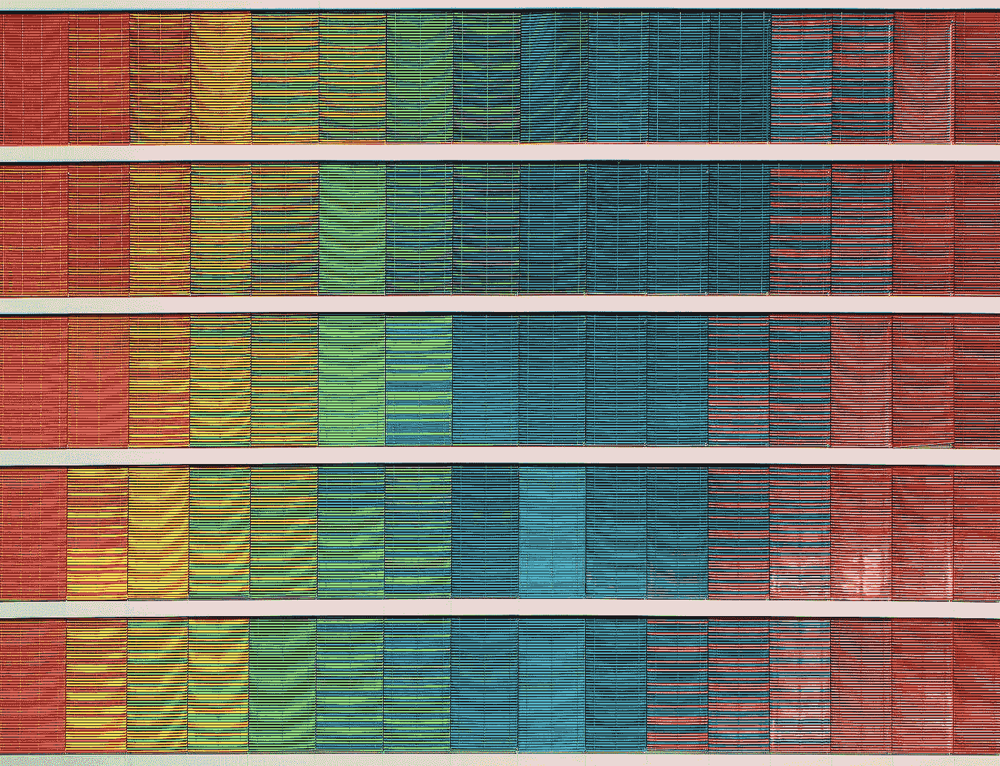
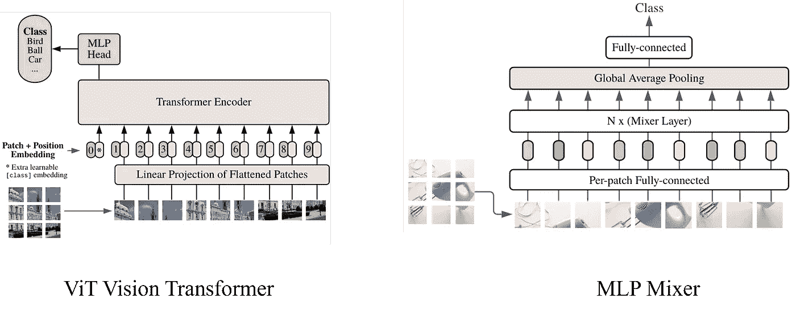
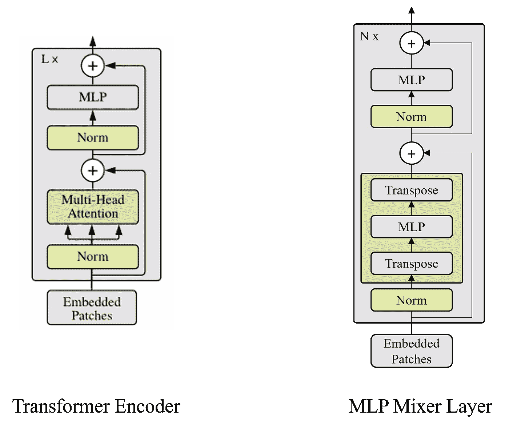
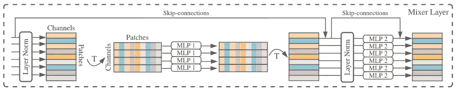
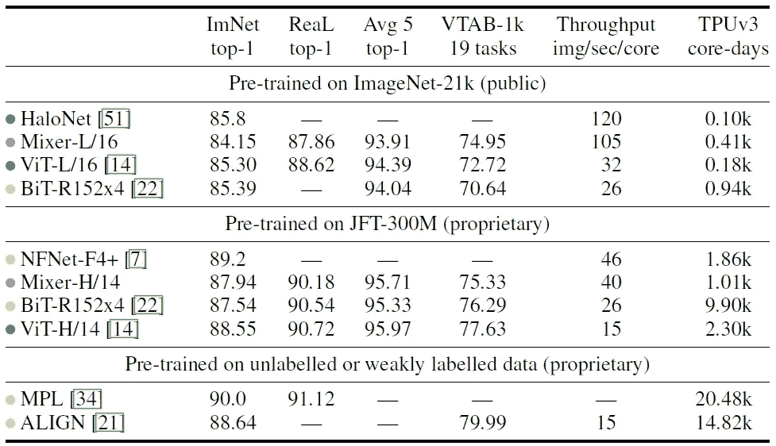

# 简而言之，MLP 搅拌机

> 原文：<https://towardsdatascience.com/mlp-mixer-in-a-nutshell-eccffb68e4fc>

## 视觉变压器的资源节约和性能竞争替代方案

里卡多·戈麦斯·安吉尔在 [Unsplash](https://unsplash.com?utm_source=medium&utm_medium=referral) 上的照片

T 他的文章旨在对 I .托尔斯泰欣、n .霍尔斯比、a .科列斯尼科夫、l .拜尔等人的论文 *MLP 混频器:一个全 MLP 架构的愿景*中介绍的 MLP 混频器进行简要概述[【1】](#4bce)。此外，我想根据我的经验提供一些进一步的背景知识，以便快速理解 MLP 混频器的主要特性。

# 概述

1.  [简介](#7b75)
2.  [MLP 混频器的动机及其贡献](#033b)
3.  [MLP 混频器架构及其与之前型号的比较](#81a8)
4.  [实验](#0b1a)
5.  [结论](#b9a7)

# 介绍

由 *Vaswani 等人*在论文*“注意力是你所需要的一切】*[【2】](#3004)中引入的 transformer 架构已经彻底改变了机器学习领域。虽然它最初应用于 NLP(自然语言处理)任务，如将句子从英语翻译成德语，但它的架构很快被其他学科采用和改编，如计算机视觉，产生了 ViT(视觉转换器)[【3】](#d6c9)等模型。其中，变换器的主要优势是(1)其通过注意机制捕获全局上下文的能力，(2)其用于训练的高并行化能力，以及(3)与例如旨在复制人类感知图像的行为的卷积神经元网络相比，它是具有较少归纳偏差的更一般化的操作。

在我们深入 MLP 混合器之前，让我们首先通过回顾变压器的弱点来理解新架构的动机。然后让我们总结一下 MLP 密炼机论文的贡献，最后换个话题来回顾一下 MLP 密炼机。

# MLP 混频器的动机及其贡献

不管 transformer 架构的强度及其变化如何，有一个主要问题:计算和内存需求与输入序列长度成二次方关系。换句话说，在 NLP 问题中，词汇表中的单词越多，或者计算机视觉中图像的分辨率越大，就需要更多的资源来训练和部署模型。这种约束是注意机制的结果，其中一个集合(或序列)中的每个元素都注意第二个集合中的其他元素，而第二个集合可能与初始集合相同。

MLP 混合器通过替换注意力机制来解决这个问题。根据[【1】](#4bce)，MLP 混频器的主要贡献是:

*   在 ViT 中引入一种有竞争力的(但不是更好的)简单架构，它不使用卷积或自我关注，而只使用多层感知器(MLP)。
*   仅依赖于基本的矩阵乘法、整形和转置以及标量非线性。
*   计算复杂度与输入面片数量的线性比例关系(与 ViT 不同，ViT 是二次比例关系)
*   位置嵌入的去除

# MLP 混频器架构及其与以前模型的比较

在本节中，我们将讨论 MLP 混频器的模型架构，并将其与以前的模型进行比较。我们从高层架构开始，逐渐揭示细节。

正如论文的标题所示，MLP 混合器是一个视觉模型的架构。这是一个高层次的观点，非常类似于 ViT 模型，如图 1 所示。

图 1:(左)视觉变换器[【3】](#d6c9)和(右)MLP 混频器[【1】](#4bce)的高层架构对比。

ViT 和 MLP 混合器都是分类网络。他们输入一幅图像，输出一个类别概率。在高层次上，两个模型都将图像块线性投影到嵌入空间中。当 ViT 用步进卷积执行这个步骤时，MLP 混合器使用全连接层，因为它的目标之一是表明既不需要卷积也不需要注意层。嵌入，也称为令牌，在两个模型中都被输入到它们各自的主构建块中进行计算。就 ViT 而言，它基于 transformer 编码器层，而 MLP 混频器引入了一种新的架构，我们将在稍后详述。值得注意的是，MLP 混合器不需要额外的位置嵌入，因为它对输入嵌入的顺序很敏感，这与注意力层不同。在几个主要的计算层之后，信号被馈送到分类头，在那里模型预测给定输入图像的类别。

现在，让我们仔细看看图 2 中描绘的主要构建模块。

图 2:ViT[【3】](#d6c9)(左)和 MLP 混频器层(右)的变压器编码器模块对比。作者插图，灵感来自[【2】](#3004)。

左侧描述了 ViT 中使用的变压器编码器，右侧说明了由[【1】](#4bce)提出的 MLP 混频器层。两层都重复几次(分别是 L 次或 N 次),并且它们遵循各向同性设计，这意味着其输入和输出具有相同的形状。在这个抽象层次上，唯一的区别在于注意力机制。ViT 依赖于多头自我注意机制，这需要三个线性投影嵌入；键、值和查询。这一层为查询的每个值分配一个重要性因子给关键字的每个值，反之亦然，从而产生一个注意力图。注意力图捕捉嵌入的全局依赖性，而不像卷积那样只考虑局部邻域(全局上下文通常由几个卷积层捕捉，这通常会减小空间宽度并增加通道的数量)。然后，注意力图乘以嵌入的值，以加强重要的值，而不重要的值被抑制。另一方面，MLP 混合器通过封装在两个矩阵转置操作之间的 MLP 块来取代自我注意机制，以捕捉全局上下文。为了理解这是如何工作的，我们进一步深入图 3 所示的混合器层的详细架构。

图 3:MLP 混频器[【1】](#4bce)的混频器层。

这种架构是建立在[【1】](#4bce)作者的简单观察之上的:现代视觉架构混合了它们的特性 **(1)在给定的空间位置跨越通道**和 **(2)在不同的空间位置**。CNN 在一层内实现(1 ),但通常通过连续的卷积层实现(2 ),卷积层通过应用越来越多的滤波器来减小空间宽度并增加频道数量。基于注意力的架构在每一层中都允许(1)和(2)。MLP 混合器的目的是清楚地区分(1)和(2 ),作者分别称之为信道混合和令牌混合。

首先，我们考虑由第一 MLP，即 MLP1 执行的令牌混合。MLP1 将作用于输入矩阵的每一行，利用权重共享。在第一标准化层之后，数据以[通道，面片]形式的矩阵表示。通道(或嵌入的隐藏维度)是一个可以变化的超参数。补丁指的是输入图像被分成的补丁的数量。为了混合来自每个标记化面片的数据，在将 MLP1 应用于每一行之前，对输入进行转置。MLP1 的输出再次被转置，以获得其初始形式。通过将每个斑块的信息输入 MLP，可以感知全球背景。

第二 MLP，即 MLP2，执行信道混合。MLP2 的权重不同于 MLP1，但也使用权重共享。MLP2 从单个补丁的所有通道接收数据，允许来自每个通道的信息彼此交互。

每个 MLP 块由一个完全连接的层组成，接着是一个 GELU 激活，接着是另一个完全连接的层。

# 实验

一个重要的问题还没有答案:*它的实际表现如何？*回答问题。[【1】](#4bce)的作者对不同规模和不同数据集的模型进行了多次实验。要了解更多的细节，我建议你阅读报纸。我只讲主要结果。

为了进行实验，首先在不同的数据集上对几个模型进行预训练，然后在不同的下游任务上进行微调。已经分析了三个参数:

1.  下游任务的准确性
2.  预培训的总计算成本
3.  测试时吞吐量

表 1 显示了主要结果，并对各列进行了如下解释:

**第 1 列**:测试模型
**第 2 列**:带有原始标签的 ImageNet 下游任务的前 1 名准确率
**第 3 列**:带有已清理真实标签的 ImageNet 下游任务的前 1 名准确率
**第 4 列**:所有五个下游任务(ImageNet、CIFAR-10、CIFAR-100、Pets、Flowers)的平均性能的前 1 名准确率。
**第 5 列**:视觉任务适配基准
**第 6 列**:TPU-v3
**上的图像/秒/核吞吐量第 7 列**:TPU-v3 加速器上的预训练总时间

表 1:与来自文献[【1】](#4bce)的最新模型相比，MLP 混合器的传输性能、推理吞吐量和训练成本。

就精度而言，混合器模型在所有执行的下游任务中与所有其他测试模型具有竞争力。就测试期间的吞吐量而言，混频器优于 ViT 和 BiT。

可以观察到，MLP 混合器在大型 JFT-300M (300M 图像，18k 类)数据集上的预训练时间明显优于其竞争对手，而对于较小的 ImageNet-21k (14M 图像，21k 类)数据集，其训练实际上比其竞争对手的模型更慢。

似乎特别是对于大型数据集，MLP 混合器是其他最先进模型的有竞争力的替代方案，因为它几乎达到了最先进(SOTA)的性能，同时在训练和测试期间更有效。人们必须决定在各自的应用中哪种度量更重要。

# 结论

MLP 混合器通过引入由 MLPs 和转置组成的简化架构来解决注意力层的计算资源的二次缩放问题。它实现了接近 SOTA 的性能，同时降低了对计算资源的需求。这是一种权衡，对于给定的应用程序必须做出决定。

[1]托尔斯泰欣，伊利亚，尼尔·霍尔斯比，亚历山大·科列斯尼科夫，卢卡斯·拜尔，翟晓华，托马斯·安特辛纳，杰西卡·容等.《混音器:一个全的建筑视觉》*ArXiv:2105.01601【Cs】*，2021 年 6 月 11 日。http://arxiv.org/abs/2105.01601[。](http://arxiv.org/abs/2105.01601)

[2] Vaswani、Ashish、Noam Shazeer、Niki Parmar、Jakob Uszkoreit、Llion Jones、Aidan N. Gomez、Lukasz Kaiser 和 Illia Polosukhin。“你需要的只是关注。”*ArXiv:1706.03762【Cs】*，2017 年 12 月 5 日。[http://arxiv.org/abs/1706.03762](http://arxiv.org/abs/1706.03762)。

[3] Dosovitskiy，Alexey，Lucas Beyer，Alexander，Dirk Weissenborn，Xiaohua Zhai，Thomas Unterthiner，Mostafa Dehghani，等人《一幅图像抵得上 16x16 个字:大规模图像识别的变形金刚》*ArXiv:2010.11929【Cs】*，2021 年 6 月 3 日。[http://arxiv.org/abs/2010.11929](http://arxiv.org/abs/2010.11929)。