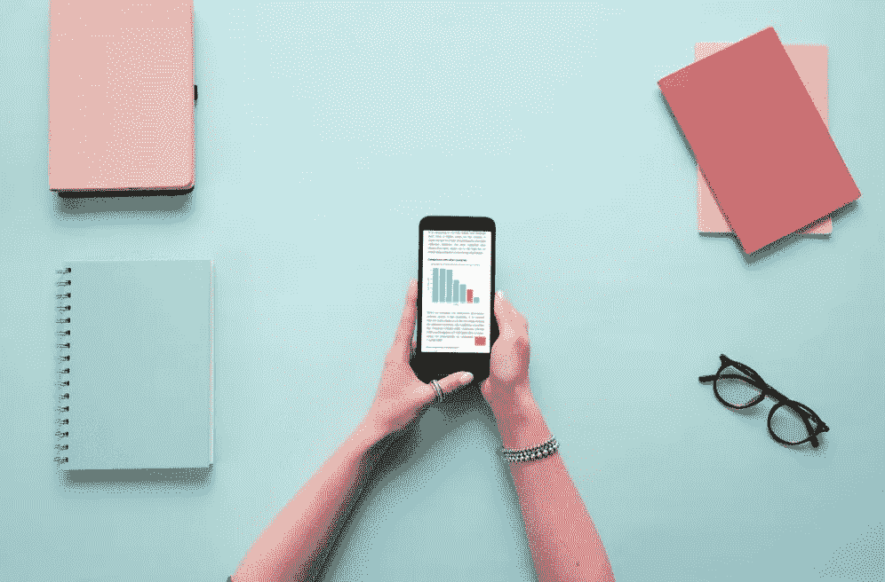
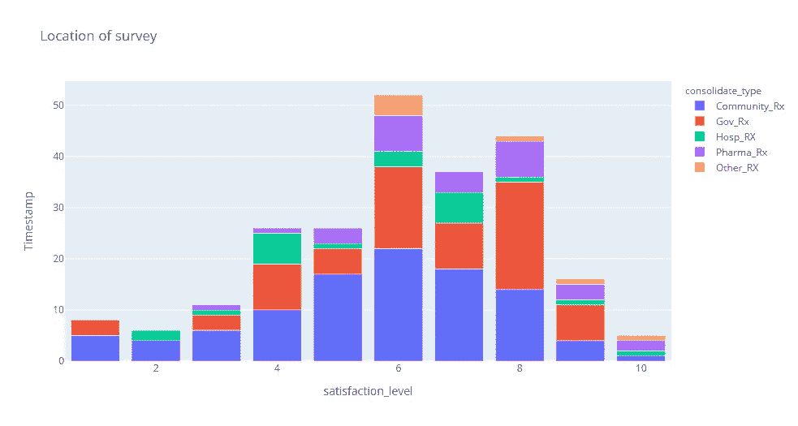
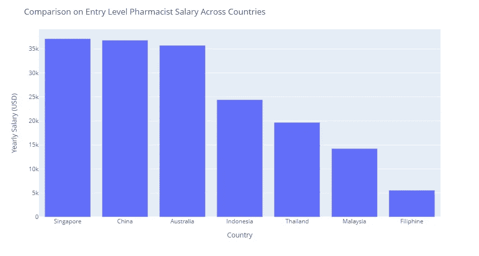
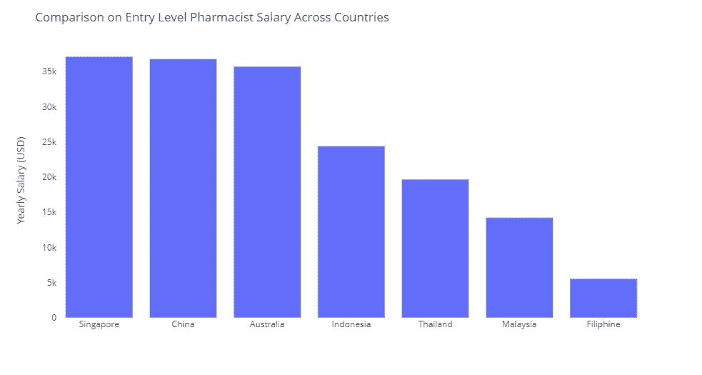
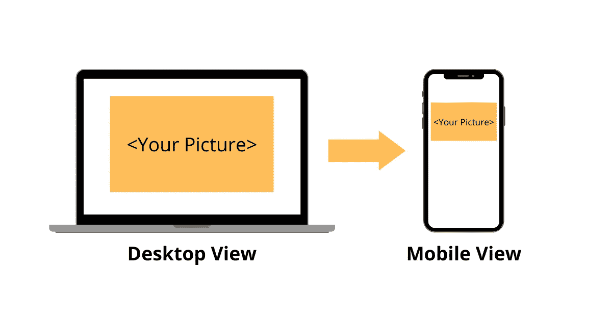
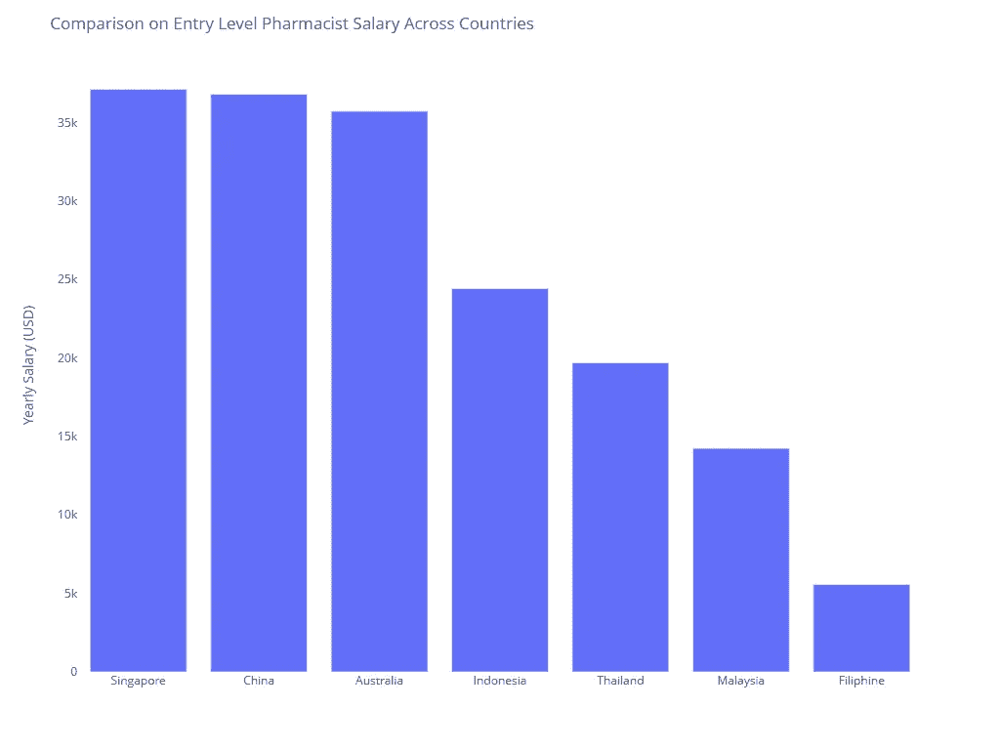
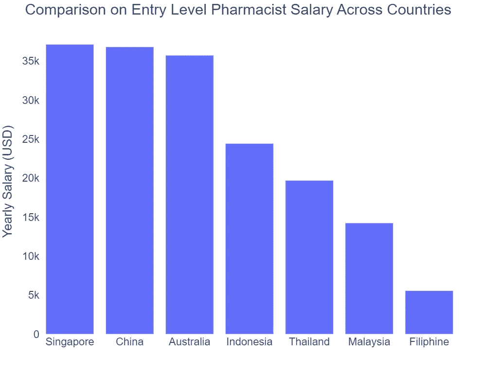
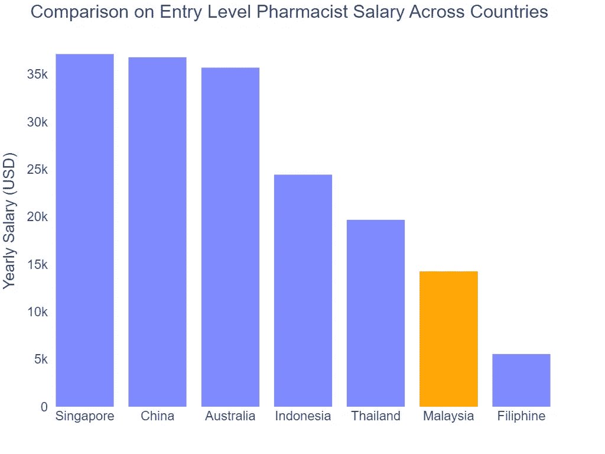
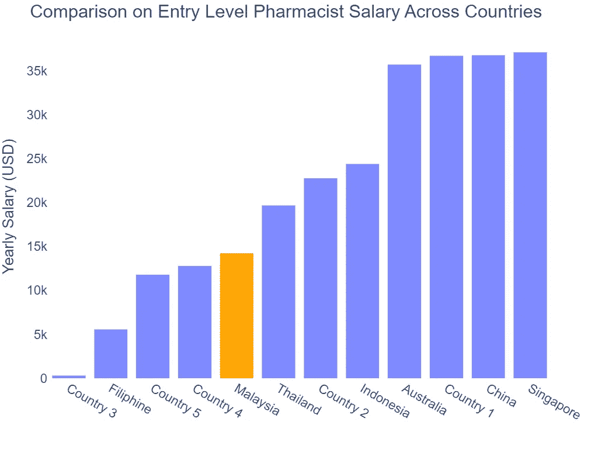
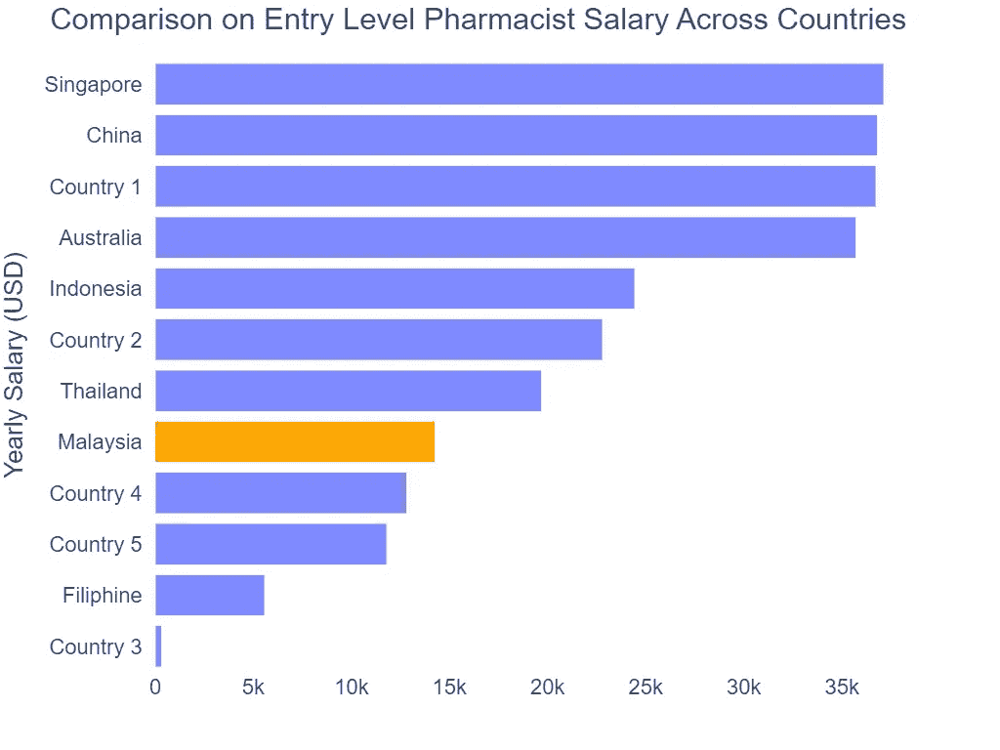

# 移动优先可视化

> 原文：<https://towardsdatascience.com/mobile-first-visualization-b64a6745e9fd>

## 神秘的魔法

## 创建一个清晰和惊人的可视化，完全适合移动

Mikael Blomkvist 来自 [Pexels](https://www.pexels.com/photo/person-holding-white-iphone-5-6483619/) 的原始照片

你如此努力地清理数据，在周末花费了无数次来寻找洞察力，最后，你设法在你的文章中发布了你的可视化，但是没有人理解你的可视化，因为他们不能正确地查看它。你不觉得你所有的努力都白费了，而且很没有动力吗？

一个坏图的例子。不要绘制这样的图表。作者图片

这是因为你没有意识到世界的技术已经改变了，你设计的重点也应该改变了。供您参考，**移动设备在 2020 年驱动了美国网站 61%的访问量，** **从 2019 年的 57%**[1]。来看你文章的大部分受众都在用手机。你应该在网上出版物的每一个方面都有一个移动优先的设计。

在本文中，我将向您介绍**移动优先可视化**的概念——通过对您的可视化进行一些调整，它将极大地增强您的可视化在移动用户中的展示和吸引力。

*注意:本文将主要关注如何使用 Plotly 来实现，但是这个概念适用于您正在使用的任何一个可视化工具*

## 1.去杂乱

消除混乱是移动优先设计中最重要的概念，如果你看着你的移动屏幕，你会注意到它非常小，任何出现在你的可视化中的额外项目都会影响你的观众的感知。

您必须做的第一件事是*从默认设置*中删除所有不必要的元素，如网格、不必要的图例和轴。例如，下面的条形图显示了具有默认背景的各国药剂师的工资。

默认 Plotly 输出条形图。作者图片

在我将背景颜色更改为白色并删除 x 轴标题后，图表看起来更加清晰。

去杂乱条形图。作者图片

## **2。比率问题**

Plotly 下载的默认`width`和`height`是 983 乘 525，它的比例为 1.87:1，在手机屏幕上显示时太小。大多数网站会在它们的 CSS 代码中使用 100%的宽度，以应对上传的每张图片和屏幕大小。这意味着您的图像将覆盖阅读窗格 100%的宽度。然而，它移动的宽度很短，相同长宽比的图片将覆盖屏幕的很小一部分。

不同设备视图中图像外观的比较。作者图片

就我个人喜好而言，我通常会选择 4:3 或 **1024 x 768 像素**的**宽高比。下面是我改变上图比例后的结果:**

已更改纵横比。作者图片

在你的手机屏幕上看起来更好吗？

## **3。字体，字体，字体！**

如果您在桌面上显示文本，最小可读字体大小是 12，对于移动视图，最小可读字体大小是 16。让你的受众一眼就能读懂你的文字，而不是放大图片来读懂你的文字，这一点非常重要。这样会让他们的经历大打折扣。通常我会选择 22 的**字体来显示我的大部分图表。**

还有一点要提醒的是，你的图的字体族，Plotly 默认的字体族(或字样)是 *Open Sans* 而最现代的网站都不使用它，它会让你的图在没有融入你的文章时显得很别扭。

例如，如果您在 Medium 上发布文章，您可以选择 *Sans-serif、*等字体；如果您在材料设计网站上发布，您可以选择 *Roboto* 等字样。这些字体会很好地融入你的文章。

字体大小和字体系列已更改。作者图片

## 4.颜色；色彩；色调

大多数现代网页设计都是黑色和黑灰色的，大多数手机屏幕都有有机发光二极管功能，可以增强颜色的对比度。这意味着当您选择更鲜明的色调时，由于移动色彩系统的增强，它将最能吸引观众的注意力。

试着给你的图表添加一些鲜明的颜色，比如:

在目标国家使用颜色。作者图片

鲜明的色彩将立即抓住你的观众的眼睛，这是进一步加强了移动屏幕的有机发光二极管功能。

## 5.垂直思考

利用手机，你应该纵向扩展你的信息，而不是横向。例如，如果您正在绘制条形图，建议您垂直绘制图表，而不是水平绘制。垂直图的优点是你可以在不牺牲棒线厚度的情况下扩张。

以上面的图表为例，如果我想在我的图表中再添加 5 个国家，这将使我的条形越来越细，并且无法读取标记的国家:

新添加国家的图表。作者图片

如果你把你的条形图改为水平条形图，你的读者就不需要低头阅读你的文本了。您可以通过调整纵横比轻松增加图表的高度，而不会影响可读性。

带有新添加国家/地区的图表(水平)。作者图片

## 代码:

本文的代码如下:

## 作者的话:

数据故事很有趣，可视化中的每一个元素都会增加观众的脑力负荷。因此，在你把每一个元素放入或从你的视觉化中取出之前，考虑它是非常有趣的。

我仍在实践数据讲故事的艺术，我希望我的小小分享能帮助你将你的工作成果有效地传达给你的听众。当人们不理解我们的视觉化时，我理解失望的感觉。相信我，只是需要更多的迭代和反馈。

最后，感谢您阅读我的文章！

<https://manfyegoh.medium.com/membership>  

## 参考资料:

[1][https://www . perficient . com/insights/research-hub/mobile-vs-desktop-usage](https://www.perficient.com/insights/research-hub/mobile-vs-desktop-usage#:~:text=Mobile%20devices%20drove%2061%25%20of,increase%20from%2063.3%25%20in%202019)

[2] Plotly 布局文档

[3]参考图来自 [AIPharm.xyz](https://aipharm.xyz/articles/pharmacist-salary-survey-2022)