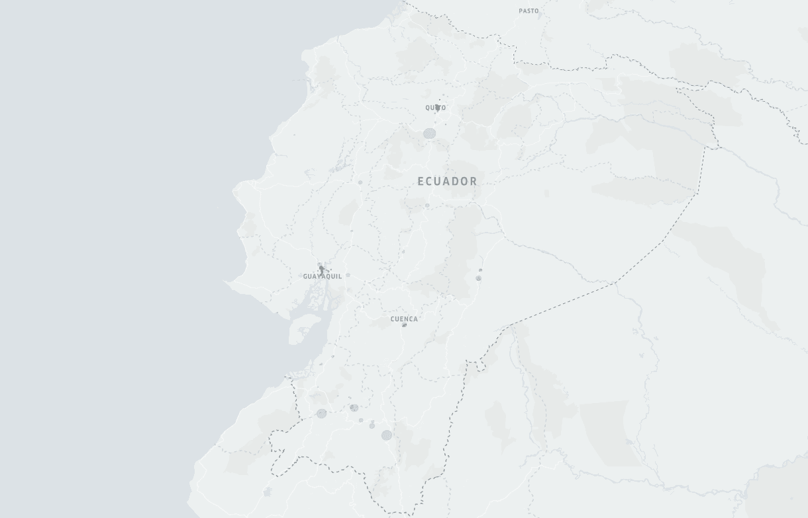
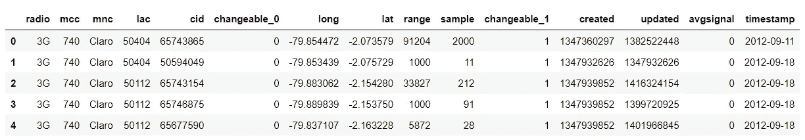
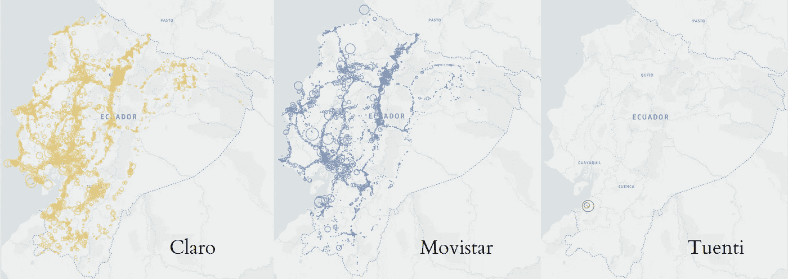
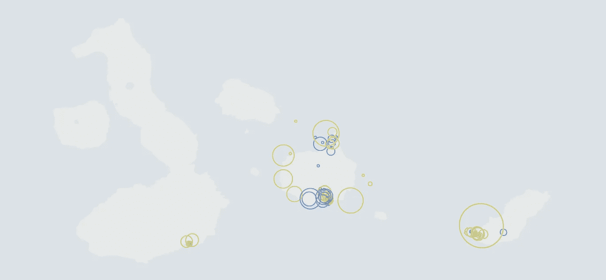
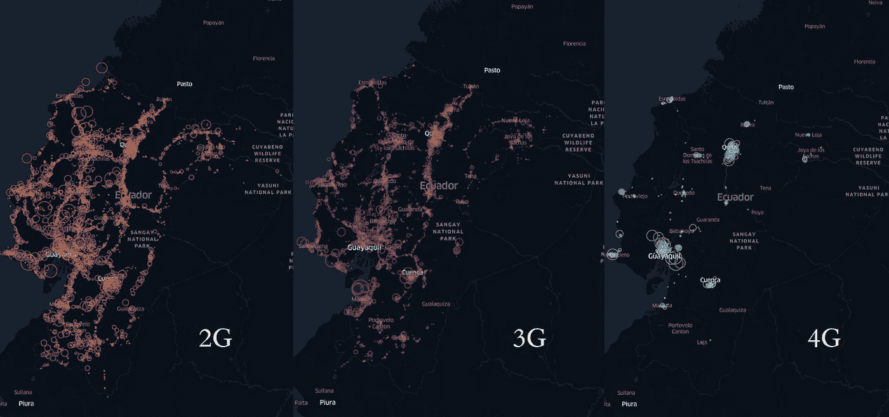
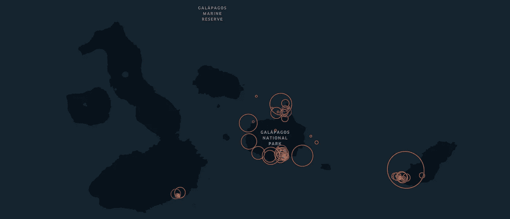

# 厄瓜多尔移动网络运营商的覆盖范围

> 原文：<https://towardsdatascience.com/mobile-network-operators-coverage-in-ecuador-9fdd78d3b4fb>

## 2G、3G 和 4G 蜂窝天线发展的地理可视化



图片由作者提供。厄瓜多尔从 2008 年开始开放细胞识别数据。2G 蓝色，3G 粉色 4G 黄色

自 2017 年以来， [OpenCell ID 组织](https://opencellid.org/#zoom=16&lat=37.77889&lon=-122.41942)一直在向世界各地的社区收集蜂窝天线的位置。这个开放数据项目包含大约 3.3GB 的全球压缩数据，包括位置属性、移动网络运营商代码、覆盖范围和国家代码。该数据集有助于公共/私人机构了解天线覆盖的模式。如今，美国是覆盖范围最广的国家(就小区数量而言),约有 700 万个，其次是德国，约有 200 万个。

为电信开发的最新技术是 5G，它覆盖了数据速率高达 20Gbps 的移动宽带(比传统移动技术快得多)。第一个将 5G 技术商业化的国家是 2019 年的韩国，如今是这一发展的领导者。[ [1](https://publications.iadb.org/publications/english/document/5G_The_Driver_for_the_Next-Generation_Digital_Society_in_Latin_America_and_the_Caribbean.pdf) 到 2021 年，5G 发展排名前 10 位的国家是韩国、挪威、阿联酋、沙特、卡塔尔、科威特、瑞典、中国、中国台湾和新西兰。

厄瓜多尔仍然未能达到这一技术，仍然严重依赖 2G 和 3G 连接，样本超过 20%。[ [2](https://www.ookla.com/articles/state-of-worldwide-5g-2021#:~:text=South%20Korea%20had%20the%20fastest,China%2C%20Taiwan%20and%20New%20Zealand.)

> 查看地图动画[这里！](https://bryanvallejo16.github.io/opencell-ec/root/coverage_ec_cell.html)
> 代码库[此处](https://github.com/bryanvallejo16/opencell-ec)！
> 在这里加入 Medium [！](https://bryanvallejo16.medium.com/membership)

# **蜂窝天线是干什么用的？**

在移动电话上进行的每一次连接都记录在近距离天线中。与移动数据连接相关的通话、信息和操作都存储在使用手机的蜂窝天线中。在国家和全球层面，存储了来自作为移动网络运营商客户的数百万用户的大量数据。数据是匿名的，主要反映用户不同位置的 pings。

一些公司在分析开发如此庞大的数据量方面很聪明。分析的洞察力可以揭示内部人口、国际旅游和网络统计的流动情况。令人惊讶的是，这一分析已被联合国证实是可靠的，并可被世界各国统计局用于官方统计。

爱沙尼亚公司*[***Positium***](https://positium.com/en?utm_source=tds&utm_medium=organic&utm_campaign=article)是移动定位数据分析领域的领导者。出席 2021 年[世界数据论坛](https://positium.com/blog/big-data-covid19-world-data-forum?utm_source=tds&utm_medium=organic&utm_campaign=article)的这家私营公司讲述了他们为支持新冠肺炎紧急情况而采取的行动，为人口流动提供了一个创新的[仪表盘](https://mobility.positium.com/covid19/?utm_source=tds&utm_medium=organic&utm_campaign=article)。*

**

*[https://positium.com/en](https://positium.com/en?utm_source=tds&utm_medium=organic&utm_campaign=article)*

*如果你愿意了解移动定位数据的分析结果及其应用，我建议你阅读这个故事:*

*[](/interactive-flow-map-with-an-od-matrix-of-regular-movements-in-tartu-estonia-3ac6b7738397) [## 爱沙尼亚塔尔图市常规运动 OD 矩阵互动流程图

### 从呼叫详细记录(CDR)获得传单中的家庭-工作通勤的交互式可视化

towardsdatascience.com](/interactive-flow-map-with-an-od-matrix-of-regular-movements-in-tartu-estonia-3ac6b7738397) 

# **目标**

这个故事旨在展示如何操作来自 OpenCell ID 的数据以及如何将其可视化。就类别而言:

*   移动网络运营商
*   通过 2G、3G(厄瓜多尔使用最多)和 4G 技术
*   靠你自己的创造力

# 数据许可证

*   OpenCell ID 的数据库是在[知识共享署名-共享 4.0 国际许可](https://creativecommons.org/licenses/by-sa/4.0/)下许可的。

# 地理可视化实践

找到您感兴趣的国家，并从 [Open Cell ID](https://opencellid.org/#zoom=16&lat=37.77889&lon=-122.41942) 下载数据。然后你解压数据，就像这样:

```
**from** datetime **import** datetime
**import** pandas **as** pd**# read with Pandas**
data = pd.read_csv(r’740.csv.gz’, header=None, compression=’gzip’)
```

国家数据的第一个问题是它不包含列名。为了帮助你，你可以像这样添加它们:

```
**# change columns of OpenCell** col_names = [‘radio’, ‘mcc’, ‘mnc’, ‘lac’, ‘cid’, ‘changeable_0’,
 ‘long’, ‘lat’, ‘range’, ‘sample’, ‘changeable_1’,
 ‘created’, ‘updated’, ‘avgsignal’]data.columns = col_names
```

再加上 2G，3G，4G 这一代，还有运营商。在本练习中，我将只使用 Movistar、Tuenti 和克拉罗。

```
**# add generation**
data[‘radio’] = data[‘radio’].replace(‘UMTS’, ‘3G’).replace(‘GSM’, ‘2G’).replace(‘LTE’, ‘4G’).replace(‘CDMA’, ‘3G’)**# add operator**
data = data.loc[data['mnc'].isin([0, 1, 3])]
data['mnc'] = data['mnc'].replace(0, 'Movistar').replace(1, 'Claro').replace(3, 'Tuenti')
```

因此，它可能看起来像:



图片由作者提供。桌子准备好了。

## [操作员](https://en.wikipedia.org/wiki/List_of_mobile_network_operators_of_the_Americas)的覆盖范围:



图片由作者提供。按操作员代码排列的天线。



图片由作者提供。加拉帕戈斯群岛的运营商覆盖范围

一般来说，所有运营商都连接到天线。尽管 Tuenti 展示了少量天线(根据覆盖范围确定大小),但它实际上连接了整个蜂窝天线网络。克拉罗似乎拥有更多基础设施。

## 世代覆盖率:



图片由作者提供。各代天线的覆盖范围。

似乎 2G 和 3G 是之前所说的主导者。4G 还在发展中。可以看出，这主要发生在城市地区，如基多、瓜亚基尔、昆卡、曼塔或马查拉。



图片由作者提供。加拉帕戈斯群岛的世代覆盖率

在加拉帕戈斯群岛，2G 和 3G 是大陆地区的主导。

## *时间性覆盖:*

我喜欢绘制混乱的地图。


图片由作者提供。蜂窝天线的发展

# 建议

开放细胞 ID 是开放数据的来源，可以帮助分析细胞天线在世界范围内的分布。但是不要想当然。一些天线似乎位于海洋中或街道中间。是这样吗？嗯，我相信由于它是一个开源数据集，对真实位置的保护是可以改变的。但是，有一个参考还是很好的，特别是如果我们在国家层面上使用地理可视化。

这种做法可以支持不同国家的移动网络运营商的空间分布及其蜂窝天线的技术发展。因此，只需使用这些材料就可以更好地了解电信发展的现状。

# **参考文献**

[1] **美洲开发银行。(2020)** 。“5G 是拉丁美洲和加勒比地区下一代数字社会的驱动力”本作品采用知识共享 IGO 3.0 归属-非商业-非衍生(CC-IGO BY-NC-ND 3.0 IGO)许可协议([https://Creative com](https://creativecom)—mons.org/licenses/by-nc-nd/3.0/igo/legalcode)，可在归属 IDB 的情况下出于任何非商业目的进行复制。不允许衍生作品

[2] **Ookla (2021)** 。“增长和放缓:2021 年全球 5G 的状况”。[https://www . ookla . com/articles/state-of-world wide-5G-2021 #:~:text = 5G % 20 slowed % 20 down % 20 at % 20 global % 20 level&text = Over % 20 the % 20 past % 20 year % 20 from，Mbps)% 20 during % 20 same % 20 period](https://www.ookla.com/articles/state-of-worldwide-5g-2021#:~:text=5G%20slowed%20down%20at%20the%20global%20level&text=Over%20the%20past%20year%20from,Mbps)%20during%20the%20same%20period)。*