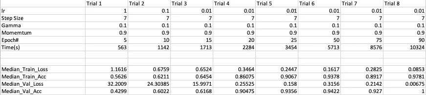
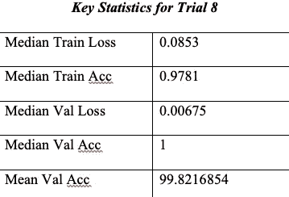
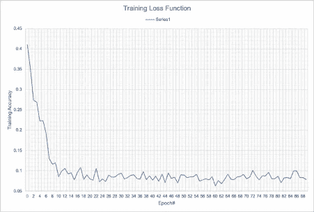
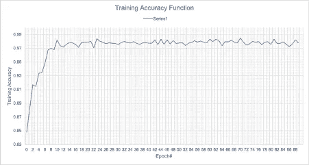
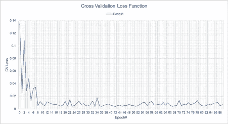
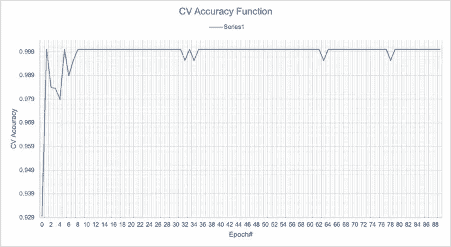

# 手机:一个图像分类问题

> 原文：<https://towardsdatascience.com/mobile-phones-an-image-classification-problem-8dd207205c0d>

## 使用监督学习算法的背景和介绍

## 分类

分类是识别数据集中趋势的最广泛使用的方法之一。这些类型的算法致力于在不使用其他数据操作技术的情况下对数据集进行可靠分类的目标。分类算法要么是有监督的，要么是无监督的。监督学习使用有标签的数据来做决策，而后者使用无标签的数据。例如，有监督的学习可以处理线性关系，而无监督的学习必须处理未知关系(通常是聚类)。因此，根据数据集的类型，分析师将不得不决定对问题采用适当的算法。对于这项研究，监督学习算法已被选为数据集被标记。

## 图像分类

图像分类是机器学习过程，通过该过程，开发者能够将一组图像分类成不同的类别或主题。使用模型(训练的或未训练的)，可以提供图像，使得该模型使用具有深度学习技术的神经网络来准确地分类所有图像。该模型是一组预编码的指令，供计算机应用于一组图像，以便它能够将数据集分类/归类。

## 神经网络

神经网络是模拟大脑的一种尝试。大脑包含数万亿个神经元连接，而开发人员只能对人工神经网络中节点之间的有限数量的连接进行编程。人工神经网络由输入层、输出层、激活层和几个其他计算/隐藏层组成，是一个大型决策树，它使用数学方法来计算数百万个结果，以便算法在训练、验证甚至测试阶段取得进展。

## 卷积神经网络(CNN)

不一样的，相信我！

“卷积”是指使用 2 个函数创建新的第三个函数的过程。“卷积神经网络”是一种神经网络，它使用两个给定的输入，并在移动到连续隐藏层、激活层或输出层中的节点时产生输出。此外，CNN 还用于剩余学习的环境中。残差学习是神经网络能够重新使用它在连续层中丢失的任何输入的过程，这使得算法产生最小的损失和更高的精度。

好吧…我想这需要消化很多背景知识。

# 收集数据

## 形象

我从无版权来源获得了我所有的图片，所以在项目后期不会有任何问题。

*   正面案例:手机
*   反面案例:洗衣机/洗碗机/平板电脑/笔记本电脑

## 主要(软件端)工具

*   语言:Python
*   ML 框架:PyTorch
*   预训练模型:Resnet18

## PyTorch 和 Resnet18:一个词

Pytorch 是开源的，包含预先训练和未训练的学习模型，这使得它适合大多数 ML 开发者。R *esnet18* 是深度学习算法的机器学习模型。“18”指的是 CNN 的 18 层。该项目利用了预训练版本 Resnet18，因此该过程可以简化为给定图像的实时训练和验证。

## 我是怎么做到的？

1.  确保足够的电源和内存

2.使用命令行工具安装 Python 和 PyTorch

3.运行几个命令来测试 Python 和 PyTorch 是否在机器上运行

4.如果机器没有足够的处理能力(功率、内存或其他):遵循步骤 5 至 8

5.联系业内专业人士或者用 GPU 设置桌面

6.将桌面配置为服务器(可以通过 ssh 连接到它)

7.使用“ssh”或电缆连接来连接到桌面

8.在命令行上运行几个命令，确保桌面服务器正在响应

9.记录培训、验证准确性和时间(两者)的值

10.迭代算法并收集必要的数据，在每次迭代结束时改变“lr”和“epochs”的值(这是为了最大化精度)

# 实验后数据

## 结构

*   8 次试验
*   每个试验都有不同的#时期和#lr 值
*   中位数:培训+ Val 准确性和完成时间(注明)

数据汇总(图片由作者提供)

所有关于模型性能的数据都以“xlsx”格式上传到 Github 存储库中。任何电子表格编辑器都应该能够打开它。

# 分析:数据告诉我什么？

试验 8 在训练和交叉验证数据集上都产生了最少的损失和最高的总体准确性。试验 8 的组合可以在其他数据集上产生相同的测量。试验 8 已经被进一步详细说明，因为该组合使得该算法与其他算法相比执行得最好。

试验 8 总结(图片由作者提供)

(ACC 是准确度，Val 是验证)

## 试验 8:可视化

图 4: Trial_8 训练损失(图片由作者提供)

图 5: Trial_8 训练精度(图片由作者提供)

图 6: Trial_8 验证失败(作者图片)

图 7: Trial_8 验证准确性(图片由作者提供)

## 洞察力:这些图表背后的意义

## 图 4，5

与数据集上模型的定型阶段相关。如图 4 所示，训练损失在图表的第一部分急剧下降。这可能指示模型的“预热”阶段，以便理解特征向量和比较基础。对于训练精度来说，这可能是类似的情况，但是，在训练精度的情况下，精度值很快达到峰值，这表明模型没有使用大量迭代来实现更高的精度值。虽然，该图的一个方面是使用现有选择的限制，即在 0.99 处的可察觉的渐近线，用于 90 次迭代的精度值的波动次数。这是选择学习率和 epoch#时要考虑的一个方面，因为这些值的微小差异可能会在准确性和模型完全分类数据集所需的时间方面产生显著差异。这可以通过比较上表中试验 7 和试验 8 的测量值的绝对值看出，该表包含所有测量值的中值。

## 图 6，7

交叉验证的可视化描绘了与训练阶段相似的趋势。然而，在交叉验证中，模型的性能稍好。这表明训练阶段是有效的，因为训练集的性能通常为开发人员提供了关于交叉验证数据集的性能的关键信息。在这种情况下，交叉验证被视为测试集，这意味着在大多数迭代中获得 100%的准确性表明模型成功，因为它表明它能够以高精度解决问题。

# 结束语

概括来说，问题陈述是“给定一张产品图片，以 x%的置信度确定该产品是否属于特定类别(本练习中为手机)”。该算法对图像进行正确分类，总体准确率高达 99.82168%。这表明试验 8 的组合是成功的。然而，当应用于更大的数据集时，仍然存在几乎 0.28%的误差率，这意味着显著的绝对误差。因此，这些结果不能用于工业环境。

## 改进/扩展:我在某个地方出错了！

1.  操纵 CNN 的步长和动量。
2.  使用不同的框架。例如张量流。
3.  应用不同方向的图像来测试不可预测的数据。例如旋转
4.  将更大的数据集应用于模型以改进数据收集

感谢您阅读我的项目总结！。

我对这个领域很陌生，所以，在我的写作中可能会有不一致/混乱，我可能已经错过了。如果您有任何批评或需要进一步澄清，您可以通过下面列出的电子邮件直接联系我。

电子邮件:rahulr280623@gmail.com

Github 储存库:[https://github . com/ra hulr 2003/Mobile-Vs-Non-Mobile-Classification](https://github.com/rahulr2003/Mobile-Vs-Non-Mobile-Classification)

# 参考

巴蒂亚，理查。"神经网络不像人脑那样工作——让我们揭穿这个神话." *Analytics India Magazine* ，2018 年 10 月 31 日，analyticsindiamag . com/neural-networks-not-work-like-human-brains-let-拆穿-myth/#:~:text = b)% 20 artificial % 20 neural % 20 networks % 20 vs，有% 20millions % 20of %个连接。

邦纳，安妮。"深度学习完全初学者指南:卷积神经网络."*中*，走向数据科学，2019 年 6 月 1 日，走向数据科学. com/wtf-is-image-class ification-8e 78 a 8235 ACB。

脸书人工智能研究实验室。火炬视觉模型。*Torch vision . models—py Torch 1 . 7 . 0 文档*，Torch 贡献者，2019，pytorch.org/docs/stable/torchvision/models.html.

冯，文森特。" ResNet 及其变体概述."*介质*，走向数据科学，2017 年 7 月 17 日，走向数据科学. com/an-overview-of-resnet-and-its-variants-5281 e2f 56035。

贾恩，普拉奇。"电子商务中的图像分类[上]. "*中*，走向数据科学，2019 年 2 月 13 日，走向数据科学. com/product-image-class ification-with-deep-learning-part-I-5b C4 E8 dccf 41。

麦克唐纳康纳。"神经网络(NN)图."*走向数据科学*，中，2017 年 12 月 22 日，走向数据科学. com/machine-learning-fundamentals-ii-neural-networks-f1 e 7 B2 CB 3 eef。

Python.org。“欢迎来到 python . org”。*Python.org*、Python.org、[www.python.org/doc/.](http://www.python.org/doc/.)

鲁伊斯帕布罗。“理解和可视化结果”*中*，走向数据科学，2019 . 04 . 23，走向数据科学. com/understanding-and-visualizing-RES nets-442284831 be 8。

周，维克多。"初学者的机器学习:神经网络导论."*中型*，走向数据科学，2019 年 12 月 20 日，走向数据科学. com/machine-learning-for-neural-networks-d 49 f 22d 238 f 9。