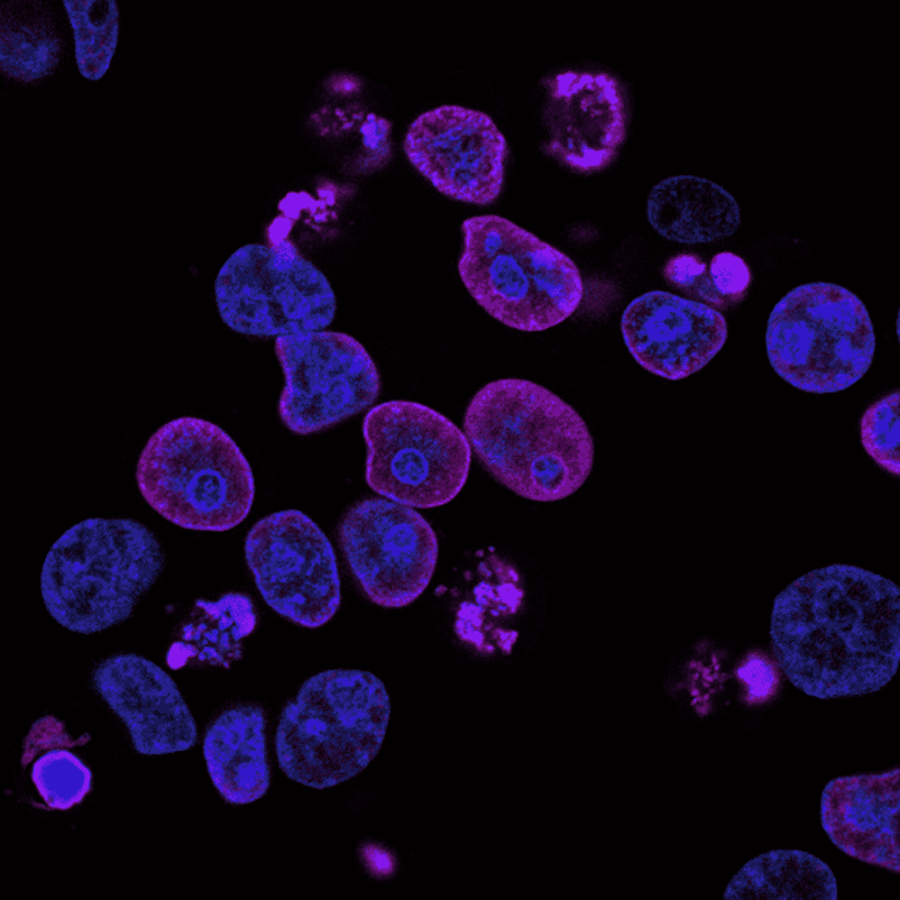
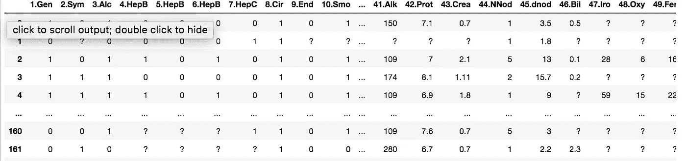
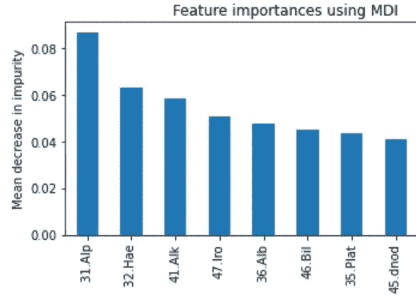
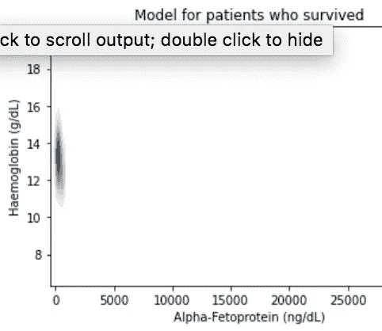
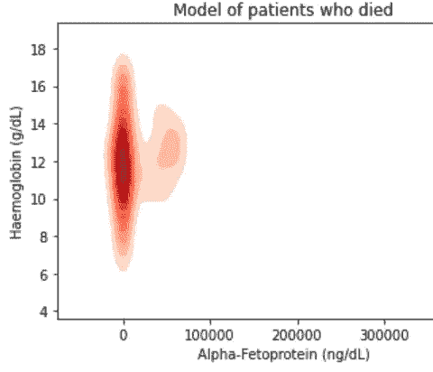
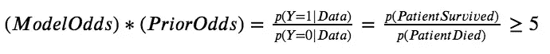
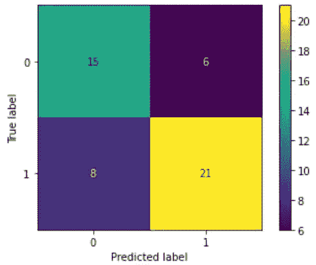
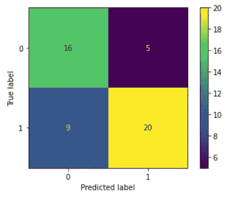
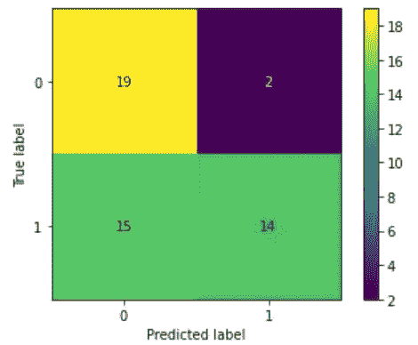

# 基于癌症数据的模型学习

> 原文：<https://towardsdatascience.com/model-based-decision-making-for-health-data-581bd58a1a3>

## 基于模型的学习；实践教程

# 基于癌症数据的模型学习

## 关于在不平衡和缺失的健康数据上部署基于模型的人工智能的教程



[国家癌症研究所](https://unsplash.com/@nci?utm_source=medium&utm_medium=referral)在 [Unsplash](https://unsplash.com?utm_source=medium&utm_medium=referral) 上拍摄的照片

在本文中，我将从头到尾概述如何将基于模型的学习应用于真实世界的健康数据——在我的例子中是癌症数据。在这篇文章的最后，我希望你能了解为什么基于模型的学习是一个有用的通用框架，可以应用于许多不同的数据集，以及它如何帮助识别基于医疗保健等数据领域做出的具体分类决策。

例如，在医疗保健领域，预测某人是健康的，而实际上他们可能需要手术或治疗——戴夫*致命的*会付出代价吗，因为他们的潜在状况可能不会被人类医生发现，直到为时已晚，因为他们已经被自动系统认为是健康的。然而，在病人实际健康的情况下预测癌症的模型并不是一件坏事，因为病人可以通过他们的保险进行定期检查。如果病情恶化，他们的医生会第一个知道。

我将使用的数据集是来自葡萄牙科英布拉医院和大学中心的真实数据，由 165 名“肝细胞癌”患者组成，这是一种常见但致命的肝癌，通常与甲型肝炎有关

# 初始数据分析

**修复缺失的健康记录数据**

首先，我们需要从 UC Irvine 机器学习库[的这个链接](https://archive.ics.uci.edu/ml/datasets/HCC+Survival)下载数据。您会注意到，在链接中，它说大约 10%的数据是*缺失*，只有*8 个患者记录有完整的数据*。所以我们的第一步是解决这个问题。



图片鸣谢:作者。缺少的值标有问号“？”。

在我们进行任何特征选择或机器学习之前，我们首先必须修复缺失的数据。通常， *pandas* 库会提供某种类型的选项，比如`pandas.fillna`，它基本上是用*均值*、*中值*或最近邻(如果列是数字)或*模式*(如果列是分类的)来填充每个特征列中的缺失值。

然而，在这种情况下，对于我们的癌症数据，该论文的作者(他们在 UCI 上免费发布了该数据集)概述了一种基于患者相似性度量的缺失数据方案，称为“异构欧几里德重叠度量”(HEOM)，根据作者的说法，该方案对于填充具有连续*和*离散类型的数据集中的缺失值非常有效。该代码包含 Python 中关于如何实现这一点的细节；[你可以在这里查看](https://github.com/galaxyenby1997/carcinoma-modeling)。

**寻找最佳功能**

现在我们已经填充了缺失的数据，让我们来看看如何选择我们的特征。我决定不在特性选择上花太多时间。有很多方法可以做到这一点:使用递归特征消除(RFE)，互信息，卡方检验独立性，等等。我通常不会推荐 RFE，因为有了足够多的特性，你需要测试的组合数量会增长得非常快。

在这种情况下，对于健康记录，我将完全做其他事情:我将使用随机森林来确定特征。你可能会问，“我为什么要用一个随机的森林来计算呢？?"但事实证明，随机森林有一个名为 *feature_importances* 的内置属性，这是由所使用的决策树集合决定的。(顺便说一句，如果你想要一篇关于 Random Forests 的快速评论文章，[看看我以前关于它们的帖子](/whats-in-a-random-forest-predicting-diabetes-18f3707b6343?source=your_stories_page----------------------------------------)，以及对现实世界糖尿病数据的应用！)

使用随机森林，我们发现预测患者存活的前 3 个特征依次是:甲胎蛋白(ng/dL)、血红蛋白(g/dL)和碱性磷酸酶(U/L)。(这些健康记录属性也在数据集所在的 [UCI 数据库中列出。)](https://archive.ics.uci.edu/ml/datasets/HCC+Survival)



图片鸣谢:作者。前 3 个特征对应于最高的 3 个条。

# **基于模型的学习**

现在到了我想投入精力和注意力的有趣部分:*基于模型的*学习。

我们已经填充了缺失的数据，并找到了最能提供信息的特征，现在让我们来看看数据集的形状。我们总共有 165 个数据记录，其中 102 例患者存活，63 例患者死亡。我们已经遇到了两个主要的“问题”——我们的数据集样本量对于机器学习来说不是那么大，我们有类别不平衡。

现在你可能会说，“Raveena，你为什么不对较小的类进行过采样，或者对较大的类进行过采样？”的确，我可以！我可以用称为 SMOTE 的合成采样对“病人死亡”类进行过采样。([这里有一个来自 sci-kit learn 的关于它的很棒的教程](https://machinelearningmastery.com/smote-oversampling-for-imbalanced-classification/))然而，我正试图结合*基于模型的学习*，这意味着我将走更贝叶斯的路线——我将在下面简要解释。

基本的想法就像它的名字一样:我要做的是为幸存的患者创建一个具有前三个特征的*模型*，为那些不幸从癌症中死去的患者创建一个模型。希望是，一旦我有了这两个模型，对于一个新的测试患者，我可以比较每个模型的判断，并决定测试患者是否会生存，死亡，或由于巨大的不确定性而犹豫不决。

在最终决定之前，贝叶斯步骤还包括一件事:我将结合我们对病人的先验知识，并将其乘以模型判断。你会问，先验知识是什么？嗯，在*训练集中*有 73 名患者存活，42 名患者死亡——因为我之前提到的“阶级不平衡”。这听起来可能是件坏事。但是在基于模型的学习中，我们实际上可以利用它！我要做的是——结合存活和死亡患者之间的先前差异，以及模型判断——并使用这两者来做出最终决定。

## **创建模型**

为了创建实际的模型，我将使用一种称为高斯混合的模型。用最简单的方式来描述它，高斯混合模型查看一堆数据，并试图将数据的分布分解为各个钟形曲线的基本总和，或高斯正态分布。每个更简单的正态分布都有一个与之相关联的特定权重，该权重告诉模型对该特定高斯分布的重视程度。这是高斯混合模型拟合数据[的 GIF 图，链接到这里](https://en.wikipedia.org/wiki/Mixture_model#/media/File:Movie.gif)，下面是一个截图:


图片来源:维基百科。高斯混合模型及其组件的屏幕截图。您可以看到单独的红色、黄色、紫色、绿色和蓝绿色正态分布，每一个都添加了特定的权重，以给出整体较细的深蓝色曲线

高斯混合模型比核密度估计器更不容易过度拟合训练数据，核密度估计器通常试图最大化分布对训练数据的拟合，从而产生过度拟合的风险。

```
# Gaussian Mixture model for patients who survived carcinoma
life_model_2feature **=** GaussianMixture(n_components**=**6, random_state**=**0)**.**fit(X_train_2life)# Gaussian Mixture model for patients who died from carcinoma
death_model_2feature **=** GaussianMixture(n_components**=**4, random_state**=**0)**.**fit(X_train_2death)
```

我们将基于前 2 个特征来看存活和死亡患者的模型；我的代码中详细介绍了前 3 个特性。



图片鸣谢:作者。这是计算机为幸存病人准备的内部模型。这是通过根据它的模型生成 100 个幸存病人的合成样本来实现的



图片鸣谢:作者。这是电脑为死去的病人准备的内部模型。这是通过根据它的模型生成 100 个死亡病人的合成样本来实现的

## 模型预测

最后，是时候看看该模型将如何根据测试患者数据预测患者存活率了。不过，在开始之前，我想讨论一件重要的事情。

**我们不能冒误报的风险**

如果我们根据患者的甲胎蛋白和血红蛋白含量来预测患者是否会在这种特定的癌症中存活，那么意外预测患者会在癌症中存活是极其危险和不道德的，因为他们可能有很高的死亡几率。这在统计学中被称为“假阳性”，在这种情况下，阳性=存活，阴性=死亡。如果我们要对测试患者做出最终决定，如果我们做出了假阳性选择，我们需要更加重视——我们需要“惩罚”这个决定，这样它就不会发生，我们不会无意中对患者撒谎，告诉他们他们会在癌症中幸存下来，而他们在没有适当治疗的情况下死亡的几率要高得多。

假设我们想要做出假阳性决策的权重是假阴性决策的 5 倍。如果我们想惩罚 5 倍的假阳性决定，那么我们只能接受这样的决定，即如果最终的优势比高于某个数量，则预测患者“存活”。更具体地说:



图片鸣谢:作者。这基本上是贝叶斯定理，为了更重地惩罚 5 倍的假阳性决策，我们使决策赌注更高。

***(只是作为一个重要的提醒，在这个项目中，Y=1 表示患者会存活，Y=0 表示患者不会存活于癌。)***

(这方面的细节在代码中，所以你可以在这里自由地[自己查看)。但是如果您感兴趣，这里有一个代码示例:](https://github.com/galaxyenby1997/carcinoma-modeling)

```
threshold = 5**for** odds **in** log_posterior_odds: **if** odds **>** np**.**log(threshold):
        decisions**.**append(1)
    **else**: 
        decisions**.**append(0)
```

那么……这个模型预测了什么？

实现这个决策规则，我们得到下面的混淆矩阵结果。(混淆矩阵只是一个 2x2 表格的花哨术语，它显示了模型在测试数据上的表现，有假阳性，也有假阴性— *不仅仅是准确性*。准确性有时会误导人！)



模型做得不算太差！––50 道题中有 36 道正确，准确率为 72%。右上角的深紫色方框是假阳性——该模型预测了 5 名测试患者，他们将是健康的，但实际上不会在癌症中存活。

但是我想让你注意到，对于这个基于模型的学习框架来说，比准确性更重要的东西——因为记住，准确性不是一切。还记得我说过，我们将通过将比率阈值设置为 5 来惩罚犯有更多假阳性错误的模型(该模型对患者撒谎说他们将在癌症中存活)吗？

当我将阈值增加到 10 时，请注意右上角紫色框中的数字会发生什么变化，因此我们增加了 10 倍的权重:



通过将阈值增加到 10，模型少犯了一个假阳性错误，代价是犯了一个假阴性错误。

但是如果门槛很高，比如 20 岁，看看会发生什么。所以我们对假阳性分类错误的重视程度是假阴性的 20 倍。



现在这个模型真的开始最小化假阳性，这很好——但是这是以增加假阴性的巨大成本为代价的。这意味着太多可能不需要检查的患者被模型送到他们的医疗提供者那里进行检查。除非他们的保险可以涵盖定期检查，否则这对病人来说是不划算的。所以你可以看到，设置阈值是模型的一个平衡游戏。

# 最后的话

我希望这篇文章能让您了解基于模型的学习的灵活性，以及如何将它应用到健康领域的真实数据中，

在我看来，基于模型的学习的主要优势之一是这个框架可以应用于许多类型的表格数据，而不仅仅是健康记录。这种类型的机器学习甚至可以应用于视觉和语音识别领域，只要从数据中提取正确的特征类型，并使用有效的概率生成模型。

我认为的另一个优势是，我们对假阳性、假阴性的最终分析，以及根据我们数据的域*来补偿任一错误*，使用基于模型的学习是非常简单的。我们所要做的就是决定我们对惩罚假阳性或假阴性的重视程度，并像我们所做的那样设定一个阈值。在 Python 中只需要几行代码，但是这种分析在例如医疗保健领域是非常重要的，在那里，不管准确性如何，出现假阳性错误可能比假阴性*更昂贵或更致命*。**

非常感谢您的阅读，我们将在下一篇文章中再见！

如果你想了解更多关于我的信息，我对机器学习和数据科学感兴趣，我想从事什么，你可以在这里查看我的 LinkedIn。