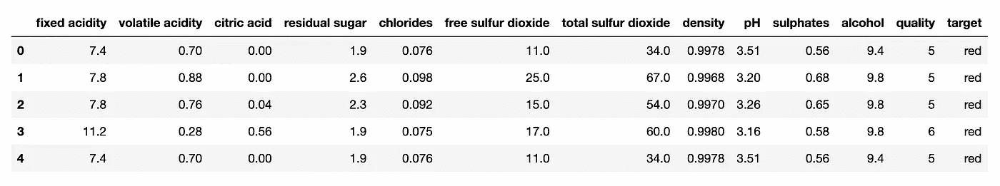
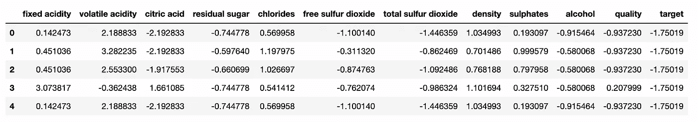
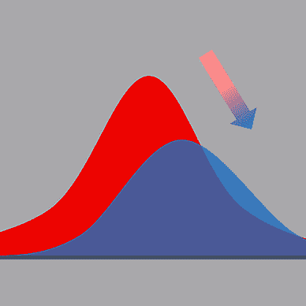
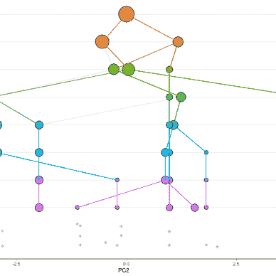

# Scikit-learn 中的模型评估

> 原文：<https://towardsdatascience.com/model-evaluation-in-scikit-learn-abce32ee4a99>

## 机器学习

## 关于如何使用 scikit-learn 计算最常见的回归和分类指标的教程。


[斯科特·格雷厄姆](https://unsplash.com/@homajob?utm_source=medium&utm_medium=referral)在 [Unsplash](https://unsplash.com?utm_source=medium&utm_medium=referral) 上拍照

Scikit-learn 是最流行的用于机器学习的 Python 库之一。它提供了模型、数据集和其他有用的功能。在本文中，我将描述 scikit-learn 为模型评估提供的最流行的技术。

**模型评估允许我们评估模型的性能，并比较不同的模型，以选择最佳模型投入生产。**模型评估有不同的技术，这取决于我们想要解决的具体任务。在本文中，我们重点关注以下任务:

*   回归
*   分类

对于每个任务，我将通过一个实际的例子来描述如何计算最流行的指标。

# 1 加载数据集

作为一个示例数据集，我使用由 [UCI 机器学习库](https://archive.ics.uci.edu/ml/datasets/wine+quality)提供的**葡萄酒质量数据集**。要使用此数据集，您应该正确引用来源，如下所示:

*   Dua d .和 Graff c .(2019 年)。UCI 机器学习知识库[http://archive . ics . UCI . edu/ml]。加州欧文:加州大学信息与计算机科学学院。
*   页（page 的缩写）科尔特斯、塞德伊拉、阿尔梅达、马托斯和雷伊斯。
    通过物理化学特性的数据挖掘建立葡萄酒偏好模型。在决策支持系统中，爱思唯尔，47(4):547–553，2009。

我下载了数据文件夹，其中包含两个数据集:一个是红酒数据集，另一个是白酒数据集。我构建了一个数据集，它是两个数据集的串联，如下所示。

我将两个数据集都作为熊猫数据帧加载，然后合并它们:

```
import pandas as pdtargets = ['red', 'white']
df_list = []
df = pd.DataFrame()
for target in targets:
    df_temp = pd.read_csv(f"../Datasets/winequality-{target}.csv", sep=';')
    df_temp['target'] = target
    df_list.append(df_temp)
    print(df_temp.shape)df = pd.concat([df_list[0], df_list[1]])
```

我添加了一个新列，它包含原始数据集名称(红色或白色)。数据集如下表所示:



作者图片

数据集包含 6497 行和 13 列。

现在，我定义一个函数，它对所有分类列进行编码:

```
from sklearn.preprocessing import LabelEncoderdef **transform_categorical**(data):
    categories = (data.dtypes =="object")
    cat_cols = list(categories[categories].index)
    label_encoder = LabelEncoder()
    for col in cat_cols:
        data[col] = label_encoder.fit_transform(data[col])
```

我还定义了另一个函数，它缩放数字列:

```
from sklearn.preprocessing import MinMaxScalerdef **scale_numerical**(data):
    scaler = MinMaxScaler()
    data[data.columns] = scaler.fit_transform(data[data.columns])
```

# 2 回归

为了评估回归模型，最常用的指标是:

*   **平均绝对误差** —实际值与预测值之差的平均值。它衡量预测与实际产出的差距。MAE 越低，模型越好。
*   **均方根误差** —均方误差的平方根(MSE)。MSE 计算实际值和预测值之差的平方的平均值。
*   **R2 分数**—Y 中可以用 x 解释的方差比例

作为一项回归任务，我希望在给定其他特征的情况下，预测每个记录的 pH 值。我将 X 和 y 变量定义如下:

```
X = df.drop("pH", axis = 1)
y = df["pH"]
```

然后，我将类别转换成数字，并对数字进行缩放:

```
transform_categorical(X)
scale_numerical(X)
```

因此，我有以下输入数据集:



作者图片

现在，我将数据集分为训练集和测试集:

```
from sklearn.model_selection import train_test_split
X_train, X_test, y_train, y_test = **train_test_split**(X, y, test_size=0.20, random_state=42)
```

我定义了一个辅助函数，它接收模型作为输入，然后对其进行训练和测试:

```
from sklearn.metrics import mean_absolute_error,r2_score,mean_squared_error
import numpy as npdef **run_experiment**(model):
    model.fit(X_train, y_train)
    y_pred = model.predict(X_test)
    print("R^2 : ", r2_score(y_test, y_pred))
    print("MAE :", mean_absolute_error(y_test,y_pred))
    print("RMSE:",np.sqrt(mean_squared_error(y_test, y_pred)))
```

现在我建立一个线性回归模型，并测试它的性能:

```
from sklearn.linear_model import LinearRegression
model = **LinearRegression**()
run_experiment(model)
```

作为输出，`run_experiment()`函数返回以下结果:

```
R^2 :  0.6508427991759342
MAE : 0.07476031320105749
RMSE: 0.09761343652989583
```

我还建立了另一个回归模型，基于随机梯度下降:

```
from sklearn.linear_model import SGDRegressor
model = SGDRegressor()
run_experiment(model)
```

作为输出，我得到了以下结果:

```
R^2 :  0.6243269738606405
MAE : 0.07703814197219305
RMSE: 0.10125211591520658
```

两个实验的比较表明，线性回归器具有较低的 RMSE，因此它优于另一个模型。

# 3 分类

最常见的分类评估指标有:

*   **精确**——在所有积极的预测中，数一数有多少是真正积极的。
*   **回忆** —在所有真正的阳性病例中，统计有多少被预测为阳性。
*   **准确性** —在所有案例中，计算有多少案例被正确预测。

作为分类任务，我考虑目标类(红/白)的预测。因此，我构建 X 和 y 变量如下:

```
X = df.drop("target", axis = 1)
y = df["target"]
```

现在，我将分类列转换为数字列，然后缩放所有数字列:

```
transform_categorical(X)
scale_numerical(X)
```

我还对目标类进行了编码:

```
label_encoder = LabelEncoder()
y = label_encoder.fit_transform(y)
```

现在，我将数据集分为训练集和测试集:

```
X_train, X_test, y_train, y_test = train_test_split(X, y, test_size=0.20, random_state=42)
```

现在，我定义一个辅助函数，它接收模型作为输入，通过计算之前定义的指标来训练和测试它:

```
def **run_experiment**(model):
    model.fit(X_train, y_train)

    y_pred = model.predict(X_test)

    plot_confusion_matrix(model, X_test, y_test, cmap='GnBu')
    plt.show() print('Precision: %.3f' % precision_score(y_test, y_pred))
    print('Recall: %.3f' % recall_score(y_test, y_pred))
    print('F1: %.3f' % f1_score(y_test, y_pred))
    print('Accuracy: %.3f' % accuracy_score(y_test, y_pred))
```

我构建了一个随机森林分类器，然后计算它的性能:

```
from sklearn.ensemble import RandomForestClassifiermodel = RandomForestClassifier()
run_experiment(model)
```

该函数返回以下输出:

```
Precision: 0.994
Recall: 0.999
F1: 0.996
Accuracy: 0.995
```

我还训练了一个决策树分类器:

```
from sklearn.tree import DecisionTreeClassifiermodel = DecisionTreeClassifier()
run_experiment(model)
```

该函数返回以下输出:

```
Precision: 0.992
Recall: 0.985
F1: 0.988
Accuracy: 0.983
```

就准确性而言，随机森林分类器的性能优于决策树分类器。

# 摘要

恭喜你！您刚刚学习了如何在 scikit-learn 中为分类和回归执行模型评估。所描述的技术没有考虑参数优化，因为本文的目的是展示最常见的评估指标。

如果你读到这里，对我来说，今天已经很多了。谢谢！你可以在[这篇文章](https://alod83.medium.com/which-topics-would-you-like-to-read-c68314dc6813)中读到更多关于我的内容。

# 相关文章

[](/an-overview-of-the-scikit-learn-clustering-package-d39a0499814) [## scikit-learn 集群包概述

### scikit-learn 系列的第二集，解释了用于机器学习的著名 Python 库

towardsdatascience.com](/an-overview-of-the-scikit-learn-clustering-package-d39a0499814) [](/an-overview-of-the-scikit-learn-library-episode-1-preprocessing-9b17ab4dde4f) [## Scikit-learn 库概述—第 1 集预处理

### 著名的用于机器学习的 Python 库的剧集中的描述。第一集讲的是…

towardsdatascience.com](/an-overview-of-the-scikit-learn-library-episode-1-preprocessing-9b17ab4dde4f) [](/understanding-the-n-jobs-parameter-to-speedup-scikit-learn-classification-26e3d1220c28) [## 了解 n_jobs 参数以加速 scikit-learn 分类

### 一段现成的代码，演示了使用 n_jobs 参数如何减少培训时间

towardsdatascience.com](/understanding-the-n-jobs-parameter-to-speedup-scikit-learn-classification-26e3d1220c28) 

# 从社区收集的文章


[安吉莉卡·洛·杜卡](https://alod83.medium.com/?source=post_page-----abce32ee4a99--------------------------------)

## 评估指标

[View list](https://alod83.medium.com/list/evaluation-metrics-e157b6c7fea6?source=post_page-----abce32ee4a99--------------------------------)2 stories

[当归罗杜卡](https://alod83.medium.com/?source=post_page-----abce32ee4a99--------------------------------)

## 数据分析

[View list](https://alod83.medium.com/list/data-analysis-f9326d4a0ec7?source=post_page-----abce32ee4a99--------------------------------)4 stories