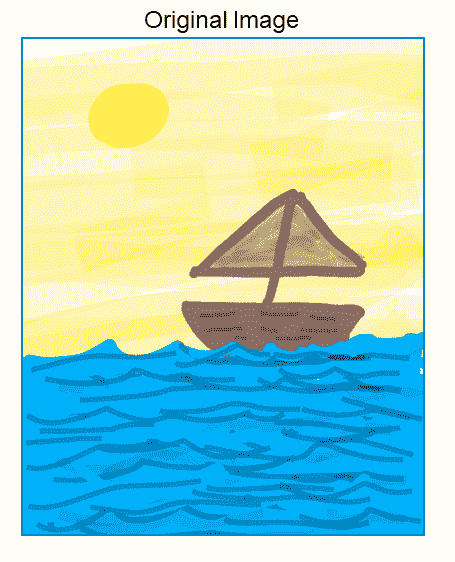
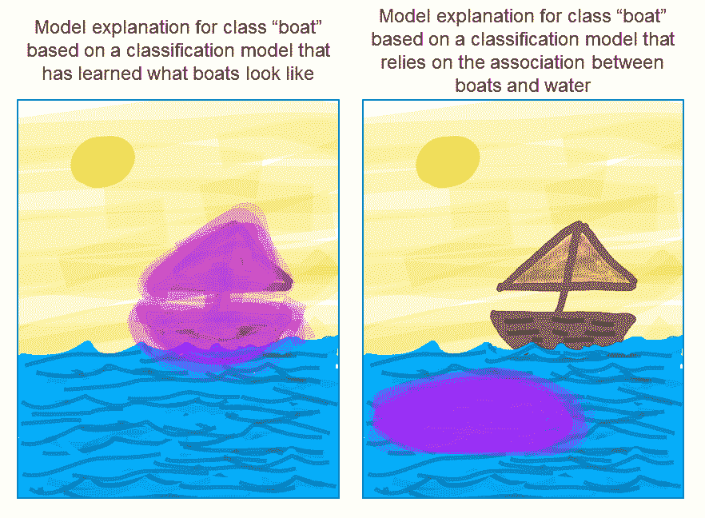
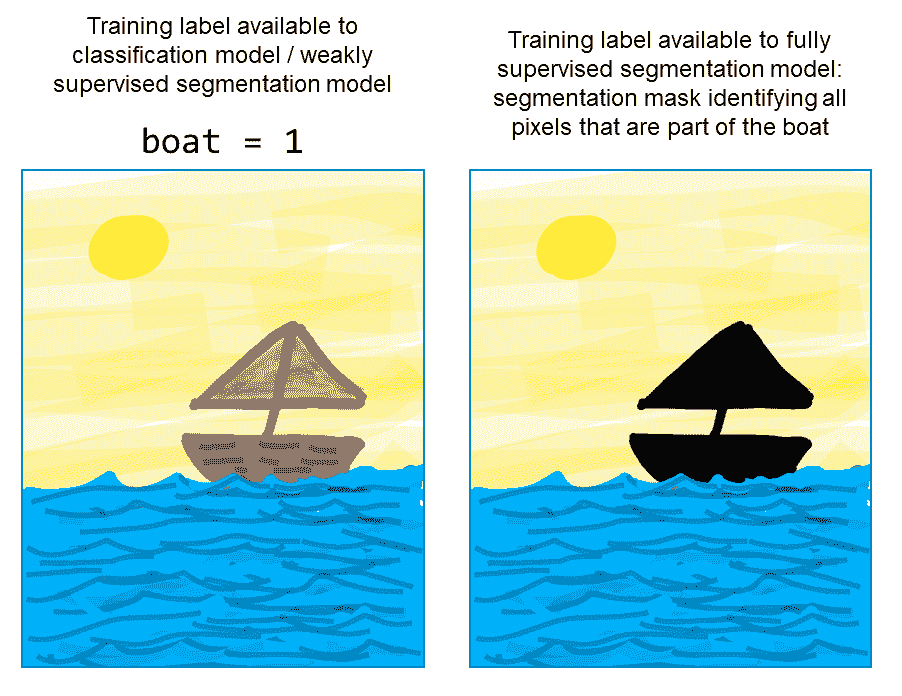
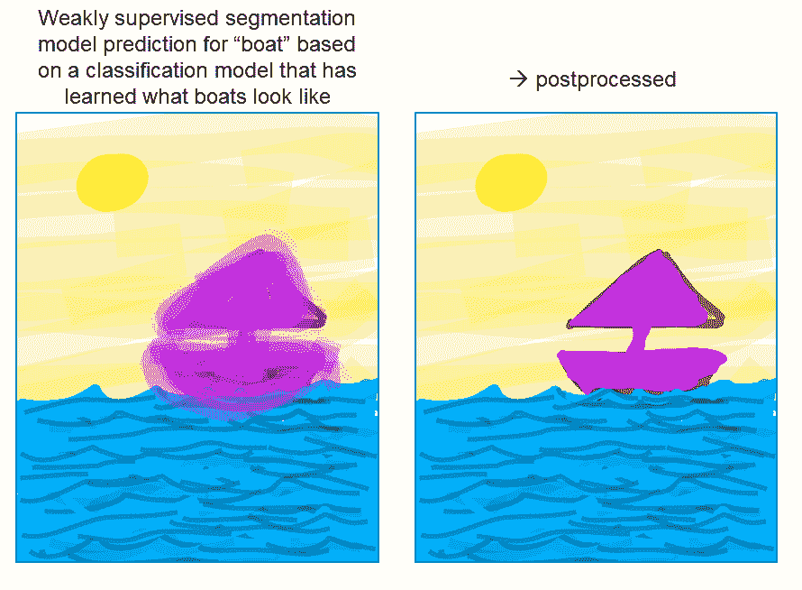
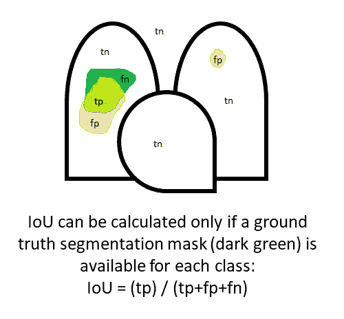
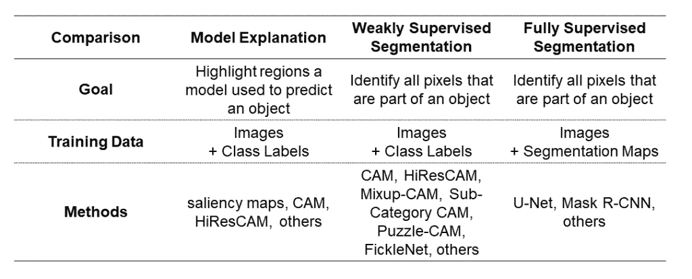

# 模型解释不是弱监督分割

> 原文：<https://towardsdatascience.com/model-explanation-is-not-weakly-supervised-segmentation-68610987420>

特色图片(天空拼图)来自[维基百科](https://commons.wikimedia.org/wiki/File:Sky_puzzle.jpg)(知识共享许可)。

在这篇文章中，我们将比较三个相关但不同的计算机视觉任务，它们可以用[卷积神经网络](https://glassboxmedicine.com/2020/08/03/convolutional-neural-networks-cnns-in-5-minutes/)来处理:图像[分类](https://glassboxmedicine.com/2019/05/26/classification-sigmoid-vs-softmax/)模型解释、弱监督分割和[完全监督分割](https://glassboxmedicine.com/2020/01/21/segmentation-u-net-mask-r-cnn-and-medical-applications/)。我们将考虑目标、训练数据和方法的异同。请注意，我将把重点放在这些任务的神经网络方法上，尽管所有这三项任务都可以通过非神经网络方法来解决。

如果你想引用这篇文章，它是基于我的论文[“使用 HiResCAM 而不是 Grad-CAM 来忠实地解释卷积神经网络”](https://arxiv.org/abs/2011.08891)的摘录。

本帖将使用一个基于该船图像草图的运行示例:

作者图片

# **目标**

首先，让我们考虑一下目标:

*   模型解释:突出显示区域用于预测对象的模型
*   弱监督或全监督分割:识别作为对象一部分的所有像素

目标的哲学差异对判断任务的成功有重要的影响，接下来会详细讨论。

## **模型解释的目标**

模型解释的目的是演示模型在图像中的哪些位置用于进行特定预测— *，即使这意味着突出显示相关对象之外的区域*。例如，如果一个模型使用轨道来识别一列火车，解释应该突出轨道。如果模型使用水来识别一艘船，解释应该突出水。

作者图片

因此，评估解释正确性(“解释质量”)的任何性能度量都必须根据“模型用于每个预测的位置”这一基本事实来计算，这反过来只能通过模型和解释方法的数学属性来揭示。例如，在 HiResCAM 的论文中，我们证明了 HiResCAM 准确地解释了 CNN 使用的位置，这些位置以一个完全连接的层结束。

“模型使用的位置”可能与对象分割图没有任何关系，这些位置也不能由人类手动创建，因为如果人类能够足够好地理解模型以限定用于每个预测的区域，那么首先就不需要解释方法。

## **分割的目标**

分割的目标是识别作为对象一部分的所有像素。

在弱监督分割中，这个目标必须仅使用整个图像标签来实现。在完全监督分割中，地面真实分割图可用于训练。

作者图片

因为从图像分类器导出的弱监督分割图是“模糊的”，并且通常倾向于集中在对象的小的区别部分，所以弱监督分割方法包括阈值处理和后处理步骤，旨在将原始“模糊”分割图变换/扩展成更清晰和更准确的图(例如，通过使用条件随机场[)。](https://arxiv.org/abs/2008.01183)

作者图片

## **借据不得用于评估解释正确性**

分割任务的一个常见性能指标是交集/并集(IoU ),当一个类的预测分割与该类的基本事实分割完全重叠而没有扩散到其他区域时，该指标最高。

IoU 是通过将模型的预测分割中的像素与真实分割中的像素进行比较来计算的。真阳性“tp”(预测和实际情况中的像素)、假阳性“fp”(预测中不在实际情况中的像素)和假阴性“fn”(不在预测中但存在于实际情况中的像素)用于计算 IoU，如下图所示，这是假设[医学图像分类任务](https://glassboxmedicine.com/2019/05/11/automated-chest-x-ray-interpretation/)的肺和心脏的卡通图:

作者图片

虽然 IoU 是判断分段性能的合理指标，但 IoU 永远不应该用于评估解释的正确性。不幸的是，一些论文试图通过实验来评估解释的正确性，使用根据基本事实对象分段计算的 IoU，或使用密切相关的设置，要求人类主观判断解释与对象的对应程度(这实际上对应于人类估计类似 IoU 的数量)。这些实验中不言而喻的假设是，分类模型总是使用相关对象来预测类别，因此“好的”解释方法将实现高 IoU。然而，如前所述，模型并不保证总是使用相关的对象来预测类，事实上，不期望的模型行为的可能性是解释方法开发背后的主要动力。

任何时候，一个模型的行为出乎意料或利用虚假的相关性，真实模型解释的 IoU 将会很低，但如果得出低 IoU 意味着解释质量差的结论，那就错了。要知道一个解释方法是否忠实于一个特定类型的模型，唯一的方法是根据模型的定义和解释方法的定义来证明它。

## **忠实解释方法的 IoU 提供了对模型的洞察**

虽然 IoU 不能用于评估解释方法的质量，但是基于具有保证属性的解释方法(例如 [CAM](https://glassboxmedicine.com/2019/06/11/cnn-heat-maps-class-activation-mapping-cam/) 或 [HiResCAM](https://arxiv.org/abs/2011.08891) )计算的 IoU 可以用于评估特定的*型号*。在这些情况下，高 IoU 表示该模型倾向于根据需要使用感兴趣对象内的区域进行预测，而低 IoU 表示该模型倾向于使用感兴趣对象外的区域进行预测，从而利用背景或相关对象。

# **方法**

既然我们已经概述了解释和分段的不同目标和评估，让我们考虑一下用于每项任务的方法。

模型解释可以通过[显著图](https://glassboxmedicine.com/2019/06/21/cnn-heat-maps-saliency-backpropagation/)、 [CAM](https://glassboxmedicine.com/2019/06/11/cnn-heat-maps-class-activation-mapping-cam/) 、 [HiResCAM](https://arxiv.org/abs/2011.08891) 等技术完成；显著图通过了完整性检查，CAM 和 HiResCAM 都具有保证的忠实性。 [Grad-CAM](https://glassboxmedicine.com/2020/05/29/grad-cam-visual-explanations-from-deep-networks/) 通常被用作解释技术，但事实上*并不*适合用于模型解释，因为[它有时会突出显示模型并未实际用于预测的区域](https://glassboxmedicine.com/2020/05/29/grad-cam-visual-explanations-from-deep-networks/)。其他模型解释方法已被证明更像[边缘检测器](https://glassboxmedicine.com/2019/10/12/guided-grad-cam-is-broken-sanity-checks-for-saliency-maps/)而不是解释，因此在选择模型解释方法时，选择一个具有保证属性的方法非常重要，以避免产生混淆模型实际工作的误导性解释。

有些令人困惑的是，弱监督分割方法通常建立在 CAM 家族解释方法的基础上，因此许多弱监督分割方法的名称中都有“CAM”，尽管它们的目标是分割而不是模型解释:例如， [Mixup-CAM](https://arxiv.org/abs/2008.01201) 、[子类别 CAM](https://arxiv.org/abs/2008.01183) 和 [Puzzle-CAM](https://arxiv.org/abs/2101.11253) 。重要的是要记住，即使这些弱监督的分割方法利用了模型解释方法，它们也有一个根本不同的目标。

像 [U-Nets 或 Mask R-CNNs](https://glassboxmedicine.com/2020/01/21/segmentation-u-net-mask-r-cnn-and-medical-applications/) 这样的完全监督分割模型利用了基础真实分割掩码。全监督分割模型通常优于弱监督分割模型，因为全监督模型具有更多可用信息。如上所述，弱监督分割图是从仅在存在/不存在标签上训练的分类模型中导出的——例如，对于整个图像，“boat=1”或“boat=0”。全监督分割模型在像素级标签上训练；典型的 RGB 自然图像可能具有大约 256×256 = 65，536 个像素。因此，与弱监督分割模型相比，全监督分割模型在数量级的更多信息上被训练。完全监督分割的缺点是获得像素级标签的费用，这限制了训练样本的数量和可以考虑的不同类别的数量。

# **总结**

下表总结了这些任务之间的相似之处和不同之处:

作者图片

快乐解释和分段！

*原载于 2022 年 7 月 2 日 http://glassboxmedicine.com*<https://glassboxmedicine.com/2022/07/02/model-explanation-is-not-weakly-supervised-segmentation/>**。**