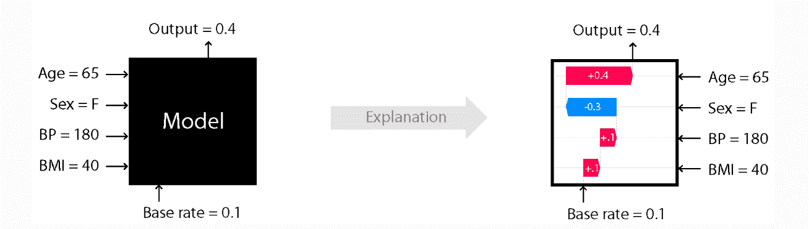
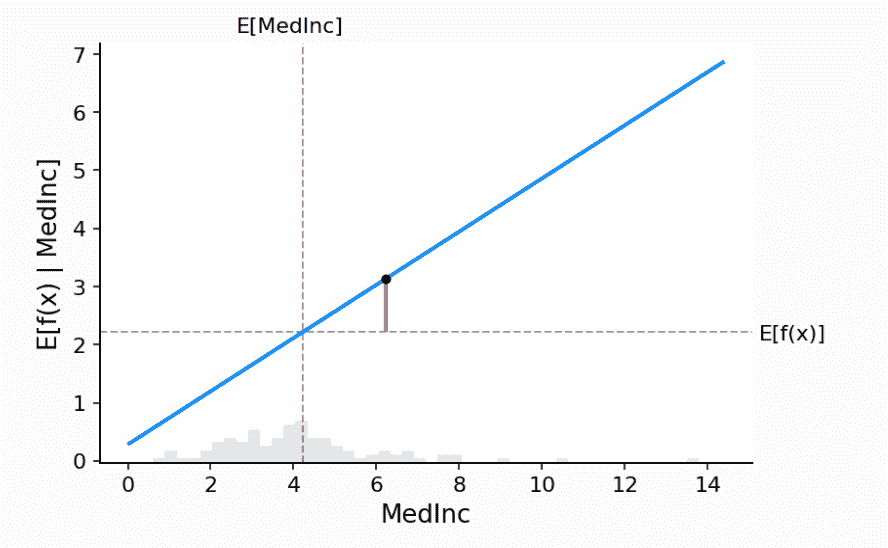
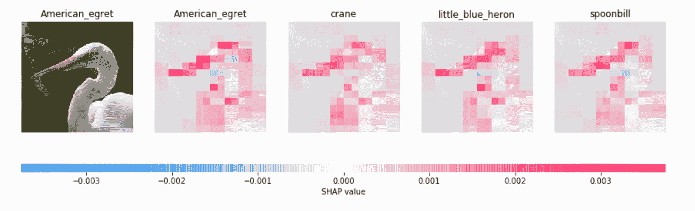
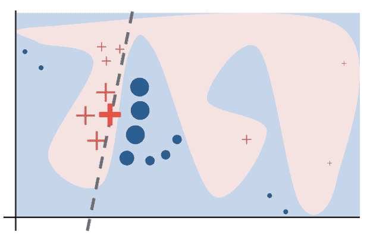
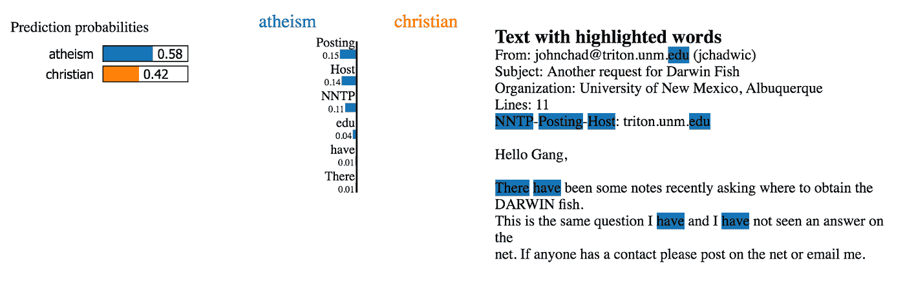
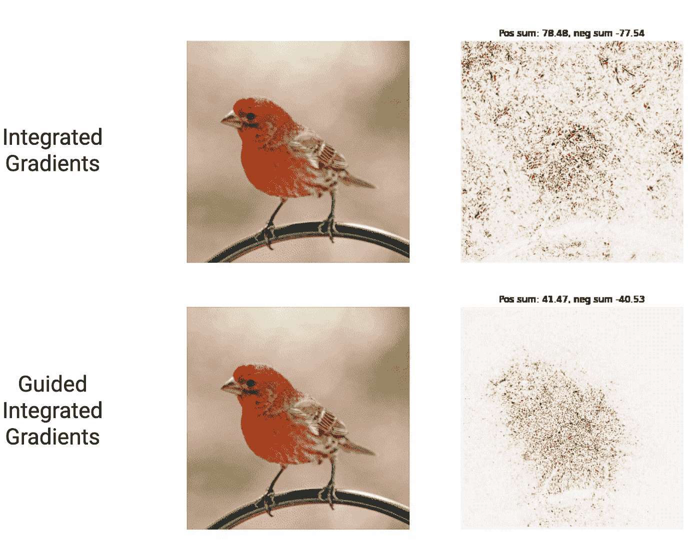
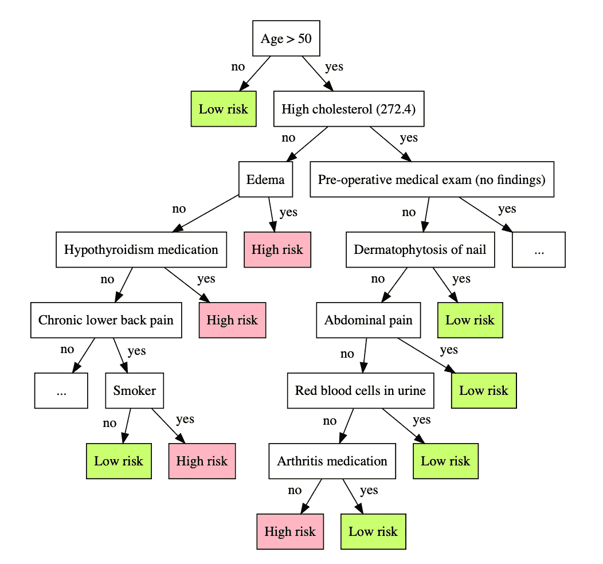
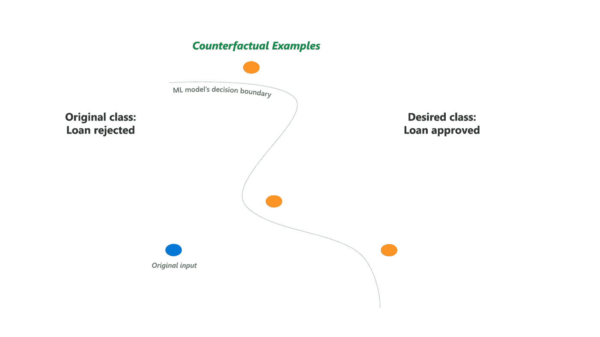
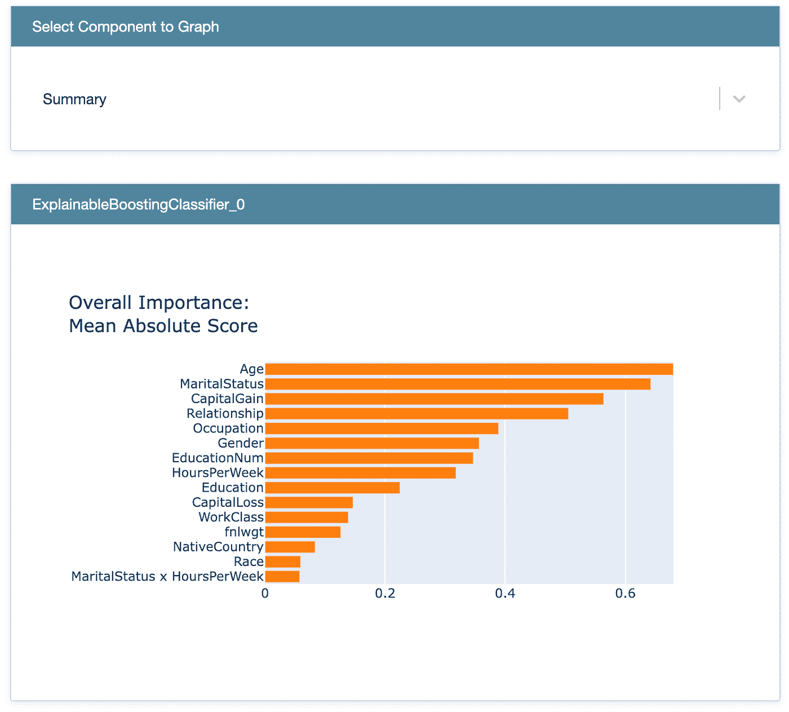

# 机器学习模型的可解释性和可解释性

> 原文：<https://towardsdatascience.com/model-interpretability-and-explainability-27fe31cc0688>

## SHAP，石灰，可解释的助推机器，显著图，TCAV，蒸馏，反事实，和解释

艾蒂安·吉拉尔代在 [Unsplash](https://unsplash.com/?utm_source=unsplash&utm_medium=referral&utm_content=creditCopyText) 上拍摄的照片

ML/AI 模型变得越来越复杂，越来越难以解释和说明。简单、易于解释的回归或决策树模型不再能够完全满足技术和业务需求。越来越多的人使用集成方法和深度神经网络来获得更好的预测和准确性。然而，那些更复杂的模型很难解释、调试和理解。因此，许多人将这些模型称为黑盒模型。

当我们训练一个 ML/AI 模型时，我们通常专注于技术细节，如步长、层、早期停止、丢失、膨胀等等。我们真的不知道为什么我们的模型会以某种方式运行。例如，考虑一个信用风险模型。为什么我们的模型会给个人分配一定的分数？我们的模型依赖于什么特性？我们的模型是否严重依赖一个不正确的特征？即使我们的模型没有将种族和性别作为输入特征，我们的模型是否会从其他特征中推断出这些属性，并引入对某些群体的偏见？利益相关者能理解并信任模型行为吗？该模型能为人们提供如何提高信用评分的指导吗？模型解释和说明可以提供对这些问题的洞察，帮助我们调试模型，减少偏差，并建立透明度和信任。

人们对机器学习模型的可解释性和可解释性越来越感兴趣。研究人员和 ML 实践者已经设计了许多解释技术。在这篇文章中，我们将提供八种流行的模型解释技术和工具的高级概述，包括 **SHAP、Lime、可解释的助推机器、显著图、TCAV、蒸馏、反事实和解释。**

# SHAP

图一。SHAP 解释机器学习模型输出(来源:[https://shap.readthedocs.io/](https://shap.readthedocs.io/)，麻省理工许可)

[“SHAP(SHapley Additive exPlanations)](https://shap.readthedocs.io/)是一种博弈论方法，用来解释任何机器学习模型的输出。它使用博弈论及其相关扩展中的经典 Shapley 值，将最优信用分配与本地解释联系起来。

图 1 显示了 SHAP 工作的要点。假设基本速率，即预测值 E[f(x)]的先验背景期望值是 0.1。现在我们有了一个新的观察结果，特征年龄=65，性别=F，血压=180，身体质量指数=40。这个新观察的预测值是 0.4。我们如何解释 0.4 的产值和 0.1 的基础率之间的这种差异？这就是 Shapley 值发挥作用的地方:

*   先说基础率 0.1。
*   加上身体质量指数 Shapely 值 0.1，我们得到 0.2。
*   加上 BP Shapely 值 0.1，我们得到 0.3。
*   加上性感匀称值-0.3，我们得到 0。
*   加上年龄匀称值 0.4，我们得到 0.4

基于 Shapely 值的加性，这个新观察的模型预测是 0.4。SHAP 值提供了对每个要素重要性的深入了解，并解释了模型预测的工作原理。

我们如何计算 Shapley 值？SHAP 绘制了线性模型的部分相关图，其中 x 轴代表特性，y 轴代表给定特性时输出的期望值(见图 2)。特征的 Shapley 值是在该特征的给定值，即图中红线的长度，预期模型输出和部分相关性图之间的差。

图二。部分依赖情节(来源:【https://shap.readthedocs.io/】T2，麻省理工学院许可)

Shapley 值的计算可能很复杂，因为它是所有可能的联盟排列的平均值。`shap`库使用采样和优化技术来处理所有复杂的计算，并为表格数据、文本数据甚至图像数据返回直观的结果(参见图 3)。通过`conda install -c conda-forge shap`安装 SHAP 并试一试。

图 3。https://shap.readthedocs.io/，麻省理工学院许可，SHAP 解释图像分类(来源:

# 石灰

模型可以是全局复杂的。Lime(局部可解释模型不可知解释)不是关注整体复杂模型行为，而是关注局部区域，并使用线性近似来反映预测实例周围的行为。

图 4 展示了 Lime 的工作原理。蓝色/粉色背景表示原始复杂模型的决策函数。红十字(我们称之为 X)是我们想要预测和解释的实例/新观察。

*   X 周围的采样点
*   使用原始模型预测每个采样点
*   根据样本与 X 的接近程度对样本进行加权(图中权重较大的点对应于较大的尺寸)
*   在加权样本上拟合线性模型(虚线)
*   用这个线性模型来解释 X 附近的局部

图 4。石灰直觉(来源:[https://github.com/marcotcr/lime](https://github.com/marcotcr/lime)，BSD 执照)

使用 Lime，我们可以在本地解释表格数据、文本数据和图像数据的模型行为。下面是一个使用 Lime 来解释文本分类器的例子。我们可以看到这个分类器正确地预测了实例，但是出于错误的原因。​​

图 5。石灰解释文本分类器示例(来源:[https://github.com/marcotcr/lime](https://github.com/marcotcr/lime)，BSD 许可)

要了解更多关于 Lime 的信息，请查看 [Github 页面](https://github.com/marcotcr/lime)并通过`pip install lime`安装。

# 可解释的助推器

[“可解释的助推机](https://interpret.ml/docs/ebm.html) (EBM)是一个基于树的、循环梯度助推广义加法模型，具有自动交互检测功能。EBM 通常与最先进的黑盒模型一样精确，同时保持完全可解释性。”

EBM 的工作原理如下:

*   在每次迭代中，我们以循环方式一次一个特征地训练一个装袋和梯度提升树。我们首先在第一个特征上训练，然后更新残差并在第二个特征上训练，并继续直到我们完成所有特征的训练。
*   然后我们重复这个过程很多很多次。
*   因为 EBM 逐个特征循环，所以它可以显示每个特征在最终预测中的重要性。

EBM 是在 [interpret.ml](http://interpret.ml) 中实现的，我们将在本文后面介绍。

# 显著图

显著图方法广泛用于解释神经网络图像分类任务。它测量每个像素的重要性，并突出显示哪些像素对预测很重要。在高层次上，显著性图采用每个类别相对于每个图像输入像素的梯度或导数，并将梯度可视化(参见图 6)。

图 6。显著地图(来源:[https://pair-code.github.io/saliency/#guided-ig](https://pair-code.github.io/saliency/#guided-ig)，阿帕奇许可)

PAIR 显著性项目提供了“最新显著性方法的框架不可知实现”，包括引导集成梯度、XRAI、SmoothGrad、香草梯度、引导、反向传播、集成梯度、遮挡、Grad-CAM、模糊 IG。

要了解更多关于显著性方法的信息，请查看 Github 页面并通过 pip 安装显著性。

# TCAV

TCAV 主张用概念激活向量(CAV)进行定量测试。TCAV“量化了用户定义的概念对分类结果的重要程度——例如，斑马的预测对条纹的存在有多敏感”(金，2018)。

图 7。用概念激活向量进行测试。(资料来源:Kim，2018 年)

TCAV 执行以下步骤来确定一个概念是否重要:

*   定义概念激活向量(图 7 步骤 a-d)

TCAV 使用概念图像(带有条纹物体的图像)和随机图像的例子作为输入，并检索层激活。然后，它训练一个线性分类器来分离激活，并采用与超平面决策边界正交的向量(CAV)。CAV 代表图像中的条纹。

*   计算 TCAV 分数(图 7 步骤 e)

TCAV 分数是通过对 CAV 取方向导数来计算的。它代表了模特对条纹等特定概念的敏感度。

*   CAV 验证

测试一个概念是否有静态意义。同样的过程可以在随机图像和随机图像中进行。我们可以将概念对随机图像 TCAV 分数分布与随机对随机图像 TCAV 分数分布进行比较。可以进行双侧 t 检验来检验 TCAV 分数分布差异。

要了解更多关于 TCAV 的信息，请查看 [Github 页面](https://github.com/tensorflow/tcav)并通过`pip install tcav`安装。

# 蒸馏

“在机器学习中，[知识提炼](https://en.wikipedia.org/wiki/Knowledge_distillation)是将知识从大模型转移到小模型的过程。”

在模型解释上下文中，大模型是黑盒模型，也是教师模型。较小的模型是解释者，学生模型。学生模型试图模仿教师模型的行为，并且是可解释的。

例如，可以构建一个决策树来近似原始的复杂模型(Bastani，2019)。Bastani 的论文“提出了一种用于学习决策树的模型提取算法——为了避免过度拟合，该算法通过主动采样新输入并使用复杂模型标记它们来生成新的训练数据。”

图 8。用决策树解释黑盒模型。(来源:[通过模型提取解释黑盒模型。奥斯伯特.巴斯塔尼，卡罗琳.金，哈姆萨.巴斯塔尼。2019](https://arxiv.org/pdf/1705.08504.pdf)

# 反事实的

反事实描述了改变模型预测所需的最小输入特征变化量。反事实提出了很多假设问题。如果我们增加这个功能或减少那个功能会怎么样？例如，根据黑盒模型，约翰有很高的心脏病风险。如果约翰一周锻炼 5 天会怎么样？如果约翰是素食者呢？如果约翰不抽烟会怎么样？这些变化会导致模型预测的变化吗？那些反事实提供了易于理解的解释。

有很多关于生成反事实的研究和方法。例如，[骰子](http://interpret.ml/DiCE/)(不同的反事实解释)为同一个人生成一组不同的特征扰动选项，该人的贷款被拒绝，但如果收入增加 10，000 美元或收入增加 5，000 美元并有 1 年以上的信用历史，则该人会获得批准。DiCE 在支持用户特定要求的情况下，对原始输入的多样性和接近度进行了优化。

要了解更多关于 interpretML 的信息，请查看[文档](http://interpret.ml/DiCE/)并通过`conda install -c conda-forge dice-ml`安装。

图 9。骰子(来源:[https://github.com/interpretml/DiCE](https://github.com/interpretml/DiCE)，麻省理工学院许可)

# 解释性语言

" [InterpretML](https://github.com/interpretml/interpret/) 是一个开源包，在一个屋檐下集成了最先进的机器学习可解释性技术。"

interpretML 提供了对 glassbox 模型的解释，包括

*   可解释的助推器，
*   线性模型，
*   决策树，
*   和决策规则。

它还解释了使用

*   Shapley 加法解释，
*   本地可解释的模型不可知的解释，
*   部分相关图，
*   和莫里斯敏感度分析。

interpretML 的结果可以显示在一个带有良好交互界面的 Plotly 仪表盘中:

图 10。interpretML 仪表板(来源:[https://interpret.ml/docs/getting-started.html](https://interpret.ml/docs/getting-started.html)，麻省理工学院许可)

要了解更多关于 interpretML 的信息，请查阅[文档](https://interpret.ml/docs/getting-started.html)并通过`conda install -c interpretml interpret`进行安装。

# **结论**

总的来说，我们已经对一些流行的模型可解释性技术和工具进行了高层次的概述，包括 SHAP、Lime、可解释推进机、显著图、TCAV、蒸馏、反事实和解释。每种技术都有自己的变化。我们将在以后详细讨论每种技术。

# 参考资料:

*   [https://shap.readthedocs.io/](https://shap.readthedocs.io/)
*   “我怎么忽悠你？”:通过误导性的黑箱解释操纵用户信任。奥斯伯特.巴斯塔尼。AAAI/ACM 人工智能、伦理和社会会议(AIES)，2020 年。
*   对黑盒模型的忠实和可定制的解释。Himabindu Lakkaraju，Ece Kamar，Rich Carauna，Jure Leskovec。AAAI/ACM 人工智能、伦理和社会会议(AIES)，2019 年。
*   https://explainml-tutorial.github.io/neurips20
*   【https://christophm.github.io/interpretable-ml-book 
*   [https://homes.cs.washington.edu/~marcotcr/blog/lime/](https://homes.cs.washington.edu/~marcotcr/blog/lime/)
*   “我为什么要相信你？”:解释任何分类器的预测。马尔科·图利奥·里贝罗，萨姆尔·辛格，卡洛斯·盖斯特林。2016 年第 22 届 ACM SIGKDD 知识发现和数据挖掘国际会议论文集。
*   对黑盒模型的忠实和可定制的解释。拉卡拉朱、卡马尔、卡鲁阿纳和莱斯科维奇。AIES，2019。
*   [通过模型提取解释黑盒模型。奥斯伯特.巴斯塔尼，卡罗琳.金，哈姆萨.巴斯塔尼。2019](https://arxiv.org/pdf/1705.08504.pdf)
*   特征归因之外的可解释性:概念激活向量的定量测试(TCAV)。被金，马丁瓦滕伯格，贾斯汀吉尔默，卡莉蔡，詹姆斯韦克斯勒，费尔南达维加斯，罗里塞尔。2018.
*   [https://www.youtube.com/watch?v=Ff-Dx79QEEY](https://www.youtube.com/watch?v=Ff-Dx79QEEY)
*   [pair-code.github.io/saliency/](https://pair-code.github.io/saliency/)
*   [https://interpret.ml/](https://interpret.ml/)
*   通过不同的反事实解释来解释机器学习分类器。陈豪·谭·阿米特·夏尔马·拉马鲁文·k·莫西拉尔 2019.

. . .

最初发表于[anaconda.org](https://anaconda.cloud/article-yang-interpretability)

作者索菲亚杨 2022 年 8 月 23 日。

Sophia Yang 是 Anaconda 的高级数据科学家。在 [LinkedIn](https://www.linkedin.com/in/sophiamyang/) 、 [Twitter](https://twitter.com/sophiamyang) 和 [YouTube](https://www.youtube.com/SophiaYangDS) 上与我联系，并加入 ds/ml[❤️读书俱乐部](https://discord.com/invite/6BremEf9db)