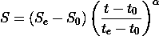
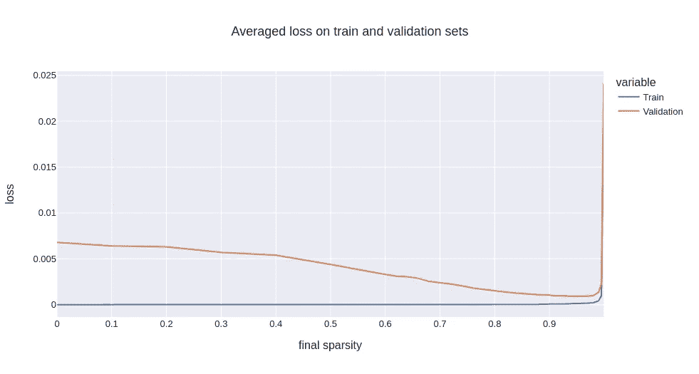
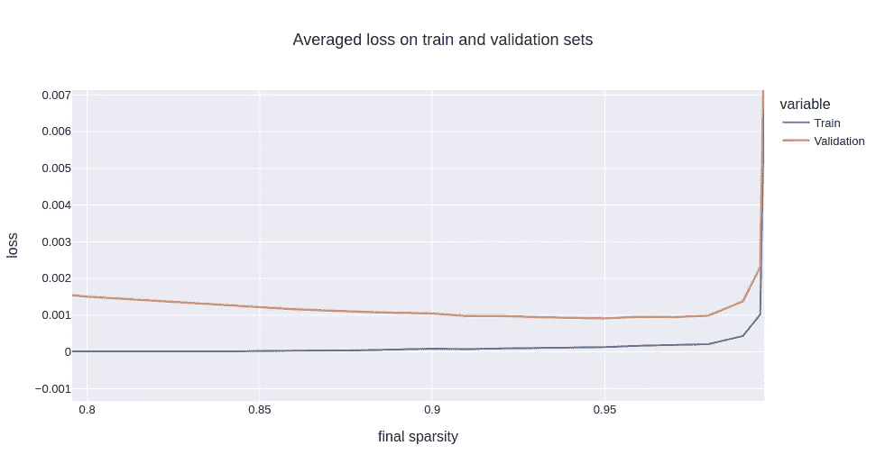

# 使用 TensorFlow API 在深度神经网络中剪枝模型

> 原文：<https://towardsdatascience.com/model-pruning-in-deep-neural-networks-using-the-tensorflow-api-7cf52bdd32>


艾蒂安·德洛里欧在 [Unsplash](https://unsplash.com?utm_source=medium&utm_medium=referral) 上拍摄的照片

机器学习中最常见的问题之一就是过拟合。这可能是由多种原因造成的[1]。为了解决这个问题，一个常见的解决方案是在模型中添加正则化项。另一种方法是通过减少参数的数量来降低模型的复杂性。要获得最佳解决方案，应结合使用这两种方法。在本文中，我们将探讨后者，更具体地说，如何使用 Tensorflow 模型优化 API 在 Keras Tensorflow 模型中合并模型修剪(包括删除模型中多余的权重)。

# 什么是修剪，为什么选择修剪？

修剪机器学习模型包括移除(永久设置为 0)某些权重。通常被修剪的权重是那些已经接近 0(绝对值)的权重。这阻止了模型过度拟合，因为在训练开始时被认为无用的权重不能再次被重新激活。

有不同的方法来修剪模型。人们可以在开始时修剪一些随机数量的权重。人们可以在训练结束时进行修剪，以简化模型并使其更轻。在这里，我们将看到如何建立一个修剪调度程序，它将在每批学习结束时慢慢修剪一些权重，直到达到所需的稀疏度(权重百分比设置为 0)。

有人可能想知道为什么模型应该被修剪，而不是从一开始就用较少的可训练参数初始化。这样做的原因是，为了增加模型容量，您可能希望保持一个相当复杂的模型架构，在特性之间有许多可能的交互，但是限制它们的数量。此外，微调哪些层的大小应该减少，哪些层的大小应该增加，以及哪些功能应该保留，往往是一项乏味而徒劳的工作。在训练过程中，为了一点一点地去除多余的权重，对模型进行修剪要简单得多。这种方法的一个优点是，它允许人们训练多个不同的模型，这些模型可能已经被不同地修剪，然后人们可以使用各种集成学习技术来组合这些模型[2]。这些集合模型通常比单一模型更加稳健。我们现在将看到如何实现这一技术。

# 张量流模型优化工具包

目标是在每个训练步骤(批次)结束时消除最弱的重量。虽然人们可以实现自己的回调来做到这一点，但幸运的是，已经存在一个名为 tensor flow Model Optimization(**TF mot**)的 Tensorflow API 来做这件事[3]。这个工具允许用户定义一个修剪调度程序，它将自动处理权重消除。调度程序遵循多项式衰减调度。一个提供初始稀疏度、最终稀疏度、开始修剪的步骤、结束修剪的步骤，最后是多项式衰减的指数。在每一步，该工具包将消除足够的权重，以使实现的稀疏度为:



多项式衰减调度程序的公式

其中 *S* 为稀疏度， *S* ₑ为最终稀疏度， *S* ₀为初始稀疏度， *t* 为当前时间步，tₑ为结束步， *t* ₀为开始步，α为指数。α的默认值是 3。为了找到最佳值，需要考虑其他超参数。理想情况下，应该在相当长的时间内一点一点地削减权重，以便网络有时间适应权重的损失。事实上，如果权重修剪得太快，就有删除权重的风险，这些权重可能仅仅是因为它们被初始化为接近 0，而网络没有时间学习。

为了更好地理解这些概念，我们将通过一个例子来说明如何在您的模型中应用修剪。

# 修剪:一个例子

修剪最适用于具有许多参数的模型(如 MLPs ),并且我们怀疑许多参数是无用的。当我们的数据集有许多特征(几百个)，但并不是所有的特征都是相关的时，就会出现这种情况。自然地，如果知道哪些特征是需要的，哪些是不需要的，那么在过程的特征工程步骤中，应该使用降维技术(例如 PCA、NMF [4]等)来消除不相关的特征。).然而，情况并非总是如此。

对于我们的示例数据集，我们将使用 **sklearn.datasets** 库的 *make_regression* 函数。此函数生成一个回归数据集，用户可以在其中指定所需的观测值数量、要素数量、相关要素数量以及数据的噪声程度。

```
**import** pandas **as** pd
**import** numpy **as** np
**from** sklearn.model_selection **import** train_test_split
**from** sklearn.datasets **import** make_regression*# Parameters of the data-set*
**n_samples** = 10000
**n_features** = 1000
**n_informative** = 500
**noise** = 3*# Create dataset and preprocess it*
x, y = **make_regression**(**n_samples**=n_samples, **n_features**=n_features, **n_informative**=n_informative, **noise**=noise)
x = x / **abs**(x).**max**(axis=0)
y = y / **abs**(y).**max**()
x_train, x_val, y_train, y_val = **train_test_split**(x, y, **test_size**=0.2, **random_state**=42)
```

现在我们有了我们的例子，让我们建立我们的模型。因为有大量的特征，并且为了我们的示例的目的，我们将设计一个具有许多参数的非常大的 MLP:

```
**import** tensorflow **as** tf
**from** tensorflow.keras.models **import** Sequential
**from** tensorflow.keras.layers **import** Dense, ReLU**model** = tf.keras.Sequential()
**model**.add(Dense(1024, kernel_initializer="he_normal", input_dim=n_features))
**model**.add(ReLU())
**model**.add(Dense(1024))
**model**.add(ReLU())
**model**.add(Dense(1))
```

这种架构产生了一个超过 2，000，000 个参数的模型，这是一个很大的数目，尤其是因为我们知道有一半的特性实际上是没有用的。我们如何整合修剪？这很简单。我们必须首先在字典中设置各种修剪参数。然后，我们使用 **tfmot** 使用修剪参数基于原始模型定义一个新模型。最后，我们添加一个修剪回调函数。

```
**import** tensorflow_model_optimization **as** tfmot**initial_sparsity** = 0.0
**final_sparsity** = 0.75
**begin_step** = 1000
**end_step** = 5000**pruning_params** = {
        'pruning_schedule': tfmot.sparsity.keras.PolynomialDecay(
            **initial_sparsity**=initial_sparsity,
            **final_sparsity**=final_sparsity,
            **begin_step**=begin_step,
            **end_step**=end_step)
    }**model** = tfmot.sparsity.keras.prune_low_magnitude(model, **pruning_params)
**pruning_callback** = tfmot.sparsity.keras.UpdatePruningStep()
```

然后，我们像往常一样编译和拟合模型，不要忘记在拟合步骤中添加回调:

```
**model**.compile(
    loss="mse",
    optimizer=tf.keras.optimizers.Adam(learning_rate=0.001)
)**model**.fit(
    x_train, 
    y_train, 
    epochs=200, 
    batch_size=1024, 
    callbacks= pruning_callback, 
    verbose=1
)
```

# 选择超参数

我们现在有了修剪所需的所有元素。但是效果如何呢？你如何设置参数？我通常总是将初始稀疏度保持在 0，除非你有目的地想要用非常不同的随机初始化来创建多个稀疏模型，以便聚集它们。我设置了 begin 步骤，以便在几个时期后开始修剪。我通常设置的最后一步是在几个时期内进行修剪(大约 10 个时期)。

根据我的经验，这些参数没有最终的稀疏度参数重要，最终的稀疏度参数实际上取决于手头的问题。在过拟合的情况下，模型在训练集上的性能将比在验证集上好得多。在模型中引入一些稀疏性很可能会降低训练集的性能，但会提高验证集的性能。进一步增加稀疏度将继续提高验证集的性能。显然，当最终稀疏度太大时，模型变得太简单，训练集和验证集的性能都将开始下降，这意味着我们的模型现在对数据拟合不足。因此，作为最终稀疏度的函数，验证集上的性能存在最小值。

# 结果

在下图中，我采用了前面提到的例子，并用不同的最终稀疏度训练了不同的模型。模型的性能是用不同的随机初始化在 10 个不同的训练上平均的:



[0，1]中最终稀疏度的训练集和验证集的平均损失

对于非常低的最终稀疏度，模型明显过拟合，如上图所示。验证集的损失比训练集的损失大几个数量级。随着最终稀疏度的增加，训练集的损失单调增加，而验证集的损失在大约 95%稀疏度时具有最小值，这导致模型具有大约 100，000 个参数。这在下图中可以看得更清楚:



[0.8，1]中最终稀疏度的训练和验证集的平均损失

# 结束语

在这篇短文中，我们看到了使用 Tensorflow 模型优化工具包在 Tensorflow 模型中实现修剪非常简单，只需添加几行代码。修剪是减少过度拟合的另一种方法，与其他常用方法(如正则化、剔除和批量归一化)一起使用。修剪在模型有大量参数和数据集有很多特征的情况下表现出色。根据奥卡姆剃刀原理，它允许一个人在保持节俭的同时训练大容量的模型。然后，可以通过集成学习技术将这些模型结合起来，以构建更健壮的模型。

## 感谢

我要感谢[尼古拉斯·莫里泽](https://medium.com/u/8f408c864b3d?source=post_page-----7cf52bdd32--------------------------------)和[克里斯托夫·盖斯勒](https://medium.com/u/8dd41142f97f?source=post_page-----7cf52bdd32--------------------------------)对本文写作的帮助和支持。

**参考文献**

[1][https://hastie.su.domains/ElemStatLearn/](https://hastie.su.domains/ElemStatLearn/)(第七章)

[https://link.springer.com/article/10.1007/s10462-009-9124-7](https://link.springer.com/article/10.1007/s10462-009-9124-7)

[https://www.tensorflow.org/model_optimization/](https://www.tensorflow.org/model_optimization/)

[https://hal.archives-ouvertes.fr/hal-03141876/document](https://hal.archives-ouvertes.fr/hal-03141876/document)

[【5】https://www . tensor flow . org/model _ optimization/guide/pruning/pruning _ with _ keras # fine-tune _ pre-trained _ model _ with _ pruning](https://www.tensorflow.org/model_optimization/guide/pruning/pruning_with_keras#fine-tune_pre-trained_model_with_pruning)

[https://www.jmlr.org/papers/volume22/21-0366/21-0366.pdf](https://www.jmlr.org/papers/volume22/21-0366/21-0366.pdf)

## 关于我们

[**Advestis**](https://www.advestis.com/) 是一家欧洲合同研究组织(CRO)，对统计和可解释的机器学习技术有着深刻的理解和实践。Advestis 的专长包括复杂系统的建模和时间现象的预测分析。
*领英*:[https://www.linkedin.com/company/advestis/](https://www.linkedin.com/company/advestis/)