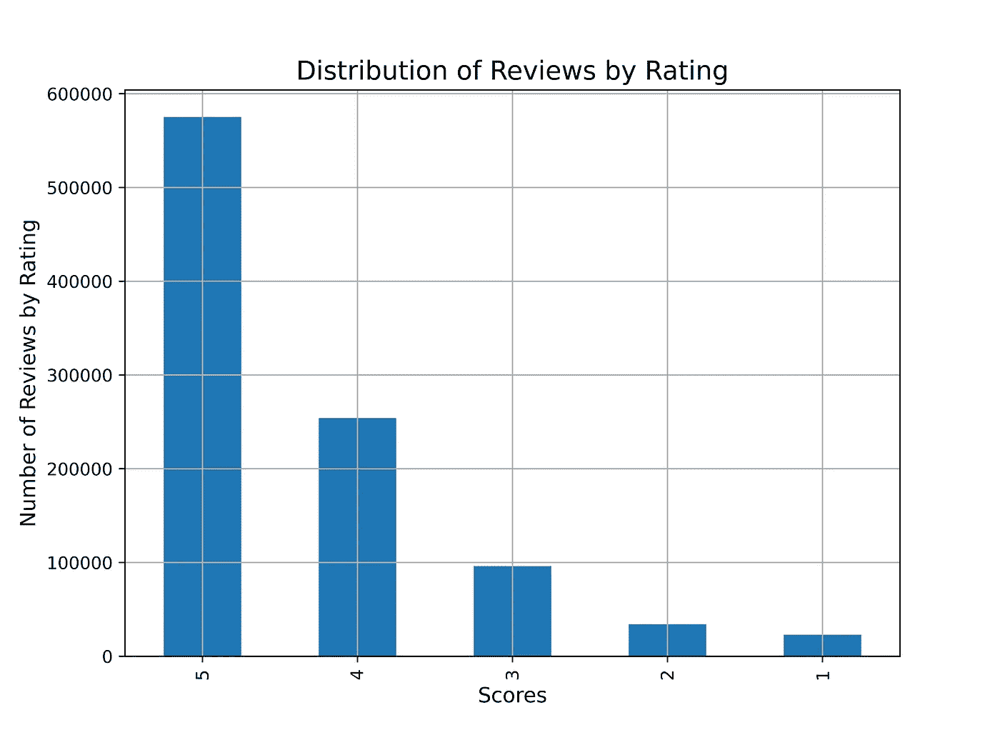
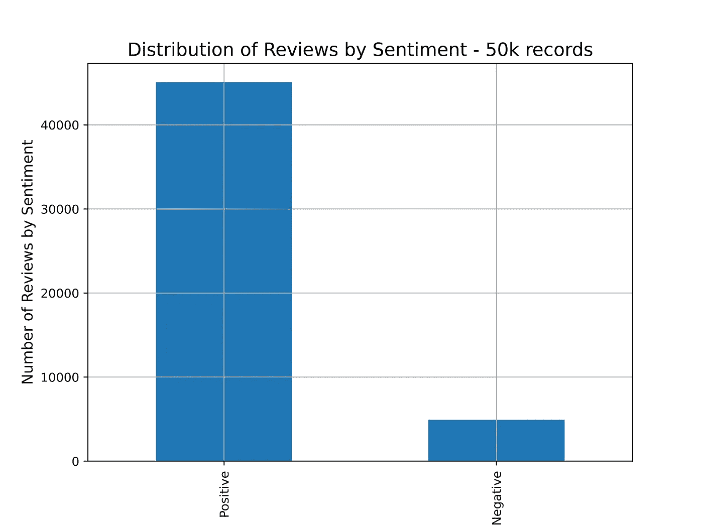
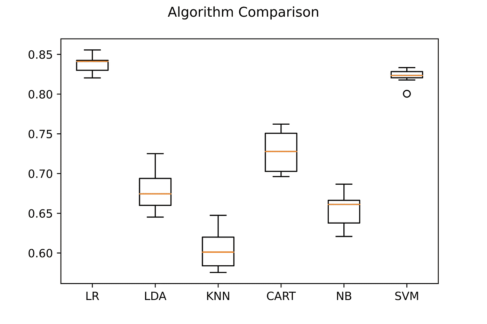

# 用 Python 实现亚马逊 Kindle 书评的模型选择和超参数调整

> 原文：<https://towardsdatascience.com/model-selection-and-hyperparameter-tuning-on-amazon-kindle-book-reviews-with-python-6d17ec46d318>

## 基于模型选择和超参数优化的书评情感分析


Emil Widlund 在 [Unsplash](https://unsplash.com?utm_source=medium&utm_medium=referral) 上拍摄的照片

# 介绍

这篇文章旨在选择和部署最佳的机器学习模型，对亚马逊 Kindle 商店的书评数据集进行情感分析。

在之前的一篇文章中，我们在一个 [IMDB](https://www.kaggle.com/lakshmi25npathi/imdb-dataset-of-50k-movie-reviews) 电影评论数据库上优化了一个支持向量机算法。虽然 SVM 是分类问题的一个很棒的算法，但它也是最好的选择吗？对于这个新项目，现在的目标是包含模型选择机制。

通过管道化多个模型，我们可以从不同的方面比较它们，包括准确性和效率。

# 数据

你可以在下面的[链接](https://www.kaggle.com/datasets/bharadwaj6/kindle-reviews)中找到这个数据集，它由大约 1，000，000 篇书评组成[1][6]。目标是通过对数据集的一部分进行训练，产生一个高性能的情感分析器。如果你想复习什么是情绪分析，我可以建议快速阅读[这篇文章](https://giovanni-valdata.medium.com/what-is-sentiment-analysis-and-what-are-the-top-two-tools-to-perform-it-in-python-da21e0c3cd3)，它涵盖了所有的基础知识。

csv 文件的结构包括 10 列:

*   `asin` -产品的 ID，如 B000FA64PK
*   `helpful` -评价的有用性等级-例如:2/3。
*   `overall` -对产品的评级。
*   `reviewText` -审查文本(标题)。
*   `reviewTime` -审查时间(未加工)。
*   `reviewerID` -审核人的 ID，如 A3SPTOKDG7WBLN
*   `reviewerName` -审核人的姓名。
*   `summary` -评审总结(描述)。
*   `unixReviewTime` - UNIX 时间戳。

对于该算法，我们只需要两个:评论语料库及其评级。

以下是一个示例评论:

```
I enjoy vintage books and movies so I enjoyed reading this book.  The plot was unusual. Don't think killing someone in self-defense but leaving the scene and the body without notifying the police or hitting someone in the jaw to knock them out would wash today. Still it was a good read for me.
```

正如您所注意到的，该文本呈现出很少的“特殊”字符，这使得它更容易清理。最重要的是，我们应该删除所有不增加价值的介词和代词，因为它们太复杂了。

# 文本处理

尽管文本预处理不是本文的重点，我还是要简单解释一下，如果你想了解更多细节，请点击下面的链接，链接到我以前的文章之一。

在自然语言处理领域，文本包含各种各样对 ML 算法没有用的符号和单词。因此有一个阶段，称为文本处理，指的是文本的分析、处理和生成[2]。

这使得 ML 模型更容易训练，因为它减少了“噪声”，即对于预测无用的信息量。

# 模型

对于这个特殊的分类问题，我考虑了 7 种流行的高性能机器学习算法。每种方法都有其独特之处，很可能会返回与其他方法不同的结果:

*   **线性判别分析(LDA)** 关注组间方差的最小化以及组间方差的最大化。换句话说，该算法跟踪保证最大类别可分性的超平面(帮助分类数据点的决策边界)。
*   **k 个最近邻居(kNN)** 创建多个 *k 个*最近邻居的数据记录 *t* 的“邻域”。然后，多数表决机制决定该记录 *t* 是否属于该类。该方法不考虑基于距离的加权。
*   [**高斯朴素贝叶斯**](https://medium.com/mlearning-ai/a-bow-vs-a-tfidf-feature-extractor-a-practical-application-on-a-na%C3%AFve-bayes-classifier-in-python-a68e8fb2248c) 是一种概率分类器。简单和高效是它最显著的特点。贝叶斯定理是分类器的基础。它计算一个记录属于某个类别的概率[3]。
*   利用给定的独立变量数据集，**逻辑回归**计算事件发生的概率。为此，首先使用一个函数计算赔率，该函数返回一个介于 0 和 1 之间的数字，其中 0 表示不太可能发生。最后，应用 logit 变换将结果精确分类为 0 或 1。
*   **决策树分类器(CART)** 是一种通过“询问”一系列问题来分离数据的模型，因此决定将一个新记录放在哪个桶中。这会创建一个树形图，其中每个节点代表一个问题，每个叶子代表一个用于预测的输出变量。
*   [**【SVM】**](/sentiment-analysis-on-a-imdb-movie-review-dataset-with-a-support-vector-machines-model-in-python-50c1d487327e)**支持向量机是非概率分类器。与 LDA 类似，SVM 采用了超平面的概念。假设两个类是线性可分的，它们可以被超平面所除。在此基础上，该算法旨在通过在称为“向量”的超平面上的两条线来最大化类别 1 和类别 2 之间的空间。**

## **超参数**

**在定义超参数之前，定义一个“标准”参数很重要。当一个模型收敛时，我们可以说它找到了描述它所训练的数据的一般行为的最佳参数组合。**

**每个机器学习模型都有一个隐喻性的架构。超参数让用户有机会使用实验方法找到模型“结构”的最佳配置。假设有 5 个超参数，每个超参数有 10 种可能的设置，当专业人员尝试各种设置组合直到性能达到峰值时，就会发生“调整”。例如，超参数 1 可能等于 5，超参数 2 可能等于 0.2，依此类推。**

**我想强调参数和超参数之间的根本区别。前者也意味着系数或权重，这是学习过程的结果。后者由用户在训练前手动设置。**

# **代码部署**

## **数据可视化**

**代码部署的第一部分侧重于数据探索和可视化。与文本评论相关的分数分布可以告诉我们有价值的信息。**

```
**#Importing libraries**
import matplotlib.pyplot as plt
import pandas as pd**#Reading Dataset**
df = pd.read_csv('kindle_reviews.csv')**#Counting values within each review bucket**
category_dist = df['overall'].value_counts()**#Defining chart**
plt.figure(figsize=(8,6))
category_dist.plot(kind='bar')
plt.grid()
plt.xlabel("Scores", fontsize = 12)
plt.ylabel("Number of Reviews by Rating", fontsize = 12)
plt.title("Distribution of Reviews by Rating", fontsize = 15)**#Generating chart**
plt.show()
```

****

**按评级列出的评论分布—按作者列出的图表**

**绝大多数评论都集中在 4 星和 5 星之间，这通常是不好的。数据集是不平衡的，因此当我们训练它时，算法可能会有偏差。**

**最重要的是，研究表明，与多类分类相比，二元分类总体上更准确[4]。由于我们要有更高的精度，我们需要将这个项目转化为一个二元分类问题。**

**进行改变的一种可能方式是将所有高于 3 分的评论视为“正面的”，而将所有低于 3 分(包括 3 分)的评论视为“负面的”。接下来的步骤是仅对数据集的一部分执行模型选择。**

**在将近 1，000，000 行上确定最佳模型可能会大幅增加处理时间，而不会增加任何越来越有价值的性能信息。**

**在从原始数据集中选择 50，000 行并将检查分数分成两类后，最终结果应该如下所示:**

****

**仅分析 50，000 条记录的评论分布(按情感分类)——按作者分类的图表**

## **文本清理**

**代码部署的第二部分侧重于文本清理。如前所述，句子中的单词越多，复杂度越高，但对准确性的贡献却微乎其微。**

**解决方案在于消除停用词。在英语中，**、【the】、**、**、**等都可以作为停用词。在文本挖掘中，停用词被定义为携带很少有用信息的不重要的词。**

**最重要的是，单词需要统一，全部小写，特殊字符需要消除。如果我们在前面看到的例句上部署代码，结果类似如下:**

```
enjoy vintage books movies enjoyed reading book plot unusual think killing someone self defense leaving scene body without notifying police hitting someone jaw knock would wash today still good read
```

**你会同意我的观点，现在消极和积极的词更容易识别，例如，“享受”，“享受”和“好”标志着潜在的积极评价。检查后，评论家给这本书打了 5 颗星。在项目结束时，我们的模型应该将此归类为“积极”。**

**最后一步是增加负面评论的数量，直到它们达到相同数量的正面评论。“上采样”人工生成少数类的数据点，并将它们添加到数据集中。该过程旨在使两个标签具有相同的计数，并防止模型偏向多数类。**

## **型号选择**

**代码部署的第三部分侧重于为我们的数据选择性能最佳的模型。**

*   *****Scikit-learn*** 和 ***matplotlib*** 是唯一需要的两个库。Sklearn 包括对数据执行机器学习所需的所有功能。每个模型需要分配一个“子库”:逻辑回归、KNeighborsClassifier、决策树分类器、SVC、GaussianNB 和线性判别分析。**
*   **在上一节中，我们使用了一种称为“上采样”的技术来匹配负面书评和正面书评的数量。在这个阶段，我们可以从数据中定义输入和目标变量。输入变量 ***x*** 为“ ***reviewText*** ”，包含评论的语料库；输出变量 ***y*** 为“*”，包含标签“ ***正*** ”和“ ***负*** ”。***
*   ***我们知道，一些用于分析的模型，包括决策树分类器，需要一个密集的矩阵。密集矩阵大多包含非零值。密集转换器类确保所有矩阵都是密集的，以避免任何错误。***
*   ***然后创建一个名为“模型”的列表，然后将分配给每个模型的对象添加到列表中。另一方面，列表“结果”将包含与其名称相关联的所有不同的模型分数。***
*   ***kfold 参数表示我们需要多少 k 倍。这引入了交叉验证的概念。交叉验证旨在更好地估计模型的准确性。它被定义为 k 重交叉验证，k 是数据被划分的子组数。该模型在一个子组上训练，并在剩余的 k-1 上测试。准确度是根据平均分计算的。***
*   ***管道在 k-fold of choice 上应用计数矢量器、密集转换器和选择模型，并执行交叉验证。然后它在控制台上打印结果。***
*   ***matplotlib 最后生成一个箱线图，这样我们就可以更好地解释结果。***

***为我们的数据寻找性能最佳的模型***

******

***模型选择过程后算法的准确性比较—作者提供的图表***

***箱线图为您提供了关于我们的模型在精确度方面的五个临界值的信息:最小值、第一个四分位数(25%)、中值(第二个四分位数)、第三个四分位数(75%)和最大值。***

***在 x 轴上，有所有用于交叉验证分析的模型。相反，在 y 轴上，我们有准确度分数。例如，逻辑回归模型是表现最好的模型，其最小精度为 0.82，最大精度为 0.86，但是支持向量机保证了最一致的性能，其最小值和最大值彼此接近。KNN 是表现最差的，表现出很少的一致性。LDA、CART 和朴素贝叶斯也表现不佳。***

***由于上述原因，超参数优化现在将集中在两个性能最高的模型上:逻辑回归和支持向量机。***

## ***支持向量机超参数调整***

***代码部署的第四部分关注支持向量机模型的超参数调整:***

*   ***在前一个代码单元中已经导入了库，但是我决定重新导入它们以使这个代码片段独立***
*   ***这次的流水线只包括计数矢量器和支持向量机模型，不需要密集转换器***
*   ***转到参数列表，这些参数包含 grid_search 将为管道的每个组件尝试的所有可能的超参数组合。例如，计数矢量器的参数 *max_df* 负责模型的泛化。Max_df 删除出现太频繁的单词，max_df 为 0.7 会忽略出现在 70%以上文档中的术语。在一个场景中，“ *vect__max_df* ”将使用内核 *poly* 和 C 参数 10，将 0.7 的 *max_df* 与(1，1)的 *ngram_range* 组合起来。因为每个交叉验证进行了 5 次，所以总“适合”(组合)是 405。***
*   ***在启动 *grid_search.fit* 之后，最后一部分代码开始在控制台上打印计算结果***

***为计数矢量器和 SVM 模型寻找最佳参数***

***结果如下:***

```
*Best: 0.840734 using {'SVM__C': 10, 'SVM__kernel': 'rbf', 'vect__max_df': 0.7, 'vect__ngram_range': (1, 2)} 0.730129 (0.038366) with: {'SVM__C': 10, 'SVM__kernel': 'poly', 'vect__max_df': 0.7, 'vect__ngram_range': (1, 1)} 0.692791 (0.049500) with: {'SVM__C': 10, 'SVM__kernel': 'poly', 'vect__max_df': 0.7, 'vect__ngram_range': (1, 2)}*
```

***性能最佳的超参数设置是:***

*   ***C = 10***
*   ***核类型= rbf***
*   ***max_df = 0.7***
*   ***ngram_range = (1，1)***

***如果我们对 90，000 个向上采样的行应用上面找到的具有优化的超参数的管道，并且我们计算精确度方面的性能，结果是相当惊人的。针对 kindle 评论优化的支持向量机模型在分类新数据方面的效率为 99%。大约 **1 小时**的处理时间后显示结果。***

```
 *precision    recall  f1-score   support    Negative       0.98      1.00      0.99      8924     
    Positive       1.00      0.98      0.99      9109          accuracy                           0.99     18033    
   macro avg       0.99      0.99      0.99     18033 
weighted avg       0.99      0.99      0.99     18033*
```

## ***逻辑回归超参数调整***

***代码部署的第五部分关注逻辑回归算法的超参数优化。所有代码都与上一节极其相似，只有很少的重要区别。***

***逻辑回归模型需要一个参数来表示它可以达到的最大迭代次数，没有这个参数，模型就不会收敛。最重要的是，与 SVM 模型相比，求解器的类型发生了变化。考虑用于分析的解算器是“牛顿-cg”、“lbfgs”和“liblinear”。***

***为计数向量机和逻辑回归模型寻找最佳参数***

***结果如下:***

```
*Best: 0.857362 using {'LR__C': 1.0, 'LR__solver': 'newton-cg', 'vect__max_df': 0.7, 'vect__ngram_range': (1, 3)}

0.825643 (0.003937) with: {'LR__C': 100, 'LR__solver': 'newton-cg', 'vect__max_df': 0.7, 'vect__ngram_range': (1, 1)} 0.852704 (0.004520) with: {'LR__C': 100, 'LR__solver': 'newton-cg', 'vect__max_df': 0.7, 'vect__ngram_range': (1, 2)}*
```

***性能最佳的超参数有:***

*   ***C = 1***
*   ***求解器=牛顿-重心***
*   ***max_df = 0.7***
*   ***ngram_range = (1，3)***

***同样，如果我们对 90，000 个向上采样的行应用具有优化超参数的逻辑回归模型，结果非常接近 SVM 模型。在任何与机器学习相关的场景中，都很难达到 98%的准确率。这次的处理时间大致是 **3 分钟**。***

```
 *precision    recall  f1-score   support

    Negative       0.97      1.00      0.98      8924     
    Positive       1.00      0.96      0.98      9109 accuracy                           0.98     18033    
   macro avg       0.98      0.98      0.98     18033 
weighted avg       0.98      0.98      0.98     18033*
```

## ***测试算法***

***SVM 和逻辑回归在准确性方面都表现出色。如果我们只根据这个参数来选择算法，那么支持向量机模型将是最佳选择。然而，需要考虑的另一个重要方面是:处理时间。SVM 模型在 70，000 行上训练需要一个小时，而逻辑回归只需要 3 分钟。当涉及到模型部署时，准确性之上的计算效率是基础。***

***在这个阶段，需要进行最后的检查。“*测试*包含一个肯定句，而“*测试 _ 1”*包含一个否定句。***

```
*##Testing Algorithm on single sentences
test = ['The book was really good, I could have not imagined a better ending']test_1 = ['The book was generally bad, the plot was boring and the characters were not original']test = count_vect.transform(test).toarray()
test_1 = count_vect.transform(test_1).toarray()#Printing prediction
print(LR.predict(test))
print(LR.predict(test_1))*
```

***下面的输出显示，经过训练的分类器正确地预测了一篇书评是正面的还是负面的。***

```
*Output:['Positive'] 
['Negative']*
```

## *****结论*****

***本文展示了模型选择和超参数调整如何显著提高精度，并提供了其他方面的全貌。我们从 6 个模型开始，4 个被过滤掉了，剩下的两个有很好表现的模型中，只有一个有可能进入生产。多亏了来自亚马逊 Kindle 商店的非常结构化的数据，除了单独确定情绪之外，还会有如此多的未来项目。从人工智能开始，它可以在一本书出版前对其进行评论和评级，或者在书籍被添加到商店后立即了解哪些书会做得很好。尤其是机器学习，可能性是无穷无尽的。***

****最后一点，如果您喜欢该内容，请考虑添加一个关注，以便在新文章发布时得到通知。如果你对这篇文章有什么要考虑的，写在评论里吧！我很想读读它们:)谢谢你的阅读！****

****PS:如果你喜欢我写的东西，如果你能通过* [*这个链接*](https://giovanni-valdata.medium.com/membership) *订阅一个中等会员，那对我来说就是全世界。这是一种间接的支持我的方式，你会得到媒体文章提供的惊人价值！****

***参考***

***[1]麦考利，J. (2018)。亚马逊评论数据。检索于 2022 年 7 月 31 日，来自 Ucsd.edu 网站:[http://jmcauley.ucsd.edu/data/amazon/](http://jmcauley.ucsd.edu/data/amazon/)***

***[2]阿佩尔，o .，奇克拉纳，f .，卡特，j .，&藤田，H. (2016 年 5 月 19 日)。句子级情感分析问题的混合方法。检索于 2022 年 7 月 30 日，来自 ResearchGate 网站:[https://www . ResearchGate . net/publication/303402645 _ A _ Hybrid _ Approach _ to _ the _ opinion _ Analysis _ Problem _ at _ the _ Sentence _ Level](https://www.researchgate.net/publication/303402645_A_Hybrid_Approach_to_the_Sentiment_Analysis_Problem_at_the_Sentence_Level)***

***[3] Raschka，s .，& Mirjalili，V. (2014 年)。*朴素贝叶斯和文本分类 I 导论和理论*。从 https://arxiv.org/pdf/1410.5329.pdf[取回](https://arxiv.org/pdf/1410.5329.pdf)***

***[4]杰哈，a .，戴夫，m .，，马丹，S. (2019)。使用不同数据挖掘分类技术的二分类器和多分类器的比较。 *SSRN 电子杂志*。[https://doi.org/10.2139/ssrn.3464211](https://doi.org/10.2139/ssrn.3464211)***

***[5]何，r .，&麦考利，j .(未注明)。*沉浮:用一类协同过滤对流行趋势的视觉演变建模*。[https://doi.org/10.1145/2872427.2883037](https://doi.org/10.1145/2872427.2883037)***