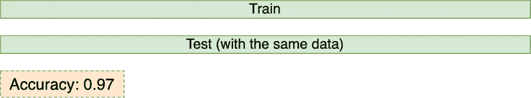
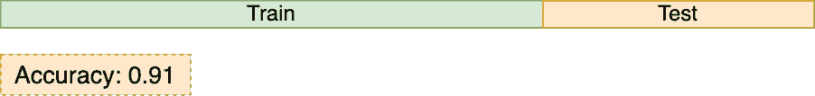
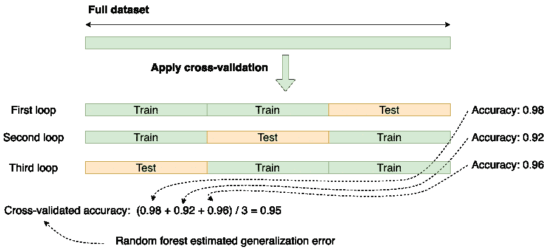
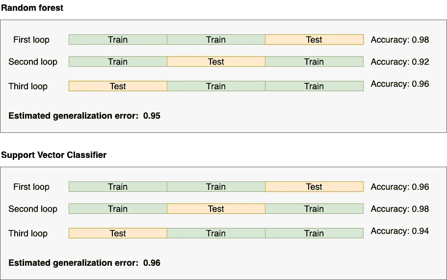
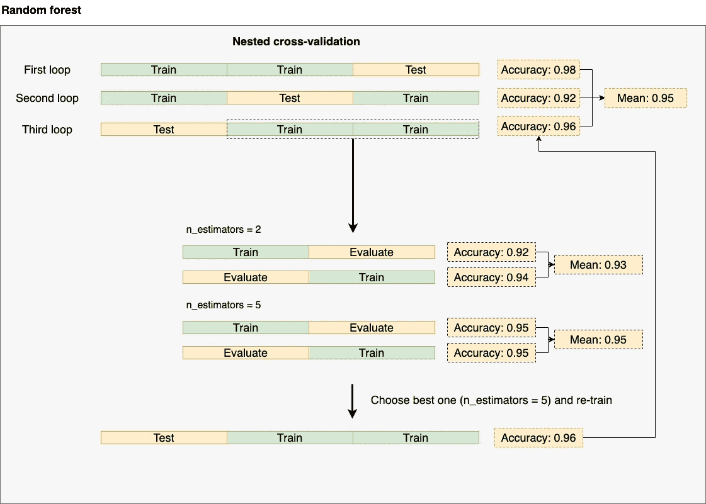
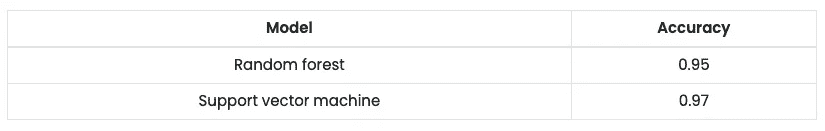
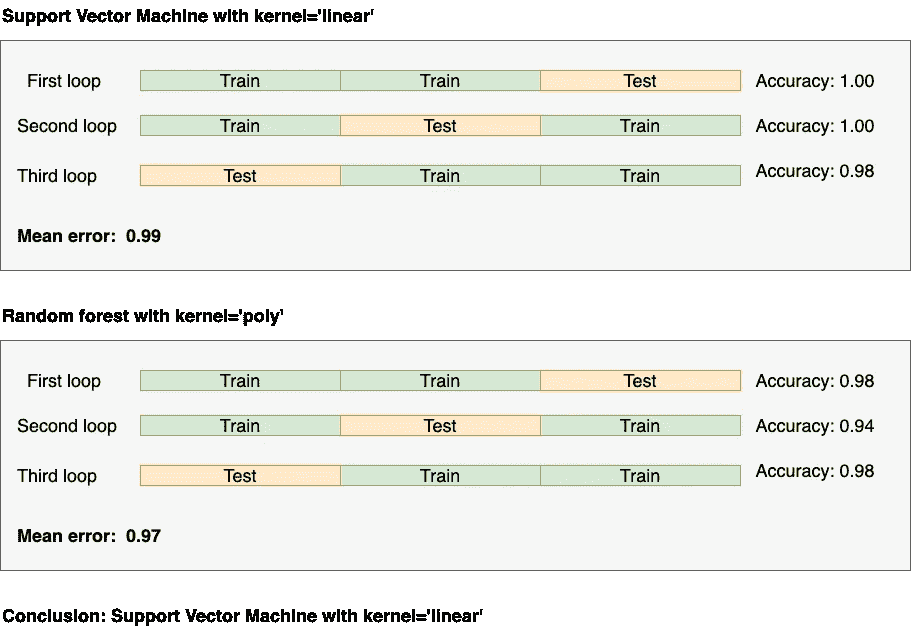
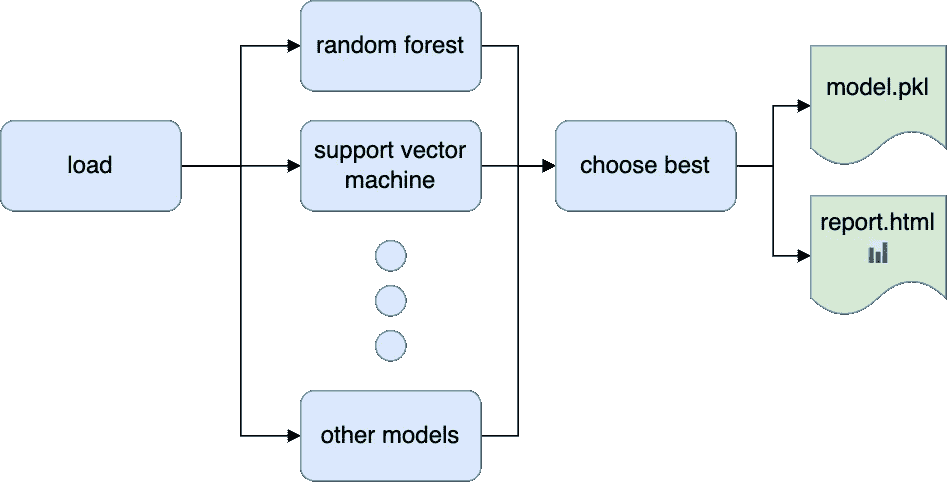

# 正确选择模型:嵌套交叉验证的温和介绍

> 原文：<https://towardsdatascience.com/model-selection-done-right-a-gentle-introduction-to-nested-cross-validation-d396af25bb03>

## 实用机器学习

## 了解如何使用这一重要的机器学习技术


由 [Unsplash](https://unsplash.com?utm_source=medium&utm_medium=referral) 上的 [Edge2Edge 媒体](https://unsplash.com/@edge2edgemedia?utm_source=medium&utm_medium=referral)拍摄

本文将回顾机器学习中最重要的技术之一:嵌套交叉验证。当部署一个模型时，我们从几个选择(例如，随机森林与支持向量机)中选择具有超参数的最佳组合(例如，具有 50 棵树的随机森林与具有 5 棵树的随机森林)的最佳选择。但是，我们还需要估计泛化误差(模型在生产中的表现)。**嵌套交叉验证允许我们找到最佳模型并正确估计其泛化误差。**

在文章的最后，我们提供了一个用 [Ploomber](https://github.com/ploomber/ploomber) 开发的示例项目，您可以重用您的数据，立即开始运行嵌套的交叉验证！

# 为什么我们需要交叉验证？

让我们想象一下，我们正在进行一个机器学习项目，我们已经完成了清理数据和获得一些训练集的繁重工作，并且我们训练了它。我们准备好部署它了吗？

不完全是。在部署之前，我们想知道该模型在生产中的表现如何。为此，我们可以计算一个评估指标，比如说准确性。

我们使用哪些数据来计算指标？一种方法是为我们的训练集中的所有观察值生成预测，并计算评估度量:



图片作者。

这是它在代码中的样子:

**控制台输出:(1/1):**

```
Accuracy: 0.97
```

这种方法在方法上是不正确的:**我们不应该用相同的数据进行训练和评估**，因为我们的模型已经看到了训练示例。因此，它可以简单地记住标签，并具有完美的准确性。

我们将数据分为两部分:模拟生产条件的训练和测试(根据看不见的数据进行预测)。用第一部分拟合我们的模型，用第二部分评估。



图片作者。

下面是如何用代码实现的:

**控制台输出:(1/1):**

```
Accuracy: 0.91
```

我们可以看到这次的估计值更低了(0.91 vs . 0.97)；较高的估计是对我们的模型将如何表现的过于乐观的估计。

因此，这种基本的训练/测试方法比第一种方法更好。尽管如此，它还有一个问题:对测试集的选择是明智的。

我们可以幸运地选择一个*简单的测试集*导致一个过于乐观的泛化错误(或者不幸地有一个过于悲观的估计)。因此，为了覆盖我们的地面，我们可以这样做:重复相同的过程多次，平均结果；这个过程被称为交叉验证:



图片作者。

总之:交叉验证为我们提供了一种可靠的方法来评估我们的模型在生产中的性能。

让我们来实现它:

**控制台输出:(1/1):**

```
Cross-validated accuracy: (0.98 + 0.92 + 0.96) / 3 = 0.95
```

所以现在我们得到了一个结果(0.95)，介于第一种(方法错误)方法(0.97)和第二种训练/测试方法(0.91)之间。

# 型号选择

我们有一种通过交叉验证来估计泛化误差的方法，但是我们还没有完成。有很多模型可用:随机森林、XGBoost、支持向量机、逻辑回归等。因为我们不知道哪一种效果最好，所以我们尝试了几种。

所以假设我们尝试随机森林和支持向量机。我们已经有了随机森林的结果，现在让我们在支持向量机上运行交叉验证。

**控制台输出:(1/1):**

```
Cross-validated accuracy: (0.96 + 0.98 + 0.94) / 3 = 0.96
```

让我们总结一下结果:



图片作者。

根据结果，我们应该使用支持向量机。

然而，我们并没有改变模型的参数(例如，一个拥有大量树木的随机森林)。那么，有没有可能我们做出了一个次优的决定？

让我们尝试几个实验，这一次，用几个超参数训练两个模型(使用我们的交叉验证程序):

**控制台输出:(1/1):**

```
SVC(kernel='linear', random_state=0):
    Cross-validated accuracy: (1.00 + 1.00 + 0.98) / 3 = 0.99SVC(kernel='poly', random_state=0):
    Cross-validated accuracy: (0.98 + 0.94 + 0.98) / 3 = 0.97 RandomForestClassifier(n_estimators=2, random_state=0):
    Cross-validated accuracy: (0.98 + 0.92 + 0.96) / 3 = 0.95RandomForestClassifier(n_estimators=5, random_state=0):
    Cross-validated accuracy: (0.98 + 0.94 + 0.94) / 3 = 0.95
```

基于这些结果，我们得到了一个更好的模型！0.99 精度的线性核的支持向量机！

不完全是。这里有一个方法上的错误。

我们强行找到了最好的模型。[本文](https://jmlr.csail.mit.edu/papers/volume11/cawley10a/cawley10a.pdf)证明了当我们使用(普通的)交叉验证方法优化超参数**和**模型选择时，可能会出现过于乐观的泛化误差(由于[过度拟合](https://en.wikipedia.org/wiki/Overfitting))。

# 输入嵌套交叉验证

我们使用嵌套交叉验证来修复上述错误，这提供了一种更准确的方法来估计泛化错误，同时还优化了超参数。

它之所以得名，是因为我们有效地嵌套了两个交叉验证过程。让我们看看它在实践中是怎样的:



图片作者。

我们嵌套了两个交叉验证循环。看第三个作为参考。在进行初始剥离后，我们再次剥离(2/3 的数据)。内部循环优化超参数:我们为每个超参数配置(在这种情况下，`n_estimators = 2`和`n_estimators = 5`)进行训练，计算交叉验证的度量(平均值)并挑选最佳超参数配置(在这种情况下，`n_estimators = 5`)，然后，我们进入外部循环，使用最佳配置(`n_estimators = 5`)重新训练并报告准确度。我们重复同样的过程，直到完成。

在这个过程结束时，我们将有一个表格，报告每个模型的估计泛化误差；让我们运行它:

**控制台输出:(1/1):**

```
GridSearchCV(estimator=RandomForestClassifier(random_state=0), param_grid={'n_estimators': [2, 5]}):
    Cross-validated accuracy: (0.98 + 0.92 + 0.96) / 3 = 0.95 GridSearchCV(estimator=SVC(random_state=0), param_grid={'kernel': ['linear', 'poly']}):
    Cross-validated accuracy: (1.00 + 0.94 + 0.98) / 3 = 0.97
```



模型性能总结。图片作者。

有了这些信息，我们可以自信地选择支持向量机作为我们的赢家模型。我们还可以说，它的估计泛化误差为 0.97(看，这低于我们之前没有使用嵌套交叉验证时的估计值 0.99)。

作为最后一步，我们运行最后的交叉验证程序，以找到最佳参数。注意这是一个普通的交叉验证过程:



图片作者。

代码如下:

**控制台输出:(1/1):**

```
SVC(kernel='linear', random_state=0):
    Cross-validated accuracy: (1.00 + 1.00 + 0.98) / 3 = 0.99SVC(kernel='poly', random_state=0):
    Cross-validated accuracy: (0.98 + 0.94 + 0.98) / 3 = 0.97
```

所以现在我们已经准备好部署:我们将使用`kernel = 'linear'`部署支持向量机！

但是考虑一个关键点:我们将报告 0.97(通过嵌套的交叉验证过程)作为我们的泛化估计，而不是这里得到的 0.99。

就是这样！现在，您已经具备了嵌套交叉验证技术，可以选择最佳模型并优化超参数！

# 示例代码



图片作者。

为了您的方便，我们为您准备了一个示例 [Ploomber](https://github.com/ploomber/ploomber) 管道，让您快速上手；以下是获得它的方法:

一旦执行了管道，检查一下`output/report.html`文件，它将包含嵌套交叉验证过程的结果。编辑`tasks/load.py`来加载你的数据集，再次运行`ploomber build`，你就可以开始了！您可以编辑`pipeline.yaml`来添加更多模型并并行训练它们。

# 警告

在我们的示例中，我们只评估了两种配置的两个模型。然而，由于我们嵌套了两个交叉验证过程，培训程序的数量像雪球一样越滚越大。如果我们添加更多的模型和超参数，我们很快就会被要求运行数百个训练程序来找到最佳模型。所以，为了加快结果，你可能想要并行运行所有这些实验；用 Ploomber 在一台机器上就可以轻松做到。不过，如果你想在多台机器上分配工作，你必须建立一些云基础设施。或者，您可以尝试 [Ploomber Cloud](https://docs.ploomber.io/en/latest/cloud/cloud-execution.html) ，它将快速启动必要的资源，在云中执行您的代码(并将作业并行化)，获得结果，并关闭基础架构，这样您就不会让那些昂贵的服务器继续运行。不用离开你的笔记本。

# 最后的想法

在我作为数据科学家的日子里，我花了一些时间来完全掌握嵌套交叉验证的概念。所以希望这篇帖子对你有帮助。你有什么问题吗？请联系我们的[社区](https://ploomber.io/community)，我们很乐意为您提供帮助。

*最初发表于* [*ploomber.io*](https://ploomber.io/blog/nested-cv/)