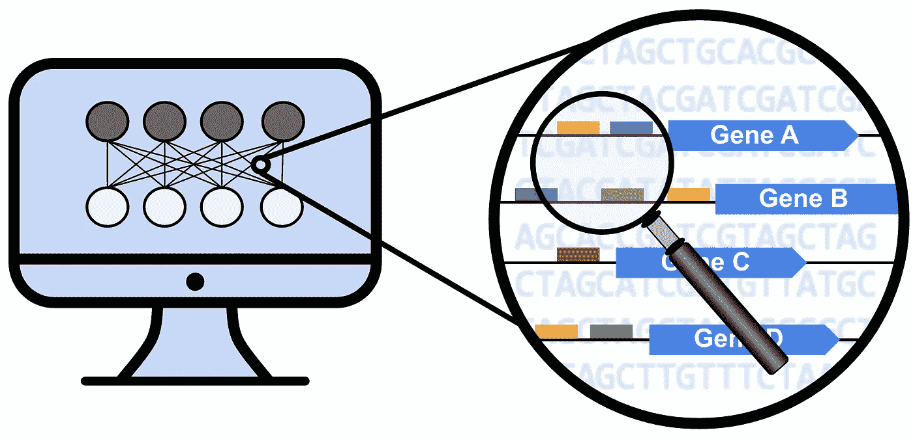
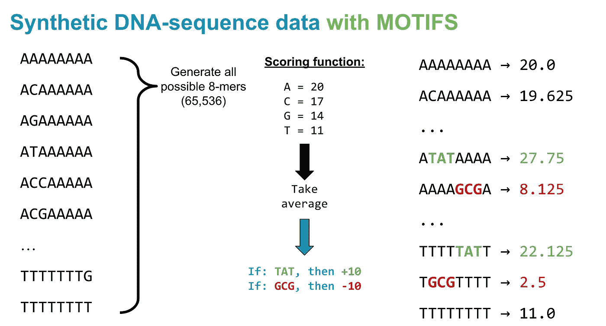
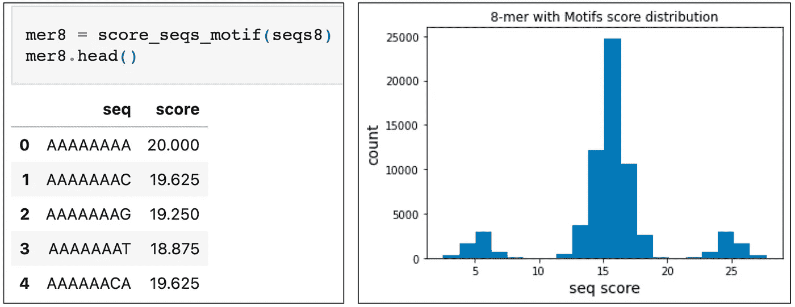
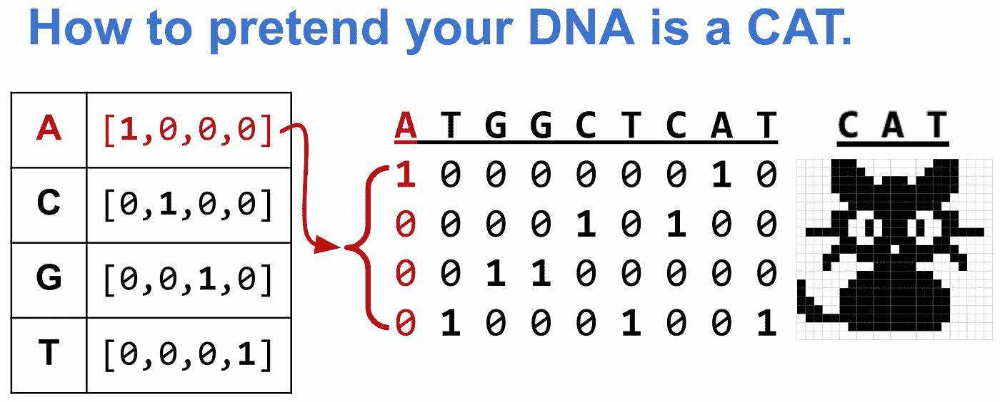
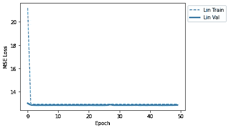
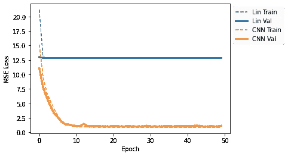
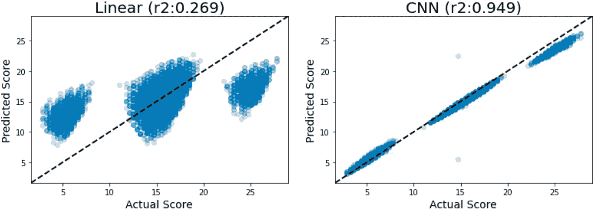
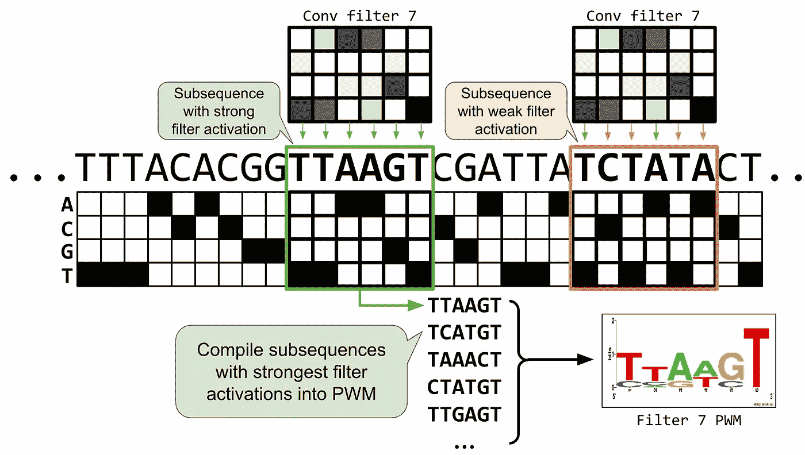
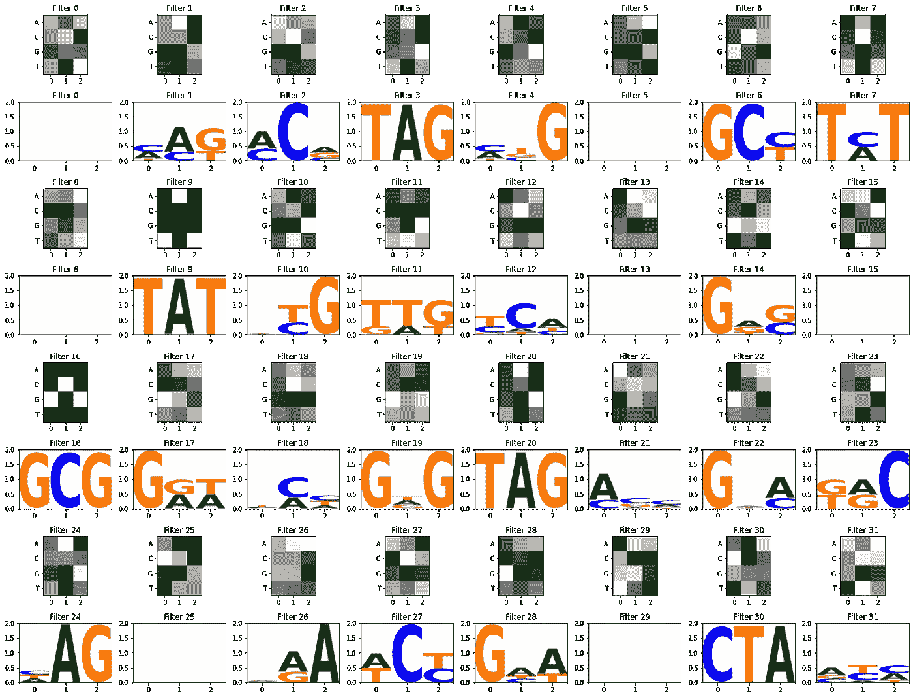

# 用 PyTorch 建模 DNA 序列

> 原文：<https://towardsdatascience.com/modeling-dna-sequences-with-pytorch-de28b0a05036>

## 适合初学者的教程



作者图片

DNA 是一个复杂的数据流。虽然它可以用一串 ACTGs 来表示，但它充满了复杂的模式和结构上的细微差别，人类很难通过查看原始的核苷酸序列来理解。近年来，利用深度学习对 DNA 数据建模取得了很大进展。

研究人员应用了卷积神经网络(CNN)、长短期记忆网络(LSTMs)、甚至变压器等方法，直接从 DNA 序列预测各种基因组测量值。这些模型特别有用，因为有了足够多的高质量训练数据，它们可以自动拾取与预测任务相关的序列模式(或基序)，而不需要专家事先指定要寻找哪些模式。总的来说，人们越来越热衷于在基因组学中使用深度学习来帮助将 DNA 序列映射到它们的生物功能！

作为一名对使用计算方法解决可持续性和合成生物学挑战感兴趣的研究生，我一直在学习如何使用 PyTorch 研究 DNA 序列模式。不缺少关于如何开始使用 PyTorch 的教程，但是许多教程倾向于关注图像或语言输入数据。对于使用 DNA 作为输入，有许多伟大的项目已经开发了 PyTorch 框架来模拟各种生物现象[ [1](https://github.com/FunctionLab/selene) 、 [2](https://github.com/davek44/Basset) 、 [3](https://github.com/jerryji1993/DNABERT) ]，但是它们可能非常复杂，对于初学者来说很难钻研。

我在为 PyTorch 新手寻找那些*也*关注 DNA 数据的初学者例子时遇到了一些困难，所以我编写了一个快速教程，以防将来的 DNA 建模者发现它对入门有帮助！

教程本身可以作为一个 [**Jupyter 笔记本**](https://github.com/erinhwilson/dna-pytorch-tutorial) 交互式运行，或者您可以跟随本文剩余部分中的关键概念和 Github 要点摘要。

# 建立 PyTorch 模型来预测 DNA 序列的得分

本教程展示了 PyTorch 框架的一个示例，它可以使用原始 DNA 序列作为输入，将这些输入到神经网络模型中，并直接从序列中预测定量标记。

**教程概述:**

1.  生成合成 DNA 数据
2.  为 PyTorch 培训准备数据
3.  定义 PyTorch 模型
4.  定义训练循环函数
5.  运行模型
6.  在测试集上检查模型预测
7.  可视化卷积滤波器
8.  结论

它假设读者已经熟悉 ML 概念，如:

*   什么是神经网络，包括卷积神经网络(CNN)的基础知识
*   跨时代的模型训练
*   将数据分成训练/值/测试集
*   损失函数和比较列车与 val 损失曲线

它还假设对生物学概念有所了解，如:

*   DNA 核苷酸
*   什么是调控基序？
*   可视化 DNA 基序

***注意:*** *下面的方法不一定是* ***最优*** *的方法！我相信还有更好的解决方法，这只是我在学习中的尝试。但是，如果您刚刚开始使用 PyTorch，并且也在使用 DNA 序列作为输入，那么本教程可能是一个有用的例子，说明如何在 DNA 序列分析的背景下“将一些 PyTorch 管连接在一起”。*

# 1.生成合成 DNA 数据

通常，科学家可能对预测结合分数、表达强度或转录因子结合事件的分类感兴趣。但在这里，我们将保持简单:本教程的目标是观察深度学习模型是否可以学习检测 DNA 序列中非常小、简单的模式，并对其进行适当的评分(同样，这只是一个练习任务，以说服我们自己我们实际上已经正确设置了 PyTorch 片段，以便它可以从看起来像 DNA 序列的输入中学习)。

因此，假设给定一个八聚体 DNA 序列，给它每个字母的分数如下:

*   A = +20 分
*   C = +17 点
*   G = +14 点
*   T = +11 点

对于每一个 8-mer，合计其总点数，然后取平均值。举个例子，

`AAAAAAAA`会得分`20.0`

> `mean(20 + 20 + 20 + 20 + 20 + 20 + 20 + 20) = 20.0`

`ACAAAAAA`会得分`19.625`

> `mean(20 + 17 + 20 + 20 + 20 + 20 + 20 + 20) = 19.625`

这些核苷酸的值是任意的——这里没有真正的生物学！这只是为了我们 PyTorch 练习的目的而给序列分配分数的一种方式。

然而，由于最近的许多论文使用类似 CNN 的方法来自动检测“基序”，或 DNA 中可以激活或抑制生物反应的短模式，让我们在我们的评分系统中再增加一项。为了模拟诸如影响基因表达的基序之类的东西，假设一个给定的序列，如果`TAT`出现在八聚体中的任何地方，就会得到一个`+10`凸起，如果其中有一个`GCG`，就会得到一个`-10`凸起。同样，这些图案在现实生活中没有任何意义，它们只是一种模拟简单激活或抑制效果的机制。



一个简单的八聚体 DNA 序列评分系统。图片作者。

下面是这个简单评分系统的实现:

绘制 8 聚体序列的分数分布图，我们看到它们分成 3 组:

*   带有`GCG`的序列(分数= ~5)
*   没有基序的序列(得分= ~15)
*   带`TAT`的序列(分数= ~25)



八聚体分数的分布。图片作者。

我们现在的目标是**训练一个模型，通过观察 DNA 序列来预测这个分数**。

# 2.为 PyTorch 培训准备数据

为了让神经网络做出预测，你必须把你的输入作为一个数字矩阵给它。例如，为了根据图像是否包含猫来对图像进行分类，网络将图像“视为”像素值的矩阵，并学习像素的相对排列中的相关模式(例如，对应于猫耳朵或长有胡须的鼻子的模式)。

我们同样需要将我们的 DNA 序列(ACGTs 的字符串)转换成一个数字矩阵。那么我们如何假装自己的 DNA 是猫呢？

一种常见的策略是一次性编码 DNA:将每个核苷酸视为长度为 4 的向量，其中 3 个位置为 0，一个位置为 1，具体取决于核苷酸。



这种一次性编码方案有一个很好的特性，它使你的 DNA 看起来就像计算机看到的猫的照片一样！图片作者。

有了这个一次性编码方案，我们就可以准备好我们的训练集、val 集和测试集。这个`quick_split`只是在 pandas 数据帧中随机选择一些指数来分割(sklearn 也有一个函数来做这个)。

*注意:在真实的/非合成的任务中，根据你的预测任务，你可能需要更聪明地使用分裂策略:通常论文会根据染色体或其他基因组位置特征创建训练/测试分裂。*

为 PyTorch 准备数据的一个重要步骤是使用 [DataLoader 和 Dataset](https://pytorch.org/tutorials/beginner/basics/data_tutorial.html) 对象。我花了很多时间在谷歌上搜索来找出一些东西，但这是我能够通过大量梳理文档和堆栈溢出帖子来炮制的解决方案！

简而言之，数据集将数据包装在一个对象中，该对象可以顺利地将正确格式化的 X 示例和 Y 标签提供给正在训练的模型。DataLoader 接受数据集和其他一些有关如何根据数据形成批次的详细信息，并使迭代训练步骤变得更加容易。

这些数据加载器现在可以在训练循环中使用了！

# 3.定义 PyTorch 模型

我感兴趣尝试的主要模型是卷积神经网络，因为这些已经被证明对从基因组数据中学习基序是有用的。但是作为比较，我包含了一个简单的线性模型。以下是一些模型定义:

注意:这些不是优化的模型，只是一些开始的东西(同样，我们只是在 DNA 环境中练习连接 PyTorch 管)。

*   线性模型试图通过简单地加权出现在每个位置的核苷酸来预测分数。
*   CNN 模型使用 32 个长度为(`kernel_size` ) 3 的过滤器来扫描 8-mer 序列以获得信息性的 3-mer 模式。

# 4.定义训练循环功能

接下来，我们需要定义训练/体能循环。我承认我在这里并不*超级*自信，并且花了很多时间费力地解决矩阵维度不匹配错误——可能有更好的方法来解决这个问题！但也许这样就可以了？- *耸肩* -(有反馈就给我发消息🤓)

在任何情况下，我都是这样定义函数堆栈的:

```
*# adds default optimizer and loss function*
run_model()
    *# loops through epochs*
    fit()
        *# loop through batches*
        train_step()
            *# calc train loss for batch*
            loss_batch()
        val_step()
            *# calc val loss for batch*
            loss_batch()
```

# 5.运行模型

首先，让我们试着在我们的八聚体序列上运行一个线性模型。

在收集了 train 和 val 损失之后，让我们在一个快速的图中查看它们:



线性模型训练和验证损失曲线。图片作者。

乍一看，似乎没有学到多少东西。

接下来让我们试试 CNN，画出损耗曲线。



CNN 和线性模型的损耗曲线。图片作者。

从损失曲线可以清楚地看出，CNN 能够捕捉到数据中的一种模式，而线性模型却不能！我们来抽查几个序列，看看是怎么回事。

从上面的例子可以看出，线性模型实际上是低估了含有大量 G 的序列，而高估了含有大量 T 的序列。这可能是因为它注意到`GCG`制造的序列具有异常低的分数，而`TAT`制造的序列具有异常高的分数。然而，由于线性模型没有办法考虑到`GCG`与`GAG`的不同上下文，它只是预测具有 G 的序列应该更低。从我们的评分方案中我们知道事实并非如此:不是 G 一般都是有害的，而是**特别是** `GCG`是有害的。

CNN 更能适应 3-mer 基序之间的差异！它对有和没有基序的序列都有很好的预测。

# 6.在测试集上检查模型预测

在任何机器学习任务中，一个重要的评估步骤是检查你的模型是否能在测试集上做出好的预测，这是*在训练中从未*见过的。这里，我们可以使用奇偶图来可视化实际测试序列分数与模型预测分数之间的差异。



测试集序列的实际分数与预测分数的比较。图片作者。

奇偶图对于可视化模型预测单个序列的效果非常有用:在完美的模型中，它们都落在`y=x`线上，这意味着模型预测正是序列的实际值。但如果它偏离了`y=x`线，这意味着模型预测过高或过低。

在线性模型中，我们可以看到它可以在一定程度上预测测试集序列的趋势，但确实会被分布的高和低区域中的这些序列桶(具有基序的序列)所混淆。

然而对于 CNN 来说，它更擅长预测接近实际值的分数！这是意料之中的，因为我们的 CNN 架构使用 3-mer 核来扫描序列中有影响的基序。

但是 CNN 并不完美。我们也许可以训练它更长时间或者调整超参数，但是这里的目标不是完美——相对于实际的监管语法，这是一个非常简单的任务。相反，我认为使用 Altair 可视化库来交互式地检查模型出错的序列会很有趣:

请注意，不在对角线上的序列往往有*多个*基序实例！在评分函数中，如果序列至少有一个基序，我们只给它一个+/-凸起，但如果基序出现多次，决定增加多个奖励肯定是合理的。在这个例子中，我任意地只增加了至少 1 个模体出现的奖励，但是我们可以使用不同的评分函数。

无论如何，我认为这个模型注意到了多次出现并预测它们是重要的，这很酷。我想我们确实愚弄了它一点，虽然 0.95 的 R2 是相当可观的:)

# 7.可视化卷积滤波器

当训练 CNN 模型时，可视化第一层卷积滤波器以尝试了解更多关于模型正在学习的内容可能是有用的。对于图像数据，第一层卷积滤波器通常会学习边界、颜色或纹理等模式，这些基本的图像元素可以重新组合，以形成更复杂的特征。

在 DNA 中，卷积过滤器可以被认为类似于模体扫描仪。与用于可视化序列标志的位置权重矩阵类似，卷积过滤器就像一个显示特定 DNA 模式的矩阵，但它不是一个*精确的*序列，它可以保留一些关于哪些核苷酸出现在模式的哪个部分的不确定性。一些位置可能是非常确定的(例如，在位置 2 中总是有一个 A；高信息含量),而其他位置可以以大约相等的概率容纳多种核苷酸(高熵；信息量低)。

发生在神经网络隐藏层中的计算可能会变得非常复杂，并且不是每个卷积滤波器都是明显相关的模式，但是有时滤波器中的模式确实会出现，并且可以提供信息来帮助解释模型的预测。

下面是一些功能，以可视化的第一层卷积滤波器，既作为一个原始的热图，也作为一个主题标志。


好吧，也许这有点帮助，但通常人们喜欢将带有一些不确定性的序列可视化为模体标志:x 轴是模体中的位置，y 轴是每个核苷酸出现在每个位置的概率。通常，这些概率被转换成比特(也称为信息内容)，以便于可视化。

为了将原始卷积滤波器转换成位置权重矩阵视觉效果，通常收集滤波器激活:沿着一个独热编码序列应用滤波器的权重，并测量滤波器激活(也称为权重与序列的匹配程度)。

对应于与给定序列紧密匹配的过滤权重矩阵将被强烈激活(产生更高的匹配分数)。通过收集产生最高激活分数的 DNA 子序列，我们可以为每个过滤器创建“高度激活序列”的位置权重矩阵，因此将卷积过滤器可视化为基序标志。



对于给定的卷积滤波器，如何收集强激活子序列并将其转换为 motif 徽标的示意图。图片作者。



从这个特定的 CNN 训练中，我们可以看到一些过滤器选择了强烈的 TAT 和 GCG 主题，但其他过滤器也专注于其他模式。

关于卷积滤波器可视化与模型可解释性的相关性存在一些争论。在具有多个卷积层的深度模型中，卷积滤波器可以在隐藏层内部以更复杂的方式重新组合，因此第一层滤波器本身可能不会提供足够的信息( [Koo 和 Eddy，2019](https://journals.plos.org/ploscompbiol/article?id=10.1371/journal.pcbi.1007560) )。这个领域的大部分已经转向注意力机制和其他可解释的方法，但是如果你好奇的把你的过滤器想象成潜在的主题，这些函数可以帮助你开始！

# 8.结论

本教程展示了一些基本的 PyTorch 结构，用于构建处理 DNA 序列的 CNN 模型。本演示中使用的练习任务不能反映真实的生物信号；相反，我们设计了评分方法来模拟非常短的序列中调控基序的存在，这对于我们人类来说很容易检查和验证 PyTorch 的行为符合预期。从这个小例子中，我们观察到具有滑动过滤器的基本 CNN 如何能够比仅考虑绝对核苷酸位置(没有局部上下文)的基本线性模型更好地预测我们的评分方案。

要阅读更多关于 CNN 应用于野外 DNA 的信息，请查阅以下基础论文:

*   深度绑定:[阿里帕纳西等人 2015](https://www.nature.com/articles/nbt.3300)
*   深海:[周与特洛扬斯卡娅 2015](https://www.ncbi.nlm.nih.gov/pmc/articles/PMC4768299/)
*   巴塞特:[凯利等人 2016](https://pubmed.ncbi.nlm.nih.gov/27197224/)

我希望其他对解决生物学问题感兴趣的新手可以发现这有助于开始使用 PyTorch 对 DNA 序列建模:)

# 9.脚注

## 脚注 1

在本教程中，CNN 模型定义使用了 1D 卷积层，因为 DNA 不是二维图像，Conv1D 足以沿着长度维度滑动，而不是上下扫描。(事实上，上下滑动过滤器并不适用于一键编码的 DNA 矩阵:将`A`和`C`行与`G`和`T`行分开是没有意义的——你需要所有 4 行来精确地表示一个 DNA 序列。)

然而，我曾经发现自己需要使用一个用 keras 构建的分析工具，并找到了一个 pytorch2keras 转换脚本。转换脚本只知道如何处理 Conv2d 层，并给出了带有 Conv1d 层的模型的错误:(

如果您遇到这种情况，以下是如何使用 Conv2D 重新格式化 CNN 定义的示例，同时确保它仍然像 Conv1D 一样扫描 DNA:

## 脚注 2

如果你正在做一个分类任务而不是回归任务，你可能想要使用`CrossEntropyLoss`。然而，`CrossEntropyLoss`期望的格式与`MSELoss`略有不同——试试这个:

```
loss = loss_func(xb_out, yb.long().squeeze(1))
```