# 使用 PyMC3 建模营销组合

> 原文：<https://towardsdatascience.com/modeling-marketing-mix-using-pymc3-ba18dd9e6e68>

## 实验先验、数据标准化，并将贝叶斯建模与 Robyn(脸书的开源 MMM 包)进行比较


杰里米·贝赞格在 [Unsplash](https://unsplash.com?utm_source=medium&utm_medium=referral) 上的照片

在这篇文章中，我将贝叶斯方法应用于评估不同媒体渠道的广告支出对收入的影响的营销问题。我涵盖了贝叶斯建模的几个方面，这些方面对 MMM 从业者应该很重要:

*   因变量和自变量的标准化以及先验的选择
*   响应变量的标准化对估计效果的影响

此外，我将结果与 Robyn 框架进行了比较，遵循其方法论，使用岭回归的 MMM 建模开源包，以及用于超参数优化的无梯度优化框架。

**之前关于营销组合建模和贝叶斯推理的出版物**

有不少关于使用贝叶斯编程对营销组合建模的文章，涵盖了建模的不同方面，例如:

*   贝叶斯框架及其揭示数据真实参数的稳健性:[具有遗留和形状效应的媒体混合建模的贝叶斯方法](https://static.googleusercontent.com/media/research.google.com/en//pubs/archive/46001.pdf)，[媒体混合建模中的遗留和形状效应:论文综述](/carryover-and-shape-effects-in-media-mix-modeling-paper-review-fd699b509e2d)
*   倍增 MMM: [倍增营销组合模型的 Python/STAN 实现](/python-stan-implementation-of-multiplicative-marketing-mix-model-with-deep-dive-into-adstock-a7320865b334)
*   股票和饱和效应建模:[通过 PyMC3 在 Python 中进行贝叶斯营销组合建模](/bayesian-marketing-mix-modeling-in-python-via-pymc3-7b2071f6001a)
*   贝叶斯模型的实际用法: [HelloFresh](https://discourse.pymc.io/t/a-bayesian-approach-to-media-mix-modeling-by-michael-johns-zhenyu-wang/6024)

# **文章的结构如下**

*   营销组合建模 —我简单介绍一下 MMM 背后的理论。
*   **Adstock/carry Effect**—我介绍了几何 ad stock 函数的差异，提供了 Robyn 框架中使用的几何函数的 ano 实现
*   **收益递减/饱和效应** —我涵盖了可用于收益递减建模的各种函数
*   **建模** —这是本文的主要部分，我在其中探索了数据规范化对结果的影响。我使用 Robyn 团队提供的演示数据，并遵循 Robyn 的数据处理方法。最后，我将结果与 Robyn 的建模进行比较。

# **营销组合建模**

> 我花在广告上的钱有一半都浪费了；问题是我不知道是哪一半(约翰·沃纳梅克)

MMM 的目标是了解销售的驱动因素，衡量所有可能影响销售的因素的影响。这些因素可分为两大类:一类是对销售只有间接影响的因素(也称为基准)，如经济形势、节假日、天气、竞争；另一类是对销售有直接影响的因素(也称为营销贡献)，如在不同媒体渠道(如电视、广播、在线平台或价格)上的广告支出(ad spend)以及促销。

建模器的目标是定义可能影响销售的相关组件，准备营销活动和其他(控制)变量的历史时间序列数据，并建立一个统计模型来估计每个组件对销售的影响。这通常是使用多元线性回归来完成的。

整个过程因两种营销效应而变得复杂:结转效应和收益递减效应。广告对销售的影响可能会有延续效应，也就是说，在广告之后的几天或几周内，销售会受到广告的影响。此外，由于消费者反应迟缓，广告效果可能不会立竿见影，在这种情况下，我们谈论的是**滞后效应**。

**收益递减**表明，从特定的媒体支出开始，支出和销售之间的关系不是线性的，而是达到了一个饱和点**，在这个点上，额外的广告投入不会导致销售的增加。**

**MMM 面临的挑战是对每个媒体渠道的遗留和饱和效应以及基线和媒体成分进行建模，将一些约束应用于从营销角度来看有意义的建模。其中一个限制是，媒体支出对销售有积极影响，这要求线性模型估计媒体渠道的正系数。**

**解决这一挑战需要一个建模框架，能够根据不同的约束和先验知识优化各种参数。这可以通过使用一些通用的超参数优化框架或使用贝叶斯编程来实现。在本文中，我使用 PyMC3，一个贝叶斯框架，来建模营销组合。**

# ****库存/结转影响****

**我们可以使用几个 adstock 变换函数来模拟遗留效应。常用的变换是所谓的几何衰减的 adstock。然而，它有两种口味。第一个在这篇[论文](https://static.googleusercontent.com/media/research.google.com/en//pubs/archive/46001.pdf)中描述，有三个参数需要估计:**

*   **广告效应的**衰减率**:0<α<1，简单来说就是如果我们今天投资 100 欧元，α为 0.5，那么明天的预期效应将是 50 欧元**
*   **假设媒体频道的最大**效果持续时间**(以天、周为单位)**
*   ****峰值效应θ (0 ≤ θ ≤ L-1)的延迟**，对不会立即开始的广告支出可能产生的滞后效应进行建模。**

**这个版本转换的实现可以在[这里](/python-stan-implementation-of-multiplicative-marketing-mix-model-with-deep-dive-into-adstock-a7320865b334)找到。基于该版本的其他实现，但是具有稍微不同的延迟权重计算，可以在这里的[和这里的](/carryover-and-shape-effects-in-media-mix-modeling-paper-review-fd699b509e2d)和[中找到。](/an-upgraded-marketing-mix-modeling-in-python-5ebb3bddc1b6)**

**第二个版本更容易实现。它只有一个参数——衰变率α。Robyn 团队也在他们的框架中使用这个版本。**

**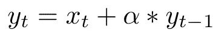**

**其中，α是衰减率，x(t)是当前广告花费，y(t-1)是时间 t-1 的累积广告效果，y(t)是时间 t 的最终广告。**

**python 中的实现有几行代码:**

```
def **adstock_geometric**(x: float, alpha: float):
  x_decayed = np.zeros_like(x)
  x_decayed[0] = x[0] for xi in range(1, len(x_decayed)):
    x_decayed[xi] = x[xi] + alpha* x_decayed[xi - 1] return x_decayed
```

**示例:**

```
x = np.array([1.0, 2.0, 3.0, 4.0, 5.0 , 6.0])
**adstock_geometric**(x, 0.5)#output: 1.0, 2.5, 4.25, 6.125, 8.062, 10.031
```

*   **第 **2** 天的库存量为 2.5: 2.0 + 1.0 * 0.5**
*   **第三天**的库存量为 4.25: 3.0 + 2.5 * 0.5****
*   **第 **4** 天的库存为 6.125: 4 + 4.25 * 0.5**
*   **….**

**当应用于时间序列时，adstock 效应的结果可以在下图中看到:**

**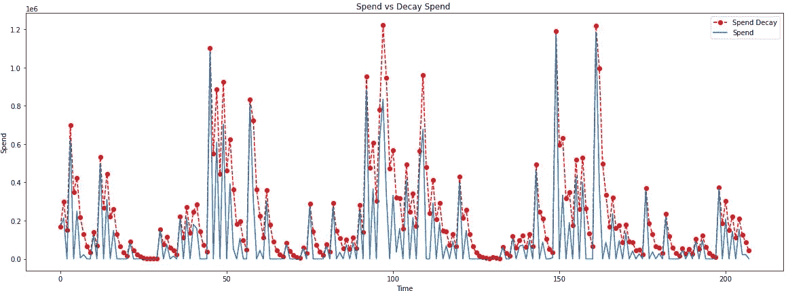**

**作者图片**

**因为我们要使用 PyMC3，所以我们必须重写 no 中的几何衰减函数。**

```
def **adstock_geometric_theano_pymc3**(x, theta):
    x = tt.as_tensor_variable(x)
        def adstock_geometric_recurrence_theano(index, 
                                            input_x, 
                                            decay_x,   
                                            theta):
        return tt.set_subtensor(decay_x[index], 
               tt.sum(input_x + theta * decay_x[index - 1])) len_observed = x.shape[0] x_decayed = tt.zeros_like(x)
    x_decayed = tt.set_subtensor(x_decayed[0], x[0]) output, _ = theano.scan(
        fn = adstock_geometric_recurrence_theano, 
        sequences = [tt.arange(1, len_observed), x[1:len_observed]], 
        outputs_info = x_decayed,
        non_sequences = theta, 
        n_steps = len_observed - 1
    )

    return output[-1]
```

# ****收益递减/饱和效应****

**有各种函数可以用来模拟广告支出和销售之间的非线性关系，例如[幂函数](https://analyticsartist.wordpress.com/2015/03/08/advertising-diminishing-returns-saturation/)、[负指数](https://analyticsartist.wordpress.com/2015/03/08/advertising-diminishing-returns-saturation/)或[逻辑](https://engineering.hellofresh.com/bayesian-media-mix-modeling-using-pymc3-for-fun-and-profit-2bd4667504e6)。Robyn 团队使用本文[中描述的 Hill 函数](https://static.googleusercontent.com/media/research.google.com/en//pubs/archive/46001.pdf)。**

**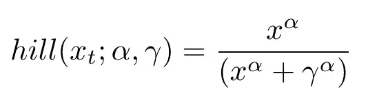**

**其中 **α** 控制曲线形状， **γ** 控制拐点。 **α** 越大，收益递减越有 S 形。 **α** 越小，C 形越多。下面的图展示了不同的饱和度曲线作为α和γ的函数。**

**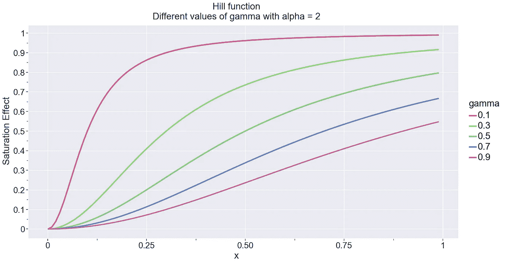**

**作者图片**

**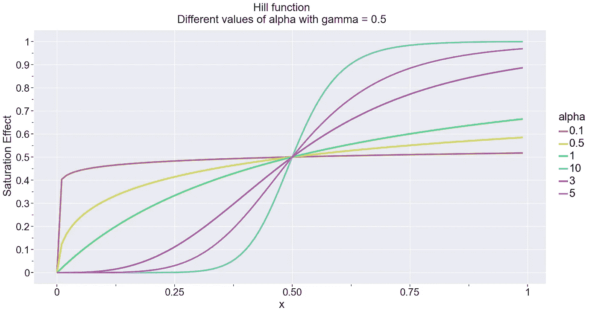**

**作者图片**

**由于饱和希尔函数是在 adstock 变换后应用的，因此在 ano 中不需要特殊处理。输入 **x** 已经是一个张量。**

```
def **saturation_hill_pymc3**(x, alpha, gamma): 
    x_s_hill = x ** alpha / (x ** alpha + gamma ** alpha)
    return x_s_hill
```

# ****建模****

## ****数据****

**我使用由 [Robyn](https://github.com/facebookexperimental/Robyn) 提供的演示数据集，并遵循相同的数据准备方法步骤，以获得相同的比较基准。为了与 Robyn 解决方案进行比较，我运行了[演示。Robyn 包自带的 R](https://github.com/facebookexperimental/Robyn/tree/main/demo) 文件，用 R 写的，设置没有任何改动。**

**该数据集包含 208 周的收入，包括:**

*   **5 个媒体消费渠道:电视、网络、印刷品、facebook、搜索**
*   **2 个也有曝光信息(印象，点击)的媒体渠道:facebook_I，search_clicks_P**
*   **无支出有机媒体:时事通讯**
*   **控制变量:事件、节假日、竞争对手销售额(competitor_sales_B **)****

**建模窗口为 2016 年 11 月 21 日至 2018 年 8 月 20 日的 92 周。为了使其通用，我定义了两个索引变量来引用这个时间窗口:**

```
START_ANALYSIS_INDEX = 52
END_ANALYSIS_INDEX = 144
```

****数据准备****

**我们必须应用 Robyn 中描述的两个准备步骤:**

> **Robyn 利用 [Prophet](https://facebook.github.io/prophet/) ，脸书的开源 ML 库进行时间序列预测。我们使用 Prophet 直接从响应中自动分解趋势、季节性和节假日影响，作为进一步建模的输入变量。这种能力通常会提高模型拟合度，减少残差中的自回归模式。**

**此外，我们可以使用 Prophet 分解将分类变量如**事件**转换成数值。**

**第二步准备:**

> **当使用曝光变量(印象、点击、GRPs 等)而不是花费时，Robyn 在曝光和花费之间拟合了一个带有米氏门登函数的非线性模型，以建立花费-曝光关系**

**第二步将允许我们将曝光度转换为最终**支出份额与效果份额**比较的支出。**

**让我们先加载数据:**

```
data = pd.read_csv("./data/data_raw_2015-11-23__2019-11-11.csv", parse_dates = ["DATE"])
data.columns = [c.lower() if c in ["DATE"] else c for c in data.columns]
data
```

**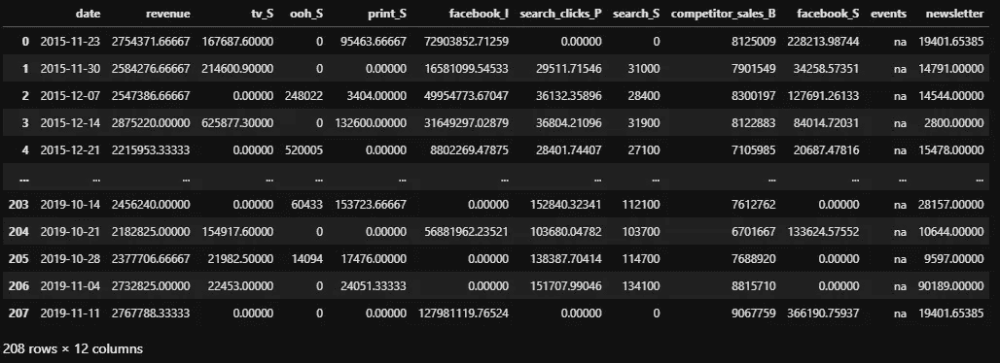**

**作者图片**

**假日数据是 Prophet 最初附带的一个单独的文件。原始假日数据具有每日粒度，因此应该首先在每周级别上进行聚合。Robyn 在他们的演示中使用了德国假日。**

```
holidays = pd.read_csv("./data/prophet_holidays_daily.csv", parse_dates = ["ds"])
holidays["begin_week"] = holidays["ds"].dt.to_period('W-SUN').dt.start_time
#combine same week holidays into one holiday
holidays_weekly = holidays.groupby(["begin_week", "country", "year"], as_index = False).agg({'holiday':'#'.join, 'country': 'first', 'year': 'first'}).rename(columns = {'begin_week': 'ds'})
holidays_weekly_de = holidays_weekly.query("(country == 'DE')").copy()
holidays_weekly_de
```

**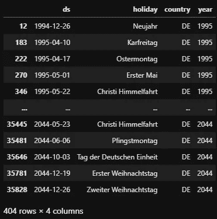**

**作者图片**

****先知分解****

**现在，我们准备将 Prophet 拟合到我们的数据中，包括假期，一个分类变量，并使用每年的季节性。重要的是要注意，我们将分解应用于所有可用的数据，而不是建模窗口。**

```
prophet_data = data.rename(columns = {'revenue': 'y', 'date': 'ds'})
#add categorical into prophet
prophet_data = pd.concat([prophet_data, pd.get_dummies(prophet_data["events"], drop_first = True, prefix = "events")], axis = 1)prophet = **Prophet**(**yearly_seasonality**=True, holidays=holidays_weekly_de)
prophet.**add_regressor**(name = "events_event2")
prophet.**add_regressor**(name = "events_na")prophet.fit(prophet_data[["ds", "y", "events_event2", "events_na"]])
prophet_predict = prophet.**predict**(prophet_data[["ds", "y", "events_event2", "events_na"]])
```

**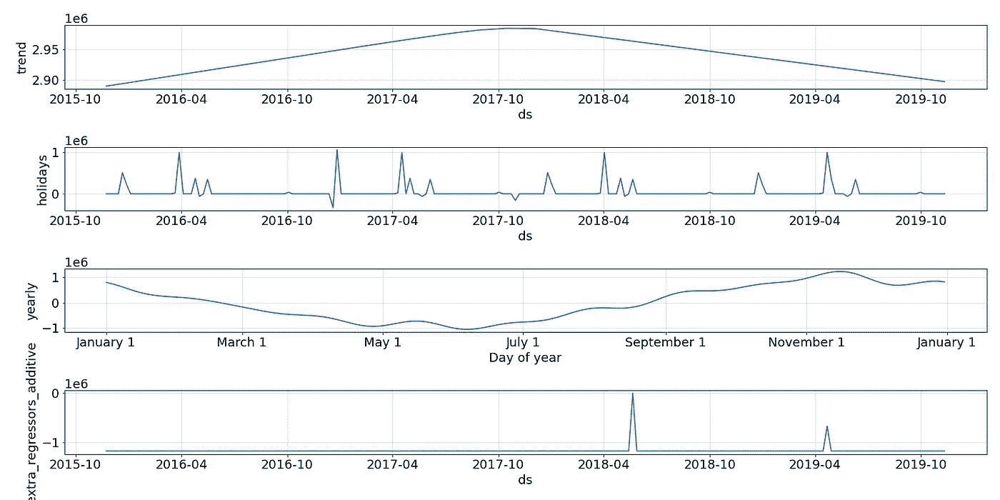**

**作者图片**

**让我们提取季节性、趋势、假日和事件组件:**

```
prophet_columns = [col for col in prophet_predict.columns if (col.endswith("upper") == False) & (col.endswith("lower") == False)]
**events_numeric** = prophet_predict[prophet_columns].filter(like = "events_").sum(axis = 1)final_data = data.copy()
final_data["**trend**"] = prophet_predict["trend"]
final_data["**season**"] = prophet_predict["yearly"]
final_data["**holiday**"] = prophet_predict["holidays"]
final_data["**events**"] = (events_numeric - np.min(events_numeric)).values
```

****支出风险评估****

**在这一步中，我们使用米氏门登函数来估计支出-敞口的非线性关系**

**支出-风险函数定义如下:**

**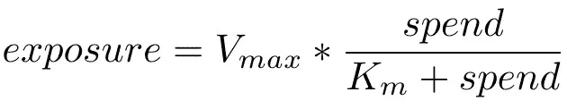**

**作者图片**

**其中 Vmax 和 Km 是我们需要估计的两个参数。这两个参数稍后将被用于找到暴露-花费的反向关系。为建模窗口估计参数。**

```
#define the function
**spend_to_exposure_menten_func =** lambda spend, V_max, K_m**: V_max * spend / (K_m + spend)**media_exposures = ["facebook_I", "search_clicks_P"]
media_spends = ["facebook_S", "search_S"]media_spend_exposure_df = pd.DataFrame()
for (media_exposure, media_spend) in zip(media_exposures, media_spends):
    V_max = final_data[media_exposure].values[START_ANALYSIS_INDEX : END_ANALYSIS_INDEX].max()
    K_m   = V_max / 2
    spend = final_data[media_spend].values[START_ANALYSIS_INDEX : END_ANALYSIS_INDEX]
    exposure = final_data[media_exposure].values[START_ANALYSIS_INDEX : END_ANALYSIS_INDEX]
    best_values, _ = **optimize.curve_fit**(f = spend_to_exposure_menten_func, xdata = spend, ydata = exposure, p0 = [V_max, K_m])
    media_spend_exposure_df = pd.concat([media_spend_exposure_df, pd.DataFrame({'spend': [media_spend], 'exposure': [media_exposure], 'V_max': [best_values[0]], 'K_m': [best_values[1]]})]).reset_index(drop = True)

media_spend_exposure_df
```

**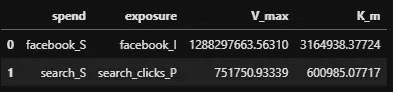**

**作者图片**

****贝叶斯建模****

**现在我们已经准备好建模了。我们将我们的响应变量(收入)建模为加性线性回归，可以用以下等式描述:**

**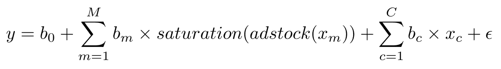**

**作者图片**

**其中 *b_0* 对应于基线收入， *b_m* 系数对应于通过 adstock 和 saturation 函数转换的媒体变量， *b_c* 系数对应于控制变量，ϵ是一些噪声。所有提到的系数、噪声以及吸附和饱和函数的参数都应该由模型来估计。**

**在建模之前，我们必须做出的第一个决定是，我们将如何标准化我们的因变量和自变量。通过标准化独立变量，我们可以将我们的模型推广到其他数据源，因为我们可以对大多数独立变量使用相同的先验。此外，很难对非标准化数据设定先验。因此，我对独立变量应用 0–1 归一化，并对响应变量进行两种不同的归一化实验:**

*   **扩展 100K**
*   **0–1 标准化**

****缩放 100K****

**最初的收入范围是 672250–3827520，因此通过将收入扩大 100K，我得到了以下范围:6.72–38.27，这使得试验先验更容易。**

**首先，我定义我的输入变量:**

```
data = final_data
**transform_variables** = ["trend", "season", "holiday", "competitor_sales_B", "events", "tv_S", "ooh_S", "print_S", "facebook_I", "search_clicks_P", "newsletter"]**delay_channels** = ["tv_S", "ooh_S", "print_S", "facebook_I", "search_clicks_P", "newsletter"]**media_channels** = ["tv_S", "ooh_S", "print_S", "facebook_I", "search_clicks_P"]**control_variables** = ["trend", "season", "holiday", "competitor_sales_B", "events"]**target** = "revenue"
```

**然后，我使用[最小最大缩放器](https://scikit-learn.org/stable/modules/generated/sklearn.preprocessing.MinMaxScaler.html)将自变量标准化，并将因变量缩放 100K**

```
data_transformed = data.copy()numerical_encoder_dict = {}for feature in transform_variables:
    scaler = **MinMaxScaler**()
    original = data[feature].values.reshape(-1, 1)
    transformed = scaler.fit_transform(original)
    data_transformed[feature] = transformed
    numerical_encoder_dict[feature] = scalerdependent_transformation = None
original = data[target].values
data_transformed[target] = **original / 100_000**
```

**建模部分包括几个步骤:**

*   **我首先通过媒体通道(延迟通道)进行迭代，并定义 adstock 和饱和度变换的先验。我试验了不同的先验，但最终我使用了那些在[贝叶斯方法论文](https://static.googleusercontent.com/media/research.google.com/en//pubs/archive/46001.pdf)中描述的先验**
*   **我对所有可用数据应用 adstock 变换，以允许使用历史数据建立结转效应**
*   **我在由 START_ANALYSIS_INDEX 和 END_ANALYSIS_INDEX 定义的建模窗口上应用饱和度变换**
*   **我使用半正态分布强制延迟通道的回归系数为正**
*   **接下来，我遍历其余的变量，对系数的符号没有任何限制**
*   **我将截距的先验定义为从收入平均值开始的正态分布。我遵循罗宾的方法，将截距限制为正值。**

```
response_mean = []
with pm.Model() as model_2:
    for channel_name in **delay_channels**:
        print(f"Delay Channels: Adding {channel_name}")

        x = data_transformed[channel_name].values

        **adstock_param** = pm.Beta(f"{channel_name}_adstock", 3, 3)
        **saturation_gamma** = pm.Beta(f"{channel_name}_gamma", 2, 2)
        **saturation_alpha** = pm.Gamma(f"{channel_name}_alpha", 3, 1)

        x_new = **adstock_geometric_theano_pymc3**(x, adstock_param)
        x_new_sliced = x_new[START_ANALYSIS_INDEX:END_ANALYSIS_INDEX]
        saturation_tensor = **saturation_hill_pymc3**(x_new_sliced, saturation_alpha, saturation_gamma)

        **channel_b** = pm.HalfNormal(f"{channel_name}_media_coef", sd = 3)
        response_mean.append(**saturation_tensor * channel_b**)

    for control_var in **control_variables**:
        print(f"Control Variables: Adding {control_var}")

        x = data_transformed[control_var].values[START_ANALYSIS_INDEX:END_ANALYSIS_INDEX]

        **control_beta** = pm.Normal(f"{control_var}_control_coef", sd = 3)
        control_x = **control_beta * x**
        response_mean.append(control_x)

    **intercept** = pm.Normal("intercept", np.mean(data_transformed[target].values), sd = 3)
    #intercept = pm.HalfNormal("intercept", 0, sd = 3)

    **sigma** = pm.HalfNormal("sigma", 4)

    **likelihood** = pm.Normal("outcome", mu = **intercept + sum(response_mean)**, sd = sigma, observed = data_transformed[target].values[START_ANALYSIS_INDEX:END_ANALYSIS_INDEX])
```

**我从以前的分布中生成样本，以检查我对以前的选择是否合理:**

**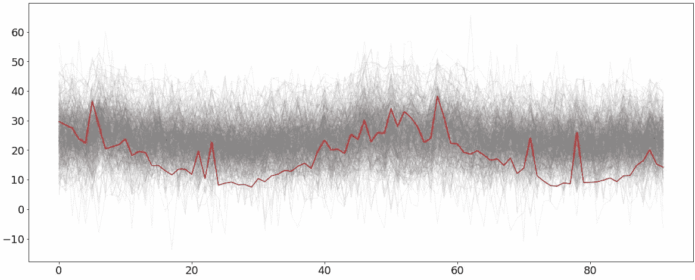**

**作者图片**

**并绘制先验分布:**

**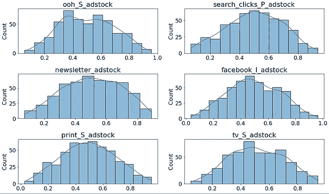****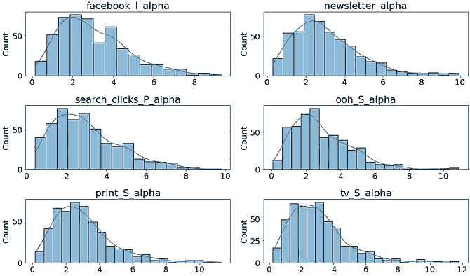****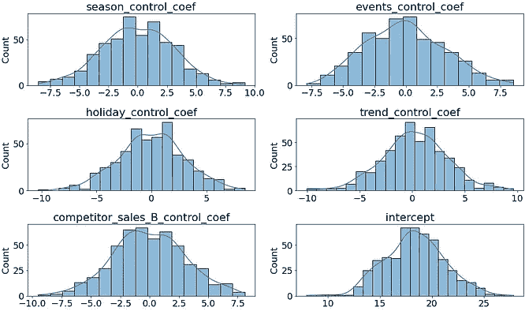****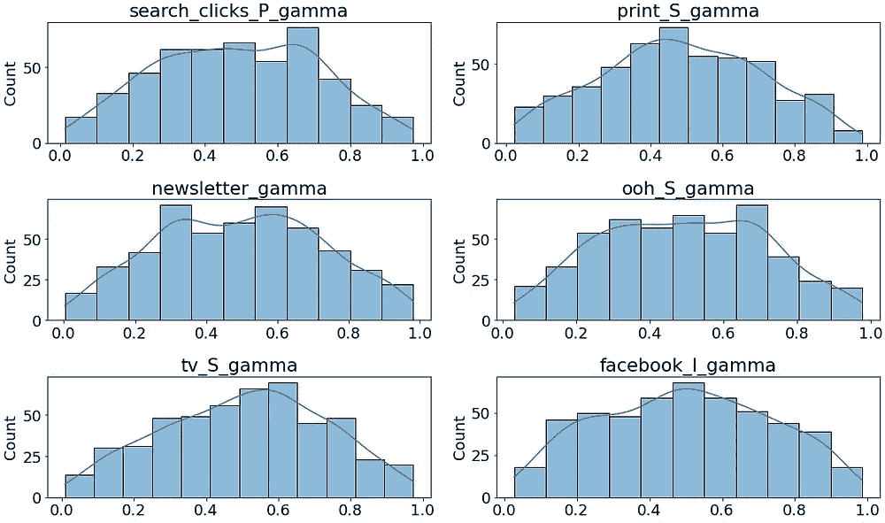****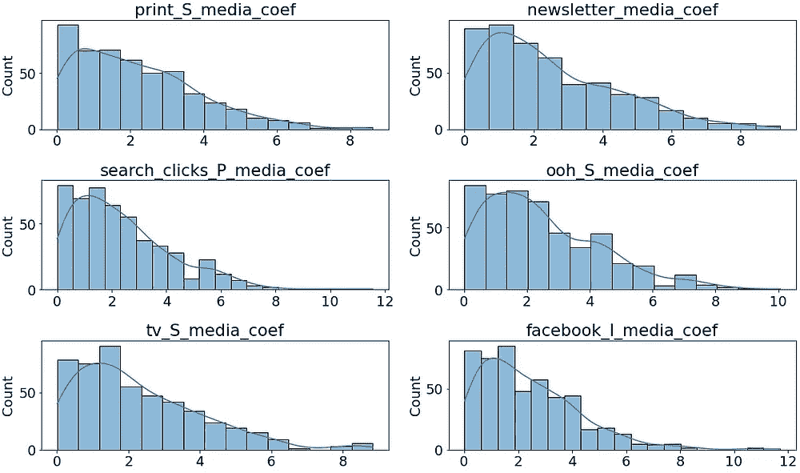**

**作者图片**

**现在我们可以拟合模型了:**

```
with model_2:
    trace = pm.sample(1000, tune=1000, step=None, **target_accept = 0.95**, return_inferencedata=True)
    trace_summary = az.summary(trace)
```

**我将 *target_accept* 参数增加到 0.95，因为我得到了一些带有默认值的收敛警告。**

**当拟合完成时，我从后面采样数据**

```
with model_2:
    ppc_all = **pm.sample_posterior_predictive**(
        trace, var_names=["outcome"] + list(trace_summary.index), random_seed=42
    )
az.plot_ppc(az.from_pymc3(posterior_predictive=ppc_all, model=model_2), var_names = ["outcome"])
```

**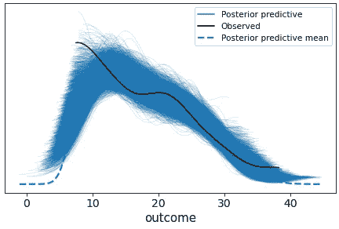**

**作者图片**

**观察到的数据的分布不是正态的，而是严格为正的，而我定义的可能性是正态分布的，这就是为什么我们在最低收入水平上看到不匹配。这也可能是一些收敛问题的原因，但使用[标准缩放器](https://scikit-learn.org/stable/modules/generated/sklearn.preprocessing.StandardScaler.html)或 [PowerTransformer](https://scikit-learn.org/stable/modules/generated/sklearn.preprocessing.PowerTransformer.html) 并没有带来任何改善，所以我决定坚持使用更直观的标准化。**

**有了后验样本，我们现在可以测量拟合优度，绘制各种辅助图，如残差图，并执行收入分解和测量渠道贡献。**

****拟合优度****

**Robyn 用来测量预测误差的指标之一是归一化均方根误差( [NRMSE](https://www.marinedatascience.co/blog/2019/01/07/normalizing-the-rmse/) )。**

```
def **nrmse**(y_true, y_pred):
   return np.sqrt(np.mean((y_true - y_pred) ** 2)) / (np.max(y_true) - np.min(y_true))
```

**预测收入是后验样本的平均值乘以 100K:**

```
y_true = data[target].values[START_ANALYSIS_INDEX:END_ANALYSIS_INDEX]#restore the original revenue by multiplying back 100K
y_pred = ppc_all["outcome"].mean(axis = 0) * 100_000print(f"RMSE: {np.sqrt(np.mean((y_true - y_pred)**2))}")
print(f"MAPE: {np.mean(np.abs((y_true - y_pred) / y_true))}")
print(f"NRMSE: {nrmse(y_true, y_pred)}")
```

****分解****

**为了按渠道分解收入，我们必须使用模型估计的参数对媒体渠道应用库存和饱和度，然后乘以相应的估计系数。**

**模型估计的参数和系数汇总:**

**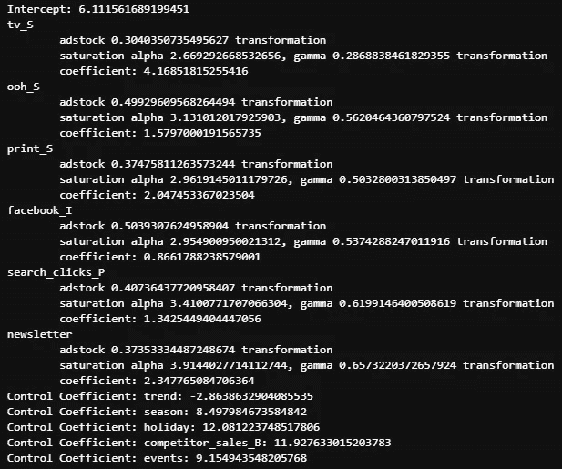**

**作者图片**

**我绘制了实际收入、预测的后验收入以及通过合计每个组成部分的收入贡献计算的收入，以比较分解的收入是否与预测的后验收入匹配。**

**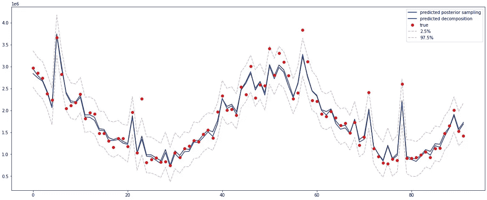**

**作者的形象**

**分解收入的 NRMSE:0.058，MAPE: 0.067**

**最后一步是计算媒体渠道支出份额，并将其与收入份额(效果份额)进行比较**

**我使用原始数据计算支出份额。我找到了使用其曝光信息(facebook_I，search_clicks_P)建模的变量的花费，使用曝光与花费的关系:**

```
**exposure_to_spend_menten_func** = lambda exposure, V_max, K_m: **exposure * K_m / (V_max - exposure)**spend_df = pd.DataFrame()
for media_channel in **media_channels**:
    temp_series = data[media_channel].iloc[START_ANALYSIS_INDEX:END_ANALYSIS_INDEX].values
    #exposure to spend should
    if len(media_spend_exposure_df[media_spend_exposure_df.exposure == media_channel]) > 0:

        **vmax** = media_spend_exposure_df[media_spend_exposure_df.exposure == media_channel]["V_max"].iloc[0]
        **km** = media_spend_exposure_df[media_spend_exposure_df.exposure == media_channel]["K_m"].iloc[0]
        **spends** = **exposure_to_spend_menten_func**(temp_series, V_max = vmax, K_m = km)
        spends_total = spends.sum()
    else:
        spends_total = temp_series.sum()

    spend_df = pd.concat([spend_df, pd.DataFrame({'media': [media_channel], 'total_spend': [spends_total]})]).reset_index(drop=True)spend_df["**spend_share**"] = spend_df["total_spend"] / spend_df["total_spend"].sum()
spend_df
```

**然后，我用分解的信息找出这些变量的影响份额。**

```
response_df = pd.DataFrame()
for media_channel in **media_channels**:
    response = data_transformed_decomposed[media_channel].iloc[START_ANALYSIS_INDEX:END_ANALYSIS_INDEX].values
    response_total = response.sum()

    response_df = pd.concat([response_df, pd.DataFrame({'media': [media_channel], 'total_effect': [response_total]})]).reset_index(drop=True)
response_df["**effect_share**"] = response_df["total_effect"] / response_df["total_effect"].sum()response_df
```

**最后，绘制支出份额与效果份额的对比图:**

**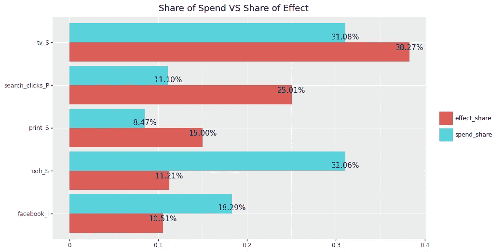**

**作者图片**

****0–1 归一化****

**让我们进行同样的实验，但是这次将响应变量归一化到 0 和 1 之间**

```
dependent_transformation = **MinMaxScaler**()
original = data[target].values.reshape(-1, 1)
transformed = dependent_transformation.fit_transform(original)
data_transformed[target] = transformed
```

**截距和系数的先验现在应根据响应范围进行调整:**

```
response_mean = []
with pm.Model() as model_3:
    for channel_name in **delay_channels**:
        print(f"Delay Channels: Adding {channel_name}")

        x = data_transformed[channel_name].values

        adstock_param = pm.Beta(f"{channel_name}_adstock", 3, 3)
        saturation_gamma = pm.Beta(f"{channel_name}_gamma", 2, 2)
        saturation_alpha = pm.Gamma(f"{channel_name}_alpha", 3, 1)

        x_new = adstock_geometric_theano_pymc3(x, adstock_param)
        x_new_sliced = x_new[START_ANALYSIS_INDEX:END_ANALYSIS_INDEX]
        saturation_tensor = saturation_hill_pymc3(x_new_sliced, saturation_alpha, saturation_gamma)

        **channel_b** = pm.HalfNormal(f"{channel_name}_media_coef", sd = 0.1)
        response_mean.append(saturation_tensor * channel_b)

    for control_var in **control_variables**:
        print(f"Control Variables: Adding {control_var}")

        x = data_transformed[control_var].values[START_ANALYSIS_INDEX:END_ANALYSIS_INDEX]

        **control_beta** = pm.Normal(f"{control_var}_control_coef", 0.1, sd = 0.1)
        control_x = control_beta * x
        response_mean.append(control_x)

    **intercept** = pm.HalfNormal("intercept", 0.1)

    **sigma** = pm.HalfNormal("sigma", 0.15)

    **likelihood** = pm.Normal("outcome", mu = **intercept + sum(response_mean)**, sd = **sigma**, observed = data_transformed[target].values[START_ANALYSIS_INDEX:END_ANALYSIS_INDEX])
```

**事先分配似乎是合理的:**

**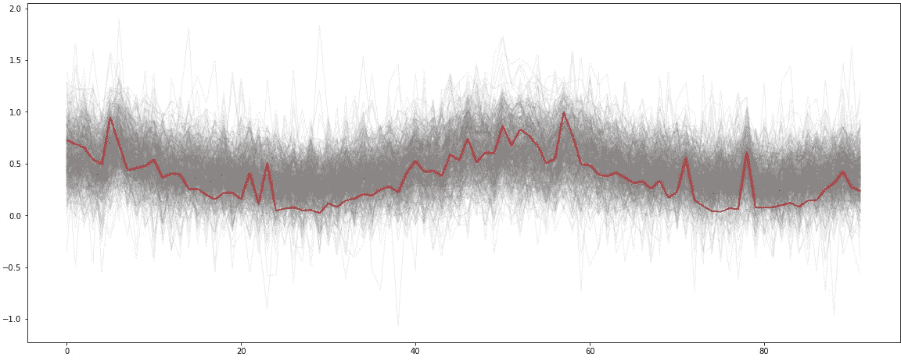**

**作者图片**

**建模和后验预测检查与之前相同，因此让我们检查拟合优度，并绘制花费与效果份额的对比图:**

**NRMSE: 0.058，MAPE: 0.065**

**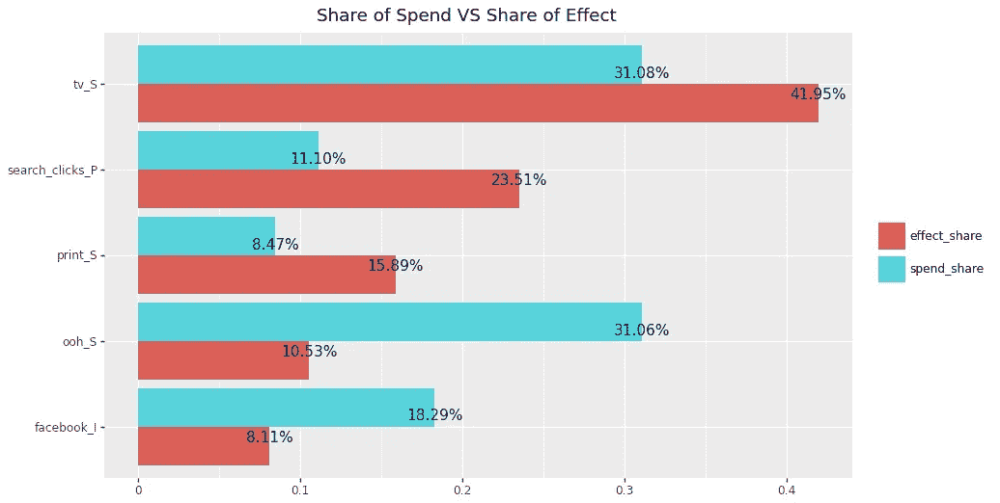**

**现在比较这两种模型:**

****

**作者图片**

**在估计的效果份额上有微小的差异，但是我可以得出结论，在估计效果份额与花费份额的相对大小上，两个模型是一致的**

****与罗宾的比较****

**Robyn 生成一组模型，并允许建模者选择与业务最相关的模型。对于几个最佳解决方案，它会生成支出份额与效果份额的对比图，并将它们保存在文件中。**

**在最好的模型中，我主观地挑选了一个或多或少与 PyMC3 生成的模型相当的模型:**

**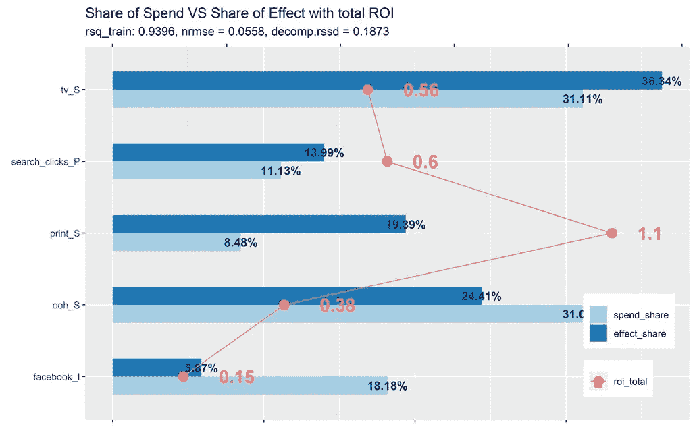**

**Robyn 生成的图像**

**我将 Robyn 与两款 PyMC3 车型进行了比较:**

**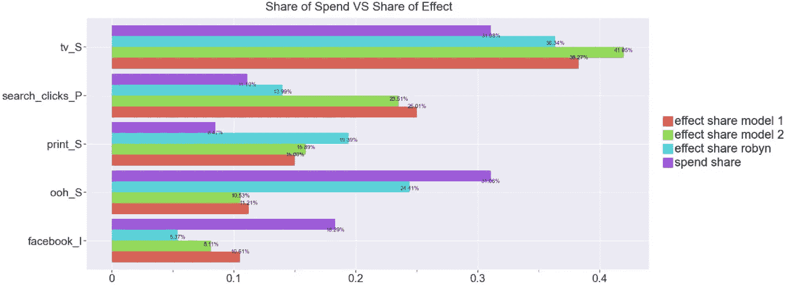**

**作者图片**

**比较表明，在 PyMC3 中生成的两个模型的结果彼此更相似，而不是与 Robyn 更相似。一个可能的原因是，与 PyMC3 生成的解决方案类似的解决方案是首选，但不是首选。另一个原因可能与 Robyn 选择顶级候选人的方式有关:Robyn 使用两种方法进行多目标优化:旨在减少模型预测误差的 NRMSE 和 RSSD(分解均方根距离):**

> **该距离说明了花费份额和渠道的系数分解份额之间的关系。如果距离太远，其结果可能太不现实——例如，花费最小的媒体活动获得最大的效果**

# ****结论****

**在本文中，我试验了自变量和因变量、先验和后验分布的标准化。我使用了 Robyn 提出的数据准备方法，该方法允许在真实场景中重用本文中的代码。同样，我将贝叶斯建模的结果与 Robyn 进行了比较。由于模型的最终选择与业务相关，如果没有额外的业务背景和校准，在这些实验中很难确定 Robyn 或 PyMC3 生成的模型是否更好。如果只比较 NRMSE，罗宾选择的顶级模特 NRMSE 更低，因此更适合。由于 Robyn 额外优化了与业务相关的指标，因此它很少有机会生成一个在统计上准确但从营销角度看不切实际的模型。我相信贝叶斯 MMM 解决方案还可以有进一步的改进。一些对我来说仍然开放的问题是如何改善先验参数化以解决收敛警告，以及什么样的非正态概率分布可以用于非正态分布的正响应变量。**

**完整的代码可以从我的 [Github repo](https://github.com/slavakx/bayesian_mmm) 下载**

**感谢阅读！**