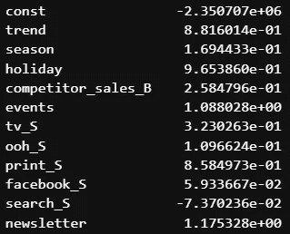
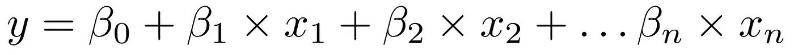
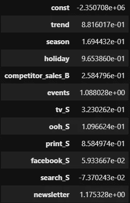
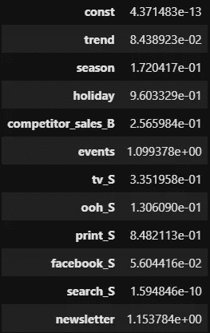
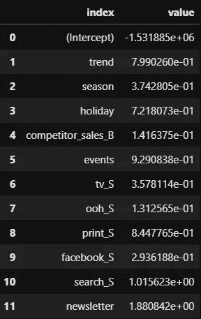

# 用约束系数模拟营销组合

> 原文：<https://towardsdatascience.com/modeling-marketing-mix-with-constrained-coefficients-234b23190ee2>

## 如何拟合一个 SciPy 线性回归并使用 RPy2 接口从 Python 调用 R 岭回归


威尔·弗朗西斯在 [Unsplash](https://unsplash.com?utm_source=medium&utm_medium=referral) 上的照片

T 营销组合建模(MMM)中最常用的方法是使用多元线性回归，该方法在因变量(如销售额或收入)和自变量(包括媒体广告渠道，如电视、印刷品)以及其他变量(如趋势、季节性、假期)之间建立线性关系。营销人员可能会问的一个问题是每个媒体渠道对结果有什么影响。线性回归估计每个独立变量的系数和截距，提供以下指示:

*   截距表示媒体广告支出为零时的平均结果
*   系数显示自变量单位变化时结果的变化幅度，以及
*   变化方向:系数可以是正的、负的或零

然而，营销组合中的假设是媒体广告渠道应该具有非负面效应。也就是说，随着广告支出的每一个单位的增加，销售或收入应该增加，减缓，或者至少保持为零(饱和效应)。这意味着媒体通道的结果系数应该是正的。

那么如何约束系数呢？

在我的上一篇文章中，我使用了基于树的算法，而不是线性回归，所以根本不存在系数的问题

[](/improving-marketing-mix-modeling-using-machine-learning-approaches-25ea4cd6994b)  

正如我在下一篇文章中所做的，我们可以在贝叶斯环境中定义媒体通道系数的正先验

[](/modeling-marketing-mix-using-pymc3-ba18dd9e6e68)  

在本文中，我展示了约束系数的两种方法:

*   通过使用 Python SciPy 包中的非线性最小二乘法 [*curve_fit*](https://docs.scipy.org/doc/scipy/reference/generated/scipy.optimize.curve_fit.html) 函数拟合线性回归，作为一般解决方案
*   通过使用 Ridge，使用用 Python 包装的 R [glmnet](https://github.com/cran/glmnet) 包和 [RPy2](https://github.com/rpy2/rpy2) 进行正则化回归

# 数据

我继续使用由 [Robyn](https://github.com/facebookexperimental/Robyn) 在麻省理工学院许可下提供的数据集，正如在我以前的文章中一样，用于实际和重要的例子，并通过应用 Prophet 来分解趋势、季节性和假日，遵循相同的数据准备步骤。

该数据集包含 208 周的收入(从 2015 年 11 月 23 日到 2019 年 11 月 11 日),包括:

*   5 个媒体消费渠道:**电视、网络、印刷品、facebook、搜索**
*   2 个也有曝光信息(印象，点击)的媒体渠道:facebook_I，search_clicks_P(本文未使用)
*   有机媒体无花费:**简讯**
*   控制变量:**事件，节假日**，竞争对手销售(**竞争对手 _ 销售 _B)**

# 无约束系数线性回归

让我们首先定义我们的自变量和因变量:

```
**target** = "revenue"
**media_channels** = ["tv_S", "ooh_S", "print_S", "facebook_S", "search_S"]
**organic_channels** = ["newsletter"]
**control_features** = ["trend", "season", "holiday", "competitor_sales_B", "events"]
**features** = control_features + media_channels + organic_channels
```

我们总共有 11 个独立变量，其中 5 个是媒体支出渠道，1 个是有机渠道，5 个是控制变量。让我们使用 [statsmodels](https://www.statsmodels.org/dev/generated/statsmodels.regression.linear_model.OLS.html) 软件包应用一个经典的多元线性回归，然后检查使用 *curve_fit* 的曲线拟合是否对无约束线性回归给出相同的结果

```
from statsmodels.regression import linear_model 
from statsmodels import toolsdata_with_intercept = tools.add_constant(final_data[features])
ols = **linear_model.OLS**(endog = data[target], 
                       exog = data_with_intercept)
ols_res = ols.fit()
print(ols_res.summary())
print(ols_res.params)
```



OLS 系数

*curve_fit* 函数的文档表明它需要一个模型函数:

> 它必须将自变量作为第一个参数，并将参数作为单独的剩余参数

模型函数将我们的线性关系描述为:



模型函数应该采用我们定义的尽可能多的参数，并且没有办法使这个函数适应不同数量的参数。因为我们有 11 个系数加上 1 个截距，所以我们必须提供 12 个参数:

```
def linear_function(data, a, b1, b2, b3, b4, 
                          b5, b6, b7, b8, b9, b10, b11):
    return a + b1 * data[:, 0]\
             + b2 * data[:, 1]\
             + b3 * data[:, 2]\
             + b4 * data[:, 3]\
             + b5 * data[:, 4]\
             + b6 * data[:, 5]\
             + b7 * data[:, 6]\
             + b8 * data[:, 7]\
             + b9 * data[:, 8]\
             + b10 * data[:, 9]\
             + b11 * data[:, 10]
```

调用 *curve_fit* ,提供模型函数，自变量为 NumPy 矩阵，目标变量为 NumPy 数组，明确设置方法为“lm ”,使用线性最小二乘优化

```
**curve_fit_coefs**, _ = **curve_fit**(**f** = linear_function, 
                                   **method** = "lm", 
                                  **xdata**=final_data[features].values, 
                                  **ydata** = final_data[target].values)#print coefficients
pd.DataFrame(curve_fit_coefs, index=["const"] + features, columns=["coefficient"])
```



曲线拟合系数

我们看到，在两种情况下，我们得到了相同的系数。intercept (const)和 *search_S* 媒体通道为负。让我们将截距和所有媒体通道约束为非负。Robyn 的 Github 上有一些有趣的讨论，关于截距应该是非负的还是无约束的。检查[这根线](https://github.com/facebookexperimental/Robyn/issues/256)。

# 带约束系数的线性回归

首先，我们需要定义一个助手函数来快速生成约束，其格式为 *curve_fit* 接受*的格式:一个长度等于参数数量*的数组

> **界限:*数组 _like 的二元组，可选:*** 参数的上下界限。默认为无限制。元组的每个元素必须是一个长度等于参数数量的**数组，或者是一个标量(在这种情况下，所有参数的界限都相同)。使用带有适当符号的`np.inf`禁用所有或部分参数的界限。**

```
def **prepare_bounds**(**intercept_value**, 
                   **control_length**, 
                   **media_length**, 
                   **control_value**, 
                   **media_value**):
    lower_bounds_array = []
    lower_bounds_array.append(intercept_value) for i in range(control_length):
        lower_bounds_array.append(control_value) for i in range(media_length):
        lower_bounds_array.append(media_value)

    return lower_bounds_array
```

让我们准备约束条件:

*   截取和媒体通道的下限是 0，控制变量的下限是-无穷大。
*   所有变量的上限都是无穷大。

```
**lower_bounds_array** = \
    **prepare_bounds**(**intercept_value** = 0, 
                   **control_length** = len(control_features), 
                   **media_length** = len(media_channels) + len(organic_channels), 
                   **control_value** = -np.inf, 
                   **media_value** = 0)
**upper_bounds_array** = \
    **prepare_bounds**(**intercept_value** = np.inf, 
                   **control_length** = len(control_features), 
                   **media_length** = len(media_channels) + len(organic_channels), 
                   **control_value** = np.inf, 
                   **media_value** = np.inf)
```

下限是:

```
**lower_bounds_array**
#[0, -inf, -inf, -inf, -inf, -inf, 0, 0, 0, 0, 0, 0]
```

上限是:

```
**upper_bounds_array**
#[inf, inf, inf, inf, inf, inf, inf, inf, inf, inf, inf, inf]
```

让我们应用带约束的*曲线拟合*

```
**curve_fit_bounded_coefs**, _ = \
    **curve_fit**(**f** = linear_function,
          **xdata**=final_data[features].values, 
          **ydata** = final_data[target].values,
          **bounds** = (tuple(lower_bounds_array), 
                    tuple(upper_bounds_array)))#print coefficients
pd.DataFrame(**curve_fit_bounded_coefs**, index = ["const"] + features, columns = ["coefficient"])
```



SciPy 曲线拟合约束系数

这一次模型的所有参数都是正的。

这种解决方案有几个缺点:

*   模型函数需要预先定义参数的确切数量，这使得当我们想要试验不同数量的参数时很困难
*   经典的线性回归容易过度拟合，不适合相关或冗余变量，也不适合推广。在营销组合建模中，变量相互关联或数据有限时，通常需要更好的建模方法，如岭回归。岭回归已用于现实生活中，通过使用正则化技术(通过降低系数的大小来惩罚系数)来克服过拟合和多重共线性的挑战。惩罚的程度由 lambda 参数控制。

# 基于 R-glm net 的约束系数岭回归

为什么我决定在 Python 中使用 R glmnet？我简直找不到任何更好的解决办法。我可以用 Python 找到 glmnet 包装器，但是由于 Fortran 的依赖性，我不能在我的 Windows 机器上编译它们。此外，glmnet 自带了两个方便的函数:[*cv . glm net*](https://glmnet.stanford.edu/reference/cv.glmnet.html)*执行交叉验证并确定最佳 lambda 参数，以及 [glmnet](https://glmnet.stanford.edu/reference/glmnet.html) 函数构建最终模型。这两个函数都执行数据标准化，并允许控制系数的符号和截距。我只需要弄清楚如何从 Python 中调用 R 代码。幸运的是，有一个 [RPy2](https://github.com/rpy2/rpy2) 包，R 语言的 Python 接口，正是为了这个:*

> *rpy2 正在运行一个嵌入式 R，使用 R 自己的 C-API 通过以下任一方式从 Python 提供对它的访问:*
> 
> *一个高级接口，使 R 函数像 Python 函数一样成为对象，并提供到 numpy 和 pandas 数据结构的无缝转换*
> 
> *更接近 C-API 的底层接口*

## *安装 R 和 RPy2*

*当然你要装 R。然后安装 RPy2:*

```
*pip install rpy2*
```

*通过导入 RPy2，检查 RPy2 是否识别您的 R 安装:*

```
*from rpy2 import robjects as ro
from rpy2.robjects import pandas2ri
from rpy2.robjects.packages import importr
import rpy2.situation
base = importr("base")
glm = importr("glmnet")*
```

*如果导入顺利，获得一些关于 R 安装信息:*

```
*for row in rpy2.situation.iter_info():
    print(row)*
```

*如果在导入过程中出现一些错误，您可以尝试以下步骤:*

*   *检查 **etc/Rprofile** 文件是否没有加载任何库*
*   *用 R 安装的路径创建一个 **R_HOME** 环境*

## *包装 glmnet 包装*

*包装过程包括三个步骤*

*   *用 R 编写一个函数，调用岭回归并返回我们感兴趣的输出*
*   *为 Pandas DataFrames、Boolean 和 Float 类型编写 Python-R 类型转换器*
*   *在一个准备数据类型、调用 R 代码并返回结果的 Python 函数中组合所有内容*

***步骤 1:编写 R 代码:在 R 中拟合岭回归***

*RPy2 提供了***rpy 2 . R objects . R***函数，该函数接受任意字符串并将其计算为 R 代码:*

```
***run_glmnet_in_r** = \
    **ro.r**("""

#pure R code
*function(x_train, 
         y_train, 
         x_test, 
         lambda, 
         is_intercept, 
         lower_limits, 
         upper_limits, 
         alpha = 0){ 
     mod = glmnet(x_train,
                  y_train,
                  family = 'gaussian',
                  alpha = alpha,
                  lambda = lambda, 
                  intercept = is_intercept,
                  lower.limits = lower_limits,
                  upper.limits = upper_limits,
                  type_measure = 'mse')**coefs = as.data.frame(as.matrix(coef(mod)))
names(coefs)[1] = "value"
y_pred = predict(mod, s = lambda, newx = x_test)
return (list(coefs = coefs, y_pred = y_pred))*
}""")*
```

*我定义了一个适合岭回归的纯 R 函数，期望 8 个参数:*

*   *x_train —训练集*
*   *y_train —响应/目标变量*
*   *x_test —我们从拟合模型中获得其预测的测试集*
*   *λ—我们从 *cv.glmnet* 得到的λ值*
*   *is _ intercept 我们希望截距是拟合的(无约束的)还是设置为 0*
*   *下限，上限-每个变量的下限/上限向量*
*   *alpha-glm net 适合由 alpha 控制的脊、套索或弹性网回归。当α0-岭回归拟合时。*

*返回的是系数和测试集预测的列表。*

***步骤 2:为 Pandas 数据帧、布尔和浮点类型编写 Python-R 类型转换器***

*以下代码将 Pandas 数据帧转换为 R 数据帧:*

```
*with ro.conversion.localconverter(**ro.default_converter** + **pandas2ri.converter**):
        r_df = **ro.conversion.py2rpy**(x_train)*
```

*然而，glmnet 期望矩阵作为输入。我必须编写自己的转换器，将 R 数据帧转换成矩阵:*

```
*data_frame_to_r_matrix = **ro.r**('*function(x) as.matrix(x)*')*
```

*使用 RPy2 转换目标值、下限和上限的向量:*

```
*r_y_train = **ro.vectors.FloatVector**(y_train)

r_lower_limits = **ro.vectors.FloatVector**(lower_limits)
r_upper_limits = **ro.vectors.FloatVector**(upper_limits)*
```

*lambda 的浮点标量值被转换为单值向量:*

```
*lambda_best_float = **ro.vectors.FloatVector**([lambda_best])*
```

*布尔变量 *is_intercept* 被类似地转换:*

```
*is_intercept_bool = **ro.vectors.BoolVector**([is_intercept])*
```

*从 R 列表到 Python 字典的转换需要一个定制的解决方案:*

```
*def **convert_r_list_into_dictionary**(r_list):
    py_dict = {}
    #for name in coefs.names:
    keys = r_list.names
    for i in range(len(keys)):
        if isinstance(r_list[i], ro.vectors.DataFrame):
            with ro.conversion.localconverter(ro.default_converter + pandas2ri.converter):
                py_dict[keys[i]]=r_list[i]
        elif isinstance(r_list[i], ro.vectors.FloatVector):
            array = np.array(r_list[i])
            if len(array) == 1:
                array = array[0]
            py_dict[keys[i]] = array
        else:
            py_dict[keys[i]] = r_list[i]
    return py_dict*
```

***步骤 3:将所有步骤组合到一个 Python 函数中，该函数准备数据类型，调用 R 代码并返回结果***

```
*def **run_glmnet**(x_train, 
               y_train, 
               x_test, 
               lambda_best, 
               is_intercept, 
               lower_limits, 
               upper_limits, 
               alpha = 0):
    #type conversions
    with ro.conversion.localconverter(ro.default_converter + pandas2ri.converter):
        r_df = ro.conversion.py2rpy(x_train)
        r_test_df = ro.conversion.py2rpy(x_test)

    r_x_train = data_frame_to_r_matrix(r_df)
    r_x_test = data_frame_to_r_matrix(r_test_df)

    r_y_train = ro.vectors.FloatVector(y_train)

    r_lower_limits = ro.vectors.FloatVector(lower_limits)
    r_upper_limits = ro.vectors.FloatVector(upper_limits)

    lambda_best_float = ro.vectors.FloatVector([lambda_best])

    is_intercept_bool = ro.vectors.BoolVector([is_intercept])

    #call glmnet
    mod = run_glmnet_in_r(r_x_train, 
                          r_y_train, 
                          r_x_test, 
                          lambda_best_float, 
                          is_intercept_bool, 
                          r_lower_limits, 
                          r_upper_limits, 
                          alpha)
        #prepare the results
    mod = convert_r_list_into_dictionary(mod)

    mod["coefs"] = mod["coefs"].reset_index()

    return mod*
```

***拟合岭回归***

*让我们定义下限和上限:*

```
*# Set lower and upper bounds for feature coefficients
**lower_limits** = np.array([-np.inf for _ in range(len(control_features))] + [0 for _ in range(len(media_channels) + len(organic_channels))])
**upper_limits** = np.array([np.inf for _ in range(len(control_features))] + [np.inf for _ in range(len(media_channels) + len(organic_channels))])print(lower_limits)
print(upper_limits)#[-inf -inf -inf -inf -inf   0\.   0\.   0\.   0\.   0\.   0.]
#[inf inf inf inf inf inf inf inf inf inf inf]*
```

*这次我们只为变量定义约束。截距由函数参数明确控制。*

*接下来，我们交叉验证以找到最佳的 lambda 参数:*

```
*cv_glmnet = **run_cv_glmnet**(**x_train** = final_data[features], 
                          **y_train** = final_data[target], 
                          **is_intercept** = True, 
                          **lower_limits** = lower_limits , 
                          **upper_limits** = upper_limits)print(**cv_glmnet["lambda_best"]**)
#166018.4312548283*
```

*最后，我们使用找到的λ拟合岭回归:*

```
*results = **run_glmnet**(**x_train** = final_data[features], 
                     **y_train** = final_data[target], 
                     **x_test** = final_data[features], 
                     **lambda_best** = **cv_glmnet["lambda_best"]**, 
                     **is_intercept** = True, 
                     **lower_limits** = lower_limits, 
                     **upper_limits** = upper_limits)results.keys()
#dict_keys(['coefs', 'y_pred'])*
```

*最终系数为:*

```
*results["coefs"]*
```

**

*岭系数*

# *结论*

*在某些情况下，按照营销组合建模中的业务逻辑，我们希望强制线性回归找到一个具有正系数的解决方案。然而，并不是所有的统计软件包都支持这种功能，因此需要一些变通方法。*

*我展示了两种约束系数的方法:使用 SciPy 非线性最小二乘优化函数 *curve_fit* 和 R glmnet 软件包中的岭回归。后一种方法需要使用 RPy2 接口包装 R 代码，并允许从 Python 调用任意 R 函数。*

*完整的代码可以从我的 [Github repo](https://github.com/slavakx/medium_posts) 下载*

*感谢阅读！*