# 使用马尔可夫链对星巴克等待时间建模，用 Python 编写

> 原文：<https://towardsdatascience.com/modeling-starbucks-waiting-time-using-markov-chains-with-python-ab267670d02c>

## 以下是如何使用马尔可夫链来确定你等待星巴克咖啡的时间

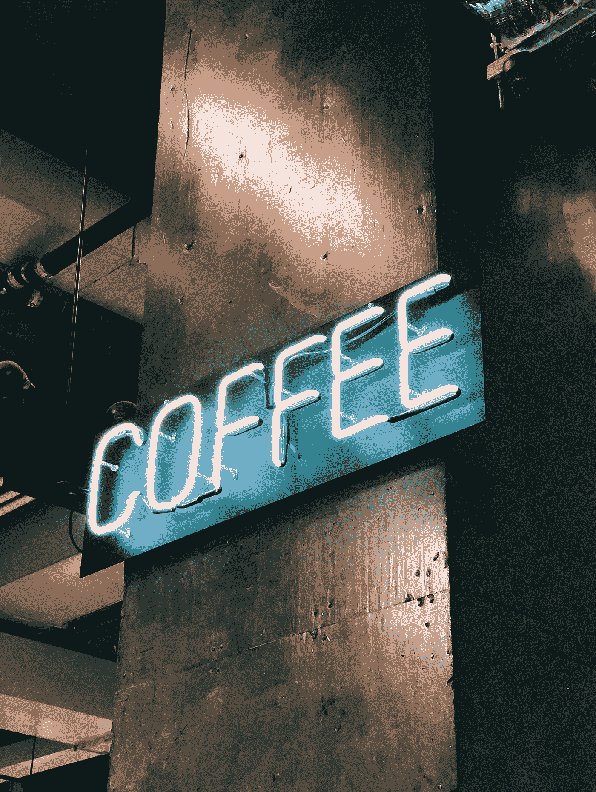

乔恩·泰森在 [Unsplash](https://unsplash.com?utm_source=medium&utm_medium=referral) 上的照片

我来自意大利，可以肯定地说，对我们来说，咖啡是一种 T4 宗教。我们喝咖啡是为了社交，早上喝咖啡是为了提神，午饭后喝咖啡，晚饭后喝咖啡。当你有一段时间没见朋友时，我们会说

> "我在一家咖啡馆"

这意味着

> “过来，我们喝杯咖啡”

我住在美国，美国人对咖啡的态度是不同的。我上班时喝咖啡带走。我工作的时候喝咖啡。我一边看电影一边喝咖啡。美国人不喝“浓缩咖啡”，但他们喜欢花很长时间喝完一大杯咖啡。还有一点:**咖啡有多种！**

如果你走进一家星巴克，你可能会看到 100 种可能的咖啡。可以是黑咖啡，可以是玛奇朵，可以是拿铁，可以是星冰乐，可以是其他很多我都不知道的东西。😅

有一些非常容易制作的咖啡，也有一些比较复杂的，需要更多的时间来制作。假设你在星巴克排队买咖啡。如果你前面有 3 个人，他们都点了黑咖啡，你可能要等大约 **3 分钟才能点。**

尽管如此，如果他们点了一份“额外的奶油焦糖玛奇朵，加糖屑和肉桂，加豆奶”……嗯，那可能会让你的等待时间延长一倍，或者至少你得多等几分钟。

所以问题是…

> “我要等多久才能得到我的咖啡，我可以写一篇关于我要等多久才能得到我的咖啡的文章？”

当然，我们不知道其他人会点什么，所以这是一个**概率**问题(或者如果你想要一个**随机过程**)。那么我们怎么解决呢？

一个可行的方法是建立一个**马尔可夫链。**特别是，我们将需要一个**依赖于时间的马尔可夫链**。

我们来建题吧！

# 1.理论介绍

让我们先从理论上介绍一下这个问题，然后把它纠正过来。

先说最简单的情况。我们走进星巴克，点了咖啡。假设从数学上来说，我们可以处于这三种**状态**之一。

第一个状态(O)是我们**点**咖啡的状态。第二家( **M** )是我们已经**点了**我们的咖啡，正在等着拿的那家。因为他们正在做一杯咖啡。然后你得到了咖啡，并朝着**离开**州的方向转移。这意味着你的咖啡准备好了，你可以走了。

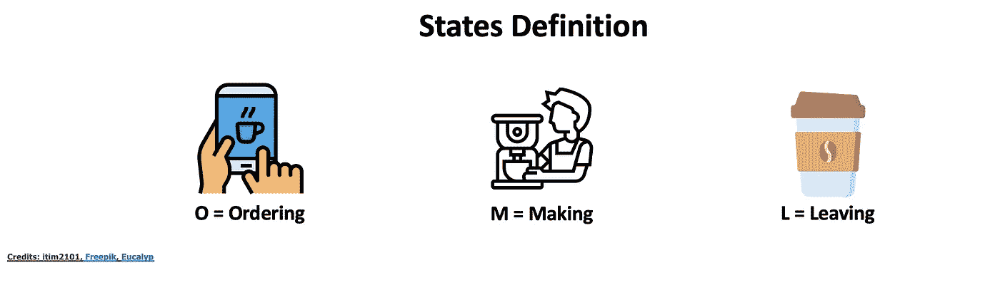

作者图片

太好了。现在，可能的转变是什么？

1.  你肯定会从订购走向制作。( **O** 到 **M** )。
2.  可以从 **M** 到 **M(保持等待)**。
3.  最终，你会从**米**到**米**

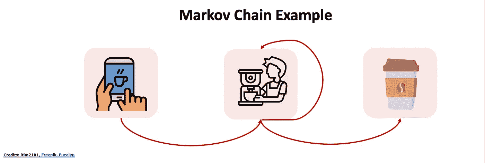

作者图片

现在我们如何形式化它？

## 1.1 关于马尔可夫链

马尔可夫链的假设是什么？假设如下:

> “处于下一个状态的概率只取决于你当前的状态”

例如:

> 在时间步长 t = 5 中处于状态 **L** 的概率只取决于你在时间步长 t = 4 中处于状态**M**make 的事实。

让我们把它形式化:

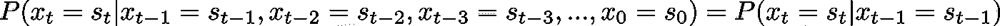

作者图片

在上面的符号中，我们知道，在时间 t，在空间 s_t (O，M，L)中的概率只取决于我们在时间 t-1 的状态。

在我们的具体实验中，我们需要记住的是，这个概率也必须依赖于时间。这是事实，因为，当然，如果我等了 5 分钟，下一分钟离开的概率比我只等了 1 分钟就离开的概率高。

这意味着:

作者图片

这正是我们之前谈论的概念。

现在，当然，不仅仅是我们在星巴克。还有很多其他的顾客！所以我们一会儿会把这个设置复杂化。但是你在上面看到的是我们将要做的一切的起点。

让我们开始吧！🤩

# 2.一个顾客一杯饮料的例子

让我们尽可能举一个最简单的例子。我们知道要喝什么，咖啡店里只有我们。假设我们想要一杯焦糖玛奇朵。 [所有食谱](https://www.allrecipes.com/recipe/258686/iced-caramel-macchiato/)都提示需要 5 分钟。假设点餐和支付需要 30 秒。所以总等待时间是 5.30 分钟。但是让我们更进一步。假设 **5 分钟是平均开始时间。我们还可以说，我们可以在 4 分钟或 6:**

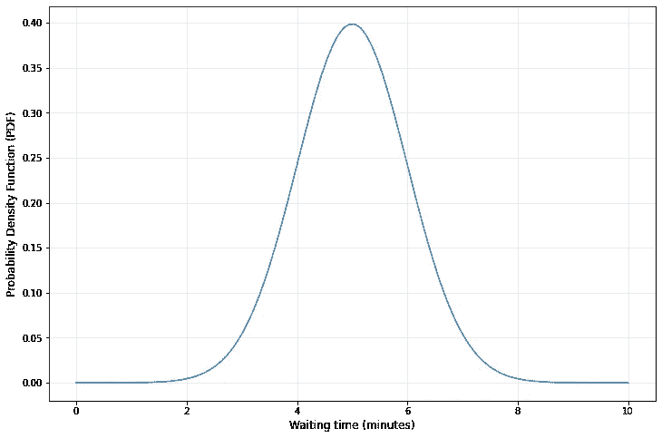

作者图片

太好了。现在假设我们的时间刻度是 30 秒(0.5 分钟)。30 秒后，非常不幸的是，我们点了焦糖玛奇朵。8 分钟后，非常不幸的是，我们仍然在等待。

## 2.2 实际实施

让我们实现这一点。让我们从导入一些库开始:

让我们定义我们的状态:

太好了。现在让我们运行上面描述的整个过程。我们将使用这个函数来实现:

这是一个例子:

# 3.一个顾客多杯饮料的例子

现在，让我们增加模型的复杂性，使它更加真实。
假设我们不知道特定客户想要什么。这更现实，因为我们在星巴克有 150 多种饮料，它们可能需要不同的等待时间。

现在马尔可夫链看起来像这样

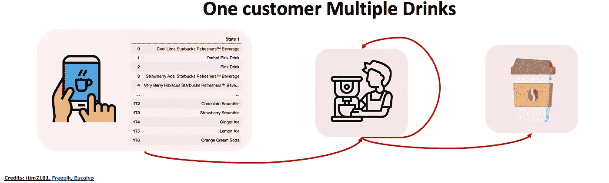

作者图片

与前一个不同的是，我们有一个概率分布，我们称之为:

作者图片

特别是，这是我们能得到的所有可能饮料的概率分布，我们称之为:

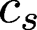

作者图片

例如:

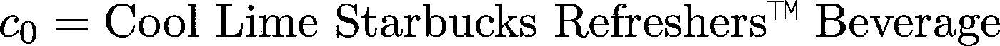

作者图片

所以我们可以说:

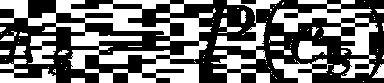

作者图片

## 3.2 动手实施

从这个 [Kaggle 数据集](https://www.kaggle.com/datasets/ashishpatel26/starbucks-menu-nutrition-drinks) ( [CC0:公共域](https://creativecommons.org/publicdomain/zero/1.0/))我们可以导入所有的星巴克饮料:

我们不需要其他的柱子。
现在，我们不知道最常选择的饮料是什么，让我们为我们的目的创建一个假的分布:

所以我们提取 50 到 100 之间的值，然后用总和归一化，这样我们就有了一个概率向量。

所以我们有了概率分布。我们该拿它怎么办？这个概率分布将为我们排序:我们将从分布中抽取样本。那么我们必须假设每种咖啡需要不同的时间来制作。

现在，客观地说，没有那么大的区别。假设“最简单”的咖啡(假设这是一杯 guess…☕️黑咖啡)需要 3 分钟(平均值),最复杂的咖啡需要 6 分钟(平均值)(假设额外的搅打奶油焦糖玛奇朵加糖屑和肉桂加豆奶🙃).

让我们玩不同的变化(从 0.1 到 1)。

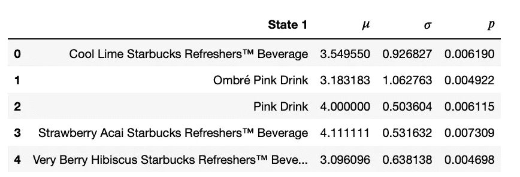

正如我们之前看到的，我们有从 3 到 6 的平均值，所以你可以有 3 到 6 分钟的平均等待时间，有时，你会比其他时间有更多的不确定性。例如，当你喝咖啡“A”时，你可能有一个最大的方差。

让我们实现以下情况:

现在，我相信在这一点上我们可以提取一些有意义的信息。比如说…

> "在星巴克喝一杯咖啡通常需要多长时间？"

这个问题非常笼统，所以我们不妨用一些统计数据来回答*:

> *我把所有的“**打印***”**都去掉了，这样我的电脑就不会爆炸了。🥲*

# *4.多个客户多种饮料示例*

*太好了。现在我们有多个客户。我们该怎么办？
情况看起来是这样的:*

*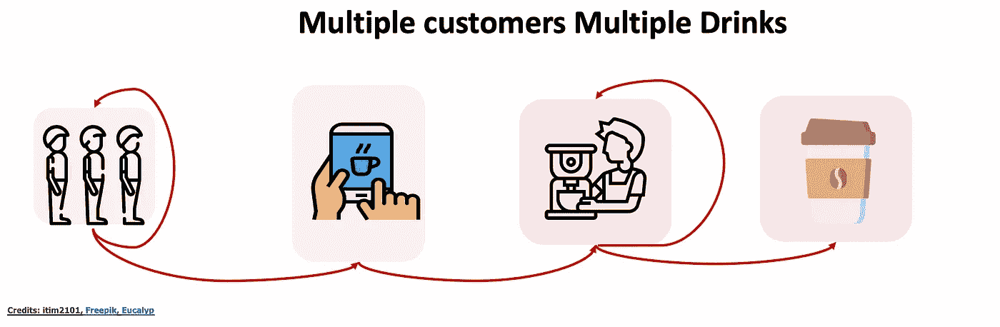*

*作者图片*

*现在，认为我们必须等一杯咖啡煮好了，他们才开始煮你的咖啡，这是不现实的。通常你在星巴克有 3，4 个咖啡师。*

*这使代码变得有点复杂，因为我们需要跟踪所有咖啡师实际上忙不忙的事实。为此，我们将考虑的函数是顾客数量和咖啡师数量的函数。*

*这个函数就是这样做的:*

*好的，让我们测试一个案例，我们有 4 个顾客和 2 个咖啡师。*

*正如你在前两个案例中看到的，我们有免费的咖啡师，他们分别等待 7 分钟和 6.5 分钟。*

> ** **注**！这不是一个错误！只是意味着第二杯咖啡比第一杯咖啡快+点餐时间。想想也有道理。如果你点了一杯复杂的咖啡，而我只点了一杯拿铁，即使你比我先点，我等的时间也可能比你少。*

*然后咖啡师就忙了。所以我们必须再等 6 分钟，我才能真正点菜。(我可以让它更真实，减去 1 分钟的点餐时间，但你明白了吗？)*

*当第四个顾客点餐时，有一个免费的咖啡师，所以他不用等那么久。他只等了 5.5 分钟。*

*注意这个模型会变得多么复杂，情况会变得多么有趣。这是一个有 **10 名顾客**和 **5 名咖啡师的案例:***

# *5.考虑*

*在这篇文章中，我们讨论了一个队列中等待时间的一般性问题。当然有多种情况:*

1.  *我们可能是店里唯一一个知道自己想要什么的人*
2.  *我们可能是店里唯一一个不知道自己到底想要什么的人*
3.  *我们可能是**商店里很多人不知道我们到底想要什么***

*这三个场景当然越来越复杂。由于这个原因，马尔可夫链变得越来越复杂，就像我们之前看到的那样。*

1.  *在**第一种情况下，**唯一的概率分布是过程中“制作咖啡”的那一部分。例如，制作焦糖玛奇朵平均需要 5 分钟，高斯分布和方差为 1*
2.  *在**第二种情况**中，我们得到了我们采摘的咖啡的概率分布**加上**咖啡制作位的概率分布，这就是之前的那个*
3.  *在**第三种情况**中，以上两种情况我们都有，咖啡师的数量成为另一个需要考虑的事情*

*我们当然可以把这个模型复杂化很多。我们可以考虑机器会被损坏的事实。我们可以考虑咖啡师的短缺。我们可以考虑咖啡师的数量随时间变化的事实。我们可以考虑一些咖啡师比其他人更快。以及更多的可能性。*

*这个起点可以用来以几乎所有你想要的方式使模型复杂化。请记住，我们使用的工具是**依赖于时间的马尔可夫链**，并从那里开始构建😎*

# *6.结论*

*如果你喜欢这篇文章，你想知道更多关于机器学习的知识，或者你只是想问我一些你可以问的问题:*

*A.在 [**Linkedin**](https://www.linkedin.com/in/pieropaialunga/) 上关注我，在那里我发布我所有的故事
B .订阅我的 [**简讯**](https://piero-paialunga.medium.com/subscribe) 。这会让你了解新的故事，并给你机会发短信给我，让我收到你所有的更正或疑问。
C .成为 [**推荐会员**](https://piero-paialunga.medium.com/membership) ，这样你就不会有任何“本月最大数量的故事”，你可以阅读我(以及成千上万其他机器学习和数据科学顶级作家)写的任何关于最新可用技术的文章。*