# 使用广义线性模型模拟纽约市自行车数量

> 原文：<https://towardsdatascience.com/modelling-new-york-city-bicycle-volumes-using-generalised-linear-models-7b5cc71d8432>

## 在 Python 中拟合广义线性模型的简单项目演练


照片由[福原广茂](https://unsplash.com/@invisi?utm_source=medium&utm_medium=referral)在 [Unsplash](https://unsplash.com?utm_source=medium&utm_medium=referral) 上拍摄

# 介绍

尽管我写过几篇关于这个主题的文章，也在保险行业工作过，但实际上我从未从头开始拟合过一个[**【GLM】**](https://en.wikipedia.org/wiki/Generalized_linear_model)广义线性模型。

我知道很震惊。

所以，我决定展开我的翅膀，开展一个小项目，在那里我可以把我所有的理论知识付诸实践！

在本文中，我想带您完成一个简单的项目，使用 GLMs 对纽约市的自行车穿越量进行建模。我们还将简要介绍 GLMs 背后的主要技术细节以及使用它们的动机。

> 本项目使用的数据来自纽约市交通部门，可通过 CC0 许可在 Kaggle 上的 [**此处**](https://www.kaggle.com/datasets/new-york-city/nyc-east-river-bicycle-crossings) 获得。Kaggle 实际上从纽约开放数据中获得了这个数据集，你可以在这里找到。

# 广义线性模型概述

为了完整起见，我将在本文中讨论 GLMs 背后的主要概念。然而，为了更深入地理解，我强烈建议您查看我以前的文章，这些文章真正深入了它们的技术细节:

</poisson-regression-and-generalised-linear-models-606fe5f7c1fd>  </the-essence-of-logistic-regression-e9188625cb7d>  

## 动机

[**广义线性模型**](https://en.wikipedia.org/wiki/Generalized_linear_model) 字面上的‘广义’[**线性回归**](https://en.wikipedia.org/wiki/Linear_regression) 到一个目标变量即**非正态**。

例如，这里我们将模拟纽约市的自行车交通流量。如果我们要将此建模为一个线性回归问题，我们将假设针对我们的特征的自行车数量将遵循一个 [**正态分布**](https://en.wikipedia.org/wiki/Normal_distribution) 。

这有两个问题:

*   正态分布是**连续**，而单车计数是**离散**。
*   正态分布可以是**负**，但是单车计数是**正**。

因此，我们使用 GLMs 来克服这些问题和常规线性回归的局限性。

## 数学

线性回归的一般公式是:

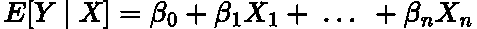

作者在 LaTeX 中生成的方程。

其中 ***X*** 为**特征**， ***β*** 为**系数**其中 ***β_0*** 为**截距**，*【Y | X】*为 [**期望值**](https://en.wikipedia.org/wiki/Expected_value) (平均值)

为了将这个线性回归公式转换为包含非正态分布，我们附加了一个叫做 [**的链接函数**](https://www.statisticshowto.com/link-function/) ， ***g()*** :

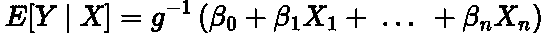

作者在 LaTeX 中生成的方程。

链接功能字面上的'**链接**'您的线性组合输入到您想要的目标分布。

对于每个分布，可以通过经验或数学方法找到关联函数。在我上面链接的文章中，我为一些发行版推导了链接函数。

并不是所有的分销都在 GLM 的保护伞下。这些分布必须是 [**指数族**](https://en.wikipedia.org/wiki/Exponential_family) 的一部分。但是，你常见的分布大多: [**【伽马】**](https://en.wikipedia.org/wiki/Gamma_distribution)[**泊松**](https://en.wikipedia.org/wiki/Poisson_distribution)[**二项式**](https://en.wikipedia.org/wiki/Binomial_distribution)[**伯努利**](https://en.wikipedia.org/wiki/Bernoulli_distribution) 都是这个家族的一部分。

> 对于正态分布(线性回归)的链接函数称为 [**恒等式**](https://www.statisticshowto.com/link-function/) **。**

## 泊松回归

为了模拟我们的自行车数量，我们将使用[**泊松分布**](https://en.wikipedia.org/wiki/Poisson_distribution) 。这种分布描述了在给定时间范围内一定数量的事件以平均发生率发生的概率。

> 要了解更多关于泊松分布的知识，请点击这里查看我的文章[。](/poisson-regression-and-generalised-linear-models-606fe5f7c1fd)

对于泊松回归，链接函数是 [**自然对数**](https://en.wikipedia.org/wiki/Natural_logarithm) :

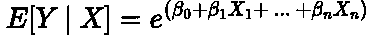

作者在 LaTeX 中生成的方程。

正如你所看到的，我们的输出现在总是正的，因为我们使用的是指数。这意味着我们将避免任何可能的无意义的结果，不像如果我们使用线性回归，输出可能是负的。

同样，我还没有对 GLMs 进行全面彻底的分析，因为这将是详尽的，而且我以前已经讨论过这些主题。如果你有兴趣了解更多关于 GLMs 的知识，请务必查看我在上面链接的文章或我提供的任何超链接！

# 建模演练

## 包装

我们将首先下载基础数据科学包，以及用于 GLM 建模的 [statsmodels](https://www.statsmodels.org/stable/index.html) 包。

```
import pandas as pd
import matplotlib.pyplot as plt
import numpy as np
import seaborn as sns
import statsmodels.api as sm
from statsmodels.formula.api import glm
```

## 数据

读入并打印数据:

```
data = pd.read_csv('nyc-east-river-bicycle-counts.csv')
data.head()
```

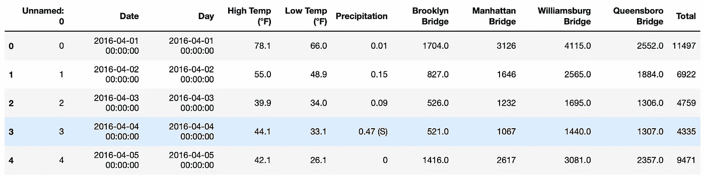

图片来自作者。

这里我们有四座桥上的自行车数量:布鲁克林、曼哈顿、威廉斯堡和昆斯伯勒，它们的总和在“总”特征下。

“日期”和索引有重复的列，所以我们来清理一下:

```
data.drop(['Unnamed: 0', 'Day'], axis=1, inplace=True)
data.head()
```

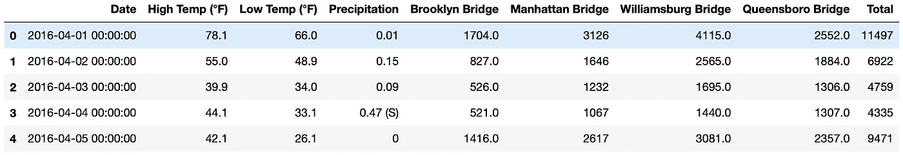

图片来自作者。

注意温度有两列:高和低。取它们的平均值，使其成为一列:

```
data['Mean_Temp'] = (data['High Temp (°F)'] + data['Low Temp (°F)'])/2
data.head()
```

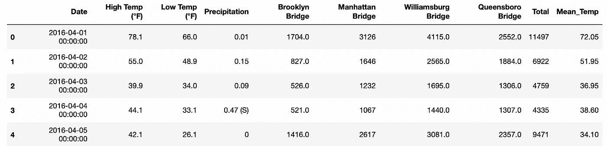

图片来自作者。

降水列包含一些字符串，所以让我们删除它们:

```
data['Precipitation'].replace(to_replace='0.47 (S)', value=0.47, inplace=True)
data['Precipitation'].replace(to_replace='T', value=0, inplace=True)
data['Precipitation'] = data['Precipitation'].astype(np.float16)
data.head()
```

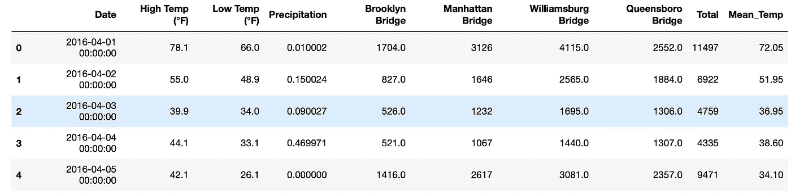

图片来自作者。

## 可视化

影响自行车数量的两个主要独立变量是温度和降水量。我们可以将这两个变量与目标变量“Total”相对照:

```
fig = plt.figure(figsize=(22,7))
ax = fig.add_subplot(121)
ax.scatter(data['Mean_Temp'], data['Total'], linewidth=4, color='blue')
ax.tick_params(axis="x", labelsize=22) 
ax.tick_params(axis="y", labelsize=22)
ax.set_xlabel('Mean Temperature', fontsize=22)
ax.set_ylabel('Total Bikes', fontsize=22)
ax2 = fig.add_subplot(122)
ax2.scatter(data['Precipitation'], data['Total'], linewidth=4, color='red')
ax2.tick_params(axis="x", labelsize=22) 
ax2.tick_params(axis="y", labelsize=22)
ax2.set_xlabel('Precipitation', fontsize=22)
ax2.set_ylabel('Total Bikes', fontsize=22)
```

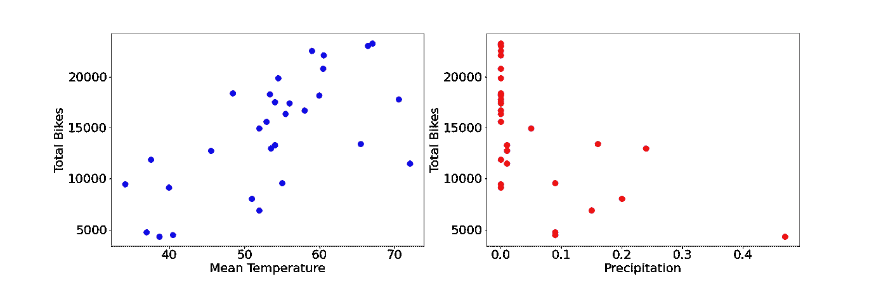

作者用 Python 生成的图。

## 系统模型化

现在，我们可以通过 statsmodel 软件包使用平均温度功能构建一个模型来预测“总量”。由于这种关系是泊松关系，我们将使用自然对数链接函数:

```
model = glm('Total ~ Mean_Temp', data = data[['Total','Mean_Temp']], family = sm.families.Poisson())
results = model.fit()
results.summary()
```

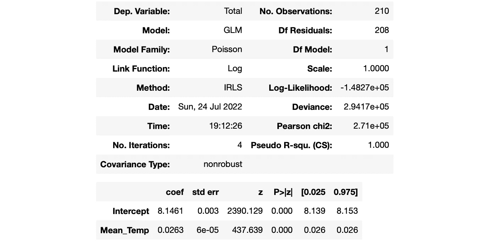

图片来自作者。

> 我们对 GLM 使用了[**R-style 公式**](https://www.statsmodels.org/devel/example_formulas.html) ，因为这在后端提供了更好的性能。

## 分析

从上面的输出中，我们看到平均温度的系数是 **0.0263** ，截距是 **8.1461** 。

使用上面给出的泊松回归公式，我们的直线方程是:

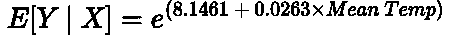

作者在 LaTeX 中生成的方程。

```
x = np.linspace(data['Mean_Temp'].min(),data['Mean_Temp'].max(),100)
y = np.exp(x*results.params[1] + results.params[0])plt.figure(figsize=(10,6))
plt.scatter(data['Mean_Temp'], data['Total'], linewidth=3, color='blue')
plt.plot(x, y, label = 'Poisson Regression', color='red', linewidth=3)
plt.xticks(fontsize=18)
plt.yticks(fontsize=18)
plt.xlabel('Mean Temperature', fontsize=18)
plt.ylabel('Total Count', fontsize=18 )
plt.legend(fontsize=18)
plt.show()
```

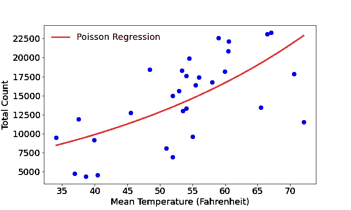

作者用 Python 生成的图。

找到了。我们已经安装了 GLM！

> 对于感兴趣的读者来说，statsmodels 用来拟合 GLM 的算法称为 [**迭代重加权最小二乘**](https://en.wikipedia.org/wiki/Iteratively_reweighted_least_squares) **。**

完整的代码/笔记本可以在我的 GitHub 上找到:

<https://github.com/egorhowell/Medium-Articles/blob/main/Modelling/GLM_Bike_Volume_NYC.ipynb>  

# 结论

在本文中，我们简短地讨论了线性回归的缺点，以及 GLMs 如何通过为回归模型提供更广泛的通用框架来解决这个问题。然后我们拟合一条基本的泊松回归线来模拟纽约市的自行车数量作为日平均温度的函数。

# 和我联系！

*   要在媒体上阅读无限的故事，请务必在此注册！ 💜
*   </subscribe/@egorhowell>😀
*   [*【领英】*](https://www.linkedin.com/in/egor-howell-092a721b3/) 👔
*   [*碎碎念*](https://twitter.com/EgorHowell) 🖊
*   [*github*](https://github.com/egorhowell)*🖥*
*   *<https://www.kaggle.com/egorphysics>**🏅***

> ***(所有表情符号都是由 [OpenMoji](https://openmoji.org/) 设计的——开源的表情符号和图标项目。许可证: [CC BY-SA 4.0](https://creativecommons.org/licenses/by-sa/4.0/#)***