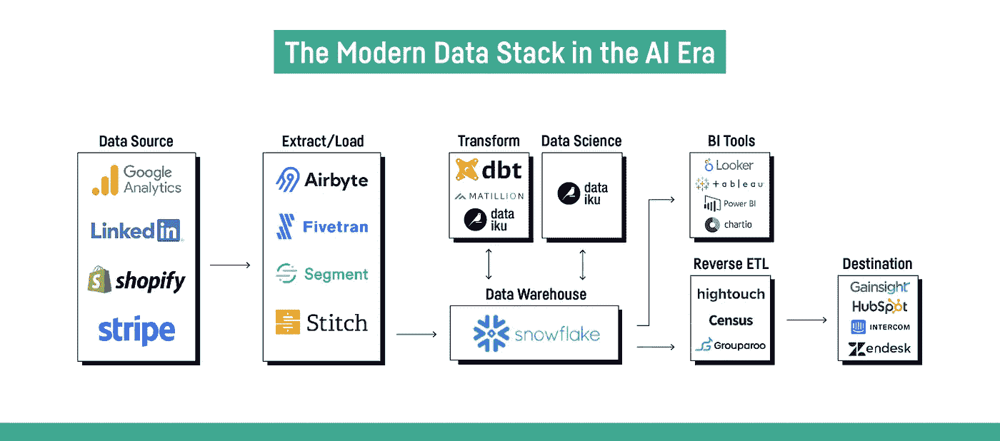
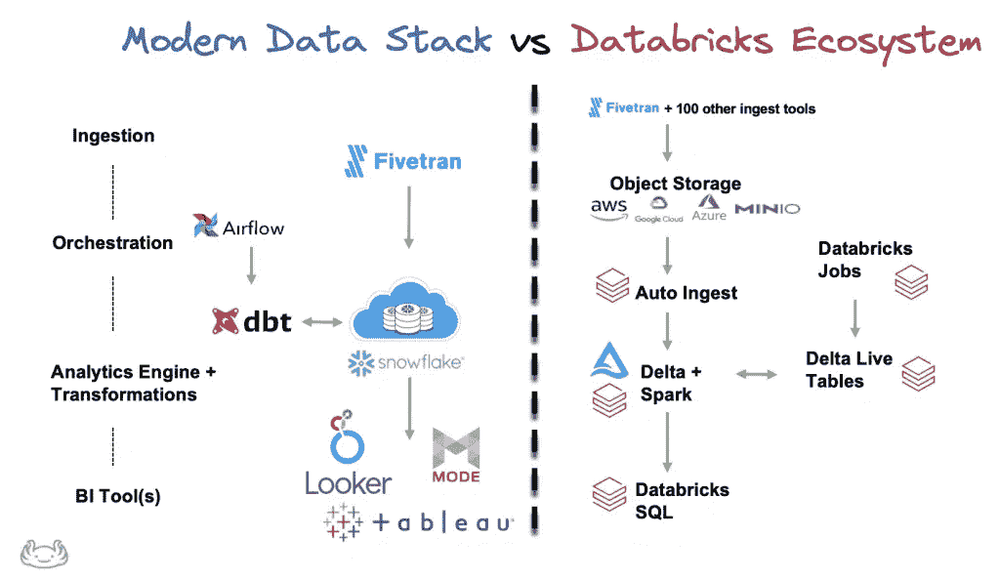
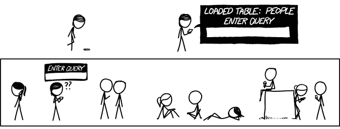
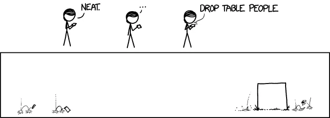

# 现代数据栈:Spark 何去何从？

> 原文：<https://towardsdatascience.com/modern-data-stack-which-place-for-spark-8e10365a8772>

# 现代数据栈:Spark 何去何从？

一年前，[一些人已经预测 dbt 有一天会超过 Spark](https://medium.com/datamindedbe/why-dbt-will-one-day-be-bigger-than-spark-2225cadbdad0) ，2021 年证明他们是对的:dbt 已经变得非常受欢迎，有传言称 [dbt-labs 可能会以 60 亿美元的估值再次融资](https://www.forbes.com/sites/kenrickcai/2021/12/15/dbt-labs-in-talks-to-raise-at-6-billion-valuation-six-months-after-becoming-a-unicorn/)。按照这种速度，他们将很快赶上 2021 年 9 月估值达到 380 亿美元的 [Databricks。](https://www.futuriom.com/articles/news/databricks-heaps-on-1-6-billion-for-38-billion-valuation/2021/09)

尽管如此，今年 Spark 给我留下最深刻印象的是，几乎所有关于现代数据堆栈的博客帖子中都没有 Spark，现代数据堆栈是围绕两个关键组件构建的:

*   一个大规模并行 SQL 引擎(大查询、红移、雪花)
*   还有… dbt

上游:无代码提取/加载工具(Fivetran、Stitch、Airbyte、Hevo)。下游:BI 工具(Tableau、Looker、Power BI、Metabase)和反向 ETL 工具，用于将数据导出到专门的数据库(客户数据平台等)。

Dataiku 的现代数据堆栈:[https://blog . Data iku . com/challenges-to-the-Modern-Data-Stack](https://blog.dataiku.com/challenges-to-the-modern-data-stack)

我只需在 Google Images 中键入“Modern Data Stack ”,就会注意到数据市场中的所有公司都在提出自己的技术列表，因为他们通常会试图将自己包括在列表中。

但我也注意到，这种现代数据堆栈通常完全没有 Spark，Databricks 生态系统通常被视为它的完整替代方案。当然，Databricks 完全意识到了这一点，并且像许多其他人一样，尝试加入可以放在堆栈中心的 SQL 引擎小圈子:他们在 12 月发布了与 dbt Core 和 Databricks SQL 的完全集成。

来源:[https://lakefs . io/thinks-on-the-future-of-the-data bricks-ecosystem/](https://lakefs.io/thoughts-on-the-future-of-the-databricks-ecosystem/)

最近，我回复了另一家公司的一个人，他询问将 Spark 添加到他们的现代数据堆栈中是否值得。由于我的团队目前同时使用 pySpark、BigQuery 和(一点点)dbt，我自己对这个问题想了很多。所以我用一长串支持和反对的理由来回答他们，这些理由激发了我现在的思考，我在这里分享一下:

**基础设施:** BigQuery 完全由 Google 管理，你什么都不用做。相比之下，掌握 Spark 要复杂得多，即使这往往会变得更容易(Spark-serverless 在 GCP 的预览版中可用，即将在 Databricks 和 Databricks SQL 中推出)。

**学习曲线:**同样，在 BigQuery(只有 SQL)上比 Spark 更容易找到或形成有技能的人。我的建议是:在 Scala、Java 或. Net 中，更喜欢 pySpark 而不是 Spark。Python 更容易理解，例如，已经被 Airflow 使用。我认为在 Spark 中使用 Python 之外的另一种语言的唯一有效理由是:“用 RDD 做**非常**高级的事情”和“重用一些公司已经用 Java 编写的代码，而不必重新实现它”。

非常感谢 XKCD 网络漫画公司明确允许我在本文中使用他们的漫画:【https://xkcd.com/1409/ 

**代码组织:** dbt 展示了组织 SQL 转换管道的正确方式(我知道这一点:从 2014 年到 2017 年，我开发了一个[工具，它做了与 dbt 相同的事情，但针对 Apache Hive](https://flamy.readthedocs.io/en/latest/Demo.html) )。据我所知，目前还没有工具能为 pySpark 做同样的事情(dbt 确实支持 spark-sql，但没有完整的 pySpark)。这就是为什么我们开发了一个内部工具，我希望有一天可以开源。如果没有这样的工具，很容易回到 dbt 帮助我们停止的那些糟糕的做法。

**表现力**:我热爱 SQL，甚至超过 BigQuery，但是我只是不能只用 SQL 做我需要的一切。此外，我认为使用 Jinja 模板不是正确的解决方案:正如 Maxime Beauchemin 在他的博客文章中所说，这将导致大量的模板化 SQL 和 YAML。就我个人而言，我认为这与第一批调度器中的错误是一样的: *config-as-code* 有许多限制，而 Airflow 通过证明 *code-as-config* (感谢 Python)工作得更好而扭转了局面。是的，JINJA 确实解决了一些 *config-as-code、*的刚性问题，但是我仍然觉得 JINJA 相当沉重和冗长，可读性不强，而且对 JINJA 代码进行单元测试似乎相当乏味。

得到 xkcd 的明确许可:[https://xkcd.com/1409/](https://xkcd.com/1409/)

**SQL 的限制:**和 Maxime Beauchemin 一样，我相信(至少，我希望)当 BigQuery、Snowflake 或 Redshift 提供类似于 pySpark 提供的 DataFrame API 时，事情会变得更好。雪花实际上已经这么做了:他们最近发布了 Snowpark，其[数据帧 API](https://docs.snowflake.com/en/developer-guide/snowpark/reference/scala/com/snowflake/snowpark/DataFrame.html) 显然是借鉴了 [Spark 的 one](https://spark.apache.org/docs/latest/api/scala/org/apache/spark/sql/Dataset.html) 。我最近开始为 big queryPOC 一个 [DataFrame API，以展示使用这样的东西可以做更多的事情(我承认，其中一些已经可以用 JINJA 宏来完成，但我觉得这种方式不够优雅，也更难维护)。我将在下一篇文章中更多地讨论这个 POC。](https://medium.com/r?url=https%3A%2F%2Fgithub.com%2FFurcyPin%2Fbigquery-frame)

**UDF:**SQL 的另一个重要限制:有些逻辑用 UDF 实现要比用 SQL 代码容易得多。在 BigQuery 中，UDF 必须用 SQL 或 Javascript(！！！).Idem [带雪花](https://docs.snowflake.com/en/sql-reference/user-defined-functions.html)，也支持 Java。去告诉一个只懂 Python 的数据工程师/分析师/科学家写一个 Javascript UDF 吧……PySpark 允许我们用 Python 写 UDF，我等不及 BigQuery 也允许了。

经 xkcd 明确许可:[https://xkcd.com/1409/](https://xkcd.com/1409/)

**Extract-Load (E/L)** :我对大量的人似乎使用定制气流操作器来执行 E/L 任务感到非常惊讶，而不是 Spark。我认为这是 Spark 最大的优势之一:它有[大量的连接器](https://spark-packages.org/?q=tags%3A%22Data%20Sources%22)来读取/写入任何东西。它还可以毫不费力地对 json 和 xml 执行自动模式检测。并且，[正如 Ari Bajo](https://airbyte.io/blog/airflow-etl-pipelines) 所指出的，最好通过一个中央状态(Spark)并拥有 *O(n)* 连接器，而不是为每个源-目的地对编写 *O(n )* 连接器。Spark 可以做到所有这些，我认为它的运行成本比 Fivetran 要低得多(尽管我必须说开源工具 Airbyte 可能是一个很好的选择)。Spark 的设置成本可能会更高，但是一旦支付了费用，复制和添加新的源/目的地并不需要很长时间。另一个优势是:Spark 可以同时完成 *ETL* 和*反向 ETL。诚然，它确实需要开发人员，而非开发人员可以使用图形界面。但是我也有一种感觉，一个没有 GUI 的开发人员不太能够调查和解决潜在的问题(但是我可能错了)。*

**实时:**在我的团队中，我们开始将 pySpark 用于简单的实时案例(将原始数据摄取到 BigQuery 中)，但我对这个主题还不够了解，无法将其与其他替代方案(如 lambda 函数)进行比较。我们会注意到，由于它的*微批量*模式，Spark 允许我们非常容易地拥有恰好一次的保证。

得到 xkcd 的明确许可:[https://xkcd.com/1409/](https://xkcd.com/1409/)

## 结论

用几句话总结一下，我认为这些考虑大多围绕一个中心点，这是 SQL 最大的优点，也是它最大的缺点:简单。正是由于 SQL 的简单性，像 BigQuery 和 Snowflake 这样的平台才如此易于使用，并被广泛采用，同时降低了被供应商锁定的风险。相反，这种简单性也是它最大的缺点，因为 SQL 很快就达到了极限，开发最佳实践更难应用，也更不普及。多亏了 dbt 和 JINJA，这些缺点中的一些可以得到缓解，但我相信行业将不得不走得更远，用 DataFrames 或其他类似的 API 来帮助数据技术人员编写更通用和高级的转换，并更好地满足不断增长的数据需求。

得到 xkcd 的明确许可:[https://xkcd.com/1409/](https://xkcd.com/1409/)

在我的团队中，一个主要的挑战是我们倾向于在 pySpark 和 BigQuery 之间交替使用，以从每种工具的优势中获益。这使得*数据血统*更加困难，因为 dbt 只让我们可视化 BigQuery 部分，而我们的内部“*用于 pySpark 的 dbt*”工具只让我们看到 pySpark 部分。从长远来看，我希望 BigQuery 能够添加与 pySpark (DataFrame API 和 Python UDFs)相比所缺少的特性，这将允许我们有一天将当前的 pySpark 转换迁移到 BigQuery。唯一留在 pySpark 这边的是 E/L 和实时数据处理。

得到 xkcd 的明确许可:[https://xkcd.com/1409/](https://xkcd.com/1409/)

*(此贴有法文版* [*此处*](https://medium.com/@pin.furcy/modern-data-stack-quelle-place-pour-spark-43bb06fa586a) *)*