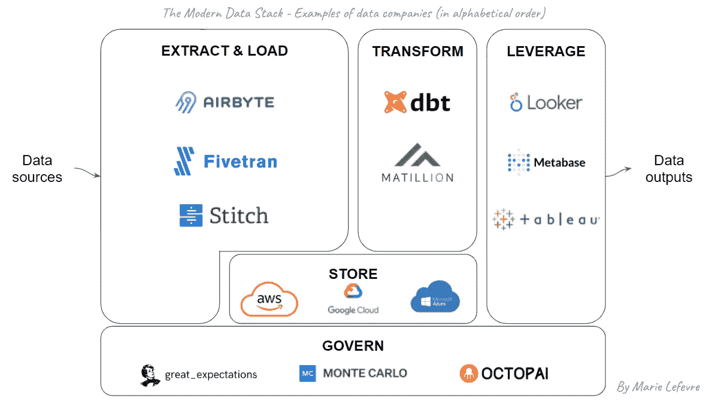

# 现代与否:什么是数据堆栈？

> 原文：<https://towardsdatascience.com/modern-or-not-what-is-a-data-stack-e6e09e74ae7f>

## 数据架构

## “现代数据堆栈”简单地解释为一个堆栈

不是一个数据堆栈——由 [Unsplash](https://unsplash.com/?utm_source=unsplash&utm_medium=referral&utm_content=creditCopyText) 上的 [Andrew Draper](https://unsplash.com/@andalexander?utm_source=unsplash&utm_medium=referral&utm_content=creditCopyText) 拍摄

去年，当我发现自己在寻找一份比我当时的职位(运营数据分析师)活动范围更广的工作时，我开始对公司的数据架构主题感兴趣。特别是，我想**更好地理解如何在我自己的数据分析范围之外构建和管理数据**。

这就是我如何进入(仍在进行中)关于“现代数据堆栈”的**讨论:**

> 这是什么？
> 
> 我们应该尝试“捆绑”还是“拆分”？
> 
> 这些融资数百万美元的数据公司都是些什么人？

围绕这个话题还有很多我并不总是完全理解的问题。

对于我们数据分析师来说，我们角色的主要部分是**将业务用户的需求转化为可操作的数据，以帮助他们做出更好的决策**。为此，我们的日常工具侧重于数据分析(例如任何 SQL 控制台，如 Google BigQuery 的控制台)和数据可视化(例如 Google DataStudio)。

在公司“数据光谱”的另一端，数据的原始提取及其转换**使数据可供数据分析师使用**更多是数据工程师的责任。至少我以前是这么看的。

拓宽我的“数据架构”视野—来自 [Pexels](https://www.pexels.com/photo/woman-in-a-mountains-having-view-on-the-sunrise-10369711/?utm_content=attributionCopyText&utm_medium=referral&utm_source=pexels) 的 [Nurlan Tortbayev](https://www.pexels.com/@nurlantortbayev?utm_content=attributionCopyText&utm_medium=referral&utm_source=pexels) 拍摄的照片

为了从更广的角度了解什么是数据堆栈，我进行了自己的研究。在这篇文章中，我想与你分享这次反思的结果。这里的目标是保持简单，因此当您想要开始探索现代数据堆栈的概念时，以下解释应该被视为“从哪里开始”的指南。

从个人的角度来看，我经常回到下面的两个图表来阐述一个特定的观点，或者就数据架构这个广泛的主题与同事进行交流:

1.  现代数据堆栈的核心和基础模块
2.  现代数据堆栈中的公司示例

# 什么是现代数据堆栈？

首先，业务环境中所谓的“数据堆栈”是多种技术的**组合，允许公司利用数据进行决策**。

添加形容词“现代”是指近年来的发展，特别是:

*   **云平台的崛起**提供更便宜、更灵活的定价方案来存储大量数据
*   **新数据公司的出现**，它们在公司数据堆栈的特定部分提供更高水平的专业知识

这些趋势意味着通常被理解为术语“现代数据堆栈”的两个主要变化。首先，针对大量数据的更便宜、更高效的存储解决方案倾向于从 ETL(提取>转换>加载)向 ELT(提取>加载>转换)转变。

其次，“一体化”解决方案往往比组合几种数据工具具有更差的性价比，因为与这些新兴数据公司相比，它们具有更通用的方法。这意味着，如果企业选择不采用“一体化”解决方案，就需要将几种数据技术结合起来。

# 现代数据堆栈由哪些块组成？

要在公司执行所有必要的数据管理任务，任何数据堆栈都必须包括以下模块:

图 1 —现代数据堆栈的核心和基础模块

让我们从**核心数据堆栈**的 4 个组件开始:

## 1.提取

要开始，必须从各种来源提取数据。例如，这可以通过用 Python 编写的脚本来完成，或者通过服务提供商提供的本地连接器来完成。最合适的解决方案将取决于所做的技术选择，但也取决于原始数据的提取方式:通过 API(可能是最简单的方式)，通过安全文件传输协议(SFTP)，通过 web 报废等。

## 2.负荷

提取的数据应该存储在适当的基础设施中。在这个模块中，公司可以使用数据湖和/或数据仓库在下一步之前加载数据。有趣的是，一些提供商，如 Databricks 或 Snowflake，倾向于提供第三种创新的数据平台，结合数据湖(非结构化和大数据)和数据仓库(结构化和有管理的数据)的优势。

## 3.改变

一旦数据在一个中心位置可用(对于更复杂的数据体系结构，可能有几个位置)，就需要对其进行转换，然后才能用于进一步的分析。这是通过几个层处理数据的地方，有两个主要目标:使数据干净(例如，避免错误的值，标准化格式)和使数据可用于步骤 4(例如，通过合并来自多个来源的数据，将其聚合)。

## 4.杠杆作用

如果不使用，数据会是什么？这是产生数据输出的地方，因此对于技术团队之外的利益相关者来说，这是数据堆栈最可见的部分。数据输出可以是报告和交互式仪表板，也可以是临时分析、数据发现工具等。

这四个数据块构成了现代数据堆栈的核心元素。然而，如果数据堆栈中缺少了**的两个基本元素**，那么它们将是徒劳的:

## A.商店

在“加载”和“转换”模块中，我们假设存储数据和将转换应用于数据的基础设施进展顺利。只有当存储配置正确，并且在容量、刷新频率、使用类型等方面适应整个数据堆栈的需求时，才会出现这种情况。

## B.管理

在构建数据堆栈时，我们倾向于关注构建部分，而忘记了维护部分——许多应用领域都是如此。然而，数据治理工具和最佳实践是保持上述所有数据块的数据质量的关键，也是确保**数据从其来源到最终目的地**得到正确处理的关键。

# 现在怎么办？自带设备:构建您自己的数据堆栈！

我不想讨论哪种工具最适合每一个用例，我想展示一些与每个模块相对应的技术和数据公司的例子。

当您进行自己的研究并对解决方案提供商进行基准测试时，这个视图应该允许您更好地对他们进行分类。请随意补充以下模板，并根据您自己的情况进行调整:

图 2—现代数据堆栈中的公司示例

虽然所有数据块都是构成您公司的数据堆栈所必需的，但是必须做出一些权衡来选择最适合的技术组合。为了帮助您做到这一点，在绘制您的目标数据堆栈时，您应该问自己一些关键问题，当然还有相关的利益相关者:

*   您希望将光标放在**“全部在一个地方”与“每个特定任务一个工具”**之间的哪个位置？
*   您希望将光标放在**“自己做”**(可能使用开源技术)**与“将实现委托给提供商”**(可能涉及供应商锁定)之间的什么位置？
*   就可用性和能力而言，你的**内部人员能力**是什么？
*   你有多少预算？
*   你在**时间**方面的约束是什么？

# 结论

这是对现代数据堆栈的基本概述。正如我之前提到的，这不是什么新东西，而是这个广泛主题的简化视图。如果您想了解更多，我邀请您向下滚动到“参考资料”部分。

在介绍现代数据堆栈的概念并与同事讨论时，我发现这些自制的图表对自己有宝贵的帮助，所以我希望它们可以为其他人提供很好的介绍。不要犹豫，分享你的想法！

# 参考

*   [现代数据基础设施的新兴架构](https://future.a16z.com/emerging-architectures-modern-data-infrastructure/)作者马特·博恩施泰因、李昕晢、马丁·卡萨多
*   [基线数据栈——超越现代数据栈](https://medium.com/coriers/the-baseline-data-stack-going-beyond-the-modern-data-stack-part-1-9791b7d49e85)(第一部分及以后)[本·罗戈扬](https://medium.com/u/41cd8f154e82?source=post_page-----e6e09e74ae7f--------------------------------)
*   [Danilo Drobac](https://medium.com/@danilo.drobac/the-modern-data-stack-4f0094017edb)[的](https://medium.com/u/755512a464bb?source=post_page-----e6e09e74ae7f--------------------------------)现代数据堆栈
*   …以及在谷歌图片和 LinkedIn 上广泛搜索“现代数据堆栈”

你喜欢读这篇文章吗？ [*成为会员*](https://marie-lefevre.medium.com/membership) *加入一个不断成长的充满好奇心的社区吧！*

<https://marie-lefevre.medium.com/membership> 