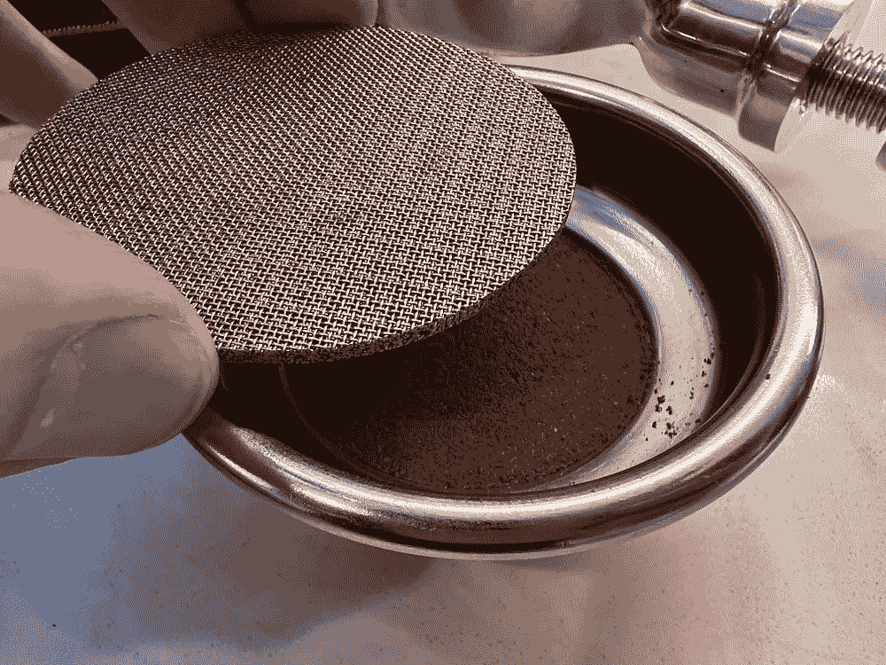
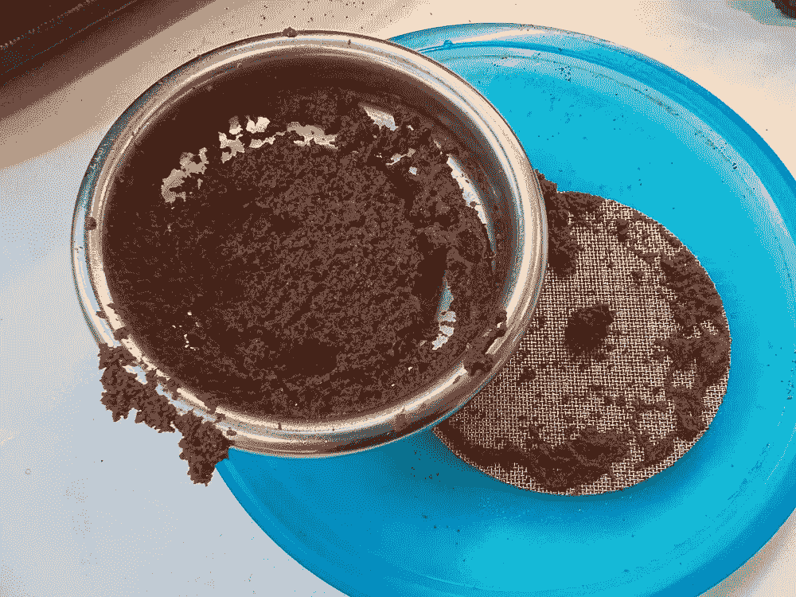
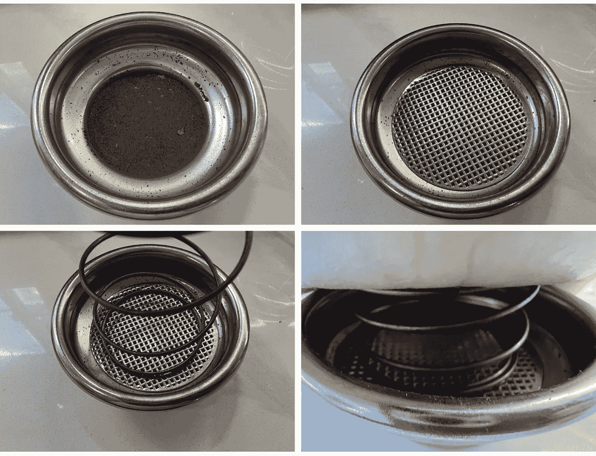
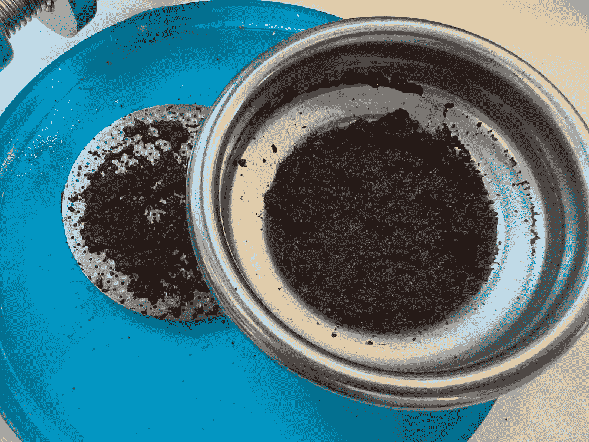
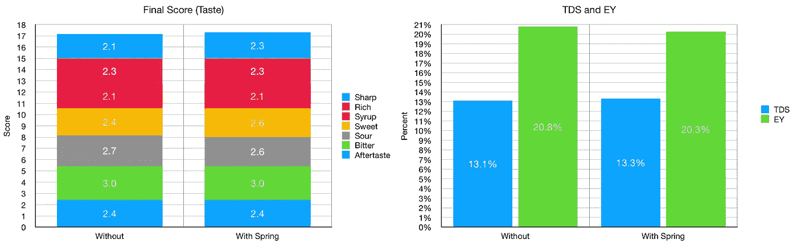

# 修改单个浓缩咖啡篮

> 原文：<https://towardsdatascience.com/modifying-the-single-espresso-basket-dcb4d87f592f>

## 咖啡数据科学

## 添加弹簧和金属网

浓缩咖啡在一杯咖啡的过程中会膨胀，但同时，由于萃取，它们会失去咖啡的质量。因此，在整个拍摄过程中，它们会失去密度，并被水取代。我很好奇，是否可以用弹簧将圆盘屏幕保持在一定深度，或者甚至可以压缩圆盘以保持相同的密度。

到目前为止，这些实验表现不佳，因为它们在开始时会产生较高的夯压。随着射击通过机械机构而不是水进行，需要新的硬件来减少顶部空间。我第一次看到这种可能性是因为我的天赋，尽管这不是我设计的。

然而，我在一个春天的单篮子里看到了一个机会。我对单个篮子(7g)的一个问题是有太多的顶部空间。通常，咖啡会从篮子的凹陷区域流出。唯一的补偿方法就是把篮子装满差不多 14g。

顶部有金属网且无弹簧的前后，所有图片由作者提供

> 理论:如果你用一个弹簧更好地将粉末装在一个篮子里，击球效果会更好。

# 弹簧设置

我用一个淋浴屏风坐在上面，我在上面放了一个弹簧来控制地面。弹簧来自 [Happy Tamper](/peeling-back-the-mystery-of-espresso-extraction-in-staccato-14a0645238a4) ，因为它的大小和张力都是正确的。

拍摄后，咖啡留在正常的篮子区。

然而，味道和提取指标显示几乎没有影响。

# 设备/技术

[浓缩咖啡机](/taxonomy-of-lever-espresso-machines-f32d111688f1) : [像样的浓缩咖啡机](/developing-a-decent-profile-for-espresso-c2750bed053f)

[咖啡研磨机](/rok-beats-niche-zero-part-1-7957ec49840d):小生零

咖啡:[家庭烘焙咖啡](https://rmckeon.medium.com/coffee-roasting-splash-page-780b0c3242ea)，中杯(第一口+ 1 分钟)

镜头准备:[断奏夯实](/staccato-tamping-improving-espresso-without-a-sifter-b22de5db28f6)

[预灌注](/pre-infusion-for-espresso-visual-cues-for-better-espresso-c23b2542152e):长，约 25 秒

输液:[压力脉动](/pressure-pulsing-for-better-espresso-62f09362211d)

[过滤篮](https://rmckeon.medium.com/espresso-baskets-and-related-topics-splash-page-ff10f690a738) : 7g VST

其他设备: [Atago TDS 计](/affordable-coffee-solubility-tools-tds-for-espresso-brix-vs-atago-f8367efb5aa4)， [Acaia Pyxis 秤](/data-review-acaia-scale-pyxis-for-espresso-457782bafa5d)

# 绩效指标

我使用两个[指标](/metrics-of-performance-espresso-1ef8af75ce9a)来评估技术之间的差异:最终得分和咖啡萃取。

[**最终得分**](https://towardsdatascience.com/@rmckeon/coffee-data-sheet-d95fd241e7f6) 是评分卡上 7 个指标(辛辣、浓郁、糖浆、甜味、酸味、苦味和余味)的平均值。当然，这些分数是主观的，但它们符合我的口味，帮助我提高了我的拍摄水平。分数有一些变化。我的目标是保持每个指标的一致性，但有时粒度很难确定。

**使用折射仪测量总溶解固体量(TDS)，这个数字结合咖啡的输出重量和输入重量用于确定提取到杯中的咖啡的百分比，称为**提取率(EY)** 。**

****

**使用弹簧有助于更清晰的拍摄，但它无助于解决根本问题。这个简短的实验让我重新思考顶空，因为这个实验显示顶空并没有像我想象的那样影响拍摄。**

**我也意识到我不像以前那样喜欢喝一杯了。**

**如果你愿意，可以在推特上关注我，在 YouTube 上关注我，在 Instagram 上关注我在不同机器上拍摄的浓缩咖啡视频和浓缩咖啡相关的东西。你也可以在 [LinkedIn](https://www.linkedin.com/in/dr-robert-mckeon-aloe-01581595) 上找到我。也可以关注我的[中](https://towardsdatascience.com/@rmckeon/follow)和[订阅](https://rmckeon.medium.com/subscribe)。**

# **[我的进一步阅读](https://rmckeon.medium.com/story-collection-splash-page-e15025710347):**

**[我未来的书](https://www.kickstarter.com/projects/espressofun/engineering-better-espresso-data-driven-coffee)**

**[我的链接](https://rmckeon.medium.com/my-links-5de9eb69c26b?source=your_stories_page----------------------------------------)**

**[浓缩咖啡系列文章](https://rmckeon.medium.com/a-collection-of-espresso-articles-de8a3abf9917?postPublishedType=repub)**

**工作和学校故事集**