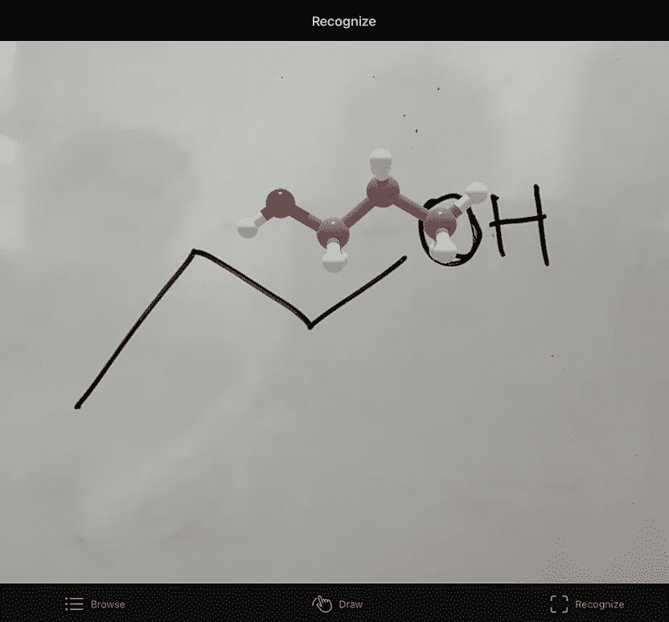
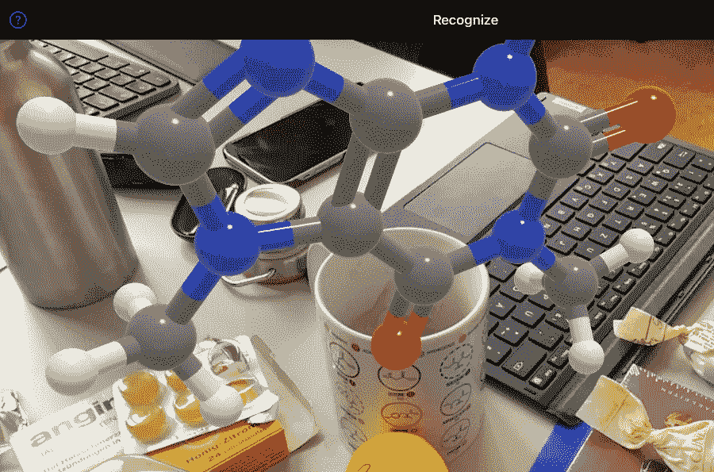

# 增强现实中的分子，来自对日常物体和手绘分子结构的 ML-powered 识别

> 原文：<https://towardsdatascience.com/molecules-in-augmented-reality-from-ml-powered-recognition-of-everyday-objects-and-hand-drawn-584ef187a7c9>

## 一篇新论文介绍了一款智能手机应用，它可以识别日常用品中手绘的化学结构和分子

斯坦福大学托德·马丁内斯(Todd Martinez)的团队刚刚发表了一篇新论文，展示了一款令人印象深刻的新智能手机应用程序，该应用程序可以识别照片中的化学物质或解析手绘分子结构，然后在你的手机上启动增强现实中的 3D 视图。这款应用名为 MolAR，你可以在苹果商店找到它(显然截至本文撰写之日，还没有针对 Android 的版本)。

我自己试过，效果非常好:

Sakshuwong 等人的臼齿在行动。左图:MolAR 刚刚扫描了丙醇的手绘结构，并在图纸顶部显示了该分子在 AR 中的 3D 结构。右图:MolAR 刚刚检测到一个杯子，并在 AR 中显示了咖啡因的 3D 结构，咖啡因是咖啡、茶和其他饮料的活性分子。作者根据 MolAR app 截图合成的图。

除了该应用程序在化学教育中的明显应用之外，该论文和相关作品(如下所述)肯定会引起*对数据科学*的读者的兴趣，因为它们说明了机器学习方法的具体应用，这里与视觉识别有关。最重要的是，该应用程序利用了商品增强现实，这是现代的另一个关键技术里程碑，尤其是随着元宇宙的发展。

 [## 元宇宙？不确定，但是 WebXR？太好了。

### 未来互联网的核心技术之一，我们已经将其应用于娱乐之外的领域。

medium.com](https://medium.com/age-of-awareness/metaverse-not-sure-but-webxr-hell-yes-12af5b302e08) 

# 臼齿及其工作原理概述

## 用于分子可视化的 AR 和 VR

观察 3D 分子结构对于理解原子水平上的世界是如何运作的至关重要。但是分子本质上是 3D 物体，很长一段时间以来，我们一直停留在平面屏幕上的 2D 视图。尽管通过增强和虚拟现实(AR/VR)的 3D 可视化多次试图做出改变，但它们大多无效且非常昂贵，直到最近手机中的 AR 变得可用，甚至高端 VR 耳机也降低了成本。我在 EPFL([EPFL tech 4 impact](https://medium.com/u/7dbe1c70684b?source=post_page-----584ef187a7c9--------------------------------)[EPFL 推广学校](https://medium.com/u/b91d50f7c43c?source=post_page-----584ef187a7c9--------------------------------) [智能系统中心 CIS EPFL](https://medium.com/u/dbc90b1d5873?source=post_page-----584ef187a7c9--------------------------------) [EPFL 企业家俱乐部](https://medium.com/u/f76876cdbe6c?source=post_page-----584ef187a7c9--------------------------------))工作的很大一部分实际上是致力于开发廉价的 AR 和 VR 在化学领域应用的新工具:

 [## 化学和生物教育使用商品网络增强现实-在任何设备！

### 感谢现代教育内容在我们的分子网站和互联网上使用了基于网络的增强现实技术

medium.com](https://medium.com/geekculture/chemistry-and-biology-education-using-commodity-web-augmented-reality-in-any-device-9fa9fdc4ab35)  [## 分子网:实用简介

### 系列的一部分。这里:活动是如何组织的+如何运行它们的一般指导

lucianosphere.medium.com](https://lucianosphere.medium.com/molecularweb-a-brief-practical-introduction-5738771b224d) 

## 摩尔的关键:化学与日常生活的无缝输入和连接

在 AR 和 VR 中观察分子的优势越来越明显，技术也越来越容易使用。然而，马丁内斯的团队意识到了一个重要的问题:如何以一种更具互动性的方式将分子结构输入到应用程序中？到目前为止，工具要么包括一个预设的分子列表，要么允许你在电脑上手动绘制 2D，或者通过键入分子名称来搜索它们，然后在 ar 或 VR 中启动它们。 **MolAR 提出了一种完全不同的方法，允许更简单、直接地输入分子结构**。

MolAR 使用深度学习技术以两种方式输入分子:

*   通过识别和分析手绘在一张纸上、板上等的分子。这是基于该小组之前开发的一个名为 [ChemPix](https://pubs.rsc.org/en/content/articlehtml/2021/sc/d1sc02957f) 的系统。
*   通过识别日常生活中的物体，然后从数据库中检索其最重要的分子，例如咖啡因，如果用户将手机摄像头对准一杯咖啡，如上例所示。

> 作为免费的应用程序，无需任何外部硬件或辅助软件就可以在智能手机上运行，并且通过这种简单的方法来引入分子，MolAR 提供了一个平台，以高度沉浸式的方式可视化 3D 分子结构并与之交互，几乎不费吹灰之力。

MolAR 应用程序是用 Swift 编写的，带有一个专门针对 iPhones 和 iPads 的软件开发工具包(SDK)，所以很可能不会很容易看到这个很酷的应用程序移植到 Android 上。为了实现 AR，MolAR 使用了 SDK 的 ARKit 模块，该模块包括处理视觉场景、运动跟踪和锚点上的图形显示的功能。在这种 AR 模式下，对象遮挡的效果非常好，所以你可以用手指指向分子的一部分，并在屏幕上清楚地看到这一点——很少有 AR 系统支持并正确渲染这一点。

有趣的是，与其他工具不同，对象和化学结构的识别和解析是在服务器上进行的，我将在接下来的两节中对此进行概述。

## 基于 MolAR 的手绘结构解析

为了解析手绘结构，服务器通过神经网络运行从应用程序接收的图像，该神经网络将图像转换为 SMILES 代码，这是分子结构的简化纯文本表示。这个名为 ChemPix 的神经网络也是由 Martinez 小组在之前的一项工作中开发的，如果你对深度学习在图像分析中的应用感兴趣，那么你必须阅读这份工作，如果是化学方面的话，就更是如此:

 [## ChemPix:使用深度学习自动识别手绘碳氢化合物结构-化学…

### DOI: 10.1039/D1SC02957F(边缘文章)，2021，12，10622-10633 收到于 2021 年 6 月 1 日，接受于 2021 年 6 月 28 日首先…

pubs.rsc.org](https://pubs.rsc.org/en/content/articlehtml/2021/sc/d1sc02957f) 

简而言之，ChemPix 首先用卷积神经网络对图像进行编码，然后用产生微笑代码的长短期记忆网络对其进行解码。在 MolAR 的服务器中，这个 SMILES 代码然后通过使用翻译器转换成 3D 坐标，翻译器是美国国家癌症研究所的许多计算化学终点之一，就像我们的 MoleculARweb 的虚拟建模工具包一样。

3D 原子坐标最终通过球体和圆柱体图元转换为 3D 模型，非常类似于任何其他 AR/VR 系统中的分子显示。

 [## 如何在 moleculARweb 上加载*any*分子用于增强现实显示

### 系列之一:如何在增强现实中看到任何分子

lucianosphere.medium.com](https://lucianosphere.medium.com/how-to-load-any-molecule-for-display-in-augmented-reality-on-molecularweb-5da0af4b64b2) 

## 解析对象

为了识别物体，MolAR 的服务器使用[谷歌云视觉 API](https://cloud.google.com/vision) 和亚马逊 Rekognition。像这样的 API 提供了简单的方法来利用其他人构建的优秀资源，这些人拥有单个用户可能没有的专业知识，或者可能需要单个终端用户无法获得的计算能力。API 简化了新的酷工具的开发，并且在这个过程中展示了不同的包和不同的人的工作的无缝集成，即使他们有不同的特定最终目标。当然，他们展示了知道外面有什么可以使用的力量。对我来说，API 是计算机技术中最酷的发明之一，尤其是基于网络的编程。

回到 MolAR 及其解析对象的方式，它结合了来自 Google Cloud Vision API 和 Amazon Rekognition 的输出，以提取可能出现在网络摄像头馈送中的对象列表。这些对象是诸如“牛奶”、“番茄”或“杯子”的关键字，在数据库中映射到与对象相关的分子。比如“牛奶”配“乳糖”，“番茄”配“番茄红素”，“杯”配“咖啡因”。这确实是一个非常简单的方法，但是如果物体-分子对的数据库足够大的话，这是非常实用的。

> 当然，该工具不会知道图像中的饮料实际上是脱咖啡因咖啡而不是普通咖啡；同样，它可能会正确地选择红葡萄酒作为“葡萄酒”，而不是白葡萄酒(白葡萄酒实际上可能会与其他饮料混淆)。
> 
> 这似乎是一个显而易见的问题(顺便说一句，很难解决)，但如果该工具用于化学教育，它实际上非常重要。如果一个学生天真地想比较一杯普通咖啡和无咖啡因咖啡的摩尔说什么呢？我的观点是，无论工具看起来有多酷，在课堂上使用时都必须非常小心。

# 结论和进一步阅读

技术发展非常快，最棒的是，它们变得足够实用，可以用于具体的应用，帮助我们更好地教和学。正如你所看到的，通过视频分析，甚至是带有位置感知姿态估计的增强现实，将网络技术与机器学习相结合，实现了物体识别。

仅仅在十年前，这一切都是不可能的，而现在，它已经出现在软件开发者的工具箱和用户的智能手机中。

## 进一步阅读

同行评议论文:【https://aip.scitation.org/doi/abs/10.1063/5.0090482 

或者，您可以在此免费获取预印本:

 [## 摩尔:用增强现实和机器学习将化学结构带入生活

### 可视化三维分子结构对于理解和预测它们的化学行为至关重要…

chemrxiv.org](https://chemrxiv.org/engage/chemrxiv/article-details/613081028e38a3bd644709da) 

要了解更多这个小组令人兴奋的研究和软件开发，请看它的主页:[https://mtzweb.stanford.edu/](https://mtzweb.stanford.edu/)

www.lucianoabriata.com*[***我写作并拍摄我广泛兴趣范围内的一切事物:自然、科学、技术、编程等等。***](https://www.lucianoabriata.com/) **[***成为媒介会员***](https://lucianosphere.medium.com/membership) *访问其所有故事(我为其获得小额收入的平台的附属链接，无需您付费)和* [***订阅获取我的新故事***](https://lucianosphere.medium.com/subscribe) ***通过电子邮件*** *。到* ***咨询关于小职位*** *查看我的* [***服务页面这里***](https://lucianoabriata.altervista.org/services/index.html) *。你可以* [***这里联系我***](https://lucianoabriata.altervista.org/office/contact.html) ***。******