# MolKGNN:将卷积扩展到分子

> 原文：<https://towardsdatascience.com/molkgnn-extending-convolution-to-molecules-b94a4d51f39f>

## 了解在 AAAI2023 上接受的为药物发现量身定制的可解释 GNN

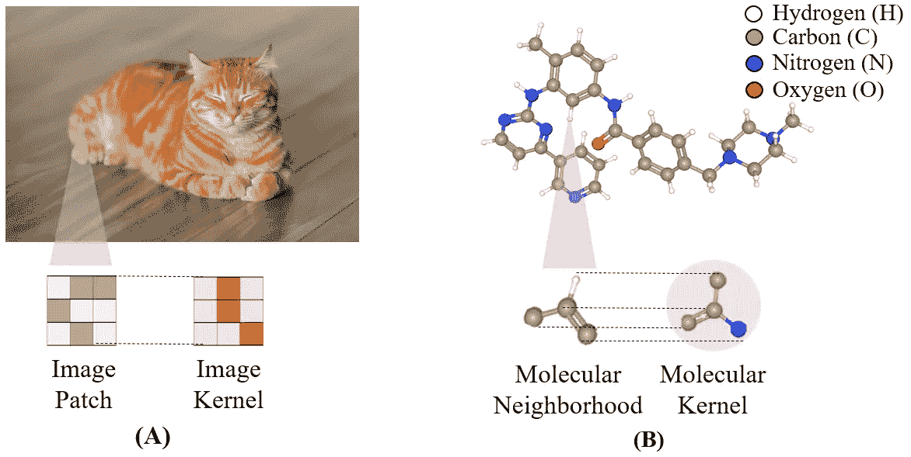

图一。类似于(A)图像卷积和(B)提出的分子卷积。[图片来自原纸。](https://www.biorxiv.org/content/10.1101/2022.08.24.505155v1)

本博客介绍了我们的最新模型**Mol**ecular**K**ernel**G**raph**N**eural**N**Network(MolKGNN)摘自论文
[***可解释手性图神经网络用于药物发现中的定量结构活性关系建模***](https://www.biorxiv.org/content/10.1101/2022.08.24.505155v1)

该作品在 [AAAI2023](https://aaai-23.aaai.org/) (口头和海报展示)，以及[图形学习会议](https://logconference.org/)(非档案海报)上被接受

# **简介:**

阐明分子结构及其药理活性是药物发现史上的一个长期问题。1859 年，德国化学家 Carl Stahlschmidt 证明了在马钱子碱和马钱子碱中加入碘甲烷显然破坏了它们的生理作用[1]。他的工作促使两位苏格兰科学家 Alxander Crum Brown(1838-1922)和 Thomas r . Fraser(1841-1920)对一系列化合物进行了实验。这些实验帮助他们确认了存在结构活性关系(SAR) [1]。当时，人们相当乐观地认为，将会发现描述分子结构与其药理活性之间关系的一般规律。从那时起，已经开发了几种数学/统计和机器学习方法，试图预测这种关系。这个过程被称为定量结构活性关系(QSAR)建模。QSAR 尝试的例子包括多元线性回归、偏最小二乘法、判别分析、决策树、遗传算法等[2]。人们对 QSAR 研究的治疗应用寄予厚望。然而，直到今天，预测小分子的生物活性仍然是一项具有挑战性的任务。

**任务:**

QSAR 建模，即从分子结构预测二进制标签 0(无活性)或 1(活性)。分子被表示为图形，其中节点是原子，键是边。

该文件的重点:

*   本文介绍了一种新的 SE(3)/构象不变性模型，命名为 **MolKGNN** ，它是为药物发现中的 QSAR 任务量身定做的。
*   **MolKGNN** 的特点在于其新颖的分子卷积、轻量级的手性计算以及可解释性
*   一个现实的药物发现实验证明了提议的 **MolKGNN** 的实用价值

# **MolKGNN 模型架构**

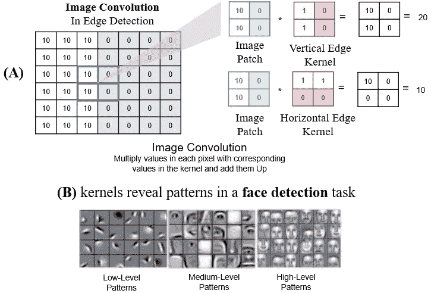

图二。(A)在 2D 图像卷积中，较高的卷积值表示较高的视觉相似性模式。(B)图像内核提供了可解释性的好处。图片由作者提供。

MolKGNN 从 2D 图像卷积中获得灵感(图 2)。在 2D 图像中，卷积运算可以看作是计算图像块和图像核之间的相似性。较大的输出值表示较高的视觉相似性模式，如边缘、条带和曲线[3]。然而，由于其不规则性，2D 图像卷积不能容易地扩展到 3D 分子图。因此，新的分子卷积被设计成在分子邻域(1 跳邻居)和分子核(1 跳)之间卷积，类似于用图像核卷积的图像补丁。分子卷积具有以下特性:

*   像图像卷积一样，分子邻域与分子核越相似，分子卷积值应该越高。
*   与图像卷积不同，分子卷积应该是旋转不变的
*   分子内核可以提供可解释性。

接下来的问题是，我们如何设计分子卷积使其具有上述性质？

分子邻域 *S* 与核*s’*之间的相似性通过相似性得分 *ϕ(S，s’)来量化。*这个分数是三个子分数 *ϕ_* cs、 *ϕ_* ns 和 *ϕ_* es 的组合，这三个子分数分别捕获中心相似性、邻近节点相似性和边缘相似性。这些的计算如下所示(符号在最后有完整的描述):

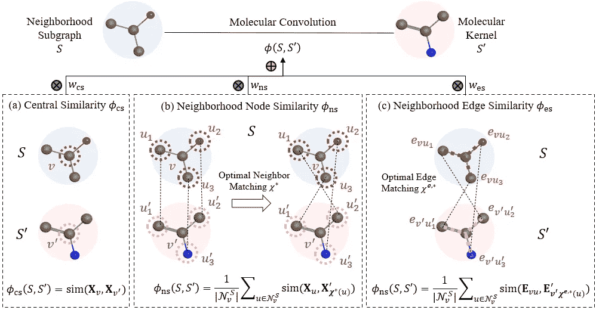

图 3。相似性得分计算的图示。图片来自[原文](https://www.biorxiv.org/content/10.1101/2022.08.24.505155v1)。

从三个子得分的组合中计算邻域子图和核之间的相似性得分。子分数量化了邻域子图和核之间不同方面的相似性。中心相似性子分数 *ϕ* _cs 捕获中心节点属性(v 和 v’)之间的相似性。邻近节点相似性子分数 *ϕ* _ns 捕获邻近节点(u1 和 u1’、u2 和 U2’、u3 和 u3’)的属性的相似性。邻域边缘相似性子分数 *ϕ* _es 捕捉相邻边缘属性的相似性。

因为节点/边属性是向量，所以使用相似性函数 sim(⋅来计算向量相似性。我们在实现中使用了[余弦相似度](https://en.wikipedia.org/wiki/Cosine_similarity)。*如图 3(a)所示，在中心节点 v 和 v’的属性之间计算ϕ_cs* 。

注意，为了计算 *ϕ* _ns，有多种匹配邻居的方法，每种匹配都给我们一个分数。我们列举所有匹配并将给出最高分数的一个定义为最佳邻居匹配χ*(例如，图 3(b)右侧的 u1 和 u2’、U2 和 u3’、u3 和 u1’)。这种匹配的枚举是可行的，因为在类药物分子中至多有四个邻居。

对于 *ϕ_* es *，b* 由于相邻节点与相邻边一一对应，我们可以根据最优邻居匹配χ*(图 3(c))找到最优边匹配χ^{e,*}。

接下来，我们想整合手性计算。想法是用内核作为参考的锚点。然后将分子邻域与核进行比较，以查看它是否与核具有相同的邻域顺序。我们利用矢量形式的四面体体积计算来捕捉邻居排序[4]。请参见下图。

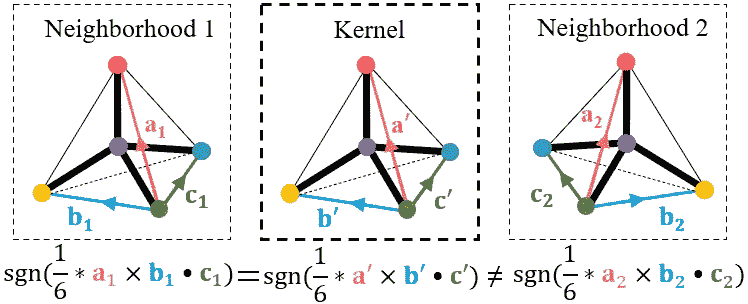

图 4。手性计算图解。图片来自[原纸](https://www.biorxiv.org/content/10.1101/2022.08.24.505155v1)。

在邻域 1 中，三个向量 a1、b1 和 c1 由任意选择的邻居构成而不失一般性。四面体的体积可以计算为 1/6* a1×b1⋅c1.请注意，该音量可以是正的或负的符号，表示音量方向。对于最佳匹配中的相应邻居节点，可以在内核中执行相同的计算。如果邻域 1 的四面体体积的符号与核中的相同，我们知道它们具有相同的相邻节点排序。在上面的邻居 2 的情况下，它的体积具有不同的符号，并且我们知道邻居 2 具有不同的邻居节点顺序。还要注意，常数 1/6 在符号确定中是微不足道的，在实际实现中可以省略。

最后，我们利用消息传递神经网络(MPNN)框架[5]来获得更大的感受域。其思想是用分子邻域和核之间相似性的聚集来代替传统的邻近节点属性的聚集。请参见下图。

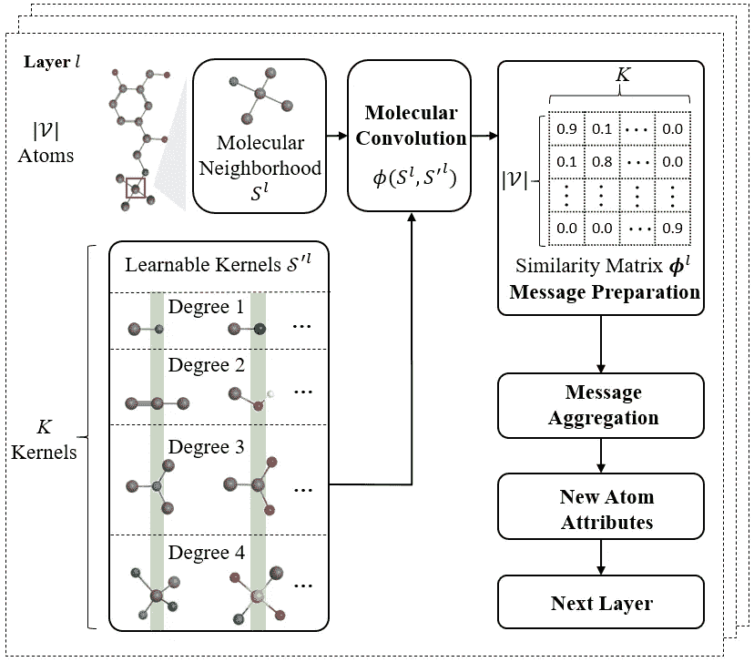

图 5。MolKGNN 模型概述。关键思想是用一个分子邻域和一组核之间的相似性来代替传统的相邻节点属性的聚集。图片来自[原纸](https://www.biorxiv.org/content/10.1101/2022.08.24.505155v1)。

最后的原子嵌入可以通过重复几次计算分子卷积和传播消息的过程来学习。最终的分子包埋可以通过[各种汇集技术](https://pytorch-geometric.readthedocs.io/en/latest/modules/nn.html#pooling-layers)获得。下游预测可以通过在分子嵌入的顶部附加诸如多层感知(MLP)的分类器来进行。

# **实验**

来自药物发现的真实数据集被用于测试 MolKGNN [6，7]。这些数据集经过精心筛选，以消除药物研发活动中常见的假阳性信号。数据集统计如下所示，可在 [FigShare](https://figshare.com/articles/dataset/Well-curated_QSAR_datasets_for_diverse_protein_targets/20539893) 上获得。

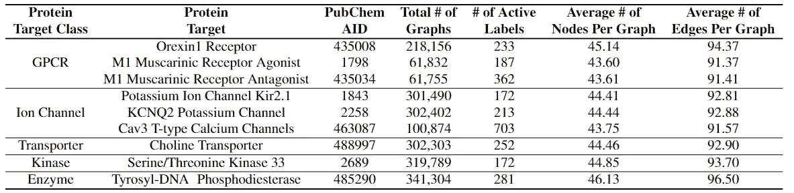

表 1。数据集统计。它们的特点是大尺寸，高度不平衡的标签分布和不同的蛋白质目标。图片来自[原纸](https://www.biorxiv.org/content/10.1101/2022.08.24.505155v1)。

下面的两个表格显示了结果。logAUC_[0.001，0.1]在这里用于偏向具有高预测分数的化合物。这与现实世界的药物发现场景相对应:只有那些预测活性得分高的药物才会被购买或合成。因此，更感兴趣的是查看这些化合物的模型性能，而不是一般的模型性能。更多结果和实验细节见[原文](https://www.biorxiv.org/content/10.1101/2022.08.24.505155v1)。

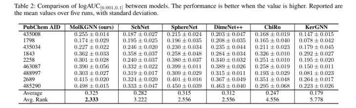

图 7。结果表。图片来自[原创论文](https://www.biorxiv.org/content/10.1101/2022.08.24.505155v1)。

此外， **MolKGNN** 能够捕捉与领域知识一致的模式。下面是一个从学习过的内核翻译过来的模式的例子。这种模式也被称为药物化学中的一种重要结构，称为[三氟甲基](https://en.wikipedia.org/wiki/Trifluoromethyl_group)。

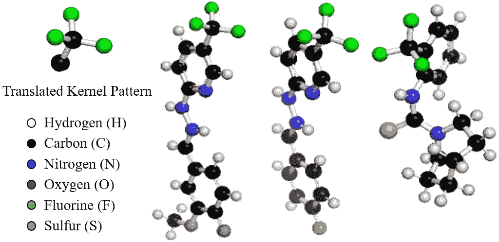

图 6。一个学习过的内核显示了一个重要的亚结构模式，被称为三氟甲基。图片来自[原纸](https://www.biorxiv.org/content/10.1101/2022.08.24.505155v1)。

此外，关于 **MolKGNN** 表达能力的实验证实了其能够区分手性分子。使用 CHIRAL1 数据集[8]。其对于具有一个手性中心的单一 1，3-环己基丙烷骨架支架包含 102，389 个对映异构体对。数据被标记为 R 或 S 立体中心，我们使用精度来评估性能。为了比较，我们使用 GCN [9]和我们的模型的修改版本，MolKGNN-NoChi，它删除了手性计算模块。我们的实验观察到 GCN 和 **MolKGNN-NoChi** 达到 50%的准确率，而 **MolKGNN** 达到近 100%，这从经验上证明了我们提出的方法区分手性分子的能力。

# **消融研究**

这项研究的详细信息可以在[原始论文](https://www.biorxiv.org/content/10.1101/2022.08.24.505155v1)中找到。

*ϕ的**分量*** (S，s’)

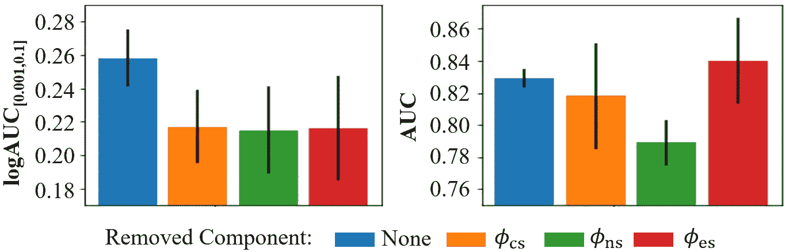

图 7。 *φ(S，S’)组件的 alation 研究结果。*图片来自[原纸](https://www.biorxiv.org/content/10.1101/2022.08.24.505155v1)。

移除任何元件都会对 logAUC[0.001，0.1]产生负面影响。事实上，就性能变化的百分比而言，logAUC[0.001，0.1]的影响大于 AUC。请注意，在某些情况下，如移除φes，根据 AUC，性能会有所提高，但这会显著妨碍 logAUC[0.001，0.1]度量。

**内核号**

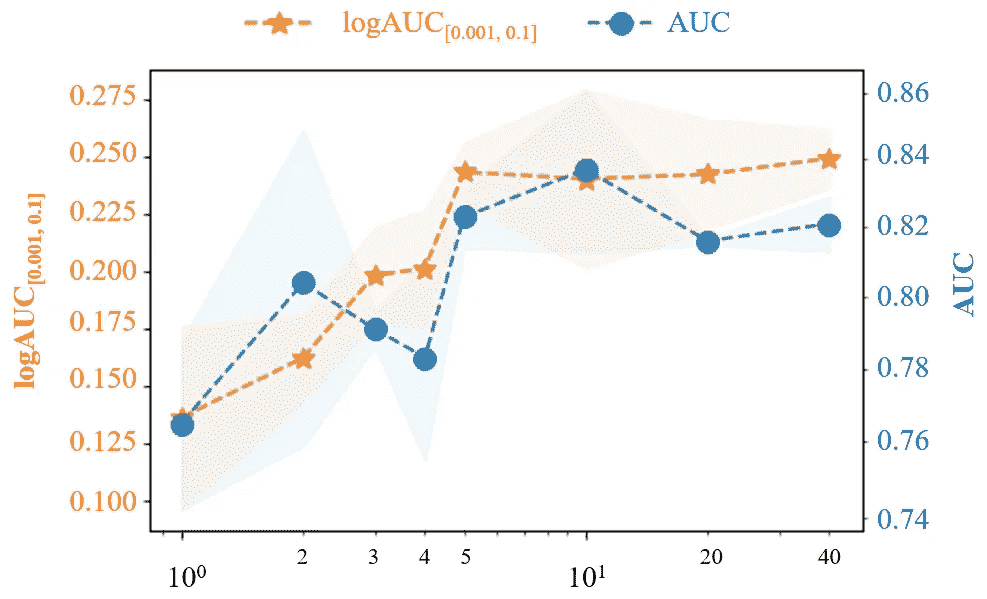

图 8。不同内核数量的性能。图片来自[原创论文](https://www.biorxiv.org/content/10.1101/2022.08.24.505155v1)。

当核的数量太少时(< 5), it greatly impacts the performance. However, once it is large enough to a certain point, a larger number of kernels has little impact on the performance.

# Discussion of Computation Complexity

It may seem to be formidable to enumerate all possible matchings described above. However, most nodes only have one neighbor (e.g., hydrogen, fluorine, chlorine, bromine and iodine). Take AID 1798 for example, 49.03%, 6.12%, 31.08% and 13.77% nodes are with one, two, three
和所有节点中的四个邻居，分别为。对于具有四个邻居的节点，由于手性，24 个匹配中只有 12 个需要被枚举[8]。由于分子图的邻接矩阵是稀疏的，大多数 gnn 的时间复杂度为 O(|E|)。如上所述，排列由多达四个邻居(12 个匹配)限定。因此，寻找最佳匹配的时间复杂度为 O(1)。分子卷积的计算与 K 个核的数量成线性关系，因此时间复杂度为 O(K)。总的来说，我们的方法需要 O(|E|K)的计算时间

# **结论**

在这篇文章中，我们引入了一个新的 GNN 模型来解决 QSAR 模型的问题。MolKGNN 利用新设计的分子卷积，其中分子邻域与分子核进行比较，以输出相似性得分，该得分用作下一层的新原子嵌入。进行全面的基准测试来评估 MolKGNN。使用由来自不同蛋白质目标类别的实验 HTS 数据组成的精确数据集进行评估。数据集是高度不平衡的，这凸显了这个现实世界问题中积极信号的稀缺。为了评估，我们不仅使用传统的 AUC，而且使用 logAUC[0.001，0.1]来评估该方法在高截止条件下的性能。这种高截止条件是真实世界应用的典型条件，证明了 MolKGNN 在药物发现中的可应用性。此外，本文提供了一个理论证明和实验证明，MolKGNN 能够区分手性分子，同时为其结果提供了可解释性。

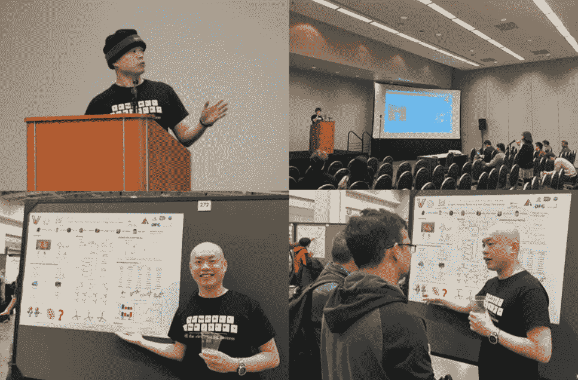

在 DC 华盛顿举行的 AAAI2023 会议上口头和海报展示这项工作

**参考文献:**

[1]约翰·帕拉斯坎多拉。"结构-活动关系——早期的海市蜃楼."*历史上的药学*13.1(1971):3–10。

[2]沃穆思，卡米尔·乔治，编辑。*药物化学的实践*。学术出版社，2011 年。

[3]林、王志浩、黄胜玉、王玉强。"用于点云分析的三维图形卷积网络的学习." *IEEE 模式分析与机器智能汇刊*44.8(2021):4212–4224。

[4] Sliwoski，Gregory，等，“BCL::EMAS-三维 QSAR 的对映选择性分子不对称描述符。”*分子*17.8(2012):9971–9989。

[5]吉尔默、贾斯汀等人，“量子化学的神经讯息传递”*机器学习国际会议*。PMLR，2017。

[6] Butkiewicz，Mariusz 等，“用 PubChem 数据库对基于配体的虚拟高通量筛选进行基准测试。”*分子*18.1(2013):735–756。

[7] Butkiewicz，Mariusz 等人，“来自 pubchem 数据库的高通量筛选分析数据集。”*化学信息学(特拉华州威尔明顿。)* 3.1 (2017)。

[8] Pattanaik，Lagnajit 等人，“四面体手性分子的信息传递网络”arXiv 预印本 arXiv:2012.00094 (2020)。

[9]基普夫、托马斯·n 和马克斯·韦林。"图卷积网络的半监督分类." *arXiv 预印本 arXiv:1609.02907* (2016)。

这部作品由[王禹](https://yuwvandy.github.io/)、[奥安武](https://www.linkedin.com/in/oanhvu/)、[罗科·莫雷蒂](https://www.linkedin.com/in/rocco-moretti-547364110/)、[鲍比·博登海默](http://www.vuse.vanderbilt.edu/~bobbyb/)、[延斯·梅勒](https://www.linkedin.com/in/jens-meiler-4b635339/)和[泰勒·德尔](https://tylersnetwork.github.io/)合著。

刘云超“兰斯”感谢英伟达学术硬件资助计划的支持。

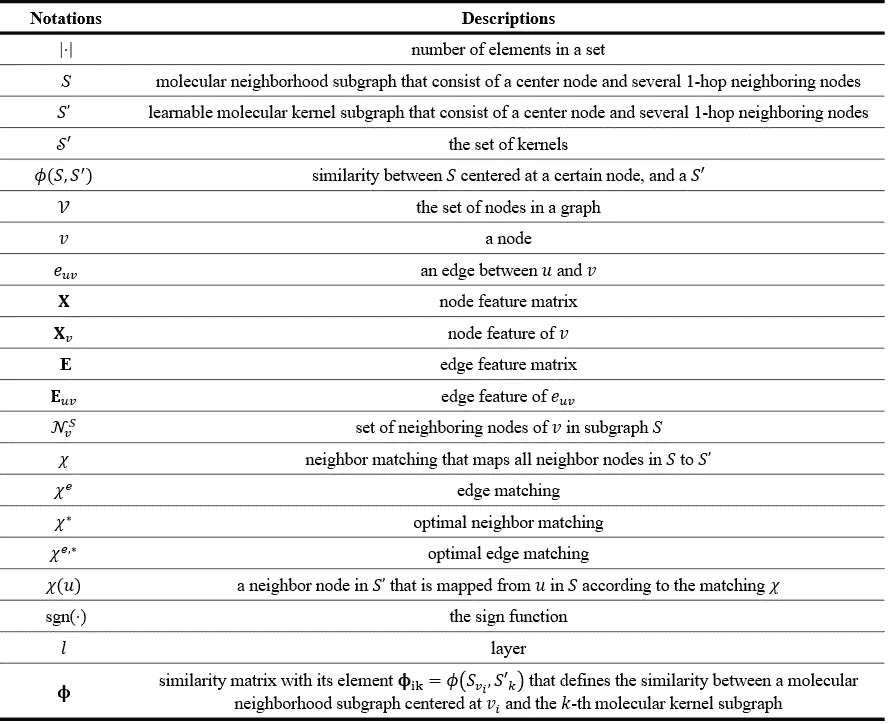

表 1。符号。作者做的。