# 统计分布的矩和矩母函数

> 原文：<https://towardsdatascience.com/moments-and-moment-generating-functions-of-statistical-distributions-e216cb11a079>

## 统计矩的解释以及如何使用矩母函数导出它们

马库斯·斯皮斯克在 [Unsplash](https://unsplash.com?utm_source=medium&utm_medium=referral) 上的照片

# 介绍

在本帖中，我们将讨论统计学中的**矩**的概念(从物理学的角度来看，这很难接受！)以及它们为什么重要。接下来，我们将展示一种使用**力矩生成函数计算力矩的简单方法。**

# 什么是瞬间？

长话短说，时刻描述了**的位置、**的形状和大小的一种概率分布。

以下是**前 4 个时刻的列表:**

1.  [**意思是(中心倾向)**](https://en.wikipedia.org/wiki/Expected_value)
2.  [**【方差(价差)】**](https://en.wikipedia.org/wiki/Variance)
3.  [**【不对称】**](https://en.wikipedia.org/wiki/Skewness)
4.  [**【峰度(离群倾向)**](https://en.wikipedia.org/wiki/Kurtosis)

> 还有一个叫**零阶**矩的东西，基本上说的是任意概率分布下的面积为 1。

你们大多数人应该知道以上四个参数指的是什么分布。如果你不太熟悉，我提供了解释它们的链接，因为它们相当容易理解，特别是对于正态分布。

> 第一个力矩(平均值)被认为是非中心力矩，而其余三个是中心力矩，因为它们与平均值有关。这并不重要，但它确实会导致一些复杂的细微差别。

**高阶矩**也存在，只是提供了关于分布的偏度和峰度的更多信息。**奇次幂矩推断关于偏斜度的信息，偶次幂矩推断关于峰度的信息。这里联系的是一个关于交换的大讨论，解释为什么会这样。**

# 计算力矩

第一个矩， **E[X]** (一个**随机变量 X** 的期望值，平均值)可以计算如下:

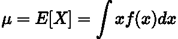

作者在 LaTeX 中生成的图像。

其中 ***f(x)*** 是某些概率分布如**正态、泊松、伽玛**等的**概率密度函数**。这个公式来自无意识统计学家的 [**定律。**](https://en.wikipedia.org/wiki/Law_of_the_unconscious_statistician)

上面的积分看似简单到可以积分，那二阶矩呢？**方差**，可以计算为:

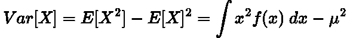

作者在 LaTeX 中生成的图像。

> 峰度和偏斜度可以使用期望值积分来进一步计算，但是它很快变得复杂。

一般来说，计算**偏心力矩**的公式为:

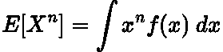

作者在 LaTeX 中生成的图像。

又过了一个以**为中心的瞬间**:

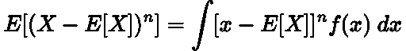

作者在 LaTeX 中生成的图像。

方差积分看起来相当简单，尽管比一阶矩更复杂。因此，可以看到，当积分变得太复杂而不容易计算时，最终会出现问题。因此，我们需要另一种选择…

# 矩母函数

这就是**力矩生成函数**介入的地方！这些从字面上产生力矩，并定义为:

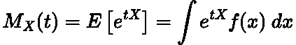

作者在 LaTeX 中生成的图像。

其中 ***t*** 是一些 [**哑变量**](https://stats.stackexchange.com/questions/186889/what-is-t-in-generating-functions) 便于我们计算矩。

现在，为了找到期望值(矩)，我们简单地**找到 MGF** 的导数，并设置 ***t = 0:***

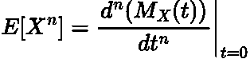

作者在 LaTeX 中生成的图像。

由此得出结论:

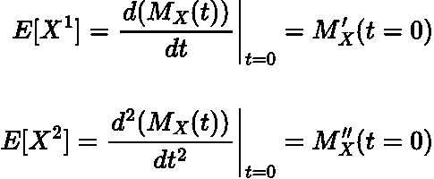

作者在 LaTeX 中生成的图像。

## 为什么会这样呢？

我们可以用指数(**欧拉数**)的 [**麦克劳林级数**](https://en.wikipedia.org/wiki/Taylor_series#List_of_Maclaurin_series_of_some_common_functions) (泰勒级数 [**的子集**](https://en.wikipedia.org/wiki/Taylor_series) 围绕 **0** )来证明上述公式:

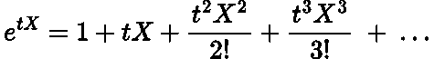

作者在 LaTeX 中生成的图像。

然后将该方程代入力矩生成函数:

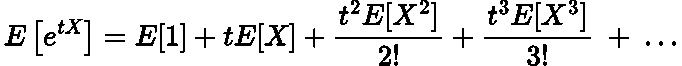

作者在 LaTeX 中生成的图像。

现在对 ***t*** 进行微分，并设置 ***t = 0*** :

作者在 LaTeX 中生成的图像。

这里我们展示了一阶导数等于平均值(期望值)！计算(手工和计算机)导数比 n 次积分 ***要容易得多。***

# 正态分布示例

让我们看一个使用**正态分布的例子。**概率密度函数由下式给出:

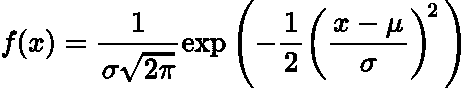

作者在 LaTeX 中生成的图像。

其中 ***μ*** 为给定正态分布的**均值*****σ***为给定正态分布的**标准差**。

正态分布[的**力矩生成函数**可表示为](https://proofwiki.org/wiki/Moment_Generating_Function_of_Gaussian_Distribution):

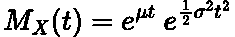

作者在 LaTeX 中生成的图像。

> 我没有在这篇文章中包括推导，因为它是详尽的，[但是你可以在这里找到它](https://proofwiki.org/wiki/Moment_Generating_Function_of_Gaussian_Distribution)。

取**一阶导数**并设置 ***t = 0*** :

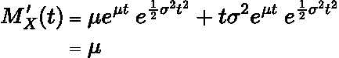

作者在 LaTeX 中生成的图像。

我们找到了正态分布的均值，正如我们所料，它就是**。**

# **结论**

**矩描述了概率密度函数的位置(均值)、大小(方差)和形状(偏斜度和峰度)。矩母函数允许我们用导数来计算这些矩，导数比积分更容易处理。这一点特别有用，因为概率密度函数可能很复杂，用矩母函数进行计算通常更容易。**

# **和我联系！**

*   **要在媒体上阅读无限的故事，请务必在这里注册！T49*💜***
*   **[*当我在这里发布注册邮件通知时获得更新！*T55*😀*](/subscribe/@egorhowell)**
*   **[*LinkedIn*](https://www.linkedin.com/in/egor-howell-092a721b3/)*👔***
*   ***[*碎碎念*](https://twitter.com/EgorHowell) 🖊***
*   **[*GitHub*](https://github.com/egorhowell) 🖥**
*   ****🏅****

> ***(所有表情符号都是由 [OpenMoji](https://openmoji.org/) 设计的——开源的表情符号和图标项目。许可证: [CC BY-SA 4.0](https://creativecommons.org/licenses/by-sa/4.0/#)***