# 自动气象站上的监测分类模型

> 原文：<https://towardsdatascience.com/monitor-classification-models-on-aws-bf20346fe06>

## 遵循本逐步指南，立即了解您的分类器性能，并在性能下降时得到通知。

当您向客户交付预测时，您希望了解模型的表现。无需等待真/假阳性/阴性，通过计算分类率，您可以立即了解您的模型的性能！

本文主要讨论如何结合 AWS 服务来计算分类率，并在模型漂移时得到通知。


一只眼睛在黑暗的背景下通过镜子观察大脑——由 DALL-E 生成。

**分类率**计算为有效预测的总和除以预测总数。

> 分类率=有效预测/总预测

在推断时监控分类率对于以下方面至关重要:

1.  知道是不是和训练时的分类率差不多。
2.  当分类率下降时检测模型性能下降。

## 什么是有效的预测？

有效的预测是高于某个阈值的概率。例如，我们可以将所有高于 95%阈值的预测视为有效，将所有低于 95%阈值的预测视为无效。

如果 100 个预测中有 90 个高于 95%的阈值，这意味着 90%的预测是有效的，分类率为 90/100=0，9。
你可以使用阈值来获得正确的分类率，并优化你的模型的性能。

现在我们知道了什么是有效预测，什么是分类率，让我们使用 AWS Cloudwatch 的功能来洞察分类率，并在分类率下降时触发警报。

# 1.将您的预测作为 JSON 记录到 Cloudwatch

在推断时间记录预测是否有效。下面是一个带有简单示例的 Python 片段:

```
# prediction_valid = True | False logger.info( json.dumps({
     “prediction_valid”: prediction_valid
    }))
```

在 Cloudwatch 日志中，您应该会看到“prediction_valid”出现:

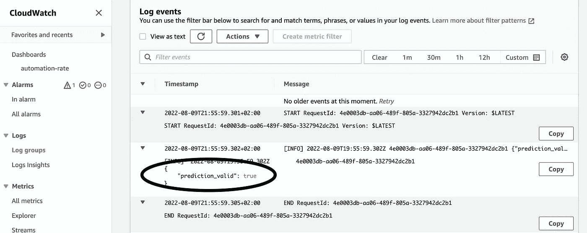

您的 JSON 对象在 Cloudwatch 日志中的样子示例。

Lambda 或 Sagemaker 等许多 AWS 服务都与 Cloudwatch 进行了本机集成，因此如果您的角色拥有正确的 IAM 策略，日志记录将开箱即用。

如果你的服务没有像在 EKS 上运行的 pod 那样与 Cloudwatch 集成，那么看看这个关于如何使用 boto3 登录 Cloudwatch 的 [StackOverflow 答案。](https://stackoverflow.com/questions/30897897/python-boto-writing-to-aws-cloudwatch-logs-without-sequence-token/58060910#58060910)

# **2。为有效/总预测定义度量过滤器**

我们在上一步将 JSON 数据转储到 Cloudwatch 是有原因的。我们将通过 Cloudwatch 度量过滤器在我们的 Cloudwatch 日志组中查询 JSON 数据，并跟踪有效的和总的预测。

**有效预测**

*   转到您的 Cloudwatch 日志组>指标过滤器>创建指标过滤器。

使用以下“过滤模式”获得所有有效预测:

```
{ $.prediction_valid IS TRUE }
```

更多关于过滤模式语法的信息请点击。

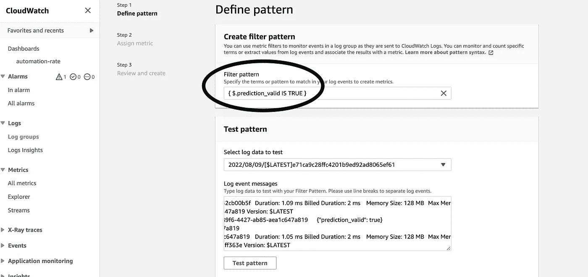

度量过滤器可以过滤日志组中的 JSON 数据。

*   使用“测试模式”按钮根据日志流测试您的过滤器模式。
*   单击下一步。
*   过滤器名称“有效 _ 预测”。
*   度量命名空间“分类率”。
*   度量名称“有效 _ 预测”。
*   度量值“1”，像这样我们计算有效预测的每一次出现。

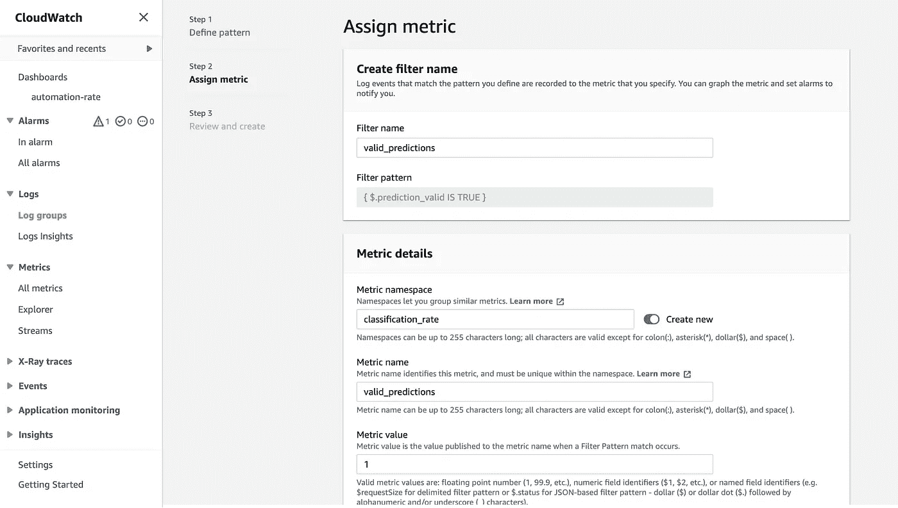

*   单击下一步，然后单击“创建指标过滤器”

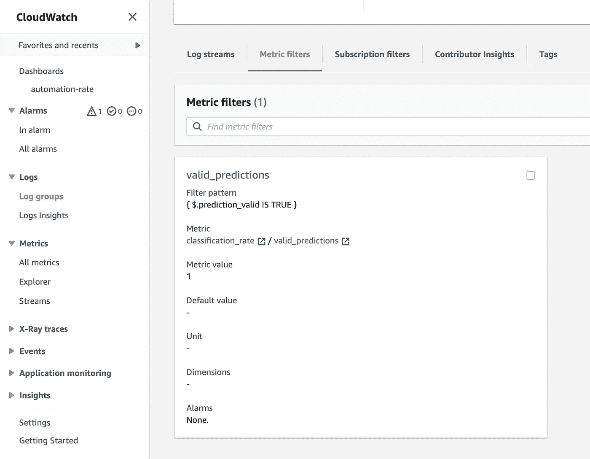

我们为有效的预测创建了一个度量过滤器。同样，我们将为总预测创建一个。

**总预测**

在步骤 1 中，执行与有效预测完全相同的步骤，但使用以下过滤模式来获得所有预测:

```
{ $.prediction_valid IS TRUE  || $.prediction_valid IS FALSE}
```

这将查询所有出现的 prediction_valid、true 或 false。

在步骤 2 中，执行

*   过滤器名称“total_predictions”。
*   度量命名空间“分类率”。
*   指标名称“total_predictions”。
*   度量值“1”。

创建 total_predictions 指标过滤器后，您应该会看到以下内容:

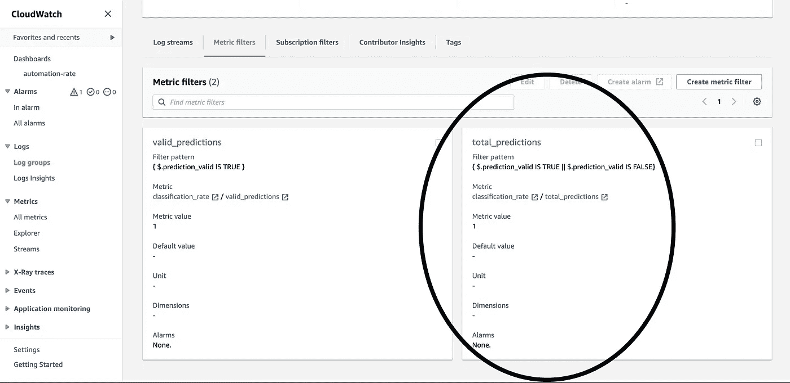

# 3.计算分类率

度量过滤器仅使用创建时的数据，*历史数据被忽略！*在指标收集到一些数据之前，您可能需要等待片刻。

*   转到云监控>报警>所有报警>创建报警。
*   选择度量。
*   选择名称空间“分类率”。
*   选择“没有维度的度量”。
*   选择复选框“有效预测”和“总预测”。
*   转到图表化指标选项卡。
*   将统计值设置为总和。

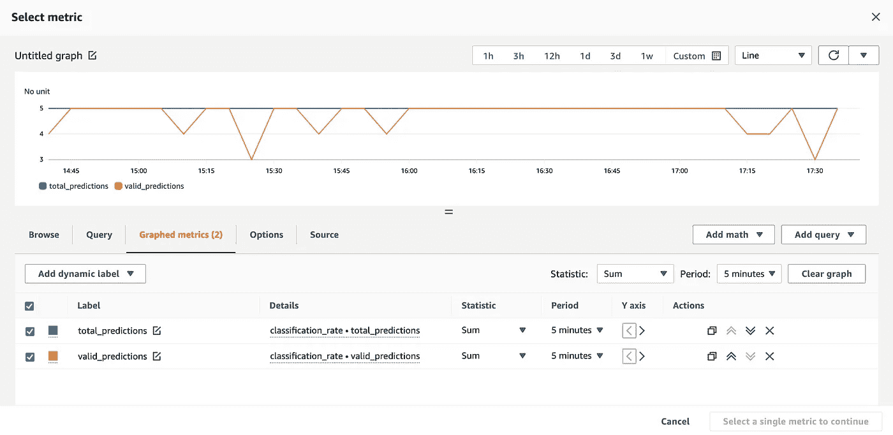

总预测和有效预测每 5 分钟绘制一次，我们通过求和进行合计。

*   添加数学>常用>百分比。
*   确保将 valid_predictions 的 id 除以 total_predictions 的 id。

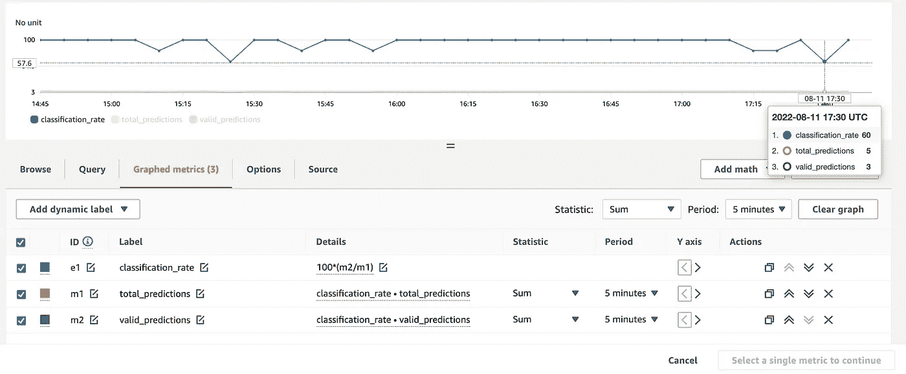

我们计算了分类率，乘以 100 得到一个百分比。

在这个例子中，分类率是 **100*(m2/m1)** 。其中，m2 是有效预测的 id，m1 是总预测的 id。我们乘以 100 得到一个百分比。

*   编辑标签>分类 _ 比率。
*   仅选择 classification_rate >点击按钮"选择单个指标继续"。

# 4.配置云监控警报

我们为分类率创建了一个 Cloudwatch 指标。
接下来，我们将向分类率附加一个警报，当分类率低于某个阈值时将触发该警报，我们将收到一封电子邮件。

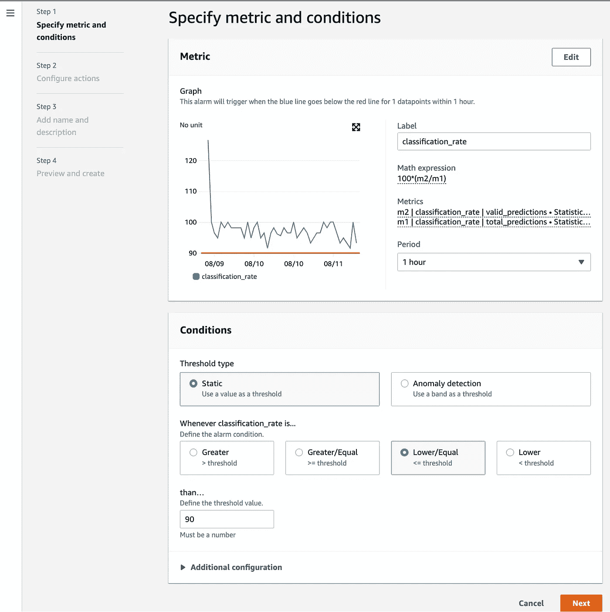

配置每当超过阈值时触发的警报。

*   将周期设置为 1 小时。
*   将阈值类型设置为“静态”。
*   每当分类率… **低于/等于… **90** 时。**

我们使用 90 的**阈值**，这意味着当分类率下降到 90 以下时触发警报。通常，阈值比训练时的分类率要低一点。

*   选择附加配置。
*   报警数据点>将其设置为“1 选 1”。

将闹钟设置为“1/1”会让你收到垃圾信息。我们在教程中这样做是为了更容易触发警报并在我们的收件箱中收到电子邮件。

为了避免收到垃圾邮件，您可以**将警报配置为不那么“紧张”**，只在多个时间段超过阈值时触发警报。
例如，当您想要在连续 3 个周期违反阈值时触发警报，您将它设置为“3/3”。请记住，在我们的示例中，我们将周期设置为 1 小时，这意味着连续 3 小时阈值被突破。

或者，你可以玩这些数字，例如设置为“5 中 3”。这意味着当 5 个周期中有 3 个周期超过阈值时，将触发警报。

*   缺失数据处理>将其设置为“将缺失数据视为良好(不超过阈值)”。

如果您没有稳定的数据流，您可以考虑将它设置为*将丢失的数据视为良好(不超过阈值)，*这样，在某段时间内数据丢失时，您就不会收到垃圾消息。

*   单击下一步。

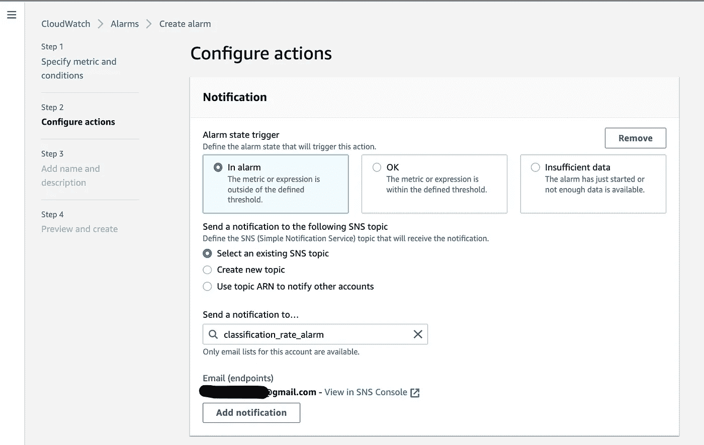

*   警报状态触发器>创建新主题。
*   将 SNS 主题的名称设置为“分类 _ 费率 _ 报警”。
*   填写一个电子邮件地址，该地址将在警报触发时接收消息。
*   点击“创建主题”。
*   您将收到一封电子邮件，确认您的订阅。请确保单击该链接。您应该看到这个:

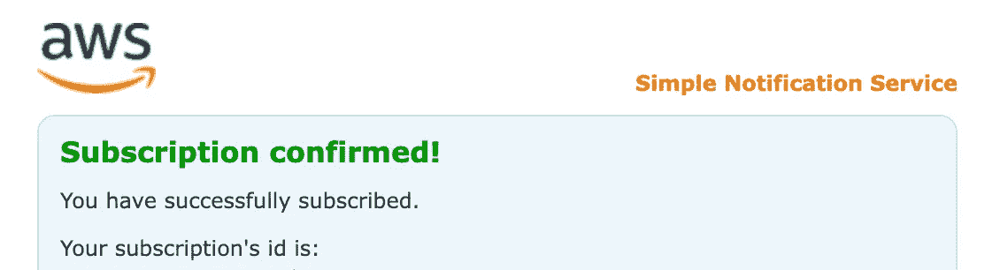

*   返回 AWS 控制台，然后单击下一步。

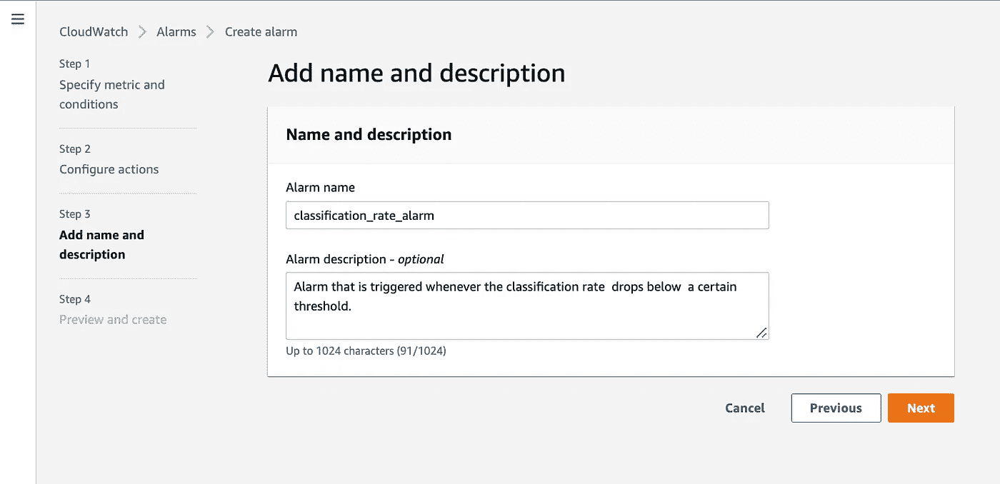

*   设置警报名称并给出描述。
*   单击下一步。
*   在预览界面中，点击“创建报警”按钮。

在概述中，您应该会看到警报，可能是“数据不足”状态。如果是这种情况，请不要担心，过一会儿，警报已经处理了一些数据，状态将变为“正常”。

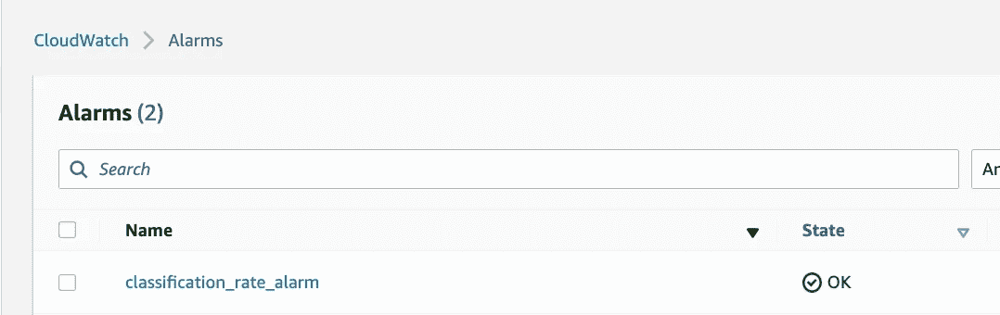

当您单击警报时，您应该看到蓝色的分类率和红色的阈值，当它被突破时将触发警报。

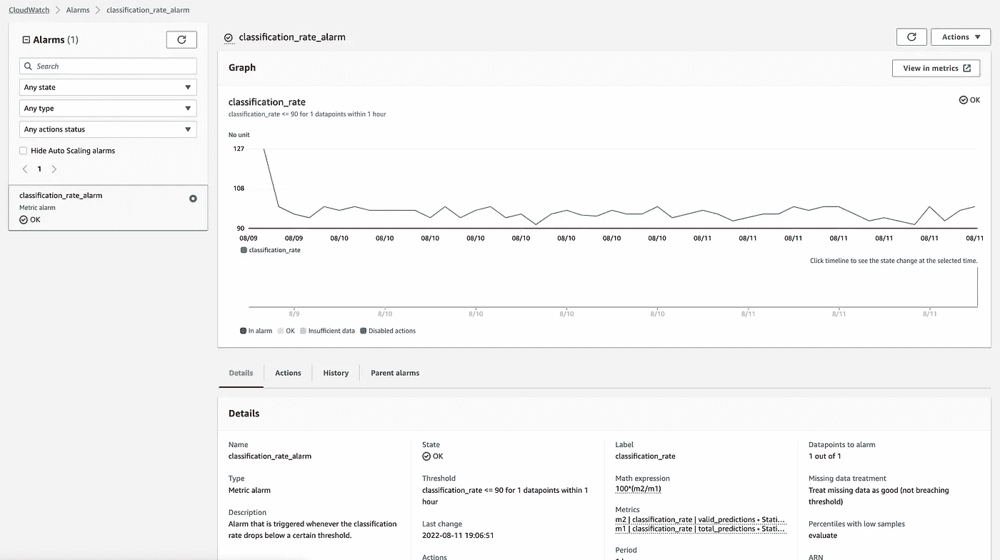

指标概述+我们配置的警报。

要测试警报，您可以进入编辑>设置阈值为 100，这样警报就会被触发。几分钟后，您应该会收到一封电子邮件。

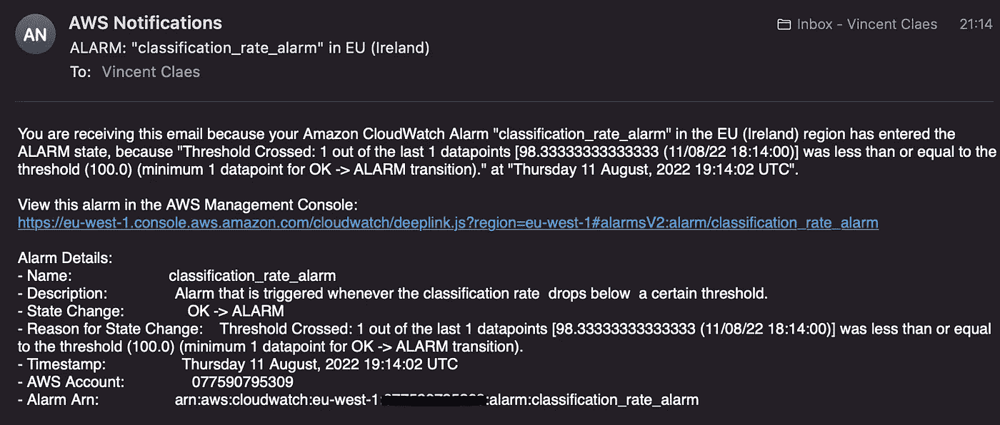

分类率低于阈值时发送的电子邮件示例。

我们测试了警报，您可以将阈值设置回原始值。

就是这样！现在，您可以监控分类模型的性能，并在性能下降时得到通知。

# 文森特·克拉斯

👋在 [Medium](https://medium.com/@vincentclaes_43752) 、 [Linkedin](https://www.linkedin.com/in/vincent-claes-0b346337/) 和 [Twitter](https://twitter.com/VincentClaes1) 上关注我，阅读更多关于 ML 工程和 ML 管道的内容。

## 脚注

[1]设置 IAM 策略以记录到 cloud watch[https://docs . AWS . Amazon . com/Amazon cloud watch/latest/logs/IAM-identity-based-access-control-cwl . html](https://docs.aws.amazon.com/AmazonCloudWatch/latest/logs/iam-identity-based-access-control-cwl.html)

[2]如何在 AWS Cloudwatch 中触发警报[https://docs . AWS . Amazon . com/Amazon cloud watch/latest/monitoring/alarmthatsendsemail . html](https://docs.aws.amazon.com/AmazonCloudWatch/latest/monitoring/AlarmThatSendsEmail.html)