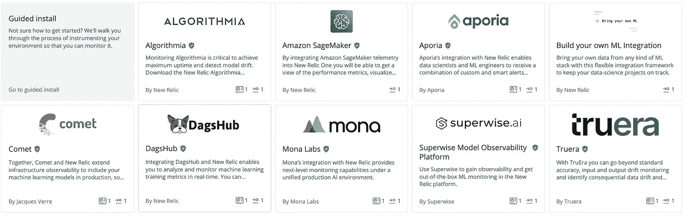
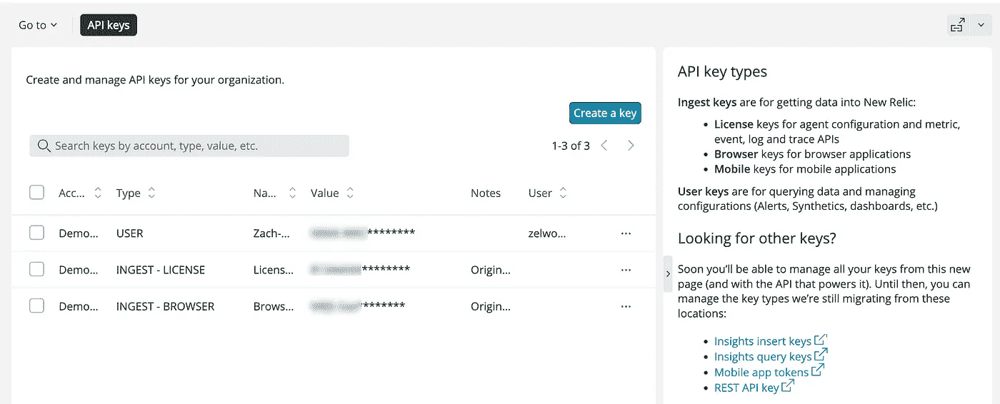
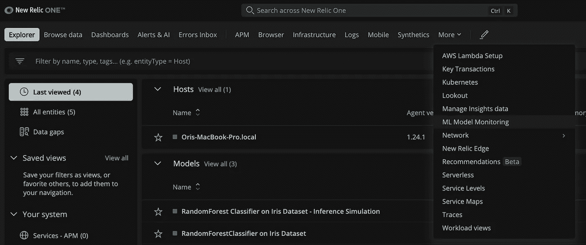
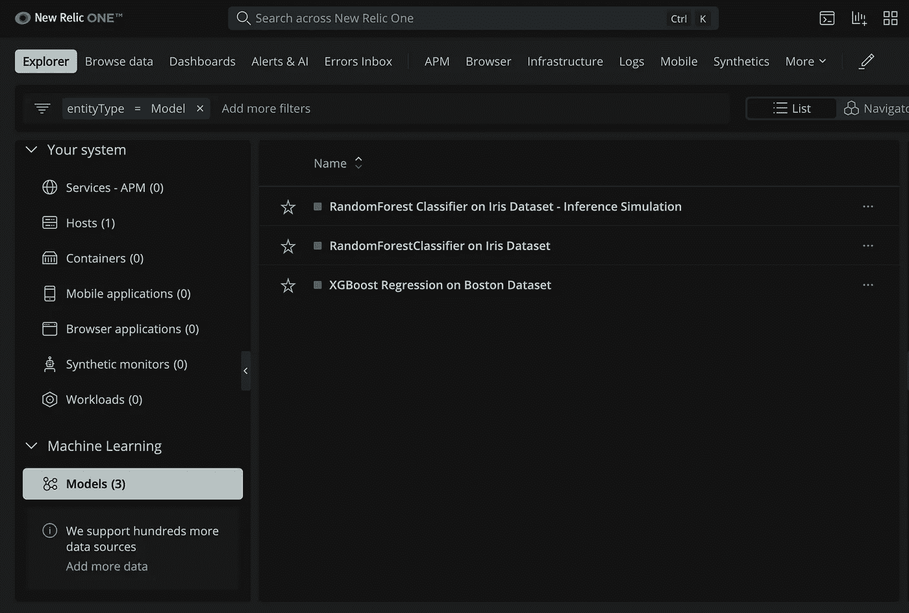
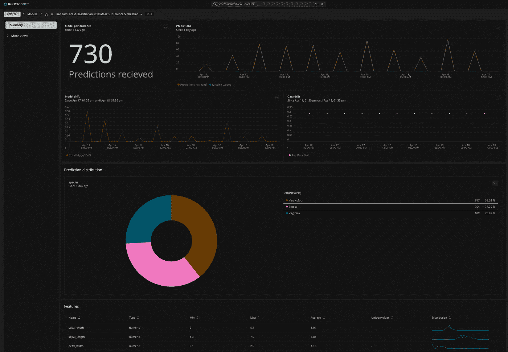
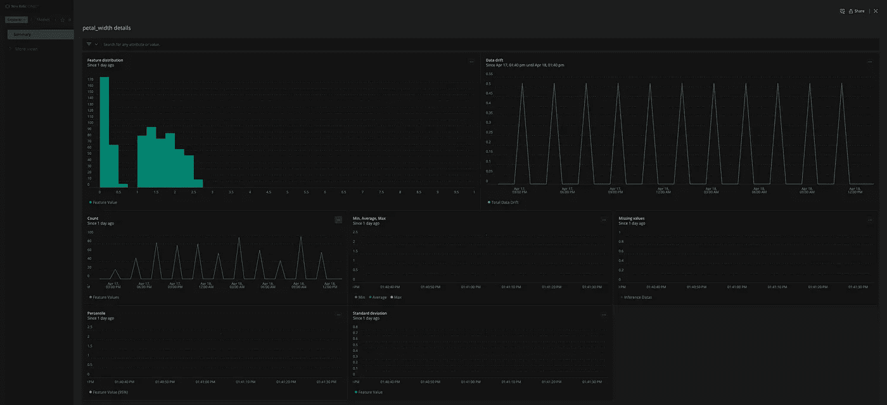
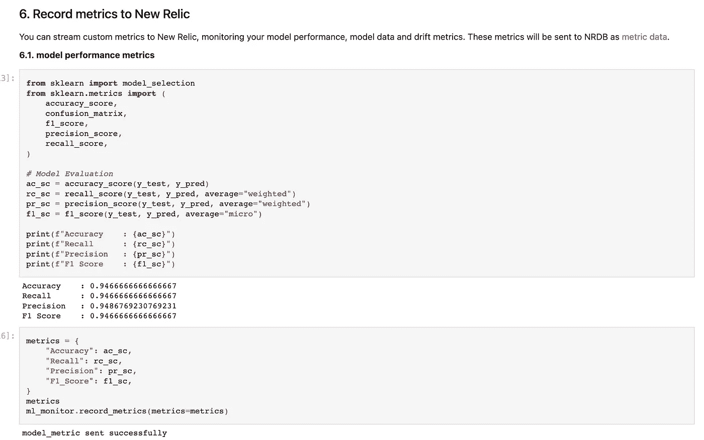

# 班长！使用 New Relic 轻松监控 MLOps 模型

> 原文：<https://towardsdatascience.com/monitor-easy-mlops-model-monitoring-with-new-relic-ef2a9b611bd1>

## 监控 ML 模型的简单方法


“可观察性仪表板”，Wallusy， [Pixabay](https://pixabay.com/illustrations/charts-tables-graph-statistics-6246450/) 。

我们现在都知道数据和模型监控极其重要。即使您的生产就绪模型没有发生变化，数据分布也可能会发生变化，并可能会影响您的输出，从而直接影响您的用户，一旦发生这种情况，您可能会遇到面向客户的生产问题。

本文旨在成为一个简短的教程，帮助您开始 ML 模型监控，在本指南的结尾，您将知道如何监控任何 ML 模型。

仅供参考，如果您想了解更多关于监控必要性的原因，请阅读下面的文章。

</monitor-stop-being-a-blind-data-scientist-ac915286075f>  

## 监控和可观察性

开发人员和数据科学生产系统之间的监控和可观察性差距是真实的，我们需要谈论它。有许多平台设计用于监控工程系统，也有许多其他平台设计用于监控 ML 系统，但没有一个具有高度先进功能的系统能够开箱即用地支持这两种系统，至少目前还没有。

NR 开始向这个方向发展，提供 ML 模型监控，允许数据科学家将他们的模型度量和输出发送到开发人员使用的同一个平台。您可以获得自动和定制的仪表板、警报和相关的系统事件。如果您想要更高级的功能和见解来减少平均解析时间，您还可以与 ML 模型监控公司集成，如 [Superwise](https://www.superwise.ai/) 、 [Aporia](https://www.aporia.com/) 、 [Comet](https://www.comet.ml/site/) 、 [Truera](https://truera.com/) 、 [DagsHub](https://dagshub.com/dashboard) 、 [Mona Labs](https://www.monalabs.io/) 、&、 [Algorithmia](https://algorithmia.com/) (DataRobot)。



ML 模型监控集成，如 NR I/O 中所示，图片由作者提供。

# ML 监控入门

通过使用 GitHub 上提供的开源“[ML-performance-monitoring](https://github.com/newrelic-experimental/ml-performance-monitoring)”python 库，发送 ML 数据变得很容易。

<https://github.com/newrelic-experimental/ml-performance-monitoring>  

这组工具将允许您直接从代码中监控各种 ML 输出。首先，你需要注册一个*免费* NR 账户，每月最多 100GB。接下来，您将能够直接从 python 脚本或 Jupyter 笔记本进行监控，利用预先构建的仪表板，创建自定义仪表板，以及创建警报。这可以针对模型度量、数据漂移、概念漂移、概率、标签等等来完成。

## 安装

首先，你需要安装 GitHub 包。

```
$ pip install git+https://github.com/newrelic-experimental/ml-performance-monitoring.git
```

## 获取插入键

现在去[拿](https://docs.newrelic.com/docs/apis/intro-apis/new-relic-api-keys/#keys-ui)你的 insert 键，这是一个允许你发送数据到平台的键，把它放在你的`NEW_RELIC_INSERT_KEY`环境变量中。这个键可以在下面的 API 键 [UI](https://docs.newrelic.com/docs/apis/intro-apis/new-relic-api-keys/#keys-ui) 中找到。



钥匙[管理](https://docs.newrelic.com/docs/apis/intro-apis/new-relic-api-keys/#keys-ui) UI，文档，新遗物。

## 准备的

我们从导入、加载波士顿数据集、分割和拟合模型开始。这些步骤非常基本，不需要进一步解释。

```
from ml_performance_monitoring.monitor import wrap_model
import numpy as np
from sklearn.metrics import mean_squared_error
from sklearn.datasets import load_boston
from sklearn.model_selection import train_test_split
import xgboost as xgbboston_dataset = load_boston()X, y = (
    boston_dataset["data"],
    boston_dataset["target"],)X_train, X_test, y_train, y_test = train_test_split(
    X, y, test_size=0.2, random_state=123
)print(X_train[:5], y_train[:5])xg_reg = xgb.XGBRegressor(
    objective="reg:linear",
    colsample_bytree=0.3,
    learning_rate=0.1,
    max_depth=5,
    alpha=10,
    n_estimators=10,
)xg_reg.fit(X_train, y_train)
```

## 监视

然后我们想发送一些基于模型的数据。我们用一组元数据键值创建一个字典，并准备需要发送的数据。使用 wrap_model()包装您的模型或管道，因为您仍然可以正常使用它，例如在 fit()、predict()等方面。这个包装器会将您的推理数据和 data_metrics 自动发送给 NR。

```
metadata = {"environment": "aws", "dataset": "Boston housing prices", "version": "1.0"}
features_columns, labels_columns = (
    list(boston_dataset["feature_names"]),
    ["target"],
)ml_performence_monitor_model = wrap_model(
    insert_key=None,  # set the environment variable NEW_RELIC_INSERT_KEY or send your insert key here
    model=xg_reg,
    model_name="XGBoost Regression on Boston Dataset",
    metadata=metadata,
    send_data_metrics=True,
    features_columns=features_columns,
    labels_columns="categorical",
)y_pred = ml_performence_monitor_model.predict(
    X=X_test,
)rmse = round(np.sqrt(mean_squared_error(y_test, y_pred)), 3)
print(f"RMSE: {rmse}")
metrics = {"RMSE": rmse,}# Send your model metrics as a dictionary.
ml_performence_monitor_model.record_metrics(metrics=metrics)
```

## 查询您的数据

现在，您将希望看到您的数据，并在平台上验证它，即确保它在一个表中。

我们可以通过以下查询[查询](https://docs.newrelic.com/docs/query-your-data/explore-query-data/get-started/introduction-querying-new-relic-data/)来做到这一点:
`Select * From InferenceData Where entity.name='XGBoost Regression on Boston Dataset' Since 1 hour Ago Limit Max`

或者转到 ML 模型监控视图



ML 模型监控，图片由作者提供。

选择“XGBoost Regression on Boston Dataset”模型，这将显示嵌入式模型视图。另一方面，如果它没有显示任何模型，可能是出了问题，您需要进行调试。



实体视图，作者图片。

一旦您选择了您的模型，您将会看到嵌入式模型视图的内部。如下图所示，报告了大量有价值的信息，如预测量、漂移、分布和特征。



嵌入式模型视图，作者图片。

如果您单击底部表格中的某一行，将会出现一个新视图并显示附加信息。



深入了解更多信息，图片由作者提供。

## 从 Jupyter 笔记本电脑进行监控

如果你正在寻找一个端到端的例子。有一款[笔记本](https://github.com/newrelic-experimental/ml-performance-monitoring/blob/main/examples/sklearn.RandomForestClassifier_on_Iris_dataset.ipynb)可以完成以上所有功能，并深入展示如何直接从笔记本内部进行监控，例如，如下图所示，我们可以看到如何记录 F1、精度、召回、漂移等性能指标。



演示笔记本，作者图片。

## 摘要

我希望这篇文章能够帮助您完成监控 ML 模型的第一步。如果这种方法对你不起作用，记住市场上有无数其他不可思议的解决方案，其中一些是自助的，它允许你进行快速 POCing。如果你有兴趣了解更多，我整理了以下市场评论。

<https://www.stateofmlops.com/>  

Ori Cohen 博士拥有计算机科学博士学位，主要研究机器学习。他是 [ML & DL 纲要](https://book.mlcompendium.com/)和[StateOfMLOps.com](http://www.stateofmlops.com)的作者，并且对 AIOps & MLOps 领域很感兴趣。现在，他是 Justt.ai 数据科学的高级数据总监。