# 用谷歌地球引擎监测植被

> 原文：<https://towardsdatascience.com/monitor-vegetation-with-google-earth-engine-909a2ad51a48>

## 为你喜欢的森林创建 NDVI + EVI 时间序列

Geran de Klerk 在 [Unsplash](https://unsplash.com/s/photos/satellite-forest?utm_source=unsplash&utm_medium=referral&utm_content=creditCopyText) 上拍摄的照片

2022 年的热浪一直在炙烤着地球。南美、美国、欧洲、印度、中国和日本都遭受了高温袭击。在这个迅速变暖的地球上，植被是我们的天然盟友。但它也承受着气候变化的冲击。2022 年，野火肆虐全球。大片森林被烧毁。这一系列事件敲响了关于气候变化的最新警钟。我们需要高度关注植物的健康。

为了保护植物，我们首先需要更多地了解它们。卫星可以提供帮助。有了卫星图像，我们可以监测面积变化和植物的健康状况。此外，我们可以先发制人地计算野火风险。当野火发生时，我们可以通过天空中的这只眼睛迅速探测到它们，并在事后评估损失。

有了谷歌地球引擎，我们可以在非商业和研究用途上免费使用它们。此外，我们既不需要安装软件，也不需要在本地硬盘上下载映像。在我之前的文章 [*用谷歌地球引擎*](https://medium.com/p/65cd15e10c6c) 监控土地利用变化中，我已经展示了如何使用谷歌地球引擎来监控给定位置的土地利用土地覆盖(LULC)。在随后的一篇文章 [*用谷歌地球引擎*](https://medium.com/geekculture/monitor-regional-climate-with-google-earth-engine-c6aa77fecdb1) 监控地区气候中，我展示了如何监控一个给定地区的长期气候(温度和降水)和海拔。在本文中，我将向您展示如何基于相同的代码构建两个新的植被监测应用程序(图 1)。我们将计算 2017 年至 2022 年间任何土地面积的**归一化差异植被指数** (NDVI)和**增强植被指数** (EVI)。

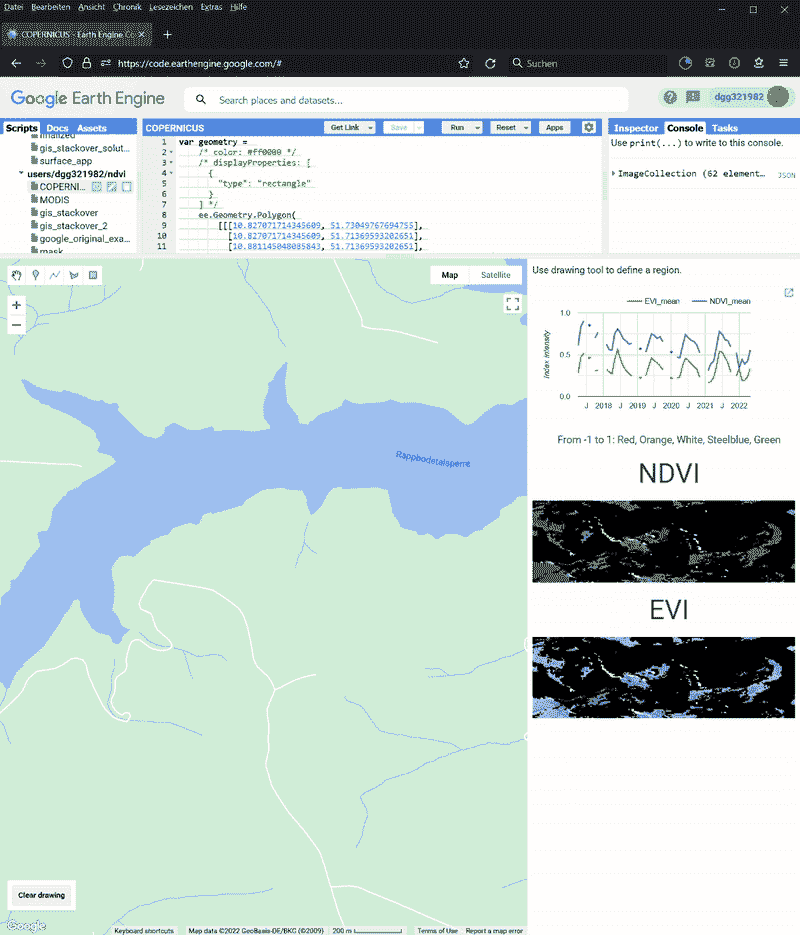

图一。基于谷歌地球引擎的 NDVI+EVI 应用。图片作者。

这个项目的代码存放在我的 GitHub 库中。

<https://github.com/dgg32/ndvi>  

我把它们都放进了网络应用程序。

    

# 1.NDVI 和 EVI

从你的飞机窗口，你会说一个地区被植物覆盖时，它是绿色的。但奇怪的是，卫星图像并不是这样工作的。植物吸收红光(620-750 纳米)进行光合作用。但是它们反射近红外光(NIR，700–1100nm)以避免组织损伤，因为这些波长的[光子能量太大](https://en.wikipedia.org/wiki/Normalized_difference_vegetation_index)。因此，被植物覆盖的区域在红色通道中是暗的，但在近红外通道中是亮的。相比之下，雪和云的情况正好相反。NDVI 利用了这一现象。其定义如下:

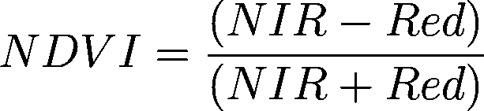

NIR 和 Red 分别代表近红外和红色表面反射率。NDVI 的值介于-1 和 1 之间。

顾名思义，EVI 是 NDVI 的加强版。根据维基百科，

> 它增强了植被信号，提高了高生物量区域的灵敏度，并通过解耦[冠层](https://en.wikipedia.org/wiki/Canopy_(biology))背景信号和减少大气影响改善了植被监测。鉴于[归一化差异植被指数](https://en.wikipedia.org/wiki/Normalized_Difference_Vegetation_Index) (NDVI)对[叶绿素](https://en.wikipedia.org/wiki/Chlorophyll)敏感，EVI 对冠层结构变化更敏感，包括[叶面积指数](https://en.wikipedia.org/wiki/Leaf_area_index) (LAI)、冠层类型、植物外貌和冠层结构。这两个植被指数在全球植被研究中相互补充，并改善了植被变化的检测和冠层生物物理参数的提取。在有雪的情况下，NDVI 减少，而 EVI 增加。

EVI 可以计算如下。

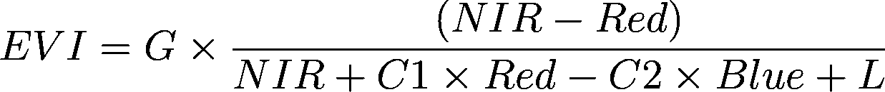

如公式所示，EVI 不仅考虑了近红外和红光，还考虑了蓝光反射率。换句话说，如果你有足够的信息来计算 EVI，你就可以计算 NDVI。四个系数是 G(增益系数)= 2.5，C1 = 6，C2 = 7.5，L=1。对于健康的植被，EVI 通常在 0.2 和 0.8 之间波动，但是它可以具有超出[-1，1]范围的值。然而，在我的应用程序的缩略图中，我将其值裁剪为[-1，1]。

# 2.数据集

在这个项目中，我实现了两个应用程序。它们基于`[COPERNICUS/S2_SR_HARMONIZED](https://developers.google.com/earth-engine/datasets/catalog/COPERNICUS_S2_SR_HARMONIZED#description)`([Creative Commons CC BY-SA 3.0 IGO license](https://open.esa.int/copernicus-sentinel-satellite-imagery-under-open-licence/))和`[MODIS/061/MOD13A1](https://developers.google.com/earth-engine/datasets/catalog/MODIS_061_MOD13A1#terms-of-use)` ( [MODIS 数据和通过 LP DAAC 获得的产品对后续使用、销售或再分发没有限制。](https://cds.climate.copernicus.eu/api/v2/terms/static/modis_for_satellite-burned-area.pdf))数据集。`COPERNICUS/S2_SR_HARMONIZED`由[欧盟/欧空局/哥白尼](https://earth.esa.int/web/sentinel/user-guides/sentinel-2-msi/product-types/level-2a)提供。它包含了 EVI 和 NDVI 所需的所有三个波段。此外，它还包含一个名为场景分类图(SCL)的波段。数据集中的每个像素都被归入 11 个类别之一(植被、裸土等)。这些分类结果存储在 SCL 中。这个 app 的老版本用的是`S2_SR`产品。但正如我的读者 Philipp Gaertner 指出的那样，`S2_SR`从 2022 年 1 月 25 日起将数字(DN)移动了 1000，之后的数据不具有可比性。现在我使用的是它的协调版本，因为它把新场景中的数据转移到与旧场景相同的范围内。

`MODIS/061/MOD13A1`由 [NASA](https://doi.org/10.5067/MODIS/MOD13A1.061) 美国地质调查局 EROS 中心的[陆地进程分布式活动档案中心提供。MODIS 代表中分辨率成像光谱仪。与`COPERNICUS/S2_SR_HARMONIZED`不同，`MODIS/061/MOD13A1`只存储预计算的 NDVI 和 EVI，而不存储电磁带。谷歌在其教程](https://doi.org/10.5067/MODIS/MOD13A1.061)中使用这个数据集制作折线图。

这两个数据集具有不同的分辨率。`MODIS/061/MOD13A1`只能分辨 500 米。相比之下，`COPERNICUS/S2_SR_HARMONIZED`中蓝色、红色和 NIR 波段的分辨率为 10 米。因此，我们可以在它的图像中看到更多的细节。

此外，`MODIS/061/MOD13A1`每 16 天造访同一个地方。虽然`COPERNICUS/S2_SR_HARMONIZED`的[重访频率为五天](https://sentinel.esa.int/web/sentinel/user-guides/sentinel-2-msi/revisit-coverage)，但我需要合成它的图像以获得更好的像素质量。即便如此，其月度综合数据仍有缺口。但在一些欧洲地区，其季度复合数据似乎是连续的。

# 3.应用程序

这两款应用与[我的 LULC 地区监控应用](https://medium.com/p/65cd15e10c6c)具有相同的结构。它们有四个主要组件:generate_collection、控件、折线图和缩略图。作为区域监控应用程序的前身，generate_collection 函数在开始和结束日期之间生成图像采集系列。在每个图像集合中，NDVI 和 EVI 都是从相应的数据集中计算或提取的。这些值被发送到折线图功能和缩略图功能。折线图为读者提供快速概览，而缩略图提供详细信息。前者记录了 NDVI 和 EVI 一段时间以来的变化。后者实际上是一个空间热图。对于每个像素，我将其 NDVI 或 EVI 值映射到五色标度:红色、橙色、白色、钢蓝色和绿色。控制组件协调它们并管理布局。最后三个功能与 LULC 应用程序中的功能大致相同。更多细节请参考我的文章。换句话说，这个项目只新实现了`generate_collection`功能。这两个应用程序基于两个数据集，它们具有不同的波段。这样一来，两个 app 的`generate_collection`功能就不一样了。

## 3.1 哥白尼应用程序

在哥白尼应用程序中，我首先对图像进行预处理。模糊像素百分比小于 20%的图像被保留(第 48 行)。然后，我通过修改这篇文章中的代码(第 1–17 行和第 50–51 行),来遮盖云彩，只保留植被和裸露的土壤像素。然后我用波段数据计算 NDVI 和 EVI(第 19–44 行和第 53–54 行)。之后，我将图像分组到时间箱中，并计算它们的平均合成(第 56–65 行)。这些合成反过来形成一个新的图像集合(第 56–74 行),它将由函数返回。如果在给定的时间段内没有合成图像，我会用一个空图像填充该时间段(第 69–70 行)。

## 3.2 MODIS 应用程序

MODIS 应用程序中的代码更简单，因为`MODIS/061/MOD13A1`已经将两个指数存储为`NDVI`和`EVI`波段。所以我只需要选择(第 4 行)并规范化(第 7 行)它们。我的代码灵感来自于[谷歌的例子](https://developers.google.com/earth-engine/apidocs/ui-chart-image-series)。

# 4.测试应用程序

现在是时候测试这两个应用程序了。`COPERNICUS`中的值是每月的综合值，而`MODIS`中的数据是从单个采样日期得到的测量值。此外，它们的预处理也不同。最后，分辨率不同。因此，两个应用程序之间的结果不会完全相同，即使是来自同一个目标区域。第一个问题是，这两个应用程序是否能提供类似的长期趋势。

## 4.1 拉普博德塔尔斯珀雷地区

在图 1 和图 3 中，可以看到 2017 年至 2022 年初为德国 Rappbodetalsperre 地区生成的时间序列(图 2)。

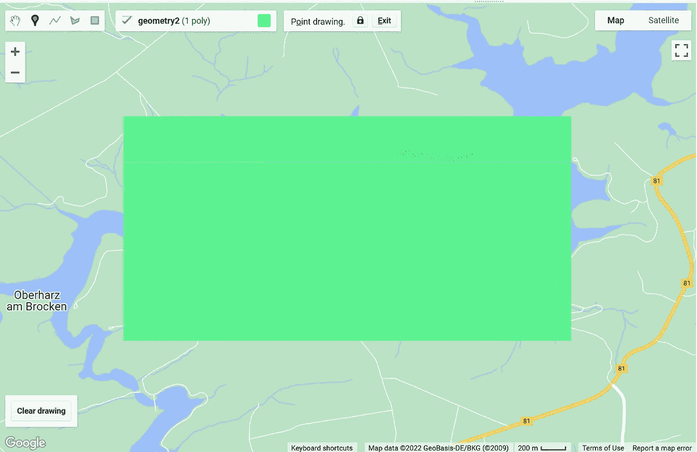

图二。拉普博德塔尔斯珀雷地区。图片作者。

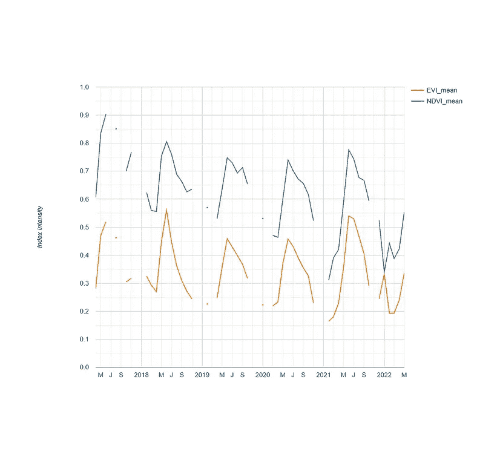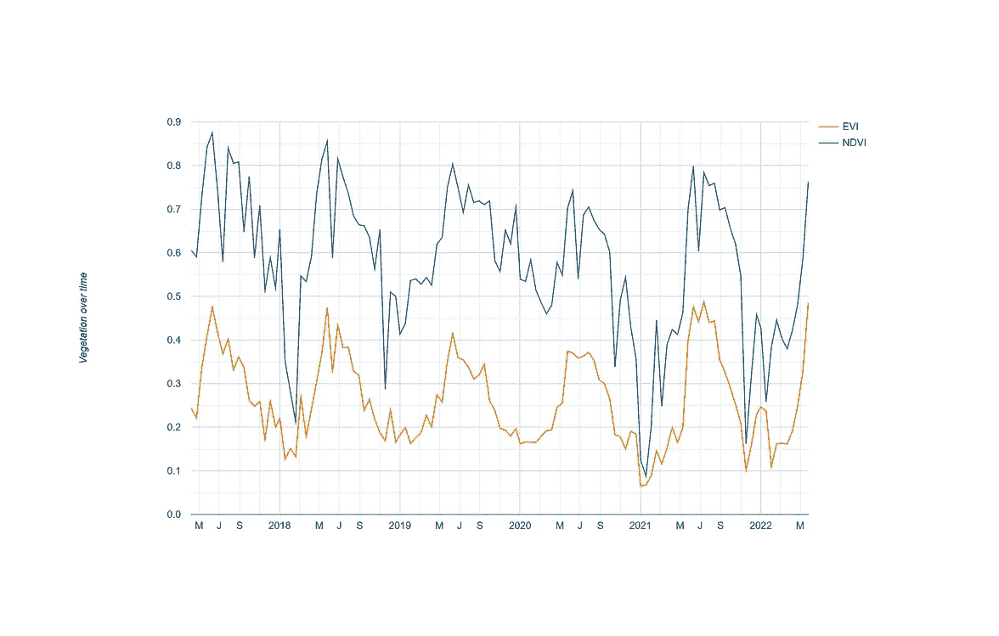

图 3。由我的`COPERNICUS` 和 MODIS 应用程序生成的 2017 年至 2022 年初 Rappbodetalsperre 地区的 NDVI 和 EVI 时间序列。左:`COPERNICUS/S2_SR_HARMONIZED`；右:`MODIS/061/MOD13A1\.` 图片作者。

在图 3 中，您可以看到`COPERNICUS`应用程序在其时间序列中有几个间隙，而`MODIS`应用程序中的曲线是连续的。然而，这两个应用程序在价值范围和趋势方面提供了相似的结果。例如，这两个指数每年的夏季上涨和冬季下跌在两个应用程序中都清晰可见。它们的数值也是可比较的。比如 2017 年 6 月的 NDVI 值在`COPERNICUS` app 是 0.9，`MODIS` app 是 0.875。最后，NDVI 和 EVI 在这个测试案例中同步得很好。

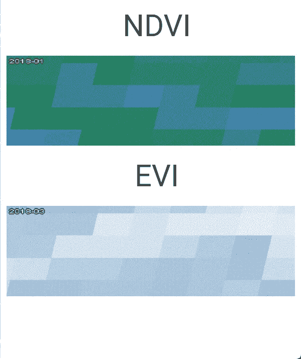

图 4。我的`COPERNICUS` 和 MODIS 应用程序拍摄的 NDVI 和 EVI 拉普博德塔尔斯珀雷地区的缩略图。左:`COPERNICUS/S2_SR_HARMONIZED`；右图:`MODIS/061/MOD13A1\.` 作者图片。

在图 4 中，您可以看到它们分辨率的差异。`COPERNICUS`不仅展示了水体的轮廓，还展示了南缘几处农田的形状。相比之下，`MODIS`应用程序在整个区域有大约 40 个大正方形像素。水体的轮廓完全消失了。

## 4.2 大兴安岭地区

因为谷歌在中国无法访问，我担心谷歌地球引擎在中国地区无法工作。为了验证这个假设，我用这些应用程序监测了黑龙江省靠近中俄边境的大兴安岭地区。

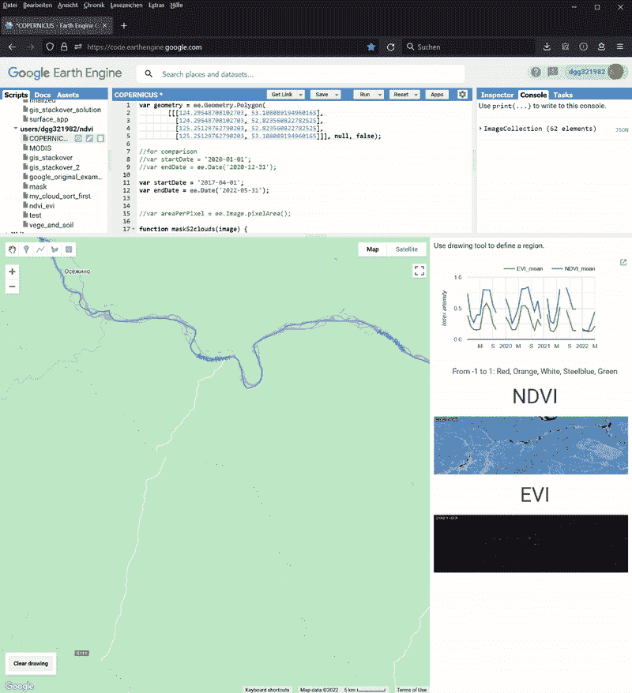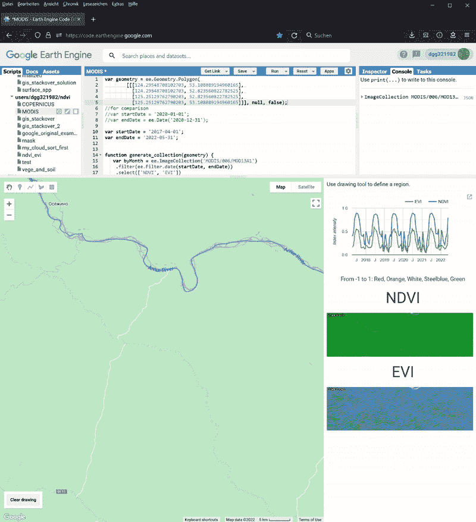

图 5。大兴安岭地区 2017 年至 2022 年初的 NDVI 和 EVI 时间序列。左:`COPERNICUS/S2_SR_HARMONIZED`；右图:MODIS/061/MOD13A1。图片作者。

在这种情况下，`MODIS`比`COPERNICUS`拥有更多的数据。其数据覆盖了 2017 年 4 月至 2022 年初的整个时间段。相比之下，`COPERNICUS` 数据只追溯到 2019 年 1 月。同样明显的是，`COPERNICUS`中的图像并不总是覆盖整个目标区域。尽管有这些差异，我们仍然可以看到这两个指数在这个森林地区的年周期。然后我在中国其他地区测试了这些应用程序，很高兴看到它们也能工作。

## 4.3 亚马逊雨林

在我的第三次测试中，我监测了亚马逊雨林。我选择了 Carauari 旁边的一个地区。

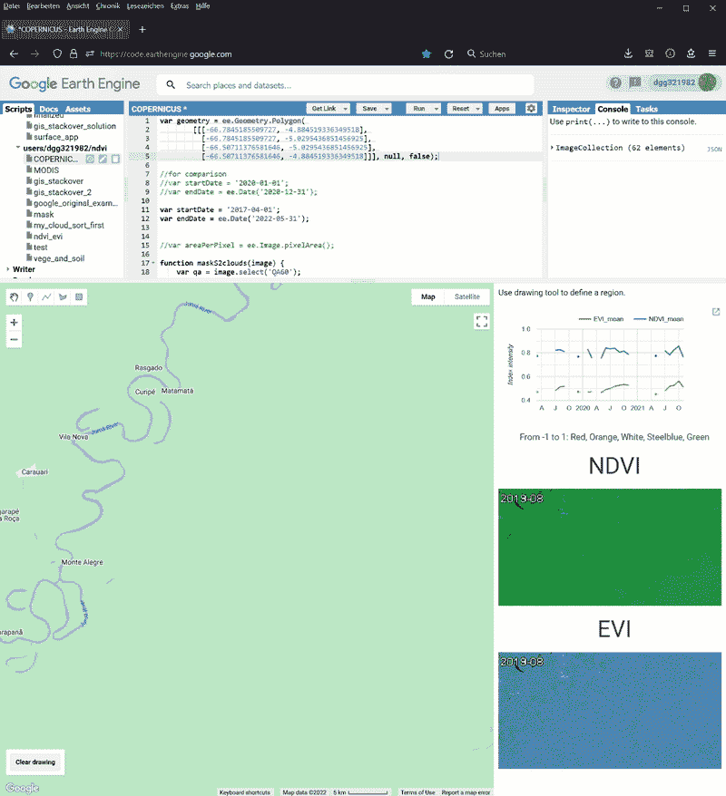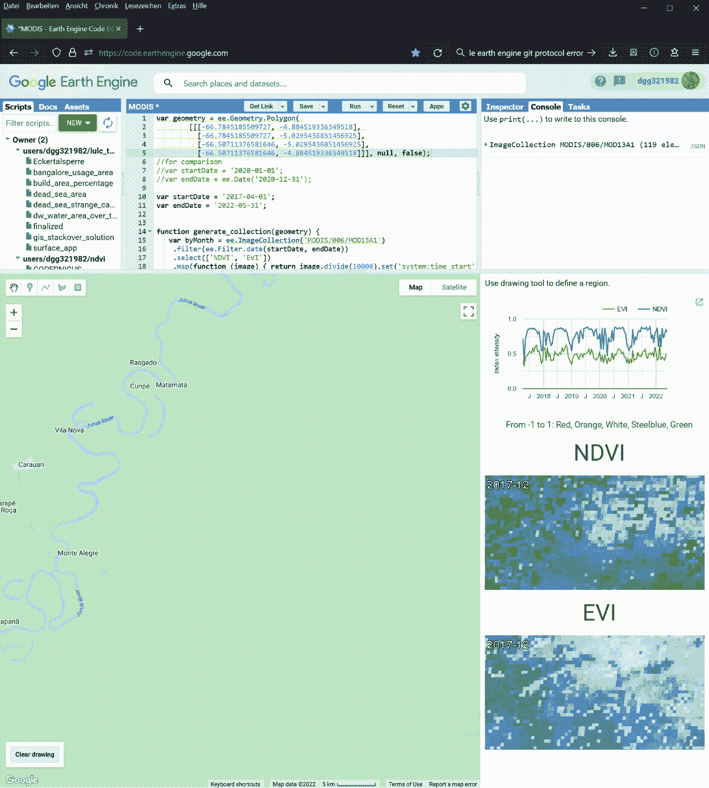

图 6。我的应用程序显示的 2017 年至 2022 年初亚马逊雨林的 NDVI 和 EVI 时间序列。左:`COPERNICUS/S2_SR_HARMONIZED`；右图:MODIS/061/MOD13A1。图片作者。

同样，`MODIS`应用程序拥有整个测试期间的所有数据。【2019 年 1 月才开始。我们也可以在`COPERNICUS`的月度综合数据中看到这些分类是多么不完整。最后，来自`COPERNICUS`的时间序列包含太多的间隙，在这个测试用例中没有用。

我们也可以从`MODIS`中得到一些有趣的观察结果。首先，与拉普博德塔尔斯珀雷和大兴安岭相比，亚马逊雨林的激增期更长，从 6 月持续到 11 月。其次，尽管 NDVI 和 EVI 同步得很好，但还是有一些小的差异。例如，2019 年 11 月 17 日，NDVI 仍高达 0.85，但 EVI 值降至 0.4。此外，NDVI 通常在 6 月达到每年的高原。相比之下，EVI 在 6 月份上涨，然后再次飙升，在 8 月至 10 月间达到夏季峰值。

# 结论

在本文中，我向您展示了如何创建两个应用程序来监控给定地区的 NDVI 和 EVI。这两个指数给我们暗示了潜在生态系统的生产力。一个生态系统的生产力越高，它能支持的生物就越多，生物多样性也就越丰富。所以 NVDI 和 EVI 可以作为我们生物多样性的代理人。它们可以补充传统的指标，如物种丰富度或物种密度，并告诉我们更多关于生态系统健康的信息。

`COPERNICUS/S2_SR_HARMONIZED`和`MODIS/061/MOD13A1`这两个数据集各有优缺点。`COPERNICUS/S2_SR_HARMONIZED`空间分辨率高，时间分辨率低。`MODIS/061/MOD13A1`中的图像是粗粒度的，但是它们可以覆盖我所有测试用例中的整个测试周期，没有间隙。有时，`MODIS`是亚马逊雨林等地区的唯一数据源。正如这个项目中的测试运行所示，应用程序的结果是可比较的。因此，建议同时使用这两种应用程序，并重叠它们的结果，以便更好地了解目标区域。您甚至可以将它们与我的 LULC 地区监测应用程序结合起来，调查遭受野火、干旱或其他干扰的地区。

还有很大的改进空间。例如，我们可以允许用户上传他们的 GeoJSON 文件。因为 Google Earth 引擎中的函数调用是异步的，所以在我当前的实现中，这两个缩略图是不同步的。所以我在寻找一种方法来同步它们。最后，我们甚至可以将两个应用程序合二为一，用户可以一次看到所有结果。

你的想法是什么？你也用谷歌地球引擎监测植被吗？如果有，请分享你的经验。

<https://dgg32.medium.com/membership> 