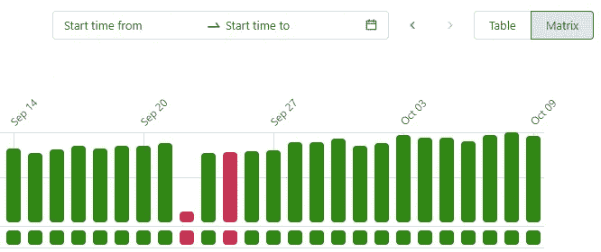
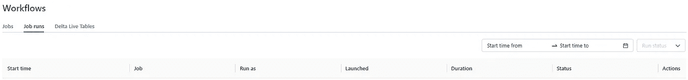
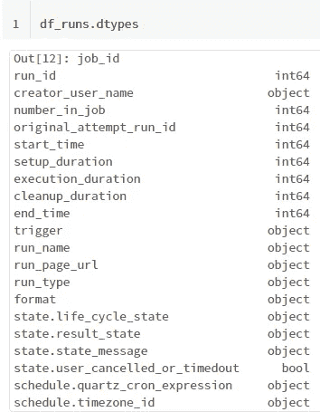
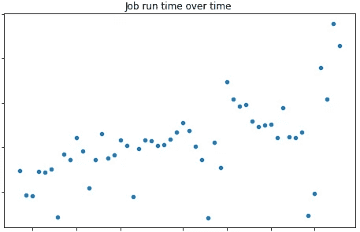

# 通过调用 REST API 监控数据块作业

> 原文：<https://towardsdatascience.com/monitoring-databricks-jobs-through-calls-to-the-rest-api-4c02d7d27278>

## 监视在 Databricks 生产环境中运行的作业不仅需要在出现故障时设置警报，还需要能够轻松提取有关作业运行时间、故障率、最常见故障原因和其他用户定义的 KPI 的统计信息。

Databricks workspace 通过其 UI 提供了一种非常简单直观的方式来可视化各个作业的运行历史。例如，矩阵视图允许快速查看最近的故障，并显示不同运行之间的运行时间的粗略比较。

作业运行，矩阵视图(图片由作者提供)

计算失败率的统计数据或者比较不同工作之间的平均运行时间怎么样？这就是事情变得不那么简单的地方。

“工作流”面板中的“作业运行”选项卡显示了过去 60 天内在 Databricks 工作区中运行的所有作业的列表。但是这个列表不能直接从 UI 导出，至少在编写本文时是这样。

“工作流”面板中的“作业运行”选项卡显示了过去 60 天在您的工作区中运行的作业列表(图片由作者提供)

幸运的是，同样的信息(和一些额外的细节)可以通过调用 [Databricks jobs list API](https://docs.databricks.com/dev-tools/api/latest/jobs.html) 来提取。数据以 JSON 格式检索，可以很容易地转换成数据帧，从中可以得出统计数据和进行比较。

在本文中，我将展示如何从运行在 Databricks 工作区中的 Jupiter 笔记本连接到 Databricks REST API，提取所需的信息，并执行一些基本的监控和分析。

# 1.生成数据块个人访问令牌

要连接到 Databricks API，您首先需要进行身份验证，与通过 UI 连接时要求您进行身份验证的方式相同。在我的例子中，我将使用通过调用[数据块令牌 API](https://docs.databricks.com/dev-tools/api/latest/tokens.html) 生成的[数据块个人访问令牌](https://docs.databricks.com/dev-tools/api/latest/authentication.html)进行身份验证，以避免将连接信息存储在我的笔记本中。

首先，我们需要通过提供请求 URL、请求主体及其头来配置对令牌 API 的调用。在下面的例子中，我使用 [Databricks secrets](https://docs.databricks.com/security/secrets/index.html) 来提取租户 ID，并为 Microsoft Azure 托管的 Databricks 工作区构建 API URL。资源*2ff 814 a 6–3304–4ab 8–85cb-CD 0 e 6 f 879 C1 d*代表数据块的 [Azure 编程 ID，而应用 ID 和密码再次从数据块机密中提取。](https://learn.microsoft.com/en-us/azure/databricks/dev-tools/api/latest/aad/service-prin-aad-token#--get-an-azure-ad-access-token-with-the-microsoft-identity-platform-rest-api)

使用数据块机密来存储这种类型的敏感信息并避免直接在笔记本中输入凭据是一种很好的做法。否则，所有对 *dbutils.secrets* 的调用都可以替换为上面代码中的显式值。

设置完成后，我们可以简单地使用 Python 的请求库调用令牌 API 并生成令牌。

# 2.调用数据块作业 API

现在我们有了个人访问令牌，我们可以配置对 [Databricks jobs API](https://docs.databricks.com/dev-tools/api/latest/jobs.html#operation/JobsList) 的调用。我们需要提供 Databricks 实例的 URL、目标 API(在本例中是 jobs/runs/list，用于提取作业运行的列表)和 API 版本(2.1 是当前最新的版本)。我们使用之前生成的令牌作为 API 调用头中的[承载令牌](https://www.devopsschool.com/blog/what-is-bearer-token-and-how-it-works/)。

默认情况下，从提供的偏移量开始，返回的响应被限制为最多 25 次运行。我创建了一个循环，根据返回响应的 *has_more* 属性提取完整列表。

# 3.提取和分析数据

API 调用将运行的作业列表作为 JSON 列表返回，我使用 Pandas [json_normalize](https://pandas.pydata.org/docs/reference/api/pandas.json_normalize.html) 将该列表转换为 Pandas 数据帧。该操作将数据转换为以下格式:

通过 API 调用检索的作业运行信息(图片由作者提供)

要在响应中包含任务和集群细节，您可以在请求参数中将 *expand_tasks* 参数设置为 True，如 [API 文档](https://docs.databricks.com/dev-tools/api/latest/jobs.html#operation/JobsList)中所述。

从这些信息开始，我们可以执行一些监控和分析。例如，我使用 state.result_state 信息来计算过去 60 天中失败运行的百分比:

(图片由作者提供)

可以轻松提取许多有用的统计信息，例如所有计划的数据块作业中每天失败的作业数量。通过查看列 *state.state_message，我们可以快速了解集群为失败的作业记录的错误消息。*

因为我们可以访问每次运行的开始和结束时间，所以我们可以计算作业运行时间，轻松地观察任何趋势，并尽早检测潜在的问题。

作为运行日期函数的作业运行时间(图片由作者提供)

一旦我们能够以这种易于利用的格式访问这些数据，我们想要计算的监控 KPI 的类型就可以取决于应用程序的类型。计算这些 KPI 的代码可以存储在一个笔记本中，该笔记本计划定期运行并发送监控报告。

# 结论

这篇文章展示了一些 Databricks 作业监控的例子，这些例子可以基于通过 Databricks REST API 提取的信息来实现。此方法可以提供数据块工作空间中所有活动作业的总体视图，其格式可轻松用于执行调查或分析。