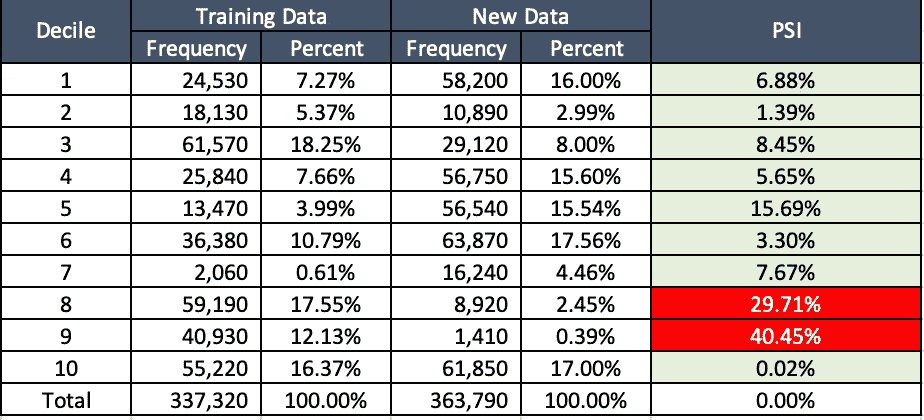
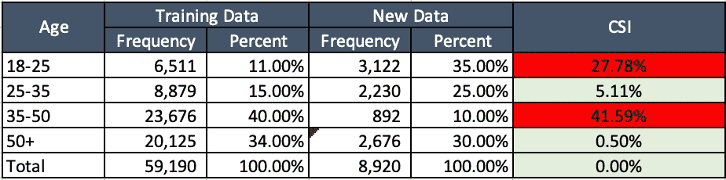
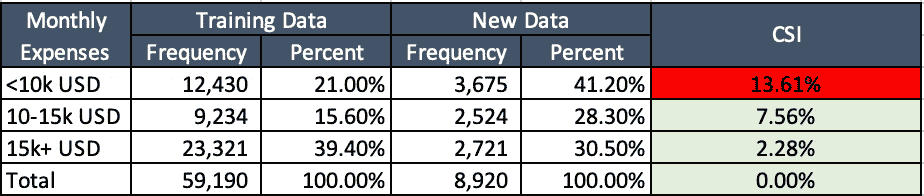

# 监控模型性能

> 原文：<https://towardsdatascience.com/monitoring-model-performance-51635c044f52>

## 您的模型是否如预期的那样持续运行？

照片由 [Ibrahim Boran](https://unsplash.com/@ibrahimboran?utm_source=medium&utm_medium=referral) 在 [Unsplash](https://unsplash.com?utm_source=medium&utm_medium=referral) 上拍摄

# 故事是这样的

因此，您已经构建并部署了您的模型。无论是使用简单的逻辑回归，SVM，随机森林，还是臭名昭著的深度学习。

业务用户也很高兴看到它的影响。无论是通过新的个性化和有针对性的活动留住客户，通过追加销售/交叉销售增加交易量和销售额，还是您承诺实现的任何 KPI。

恭喜你。

头几个月，一切都很顺利。

然后，你突然查看公司仪表板/报告，KPI 突然回到模型前的状态，或者更糟。利益相关者正在轰炸你的推送通知，要求回答。他们在质疑你模特的表现。

# 发生了什么事？

最常见的解释是:

1.  你的模型过拟合。也许它没有考虑到一些关键因素，如季节性。也许你没有正确地对数据进行采样。
2.  后期数据问题。也许是负载平衡器出了故障，导致系统一整天都没有更新数据。因此，要么是最新的报告不准确，要么是模型根据不完整的数据做出了推断。只需对有问题的表格执行`count(*)`操作，并将其上报给 IT/数据工程团队。或者，也可能是…
3.  数据本身发生了变化。

# 数据被转移意味着什么？

这意味着数据发生了根本性的变化，你建立的模型不再能够代表企业的现状。无论是内部因素还是外部因素。换句话说，模型所依据的数据不再相关，因此模型已经过时。

这很可能发生在任何地方的企业。看一下 covid。还记得它带来了多大的改变吗？或者现在的热点新闻——通货膨胀。这两者都导致客户和企业以一种显著的方式改变他们的行为和工作方式。

或者让我们举一个更简单、更普通、更少启示性的例子。假设你在一家大型电信公司工作。你的一个竞争对手在他们的预付费套餐中提供了巨大的折扣和丰厚的福利。这是其他公司从未做过的事情。结果是，你的市场太喜欢这个了，以至于他们决定抛弃你去找你的竞争对手。不是你，是他们。

这些都是外部因素。内部的呢？

嗯，这肯定是你们公司干的。政策/管理的改变。该业务的增长/亏损超过了总体盈利，因此会出现新产品/裁员。也许他们试推出了一款新产品，与现有产品相比非常独特。或者你工作了 10 年的明星零售员工已经离开/退休/终于马上用完了他们的假期津贴，而顾客不喜欢替换服务。

这能避免吗？是的。如果您的企业将所有这些事件捕获到您的数据存储中。如果你曾在任何公司工作过，你就能理解这一点，要做到这一点是极其困难和昂贵的。所以，你只需要做好你所拥有的。

这就是为什么在结果发出之前实施模型监控实践是非常重要的。每次模型对最新数据进行推断时，在将结果提供给业务用户之前，您都需要注意这些数据变化。如果都是好的，那么结果就可以炸开了。如果没有，根据严重性，您可以很容易地快速修复它，或者提高对发生了不同事情以及可测量证据的认识。

# 如何发送可衡量的证据来证明数据已经更改？

有三种简单的方法可以做到:

*   描述统计学

一个简单的时间序列报告可以很容易地告诉你的数据是否有变化。例如，一个简单的月度收入环比趋势的下降是一个明确的指标，表明你的业务整体表现不佳。如果业务每个月都在恶化，那么模型不会像以前那样识别销售数据只是时间问题。

*   人口稳定指数

该指数主要衡量模型结果的总体情况，以及有多少结果已经改变了类别/群体。您需要使用最新的数据，并将其与模型表现良好的时间进行比较，例如其训练数据，或之后的一个月(也表现良好)。

假设模型产生 N 个类/组/类别。或者也可以是二进制分类，如客户流失，在这种情况下，例如，您可以获取客户流失的概率，将他们分为 N 个相等或不相等的组。例如，0–10%作为第 1 组，11–20%作为第 2 组，等等。也可以是 0–50%第 1 组，51–60%第 2 组，依此类推。重要的是整个过程的一致性。确定这个 bin 可能还需要一些商业头脑，因为来自相同数据和模型的不同 bin 会显著影响模型监控指标。

只需计算训练数据和最新数据中有多少案例/客户属于这些组。取各自占总数据的百分比。然后将训练(`DT`)和最新数据(`DL`)之差乘以`DT/DL`的自然对数。

这是一个计算的例子，你可以尝试在 Excel 中重新创建公式。

来源:图片来自作者

PSI 的规则是:

*   至少一个 bin >20% —数据肯定发生了偏移。重新训练模型。如果不是，那么
*   至少一个箱子是 10–20%—需要稍微改变。这可能会使模型的性能有所下降。如果不是，那么
*   不到 10% —没有明显的数据偏移。继续

我们可以看到上面的例子已经有两个组的 PSI > 20%。因此，我们需要调查客户的行为发生了什么变化，并重新训练模型。

请记住，这些阈值不是固定的。这取决于你和企业愿意在多大程度上容忍这种变化。例如，在 bin 3 中，你可以清楚地看到绝对数字有巨大的差异，但是 PSI 很小。

*   特征稳定性指数

如果 PSI 确定总体上是否存在数据偏移，那么 CSI 将确定哪些特征对其产生了影响。计算基本上与 PSI 完全相同。唯一不同的是，我们深入到有问题的箱(在上面的例子中，分组 5、8 和 9)并根据特征进一步分组。

假设你有 10 个特征。年龄。每月开支。未付账单。不管是什么情况。相应地将它们分组，并进行与 PSI 中相同的计算。

下面的例子是 bin 8 的 2 个特征的 CSI。

来源；图片来自作者

来源:图片来自作者

从上面的例子可以推测，对于 bin 8 来说，年轻客户数量上升，年长客户下降。以至于它导致了我们这些箱子的数据发生了变化。你这个群体的月支出也明显减少了。

# 关键要点

描述性统计、PSI 和 CSI 是监控模型性能的非常简单且非常有效的指标。但是，在确定数据是否已经转移方面，有一点比这些指标更好，那就是定期更新的业务和市场理解。始终保持对您的业务战略、市场和客户需求的更新。