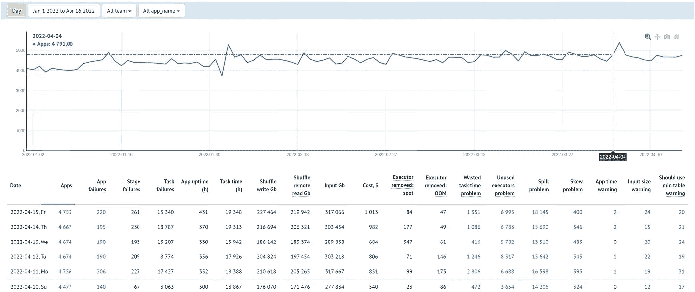
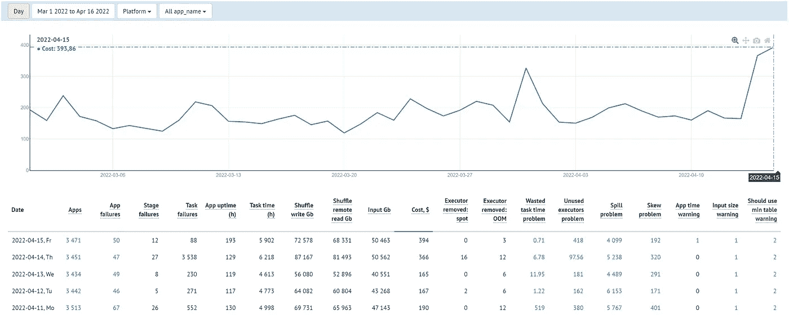
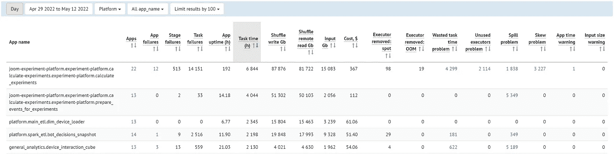

# 火花应用的监控

> 原文：<https://towardsdatascience.com/monitoring-of-spark-applications-3ca0c271c4e0>

## 使用自定义指标来检测问题

照片由[德拉戈](https://unsplash.com/@skyclear?utm_source=unsplash&utm_medium=referral&utm_content=creditCopyText) ș [格里高利](https://unsplash.com/@skyclear?utm_source=unsplash&utm_medium=referral&utm_content=creditCopyText)在 [Unsplash](https://unsplash.com/?utm_source=unsplash&utm_medium=referral&utm_content=creditCopyText) 拍摄

在这篇文章中，我将描述我们为 Spark 应用程序设置监控的经验。我们将研究显示 Spark 应用程序关键指标的定制仪表板，并帮助检测开发人员遇到的常见问题。此外，我们将更详细地讨论其中的一些问题。

# 动机和目标

如果你没有太多的 Spark 应用程序，控制它们的性能似乎很容易。但是，随着你的 Spark 工作量显著增加，情况可能会变得复杂。例如，我们在 Joom 逐渐发现，我们有超过 1000 个不同的 Spark 批处理应用程序(几乎都是每天或每小时运行的),它们是由十几个团队开发的。新的 Spark 应用程序会定期添加，并不是所有的应用程序都会得到很好的优化。此外，处理的数据量也在不断增加。所有这些都导致执行时间和计算成本的不断增加。因此，有必要监控 Spark 在我们公司的使用情况，这样我们就可以用一个工具来回答以下问题:

*   我们的 Spark 工作负载如何随时间变化？
*   我们的应用程序有多稳定和优化？
*   在我们的应用程序中，有没有什么常见的(通常是可以解决的)问题使它们比我们希望的慢得多(因此更昂贵)？
*   我们公司总共要花多少钱？

因此，我们创建了一组仪表板，显示我们的 Spark 应用程序的关键指标，并帮助检测一些典型问题。

> 我们在 [Kubernetes/EKS](https://aws.amazon.com/eks/) 上使用 Spark 3，所以这篇文章中描述的一些东西是特定于这个设置的。

# 收集统计数据

这一切都从收集统计数据开始。为了全面了解情况，我们收集并存储了以下数据:

*   您可以在 [Spark Web UI](https://spark.apache.org/docs/latest/web-ui.html) 中看到的标准 Spark 指标(例如，任务时间、洗牌、输入、溢出、执行/存储内存峰值、失败原因、执行者移除原因等。).为了收集这些指标，我们使用一个定制的 [SparkListener](https://spark.apache.org/docs/latest/api/java/index.html?org/apache/spark/scheduler/SparkListener.html) ，它在 Spark 应用程序运行时监听各种事件，提取我们感兴趣的所有指标，并将它们发送给 [Kafka](https://kafka.apache.org/) 。然后，一个特殊的 Spark 应用程序从 Kafka 读取这些指标，转换成方便的格式，并将其保存为一组 Spark 表(*Spark _ app _ level _ statistics*、*Spark _ stage _ level _ statistics*、*Spark _ executor _ level _ statistics*)。
*   与 Spark 驱动器和执行器的 K8S Pods 相关的指标(参数、寿命)。我们使用[普罗米修斯社区/kube-普罗米修斯堆栈](https://github.com/prometheus-community/helm-charts/tree/main/charts/kube-prometheus-stack)。
*   [AWS 计费数据](https://docs.aws.amazon.com/cur/latest/userguide/what-is-cur.html):EC2 实例、EBS 磁盘、数据传输的成本。
*   关于我们执行的数据查询的信息(表名、请求的时间段等。).

# 关键应用指标

我们使用上面描述的 Spark 应用程序执行统计数据来构建仪表板，每个团队可以在仪表板上看到关于他们的 Spark 应用程序的最重要的信息。例如，这里有一个摘要控制面板，显示了指标如何随时间变化。

作者图片

一些指标纯粹是信息性的。它们显示了每个应用程序相对于其他应用程序的重量。我们还使用它们来了解我们的 Spark 统计数据，一般来说，以及每个团队(或应用程序)的单独统计数据，是如何随时间变化的。这些指标在正常情况下会略有波动，只有在出现可能表明火花使用不当的意外大变化时才需要注意。

这些指标包括:

*   **应用** —已完成的 Spark 应用数量。
*   **应用正常运行时间(h)** —应用运行时间。即使应用程序本身和处理的数据量没有变化，该指标也可能会随着发布的不同而变化。例如，如果在下一次执行期间，应用程序没有获得所有请求的执行器(可能缺少 AWS Spot 实例)，那么这一次，应用程序将需要更长的时间来完成。因此，它不是评估应用程序效率变化的最佳指标(例如，在优化的情况下)，但如果您对执行时间的动态感兴趣，这可能是有用的。
*   **任务时间(h)** —所有应用任务的总执行时间。在大多数情况下，当使用相同的代码、数据和执行环境时，这个指标是稳定的。因此，它通常可用于评估应用程序优化的有效性。
*   **混洗写入 Gb** —所有写入混洗数据的总大小。
*   **混洗读取 Gb** —所有读取混洗数据的总大小。
*   **输入 Gb** —从外部来源读取的所有数据的总和(在我们的例子中，几乎总是 S3)。
*   **删除的执行器:spot 中断** —应用程序运行时由于 AWS 回收回 Spot 实例而丢失的执行器数量。我们对这个过程几乎没有影响力。如果您使用 Spot EC2 实例，您应该意识到 AWS 可以在任何时候取走它们，这将影响应用程序的执行时间。您只能优化您的 AWS 基础设施，以减少此类事件的可能性。

## 费用

成本,$ —运行应用程序的成本。更准确地说:我们在运行应用程序的 AWS 资源上花了多少钱(不包括存储在 S3 的数据成本)。有时候，很想知道我们在计算上花了多少钱，包括整个团队和每个单独的应用程序。
计算原理(简化):

*   对于每个 **Spark K8S Pod** ，我们确定运行它的 EC2 实例，并根据 AWS 计费数据计算该 EC2 实例在其生命周期内的全部成本:`EC2 instance cost` + `EBS cost` + `AWSDataTransfer cost associated with the instance`。
*   接下来，我们确定 Pod 使用了多少实例:
    **>**`Time share`=`Pod running time`/`EC2 instance running time`
    **>**`Capacity share`—Pod 占用 EC2 实例的多少份额(例如，我们的标准 Spark executor Pod 占用 4xlarge EC2 实例的 1/2，8xlarge 实例的 1/4，等等。).
*   `Pod cost` = `Full cost of the EC2 instance` * `Time share` * `Capacity share`。
*   最后，一个应用程序的成本就是其所有组件的成本。

# 描述问题的度量

上面的度量标准给出了我们的应用程序有多重的一般概念，但是并没有说明是否有任何可以改进的地方。为了给用户更直接的帮助，我们增加了更高层次的指标，以引起对我们在实践中遇到的常见问题的注意。
此类指标的主要特征:

*   它们只显示可以修复的问题(例如，通过设置更合适的火花参数或优化代码)。
*   通常，任何此类指标的每个值都会告诉我们相应问题的严重程度。通过这种方式，我们可以对其进行排序，并首先看到需要注意的最有问题的应用程序。当按某些维度(例如，按日期或团队名称)聚合指标值时也是如此。
*   对于任何应用程序，只有当问题的严重性值得关注时，我们才显示任何此类大于 0 的度量值。例如，一个小的溢出通常对应用程序没有负面影响，我们可以忽略它。在这种情况下，我们仍然将相应的度量显示为 0，以免打扰任何人。

以下是其中的一些指标。

## 浪费任务时间问题

该指标显示了由于应用程序中的各种故障而浪费的大约**任务时间**。对于失败的应用程序运行，我们认为它们所有的总任务时间都被浪费了。对于成功完成的应用程序，我们认为所有失败任务的总时间以及先前成功完成的阶段(或单个任务)的所有重试的总任务时间都是浪费的，因为这种重试通常发生在需要重新处理先前由被杀死的执行者拥有的数据时。

我们对此指标感兴趣的几点原因:

*   这一指标允许我们检测 Spark 应用中的“隐藏”问题。当应用程序运行时，可能会有一些阶段或任务的失败会降低应用程序的速度，这可以通过使用正确的设置或环境来避免。但是由于应用程序可能最终成功完成，您的工作流管理平台(例如 [Airflow](https://airflow.apache.org/) )将不会报告任何此类影响应用程序效率的问题。此外，由于某些原因，应用程序可能会在第一次尝试时失败，但如果您使用重试策略，它可能会在后续尝试中成功完成。在这种情况下，这样的故障也经常发生而不被注意。
*   这是一个定量指标，可以更清楚地报告特定应用程序问题的严重性，而不仅仅是失败的应用程序/阶段/任务的数量。

以下是**浪费任务时间**的一些常见原因示例，可能需要使用此类指标来检测问题:

*   执行者的丢失，这导致已经部分处理的数据的丢失，进而导致它们的重新处理。最常见的原因是因为*内存不足错误* (OOM)而杀死执行程序。OOM 有两种:
    **>** **K8S 容器 OOM** :这通常是由于`*spark.executor.memoryOverhead*`对于具体应用的不足。在这种情况下，我们通常要么减小分区的大小(通过增加`*spark.sql.shuffle.partitions*`)，要么通过减少`*spark.executor.memory*`来增加`*memoryOverhead*`(`*memory*`+`*memoryOverhead*`的总和保持不变，因为它受到所使用的 EC2 实例的内存量的限制)。
    **>执行器堆 OOM:** 这是相当少见的，要解决它，可以尝试以下步骤(考虑到增加内存是有问题的):减少分区的大小，减少`*spark.memory.fraction*`，毕竟要减少每个执行器的`*spark.executor.cores*`(即同时执行的任务数)。
*   由于使用了太多数据，任何 EC2 实例上的磁盘空间都不足。
*   一些任务的随机失败。这通常是因为访问外部系统(Mongo、Cassandra、ClickHouse 等)时出现临时问题。).

我们特别注意因为 AWS 偶尔回收回点实例而丢失执行程序的情况。这不是一个应用问题，在应用层面我们也无能为力。因此，对于发生这种情况的应用程序，我们不会增加**浪费的任务时间**指标。

该控制面板还显示了与此问题相关的几个额外指标，例如:

*   **应用/阶段/任务失败** —失败的应用/阶段/任务的数量。
*   **删除的执行人:OOM** —由于 OOM 而丢失的执行人数量。

## 未使用的执行者问题

该指标显示了任何已完成的 Spark 应用的理论上最大可能总任务时间与实际总任务时间之间的差异。一个应用程序理论上可能的*总任务时间*我们计算为:`<the total time spent by all its executors in the Running state> * *spark.executor.cores*`。
实际的*总任务时间*通常总是小于理论上可能的时间，但如果它小得多，那么这就是执行器(或单个内核)大部分时间都没有被使用的迹象(但同时，它们占用了 EC2 实例上的空间)。对于每个应用程序，只有当`ActualTaskTime / MaxPossibleTaskTime`比率小于某个阈值时，我们才显示该指标大于 0(因此需要注意)。

可能有各种情况导致这种不合理的资源使用。仅举几个例子:

*   由于驱动程序上的长时间同步操作(例如，当使用第三方 API 时)或在某些阶段使用非常少的并行性，执行器可能会空闲。我们使用 Spark**dynamic allocation**，但是默认情况下，如果这些执行器已经缓存了数据块或者存储了 shuffle 数据，它不会缩减执行器的数量。
*   有人循环运行大量非常短的作业。

实践表明，通常有可能以这样或那样的方式优化这种情况。此外，您可以尝试减少执行程序的数量(`*spark.dynamicAllocation.maxExecutors*`选项)，因为在某些情况下，这可以显著减少使用的资源，而对应用程序的运行时间几乎没有影响。

## 溢出问题

此指标显示任何 Spark 应用程序的总**溢出(磁盘)**。数值越高，问题越严重。
Spark 对数据分区执行各种操作(例如，在执行 *SortMergeJoin* 时进行排序)。如果任何分区太大，无法在执行内存中完全处理，那么 Spark 会将部分数据溢出到磁盘。任何溢出都不是好事，但是大量溢出可能会导致严重的性能下降(特别是如果您已经用完了带有 SSD 磁盘的 EC2 实例)。

消除溢出的主要方法是减少数据分区的大小，这可以通过增加这些分区的数量来实现。

*   如果在 Shuffle 之后发生溢出，那么值得尝试增加这个应用程序的`*spark.sql.shuffle.partitions*`属性。理论上，你可以尝试将这个属性设置得足够大，并依靠 [AQE 动态合并洗牌分区](https://spark.apache.org/docs/latest/sql-performance-tuning.html#coalescing-post-shuffle-partitions)，但目前，这并不总是很好，你应该小心设置太高，因为它也可能导致性能下降。同样值得注意的是，基于过去运行的统计数据，为每个应用程序单独自动计算分区的最佳数量相对容易。
*   如果您使用的 Spark 表已经在右列[存储了](https://spark.apache.org/docs/latest/sql-data-sources-load-save-functions.html#bucketing-sorting-and-partitioning),那么 Spark 会跳过洗牌，在这种情况下，溢出会在从源读取数据后立即发生。在这种情况下，您应该尝试增加源表中的存储桶数量。

## 偏斜问题

不对称是指一个或多个分区的处理时间明显长于所有其他分区，从而显著增加应用程序的总运行时间。这通常是由于分区之间的数据分布不均匀造成的。该度量包含差异`taskTimeMax — taskTime75Percentile`(所有阶段的总和)，但是目前，我们只考虑满足条件`(taskTimeMax — taskTime75Percentile) > 5 min AND taskTimeMax/taskTime75Percentile > 5`的那些阶段。也就是说，作为一个值得注意的不对称问题，我们只显示了可能严重影响运行时间的最严重的情况。

从 Spark 3 开始，有了一个[偏斜优化特性](https://spark.apache.org/docs/latest/sql-performance-tuning.html#optimizing-skew-join)，在 SortMergeJoin 中动态处理偏斜。但是目前，这种优化并不适用于我们所有的情况。此外，在没有这种优化的其他操作(例如，窗口函数、分组)中也可能出现偏斜。在这些情况下，我们仍然需要自己处理不对称问题。首先，我们看看数据中的哪些值是它的原因。例如，在联接/分组列中可能有许多具有空值/未知值的记录，这些记录无论如何都应该被丢弃。如果我们需要所有的数据，我们会尝试应用各种代码优化。

## 应用程序时间警告

该字段包含耗时过长的 Spark 应用程序的数量。我们现在用的确切规则:`AppUptime > 4 hours OR TotalTaskTime > 500 hours`。
长时间运行的应用不一定需要修复，因为可能没有其他选择，但我们无论如何都会关注它们。

*   如果任何此类应用程序失败(例如，由于 Spot 实例中断)，Airflow 会重新启动该应用程序，并再次完成大量工作。因此，如果可能的话，最好将这些应用程序分成几个部分。
*   长时间执行的原因可能是其他指标并不总是显示的各种问题。

## 输入大小警告

该指标突出显示了读取过多数据的 Spark 应用程序。我们考虑了从外部来源读取的数据量(**输入 Gb** 度量)和查询中使用的日期范围。这只是一个警告，因为在某些情况下，读取大量数据是必要的。但与此同时，这一指标可能会提醒某些人，有时没有必要每天读取很长时间，数据处理可以是增量的。

> 还值得注意的是，上面描述的一些问题可以部分解决，而不必关注每个应用程序。例如，我们已经实现了对一些火花参数(例如，`spark.sql.shuffle.partitions`、`spark.dynamicAllocation.maxExecutors`等)的最佳值的自动选择。)基于对先前运行的火花统计数据的分析，单独地用于每个应用。但是这种自动选择并不能在所有情况下都有帮助，所以所有描述的度量标准的使用仍然与我们相关。

# 仪表板

最后，简单介绍一下我们使用的一些仪表板。

**应用性能** —时间维度中的指标。我们用它来跟踪关键指标的变化，并显示最近几天发生的问题。通常我们的应用程序每天运行，但是我们也有其他的计划选项:每小时、每周、每月等等。

作者图片

在这里，我们可以看到每个指标的数字和图形表示。团队和个人 Spark 应用的过滤器都是可用的。单击列中的值会打开一个向下钻取页面，其中列出了已完成的 Spark 应用程序运行。

**按名称划分的应用性能** —按应用名称汇总的指标。

作者图片

我们主要用它来为选定的指标/问题找到最重要的应用，这样我们就知道首先关注什么。

# 结论

在这篇文章中，我们看了一些指标和显示它们的仪表板，这些指标和仪表板允许我们监控 Spark 在我们公司的使用情况，并检测各种问题。我们计划进一步研究这个主题:添加新的指标(特别感兴趣的是一些基于 Spark 应用程序执行计划分析的指标)并改进现有的指标。而且也有计划来提高这些工具的可用性。例如，我们正在考虑使用异常探测器。但是这些都是单独文章的主题。