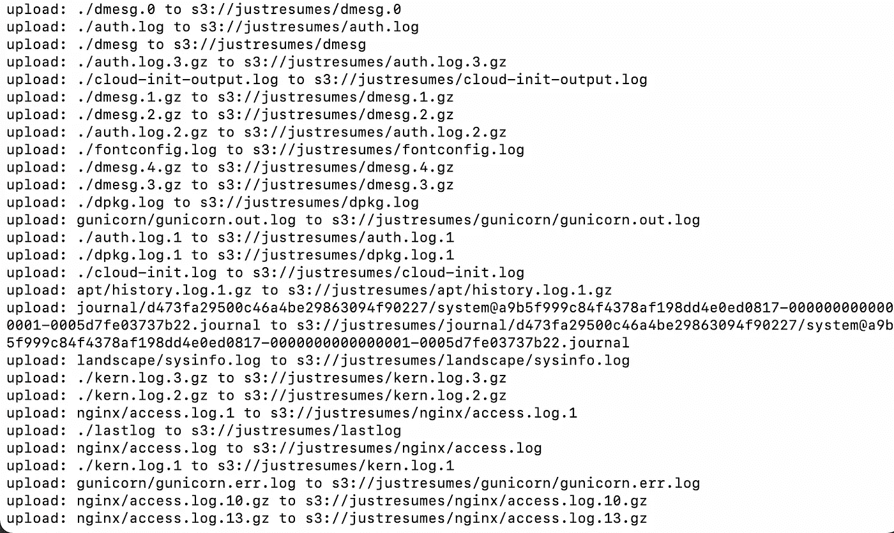
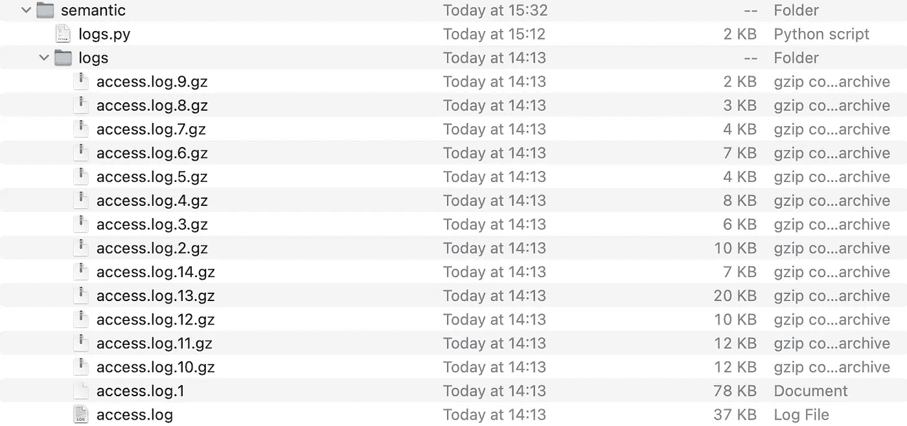
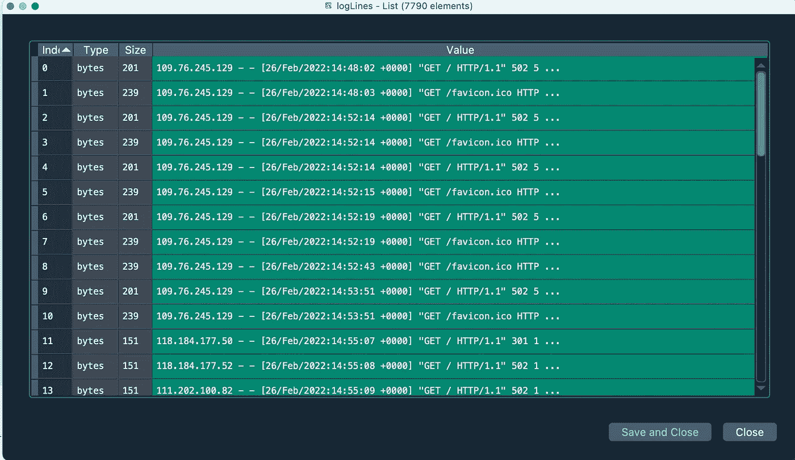
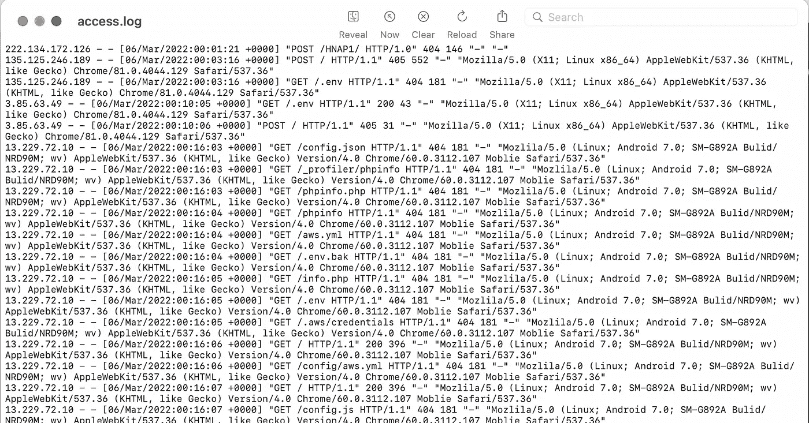
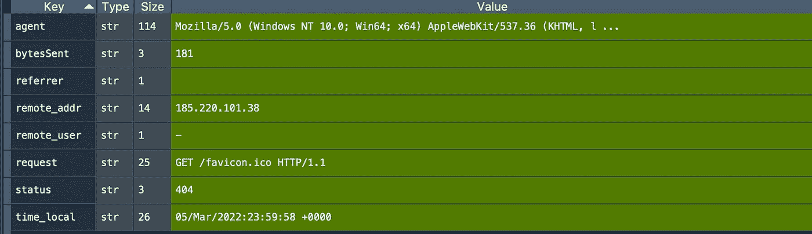
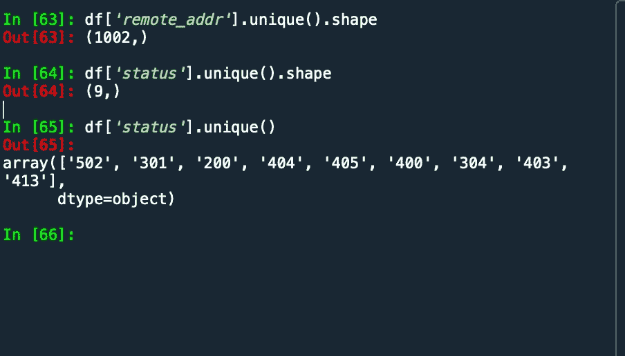

# 监控以保护数据

> 原文：<https://towardsdatascience.com/monitoring-to-protect-data-890b21a186c1>

## 您如何监控您部署的模型发生了什么？


罗伯特·拉尔森在 [Unsplash](https://unsplash.com?utm_source=medium&utm_medium=referral) 上拍摄的照片

每当有人访问一个站点或进行 API 调用时，都会在操作系统的某个日志文件中记录一个条目。如果没有，真的应该有一个！阅读和处理这些日志文件对于理解好的和坏的参与者在做什么以及谁在做什么是至关重要的。当然，python 对于这种活动来说非常方便，但是处理这些日志文件的选择就像咖啡的味道一样多。你的日志策略是什么？

我在[的任务是向求职者揭露 NLP 程序](https://medium.com/@cognitivedave)，安全是我的首要任务。如果你是第一次收听，那么需要注意的是[我已经使用 FastAPI 和 vue.js](https://medium.com/towards-data-science/from-nlp-prototype-to-production-c2b555488dc5) 构建了一个应用程序，并且[将它托管在 AWS](https://www.justresumes.net/) 上。应用程序基础结构已经就绪，我已经对安全性进行了分类；我相信是合理的！前一段时间我已经制定出了 NLP 战略。今天我在看日志文件，一些请求来自坏人，所以我开始分析自从几周前网站上线以来的流量。我是这样做的！

## 在虚拟服务器上

我只运行一个小的免费层服务器，所以我不想做任何花哨的东西，而是让它服务于页面和响应 API 调用。为了简化，我在服务器上安装了 [AWS 命令行工具](https://docs.aws.amazon.com/cli/latest/userguide/cli-chap-configure.html)。使用命令行需要凭证，并且您必须用一个一次性命令[配置那些](https://docs.aws.amazon.com/cli/latest/userguide/cli-configure-quickstart.html)。

```
sudo apt install awscli
aws configure
```

使用 IAM，我在 AWS 控制台上创建了一个拥有完全 S3 读写权限的新用户。配置命令要求:-

*   访问密钥 ID；当您创建一个新用户时，您会得到这个。
*   秘密访问密钥；创建该用户时会得到这个。
*   默认的地区名称，在我的例子中是 EU-西-1；
*   默认输出格式，我保留为 JSON。

接下来，我建立了一个名为“justresumes”的全新 S3 桶，这是我的网站的名字。最后，我发出了一个命令。

```
cd /var/log
aws s3 cp . s3://justresumes/ --recursive --include "*log"
```

使用 AWS 命令行，使用递归将/var/log 中的所有文件复制到新的 S3 存储桶中，并且只包括文件名中包含“log”的文件。接下来可以看到终端的截图。



AWS 虚拟服务器终端的屏幕截图—将日志文件复制到 S3 存储桶。作者图片

这样，任何闻起来像日志文件的东西现在都在 S3 桶上，准备进行分析。

## 将日志提取到本地机器

我知道你会说使用本地机器？但是我们正在调查那些坏人在做什么！因此，我再次创建了一个新的 IAM 用户，并检索了凭证以允许与 S3 存储桶进行编程连接。下面是我用来将特定文件从 S3 下载到本地的代码。

```
import os
import boto3session = boto3.Session(
    aws_access_key_id=s3_creds['id'],
    aws_secret_access_key=s3_creds['secret'])s3 = session.resource('s3')justresumes = s3.Bucket('justresumes')
store = '/Users/davidmoore/Documents/projects/semantic/logs/'for file in justresumes.objects.all():
    path, filename = os.path.split(file.key)
    if ('nginx' in path) and ('access' in filename):
        print(path, filename)
        writer=store+filename
        justresumes.download_file(file.key, writer)
```

使用新 IAM 用户的 S3 凭证，我创建了一个 boto3 会话，并将该会话链接到 S3 服务。今天我在找来自

```
/var/log/nginx -- specifically access*.*
```

运行该代码片段会交付一组文件。有些用 GZIP 表示压缩文件，但有些是未压缩的。Nginx 旋转日志文件并增加压缩以节省部署的 web 服务器上的存储空间。



脚本运行后日志文件夹的屏幕截图。图片由作者提供。

在那个阶段，我们有数据文件(15)。

## 在本地机器上处理文件

有了从 S3 下载并存储在本地的数据文件，我只需要一点解析和一个熊猫数据框就可以开始研究最近的事件了。

**第一步**:获取所有待处理文件的列表

```
store = '/Users/davidmoore/Documents/projects/semantic/logs/'import os
import gziplogs = os.listdir(store)
```

我们需要 gzip 来管理那些压缩文件(。gz)。

**第二步:**将所有的日志条目读入一个列表

```
logLines = []for log in logs:
    if 'access' in log:
       filetype = log.split('.')
       fullPath=store+log
       if filetype[len(filetype)-1] == 'gz':
           logFile=gzip.open(fullPath, 'rb')
           while True:
               logContent=logFile.readline()
               logLines.append(logContent)

               if not logContent:
                   break

       else:
           logFile=open(fullPath, 'rb')
           while True:
               logContent=logFile.readline()
               logLines.append(logContent)

               if not logContent:
                   break 
```

该脚本逐行遍历这 15 个文件，并创建一个 python 列表。如果您使用 Spyder IDE，有一种简单的方法可以使用变量浏览器查看变量的内容。下面是运行脚本后 logLines 变量的屏幕截图。



Spyder IDE 变量资源管理器—作者图片。

因此，自从服务器启动以来，我们有来自 15 个不同文件的 7790 个单独的 Nginx 条目。如果你以前没有见过 Nginx 标准日志文件，这里有一个截图。



Nginx 标准日志条目—作者图片。

下一步是解析和移动到熊猫！

我们遍历 logLines 对象中的每个条目(7，790 个列表元素)。接下来，我去 Nginx 弄清楚列和解析策略。通过反复试验，分成引号和空格，让我最终到达了我想去的地方。下面是组合日志格式的 nginx.conf 配置。

```
# nginx.conf
http {
  ...
  log_format combined '$remote_addr - $remote_user [$time_local] '
                      '"$request" $status $body_bytes_sent '
                      '"$http_referer" "$http_user_agent"';
  ...
}
```

最终，我得到了一个字典列表，其数据属性如截图所示。



解析整组日志记录后的单个记录。

终于可以开始对数据提问了！



图片来自 Spyder

有 1002 个唯一的远程 IP 地址

有 9 个 HTTP 状态代码，它们是 502 到 413。200 是 OK 的代码，这是一次成功的互动。4%%都是错误。304 被从 HTTP 重定向到 HTTPS。502 是一个糟糕的网关，当我的应用程序出现配置错误时就会出现这种情况。

## 一些例子

" GET/robots . txt HTTP/1.1 "**403**118 "-" Mozilla/5.0(兼容；blex bot/1.0；+【http://webmeup-crawler.com/)”——**前住**

" GET/AWS . yml HTTP/1.1 "**404**181 "-"—**未找到**

所以现在我有一些工作要做，检查所有这些记录，并确定我是否需要更改安全策略。收集和使用个人或敏感的个人数据需要绝对的安全，因此我继续探索向求职者展示安全可靠的 NLP 服务！

[](https://cognitivedave.medium.com/membership) 