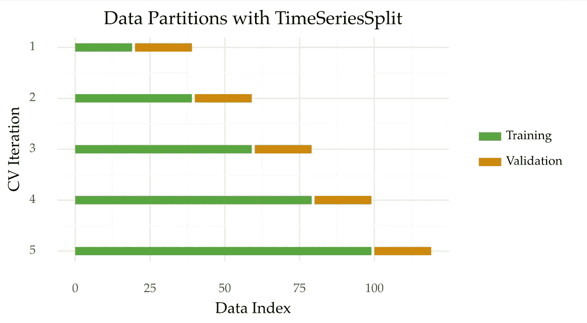
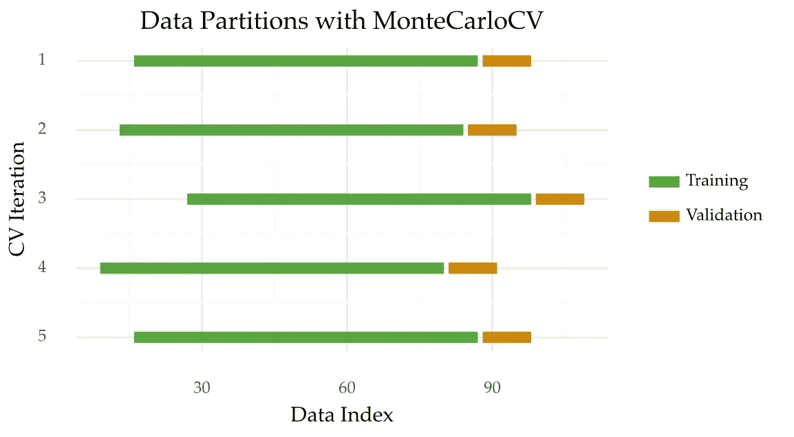

# 时间序列的蒙特卡罗交叉验证

> 原文：<https://towardsdatascience.com/monte-carlo-cross-validation-for-time-series-ed01c41e2995>

## 如何获得更好的预测性能估计值**带有一点随机性**


由[马库斯·斯皮斯克](https://unsplash.com/@markusspiske?utm_source=medium&utm_medium=referral)在 [Unsplash](https://unsplash.com?utm_source=medium&utm_medium=referral) 上拍摄的照片

[对时间序列应用交叉验证需要注意几个关键方面](https://medium.com/towards-data-science/4-things-to-do-when-applying-cross-validation-with-time-series-c6a5674ebf3a)。这些要点对于防止泄漏和获得可靠的性能估计非常重要。

在这里，您将了解蒙特卡罗交叉验证。流行的时间序列分割法的替代方法。

# 时间序列交叉验证

时间序列分割通常是使用时间序列数据进行交叉验证的首选方法。图 1 说明了这种方法是如何操作的。可用的时间序列被分成几个大小相等的折叠。然后，每个折叠首先用于测试一个模型，然后重新训练它。除了第一折，只用于训练。



图 1:时间序列分成 5 个部分。使用 plotnine Python 库创建的图。[下面是源代码](https://github.com/vcerqueira/blog/blob/main/src/cv_plot.py)。图片作者。

使用 TimeSeriesSplit 进行交叉验证的主要好处如下:

1.  它保留了观察的顺序。这个问题在有序数据集(如时间序列)中很重要。
2.  它会产生许多裂缝。几个分割导致更健壮的性能估计。如果数据集不大，这一点尤其重要。

TimeSeriesSplit 的主要缺点是跨折叠的训练样本大小不一致。

这是什么意思？

假设该方法应用了 5 次折叠，如图 1 所示。在第一次迭代中，所有可用观测值的 20%用于训练。但是，这个数字在最后一次迭代中是 80%。因此，初始迭代可能不代表完整的时间序列。这个问题会影响性能估计。

你如何解决这个问题？

# 蒙特卡罗交叉验证

蒙特卡洛交叉验证是一种可用于时间序列的方法。想法是在不同的**随机**起点重复典型的维持周期。

以下是对这种方法的直观描述:



图 2:蒙特卡洛交叉验证，5 倍。图片作者。

像时间序列一样，MonteCarloCV 也保留了观测的时间顺序。它还重复几次估计过程。

MonteCarloCV 与 TimeSeriesSplit 的区别主要体现在两个方面:

*   **训练和验证样本量**。如上所述，使用 TimeSeriesSplit 时，训练集的大小会增加。在 MonteCarloCV 中，训练集大小在过程的每次迭代中都是固定的。这防止了不代表整个数据的训练大小；
*   **随机分区**。在 MonteCarloCV 中，验证起点是随机选择的。这个原点是标志训练集结束和验证开始的点。在时间序列分裂的情况下，这一点是决定性的。它是根据迭代次数预先定义的。

蒙特卡洛夫最早是由皮卡尔和库克使用的。详情可查阅参考文献[1]。

我在博士期间研究过蒙特卡洛夫的一些细节。这包括与其他方法的比较，如 TimeSeriesSplit。我的目标之一是了解哪种方法能提供最好的估计。结论指向蒙特卡洛夫，所以我一直用到了现在。您可以查看参考文献[2]中的完整研究。

不幸的是， *scikit-learn* 没有提供 MonteCarloCV 的实现。所以，我决定自己来做:

```
from typing import List, Generator

import numpy as np

from sklearn.model_selection._split import _BaseKFold
from sklearn.utils.validation import indexable, _num_samples

class MonteCarloCV(_BaseKFold):

    def __init__(self,
                 n_splits: int,
                 train_size: float,
                 test_size: float,
                 gap: int = 0):
        """
        Monte Carlo Cross-Validation

        Holdout applied in multiple testing periods
        Testing origin (time-step where testing begins) is randomly chosen according to a monte carlo simulation

        :param n_splits: (int) Number of monte carlo repetitions in the procedure
        :param train_size: (float) Train size, in terms of ratio of the total length of the series
        :param test_size: (float) Test size, in terms of ratio of the total length of the series
        :param gap: (int) Number of samples to exclude from the end of each train set before the test set.
        """

        self.n_splits = n_splits
        self.n_samples = -1
        self.gap = gap
        self.train_size = train_size
        self.test_size = test_size
        self.train_n_samples = 0
        self.test_n_samples = 0

        self.mc_origins = []

    def split(self, X, y=None, groups=None) -> Generator:
        """Generate indices to split data into training and test set.
        Parameters
        ----------
        X : array-like of shape (n_samples, n_features)
            Training data, where `n_samples` is the number of samples
            and `n_features` is the number of features.
        y : array-like of shape (n_samples,)
            Always ignored, exists for compatibility.
        groups : array-like of shape (n_samples,)
            Always ignored, exists for compatibility.
        Yields
        ------
        train : ndarray
            The training set indices for that split.
        test : ndarray
            The testing set indices for that split.
        """

        X, y, groups = indexable(X, y, groups)
        self.n_samples = _num_samples(X)

        self.train_n_samples = int(self.n_samples * self.train_size) - 1
        self.test_n_samples = int(self.n_samples * self.test_size) - 1

        # Make sure we have enough samples for the given split parameters
        if self.n_splits > self.n_samples:
            raise ValueError(
                f'Cannot have number of folds={self.n_splits} greater'
                f' than the number of samples={self.n_samples}.'
            )
        if self.train_n_samples - self.gap <= 0:
            raise ValueError(
                f'The gap={self.gap} is too big for number of training samples'
                f'={self.train_n_samples} with testing samples={self.test_n_samples} and gap={self.gap}.'
            )

        indices = np.arange(self.n_samples)

        selection_range = np.arange(self.train_n_samples + 1, self.n_samples - self.test_n_samples - 1)

        self.mc_origins = \
            np.random.choice(a=selection_range,
                             size=self.n_splits,
                             replace=True)

        for origin in self.mc_origins:
            if self.gap > 0:
                train_end = origin - self.gap + 1
            else:
                train_end = origin - self.gap
            train_start = origin - self.train_n_samples - 1

            test_end = origin + self.test_n_samples

            yield (
                indices[train_start:train_end],
                indices[origin:test_end],
            )

    def get_origins(self) -> List[int]:
        return self.mc_origins
```

## 实际例子

MonteCarloCV 有四个参数:

*   *n_splits* :折叠或迭代的次数。这个值趋向于高达 10；
*   *training_size* :每次迭代训练集的大小，为时间序列大小的比值；
*   *test_size* :类似 training_size，但是针对验证集；
*   *gap* :分离训练集和验证集的观察值的数量。与 TimeSeriesSplits 中一样，该参数的值默认为 0(无间隙)。

每次迭代的训练和验证规模取决于输入数据。我发现一个 0.6/0.1 的分区工作得很好。也就是说，在每次迭代中，60%的数据用于训练。以下 10%的观察值用于验证。

下面是上述配置的一个示例:

```
from sklearn.datasets import make_regression
from src.mccv import MonteCarloCV

X, y = make_regression(n_samples=120)

mccv = MonteCarloCV(n_splits=5, 
                    train_size=0.6, 
                    test_size=0.1, 
                    gap=0)

for train_index, test_index in mccv.split(X):
    print("TRAIN:", train_index, "TEST:", test_index)
    X_train, X_test = X[train_index], X[test_index]
    y_train, y_test = y[train_index], y[test_index]
```

该实现也与 *scikit-learn* 兼容。下面介绍如何将其与 *GridSearchCV* 结合起来:

```
from sklearn.ensemble import RandomForestRegressor
from sklearn.model_selection import GridSearchCV

model = RandomForestRegressor()
param_search = {'n_estimators': [10, 100]}

gsearch = GridSearchCV(estimator=model, cv=mccv, param_grid=param_search)
gsearch.fit(X, y)
```

希望你觉得 MonteCarloCV 有用！

感谢阅读，下一个故事再见。

## 参考

[1]皮卡尔、理查德·库克和丹尼斯·库克。"回归模型的交叉验证."美国统计协会杂志 79.387(1984):575–583。

[2]熊伟·塞尔奎拉、路易斯·托尔戈和伊戈尔·莫泽蒂奇。"评估时间序列预测模型:性能估计方法的实证研究."机器学习 109.11(2020):1997–2028。